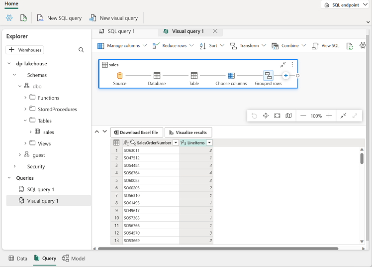

---
lab:
  title: 创建 Microsoft Fabric 湖屋
  module: Get started with lakehouses in Microsoft Fabric
---

# 创建湖屋

大规模数据分析解决方案传统上是围绕数据仓库构建的，其中数据存储在关系表中，并使用 SQL 进行查询。 “大数据”的增长（其特点是新数据资产的大容量、多样性和速度）以及低成本存储和云规模的分布式计算技术的可用性，导致了分析数据存储的替代方法：数据湖   。 在数据湖中，数据存储为文件，而不会为存储设置固定架构。 数据工程师和分析师越来越多地寻求通过将这两种方法组合到数据湖屋来利用这两种方法的最佳功能；其中数据存储在数据湖的文件中，关系架构作为元数据层应用于它们，这样可以使用传统的 SQL 语义对其进行查询。

在 Microsoft Fabric 中，湖屋在（基于 Azure Data Lake Store Gen2 构建的）OneLake 存储中提供高度可缩放的文件存储，以及基于开放源代码 Delta Lake 表格式的关系对象（例如表和视图）的元存储 。 Delta Lake 使你能够在湖屋中定义可使用 SQL 查询的表的架构。

完成本实验室大约需要 30 分钟。

> **注意**：完成本练习需要 [Microsoft Fabric 试用版](https://learn.microsoft.com/fabric/get-started/fabric-trial)。

## 创建工作区

在 Fabric 中处理数据之前，创建一个已启用的 Fabric 试用版的工作区。

1. 在 `https://app.fabric.microsoft.com` 的 [Microsoft Fabric 主页](https://app.fabric.microsoft.com)中，选择“Synapse 数据工程”****。
1. 在左侧菜单栏中，选择“工作区”（图标类似于 &#128455;）。
1. 新建一个工作区并为其指定名称，并在“高级”部分选择包含 Fabric 容量（试用版、高级版或 Fabric）的许可模式  。
1. 打开新工作区时，它应为空。

    

## 创建湖屋

现在已经有了工作区，可以为数据文件创建数据湖屋了。

1. 在“Synapse 数据工程”主页中，新建湖屋并为其指定名称 。

    大约一分钟后，一个新的湖屋创建完成：

    

1. 查看新的湖屋，并注意使用左侧的湖屋资源管理器窗格可浏览湖屋中的表和文件：
    - Tables 文件夹包含可以使用 SQL 语义查询的表。 Microsoft Fabric 湖屋中的表基于 Apache Spark 中常用的开源 Delta Lake 文件格式。
    - Files 文件夹包含湖屋的 OneLake 存储中未与托管增量表关联的数据文件。 还可以在此文件夹中创建快捷方式，以引用存储在外部的数据。

    目前，湖屋中没有表或文件。

## 上传文件

Fabric 提供了多种将数据加载到湖屋的方法，包括对复制数据外部源和可以基于 Power Query 使用可视化工具定义的数据流 (Gen 2) 的管道的内置支持。 但是，引入少量数据的最简单方法之一是从本地计算机（或实验室 VM，如果适用）上传文件或文件夹。

1. 从 `https://raw.githubusercontent.com/MicrosoftLearning/dp-data/main/sales.csv` 下载 sales.csv 文件，在本地计算机（或实验室 VM，如果适用）上将其保存为 sales.csv。

   > 注意：若要下载文件，请在浏览器中打开一个新选项卡并粘贴 URL。 右键单击包含数据的页面上的任意位置，然后选择“另存为”，将页面另存为 CSV 文件。

2. 返回到包含湖屋的 Web 浏览器选项卡，在“湖屋资源管理器”窗格中“Files”文件夹的“...”菜单中，选择“新建子文件夹”并创建名为“data”的子文件夹    。
3. 在新的 data 文件夹的“...”菜单中，选择“上传”和“上传文件”，然后上传本地计算机（或者实验室 VM，如果适用）中的 sales.csv 文件    。
4. 上传文件后，选择 Files/data 文件夹；并验证是否已上传 sales.csv 文件，如下所示 ：

    

5. 选择 sales.csv 文件以查看其内容的预览。

## 探索快捷方式

在许多情况下，需要在湖屋中处理的数据可能存储在其他某个位置。 虽然有许多方法可将数据引入湖屋的 OneLake 存储中，但另一种方法是改为创建快捷方式。 借助快捷方式，可以在分析解决方案中包含外部源数据，而不会产生与复制数据相关的开销和数据不一致的风险。

1. 在“Files”文件夹的“...”菜单中，选择“新建快捷方式”  。
2. 查看快捷方式的可用数据源类型。 然后关闭“新建快捷方式”对话框，而不创建快捷方式。

## 将文件数据加载到表

上传的销售数据位于文件中，数据分析师和工程师可以使用 Apache Spark 代码直接处理该文件。 但是，在许多情况下，可能需要将数据从文件加载到表中，以便可以使用 SQL 对其进行查询。

1. 在主页上，选择“Files/Data”文件夹，以便查看其包含的 sales.csv 文件  。
2. 在 sales.csv 文件的“...”菜单中，选择“加载到表  ”。
3. 在“加载到表”对话框中，将表名称设置为“sales”并确认加载操作 。 然后等待创建表并加载表。

    > 提示：如果 sales 表未自动显示，请在“Tables”文件夹的“...”菜单中，选择“刷新”    。

3. 在湖屋资源管理器窗格中，选择已创建的 sales 表以查看数据 。

    

4. 在 sales 表的“...”菜单中，选择“查看文件”以查看此表的基础文件

    

    增量表的文件以 Parquet 格式存储，并包含名为 _delta_log 的子文件夹，其中记录了应用于表的事务的详细信息。

## 使用 SQL 查询表

创建湖屋并在其中定义表时，会自动创建一个 SQL 终结点，通过该终结点可以使用 SQL `SELECT` 语句查询表。

1. 在湖屋页面的右上角，从湖屋切换到 SQL 分析终结点。******** 然后等待一小段时间，直到湖屋的 SQL 分析终结点在可视化界面中打开，可以从该界面查询其表。

2. 使用“新建 SQL 查询”按钮打开新的查询编辑器，并输入以下 SQL 查询：

    ```sql
   SELECT Item, SUM(Quantity * UnitPrice) AS Revenue
   FROM sales
   GROUP BY Item
   ORDER BY Revenue DESC;
    ```

3. 使用 &#9655;（“运行”）按钮运行查询并查看结果，结果应显示每个产品的总收入。

    

## 创建视觉查询

虽然许多数据专业人员都熟悉 SQL，但具有 Power BI 经验的数据分析师可以应用其 Power Query 技能来创建可视化查询。

1. 在工具栏中选择“新建可视化查询”。
2. 将 sales 表拖到打开的新可视化查询编辑器窗格，以创建 Power Query，如下所示： 

    

3. 在“管理列”菜单中，选择“选择列” 。 然后，仅选择“SalesOrderNumber”和“SalesOrderLineNumber”列 。

    

4. 在“转换”菜单中，选择“分组依据” 。 然后使用以下“基本”设置对数据进行分组：

    - 分组依据：SalesOrderNumber
    - 新列名称：LineItems
    - 操作：对非重复值进行计数
    - 列：SalesOrderLineNumber

    完成后，可视化查询下的结果窗格会显示每个销售订单的行项数。

    

## 创建报表

湖屋中的表会自动添加到默认语义模型，以便使用 Power BI 进行报告。


1. 在“SQL 终结点”页底部，选择“模型”选项卡。**** 显示语义模型的数据模型架构。

    

    > **注意**：在本练习中，数据模型由单个表组成。 在实际场景中，你可能会在湖屋中创建多个表，每个表都将包含在模型中。 然后，可以在模型中定义这些表之间的关系。

2. 在菜单功能区中，选择“报告”选项卡。然后选择“新建报表” 。 此时会打开一个新的浏览器选项卡，你可以在其中设计报表。

    

3. 在右侧的“数据”窗格中，展开“sales”表 。 然后选择以下字段：
    - **Item**
    - **数量**

    表可视化效果将添加到报表：

    

4. 隐藏“数据”和“筛选器”窗格以创建更多空间 。 然后，确保已选择表可视化效果，并在“可视化效果”窗格中，将可视化效果更改为“簇状条形图”并重设其大小，如下所示。

    

5. 在“文件”菜单中，选择“保存”。 然后在之前创建的工作区中，将报表另存为“Item Sales Report”。
6. 关闭包含报表的浏览器选项卡，返回到湖屋的 SQL 终结点。 然后，在左侧的中心菜单栏中，选择工作区以验证它是否包含以下项：
    - 你的湖屋。
    - 湖屋的 SQL 分析终结点。
    - 湖屋中表的默认语义模型。
    - Item Sales Report 报表。

## 清理资源

在本练习中，你已创建一个湖屋并将数据导入其中。 你已了解湖屋如何由存储在 OneLake 数据存储中的文件和表组成。 可以使用 SQL 查询托管表，并将表包含在默认语义模型中以支持数据可视化。

如果已完成湖屋探索，可删除为本练习创建的工作区。

1. 在左侧栏中，选择工作区的图标以查看其包含的所有项。
2. 在工具栏上的“...”菜单中，选择“工作区设置” 。
3. 在“其他”部分中，选择“删除此工作区” 。
