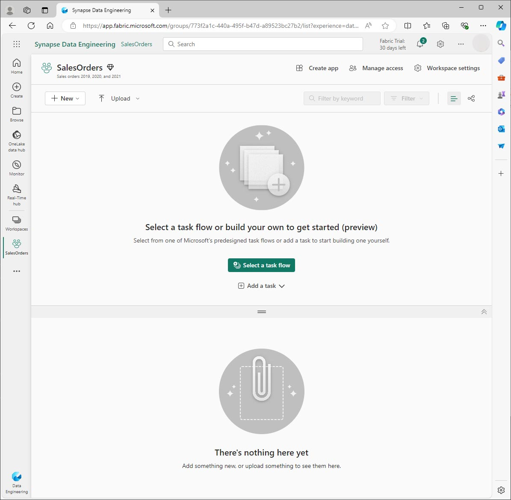
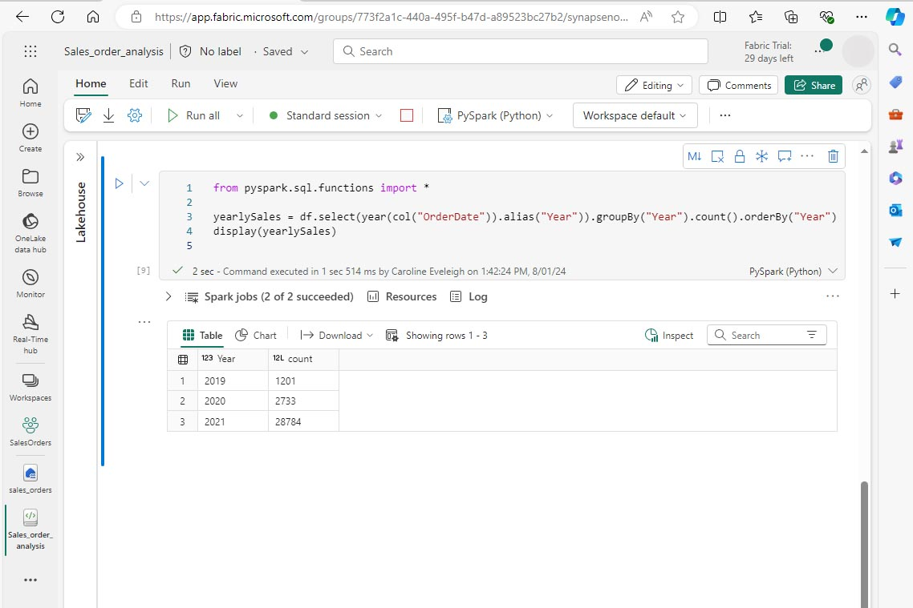
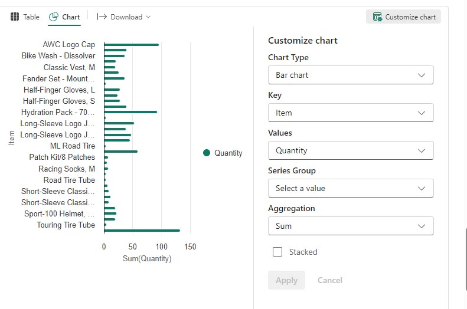

---
lab:
  title: 使用 Apache Spark 分析数据
  module: Use Apache Spark to work with files in a lakehouse
---

# 在 Fabric 中使用 Apache Spark 分析数据

在此实验室中，将把数据引入 Fabric 湖屋并使用 PySpark 读取和分析数据。

完成本实验室大约需要 45 分钟。

## 先决条件

* [Microsoft Fabric 试用版](https://www.microsoft.com/microsoft-fabric/getting-started)。

## 创建工作区

在 Fabric 中处理数据之前，需要创建工作区。

1. 在 https://app.fabric.microsoft.com 的 [Microsoft Fabric](https://app.fabric.microsoft.com) 主页上，选择“**数据工程**”体验。
1. 从左侧菜单栏中选择“**工作区**”(🗇)，然后选择“**新建工作区**”。
1. 为新工作区指定一个名称，并在“**高级**”部分中，选择适当的许可模式。 如果已启动 Microsoft Fabric 试用版，请选择“试用版”。
1. 选择“**应用**”以创建空工作区。
 
    

## 创建湖屋并上传文件

现在已经有了工作区，可以创建湖屋来存储数据文件了。 从新工作区中，选择“**新建**”和“**湖屋**”。 为湖屋命名，然后选择“**创建**”。 短暂延迟后，一个新的湖屋创建完成。

现在可以将数据引入到湖屋中。 有多种方法可以做到这一点，但现在将文本文件的文件夹下载到本地计算机（或实验室虚拟机，如果适用），然后将它们上传到湖屋。

1. 从 https://github.com/MicrosoftLearning/dp-data/raw/main/orders.zip 下载数据文件。
1. 提取压缩存档并验证是否有一个名为 *orders* 的文件夹，其中包含三个 CSV 文件：2019.csv、2020.csv 和 2021.csv。
1. 返回到新湖屋。 在“**资源管理器**”窗格中，选择 **Files** 文件夹旁边的 **…** 菜单，然后选择“**上传**”和“**上传文件夹**”。 定位到本地计算机上的订单文件夹（或者实验室虚拟机，如适用）并选择“**上传**”。
1. 上传文件后，展开 **Files** 并选择 **orders** 文件夹。 检查 CSV 文件是否已上传，如下所示：

    

## 创建笔记本

现在可以创建一个 Fabric 笔记本来处理数据。 笔记本提供了一个交互式环境，可在其中编写和运行代码。

1. 选择工作区，然后选择“**新建**”和“**笔记本**”。 几秒钟后，一个包含单个单元格的新笔记本将会打开。 笔记本由一个或多个单元格组成，这些单元格可以包含代码或 markdown（格式化文本） 。
1. Fabric 会为你创建的每个笔记本分配一个名称，例如笔记本 1、笔记本 2 等。点击菜单上**主页**选项卡上方的名称面板，将名称更改为更具描述性的名称。
1. 选择第一个单元格（当前是代码单元格），然后在其右上角的动态工具栏中，使用 **M↓** 按钮将单元格转换为 Markdown 单元格。 然后，单元格中包含的文本将显示为带格式的文本。
1. 使用 🖉（编辑）按钮将单元格切换到编辑模式，然后修改 Markdown，如下所示：

    ```markdown
   # Sales order data exploration
   Use this notebook to explore sales order data
    ```

    

单击笔记本中单元格以外的任意位置，即可停止编辑并查看呈现的 Markdown。

## 创建 DataFrame

创建工作区、湖屋和笔记本后，即可处理数据。 你将使用 PySpark，这是 Fabric 笔记本的默认语言，以及针对 Spark 优化的 Python 版本。

>[!NOTE]
> Fabric 笔记本支持多种编程语言，包括 Scala、R 和 Spark SQL。

1. 从左侧栏中选择新工作区。 将看到工作区中包含的项列表，包括湖屋和笔记本。
2. 选择“湖屋”以显示“资源管理器”窗格，包括 **orders** 文件夹。
3. 在顶部菜单中，选择“**打开笔记本**”、“**现有笔记本**”，然后打开之前创建的笔记本。 笔记本现在应该在“资源管理器”窗格旁边打开。 展开湖屋，展开“Files”列表，然后选择 orders 文件夹。 上传的 CSV 文件列在笔记本编辑器旁边，如下所示：

    

4. 在 2019.csv 的“...”菜单中，选择“**加载数据**” > “**Spark**”。 该代码会在新代码单元格中自动生成:

    ```python
    df = spark.read.format("csv").option("header","true").load("Files/orders/2019.csv")
    # df now is a Spark DataFrame containing CSV data from "Files/orders/2019.csv".
    display(df)
    ```

>[!TIP]
> 可使用 « 图标隐藏左侧的“湖屋资源管理器”窗格。 这为笔记本提供了更多空间。

5. 选择单元格左侧的 ▷ “**运行单元格**”以运行代码。

>[!NOTE]
> 第一次运行 Spark 代码时会启动 Spark 会话。 这可能需要几秒钟或更长的时间。 同一会话中的后续运行将更快。

6. 单元格完成后，查看单元格下方的输出，输出应如下所示：
 
    

7. 输出显示以列和行显示的 2019.csv 文件中的数据。  请注意，列标题包含数据的第一行。 若要更正此问题，需要修改代码的第一行，如下所示：

    ```python
    df = spark.read.format("csv").option("header","false").load("Files/orders/2019.csv")
    ```

8. 再次运行代码，使数据帧正确地将第一行标识为数据。 请注意，列名称现已更改为_c0、_c1等。

9. 描述性列名有助于理解数据。 若要创建有意义的列名，需要定义架构和数据类型。 还需要导入一组标准 Spark SQL 类型来定义数据类型。 将现有代码替换为以下代码：

    ```python
    from pyspark.sql.types import *

    orderSchema = StructType([
        StructField("SalesOrderNumber", StringType()),
        StructField("SalesOrderLineNumber", IntegerType()),
        StructField("OrderDate", DateType()),
        StructField("CustomerName", StringType()),
        StructField("Email", StringType()),
        StructField("Item", StringType()),
        StructField("Quantity", IntegerType()),
        StructField("UnitPrice", FloatType()),
        StructField("Tax", FloatType())
    ])

    df = spark.read.format("csv").schema(orderSchema).load("Files/orders/2019.csv")

    display(df)
    ```
    
10. 运行单元格并查看输出：

    

11. 数据帧仅包含 2019.csv 文件中的数据。 修改代码，使文件路径使用 * 通配符从 orders 文件夹中读取所有文件：

    ```python
    from pyspark.sql.types import *

    orderSchema = StructType([
        StructField("SalesOrderNumber", StringType()),
        StructField("SalesOrderLineNumber", IntegerType()),
        StructField("OrderDate", DateType()),
        StructField("CustomerName", StringType()),
        StructField("Email", StringType()),
        StructField("Item", StringType()),
        StructField("Quantity", IntegerType()),
        StructField("UnitPrice", FloatType()),
        StructField("Tax", FloatType())
        ])

    df = spark.read.format("csv").schema(orderSchema).load("Files/orders/*.csv")

    display(df)
    ```

12. 运行修改后的代码时，应会看到 2019、2020 和 2021 的销售情况。 只显示行的子集，因此可能看不到每一年的行。

>[!NOTE]
> 通过选择“**...**”可以隐藏或显示单元格的输出。 。 这样，在笔记本中工作就更容易了。

## 探索数据帧中的数据

数据帧对象提供其他功能，例如筛选、分组和操作数据的功能。

### 筛选数据帧

1. 通过选择将鼠标悬停在当前单元格或其输出上方或下方时显示的“**+代码**”来添加代码单元格。 或者，从功能区菜单中选择“**编辑**”和“**+ 添加**”代码单元格。

2.  以下代码筛选数据，以便只返回两列。 它还使用 *count* 和 *distinct* 来汇总记录数：

    ```python
    customers = df['CustomerName', 'Email']

    print(customers.count())
    print(customers.distinct().count())

    display(customers.distinct())
    ```

3. 运行代码，检查输出：

    * 该代码将创建一个名为 **customers** 的新数据帧，其中包含原始 **df** 数据帧中的列子集。 执行数据帧转换时，不会修改原始数据帧，而是返回一个新数据帧。
    * 实现相同结果的另一种方法是使用“select”方法：

    ```
    customers = df.select("CustomerName", "Email")
    ```

    * 数据帧函数 *count* 和 *distinct* 用于提供客户数和唯一客户数的总数。

4. 使用 *select* 和 *where* 函数修改代码的第一行，如下所示：

    ```python
    customers = df.select("CustomerName", "Email").where(df['Item']=='Road-250 Red, 52')
    print(customers.count())
    print(customers.distinct().count())

    display(customers.distinct())
    ```

5. 运行修改后的代码，只选择已购买的 Road-250 Red, 52 产品的客户。 请注意，可以“链接”多个函数，以便一个函数的输出成为下一个函数的输入。 在本例中，*select* 方法创建的 DataFrame 是用于应用过滤条件的 **where** 方法的源 DataFrame。

### 在数据帧中对数据进行聚合和分组

1. 添加代码单元格，并输入以下代码：

    ```python
    productSales = df.select("Item", "Quantity").groupBy("Item").sum()

    display(productSales)
    ```

2. 运行代码。 可以看到，结果会显示按产品分组的订单数量之和。 *groupBy* 方法按“项”对行进行分组，随后将 *sum* 聚合函数应用于剩余的数值列，在本例中为“*数量*”。

3. 在笔记本中添加另一个代码单元格，并输入以下代码：

    ```python
    from pyspark.sql.functions import *

    yearlySales = df.select(year(col("OrderDate")).alias("Year")).groupBy("Year").count().orderBy("Year")

    display(yearlySales)
    ```

4. 运行该单元。 检查输出。 现在结果显示每年的销售订单数：

    * *import* 语句可以使用 Spark SQL 库。
    * “*select*”方法与 SQL 年份函数一起使用，用于提取 *OrderDate* 字段的年份组件。
    * 使用“*alias*”方法向提取的年份值分配一个列名。
    * “*groupBy*”方法按派生的“年份”列对数据进行分组。
    * 在使用 *orderBy* 方法对生成的数据帧进行排序之前，先计算每个组中的行计数。

    

## 使用 Spark 转换数据文件

数据工程师和数据科学家的一项常见任务是转换数据，以便进一步进行下游处理或分析。

### 使用数据帧方法和函数转换数据

1. 在笔记本中添加代码单元格，并输入以下内容：

    ```python
    from pyspark.sql.functions import *

    # Create Year and Month columns
    transformed_df = df.withColumn("Year", year(col("OrderDate"))).withColumn("Month", month(col("OrderDate")))

    # Create the new FirstName and LastName fields
    transformed_df = transformed_df.withColumn("FirstName", split(col("CustomerName"), " ").getItem(0)).withColumn("LastName", split(col("CustomerName"), " ").getItem(1))

    # Filter and reorder columns
    transformed_df = transformed_df["SalesOrderNumber", "SalesOrderLineNumber", "OrderDate", "Year", "Month", "FirstName", "LastName", "Email", "Item", "Quantity", "UnitPrice", "Tax"]

    # Display the first five orders
    display(transformed_df.limit(5))
    ```

2. 运行该单元。 根据原始订单数据创建新的数据帧，并进行以下转换：

    - 基于 OrderDate 列添加了“年份”和“月份”列。
    - 基于 CustomerName 列添加了 FirstName 和 LastName 列。
    - 对列进行筛选并重新排序，删除 CustomerName 列。

3. 查看输出并验证是否已对数据进行了转换。

可使用 Spark SQL 库通过筛选行、派生、删除、重命名列以及应用其他所需的数据修改来转换数据。

>[!TIP]
> 请参阅 [Apache Spark 数据帧](https://spark.apache.org/docs/latest/api/python/reference/pyspark.sql/dataframe.html)文档，详细了解数据帧对象。

### 保存转换后的数据

此时，你可能想要保存转换的数据，以便可用于进一步分析。

*Parquet* 是一种常用的数据存储格式，因为它有效地存储数据，并且受大多数大规模数据分析系统支持。 事实上，有时数据转换要求是将数据从一种格式（如 CSV）转换为 Parquet 格式。

1. 若要以 Parquet 格式保存转换的数据帧，请添加代码单元格并添加以下代码：  

    ```python
    transformed_df.write.mode("overwrite").parquet('Files/transformed_data/orders')

    print ("Transformed data saved!")
    ```

2. 运行单元格并等待数据已保存的消息。 然后，在左侧的“湖屋”窗格中，在 “Files”节点的“...”菜单，选择“**刷新**”。 选择 transformed_data 文件夹以验证它是否包含一个名为 orders 的新文件夹，而该文件夹又包含一个或多个 Parquet 文件。

3. 添加包含以下代码的单元格：

    ```python
    orders_df = spark.read.format("parquet").load("Files/transformed_data/orders")
    display(orders_df)
    ```

4. 运行该单元。  从 *transformed_data/orders* 文件夹中的 parquet 文件创建新的数据帧。 验证结果是否显示已从 parquet 文件加载的订单数据。

    

### 以分区文件的形式保存数据

处理大量数据时，分区可以显著提高性能，更易于筛选数据。

1. 添加包含代码的单元格以保存数据帧，并按“年份”和“月份”对数据进行分区：

    ```python
    orders_df.write.partitionBy("Year","Month").mode("overwrite").parquet("Files/partitioned_data")

    print ("Transformed data saved!")
    ```

2.  运行单元格并等待数据已保存的消息。 然后，在左侧的“湖屋”窗格中，在 在“Files”节点的“...”菜单中，选择“**刷新**”，然后展开 partitioned_orders 文件夹以验证它是否包含名为 *Year=xxxx* 的文件夹层次结构，每个文件夹是否包含名为 *Month=xxxx* 的文件夹。 每个月份文件夹均包含一个 parquet 文件，该文件包含该月的订单。

    

3. 添加包含以下代码的新单元格，以从 orders.parquet 文件加载新的数据帧：

    ```python
    orders_2021_df = spark.read.format("parquet").load("Files/partitioned_data/Year=2021/Month=*")

    display(orders_2021_df)
    ```

4. 运行单元格并验证结果是否显示 2021 年的销售订单数据。 请注意，数据帧不包含路径中指定的分区列（“年份”和“月份”）。

## 使用表和 SQL

如你所见，数据帧对象的本机方法能让你查询和分析文件中的数据。 但是，你可能更熟悉如何使用 SQL 语法处理表。 Spark 提供可在其中定义关系表的元存储。 

Spark SQL 库支持使用 SQL 语句查询元存储中的表。 这为关系数据仓库的结构化数据架构和基于 SQL的查询提供了数据湖的灵活性，因此称为“数据湖屋”。

### 创建表

Spark 元存储中的表是数据湖中文件的关系抽象。 表可以由元存储*托管*，也可以由*外部*独立托管。

1.  在笔记本中添加代码单元格，然后输入以下代码，该代码将销售订单数据的数据帧另存为名为 *salesorders* 的表：

    ```python
    # Create a new table
    df.write.format("delta").saveAsTable("salesorders")

    # Get the table description
    spark.sql("DESCRIBE EXTENDED salesorders").show(truncate=False)
    ```

>[!NOTE]
> 在此示例中，未提供显式路径，因此表的文件将由元存储托管。 此外，表以增量格式保存，从而向表添加关系数据库功能。 这包括对事务、行版本控制和其他有用功能的支持。 对于 Fabric 中的数据湖屋，以增量格式创建表是首选。

2. 运行代码单元格并查看输出，该输出描述新表的定义。

3. 在“**湖屋**”窗格中，在 Tables 文件夹的“...”菜单，选择“**刷新**”。 然后展开 Tables 节点并验证是否已创建 salesorders 表 。

    

4. 在 salesorders 表的“...”菜单，选择“**加载数据**” > “**Spark**”。 添加新代码单元格，其中包含与以下代码类似的代码：

    ```pyspark
    df = spark.sql("SELECT * FROM [your_lakehouse].salesorders LIMIT 1000")

    display(df)
    ```

5. 运行新代码，该代码使用 Spark SQL 库在 PySpark 代码中嵌入针对 *salesorder* 表的 SQL 查询，并将查询结果加载到数据帧中。

### 在单元格中运行 SQL

虽然能够将 SQL 语句嵌入到包含 PySpark 代码的单元格中非常有用，但数据分析师通常只想要直接在 SQL 中工作。

1. 在笔记本中添加新代码单元格，并输入以下代码：

    ```SparkSQL
    %%sql
    SELECT YEAR(OrderDate) AS OrderYear,
           SUM((UnitPrice * Quantity) + Tax) AS GrossRevenue
    FROM salesorders
    GROUP BY YEAR(OrderDate)
    ORDER BY OrderYear;
    ```

7. 运行单元格并查看结果。 观察以下情况：

    * 单元格开头的 **%%sql** 命令（称为“magic”）将语言更改为 Spark SQL 而不是 PySpark。
    * SQL 代码引用以前创建的 salesorders 表。
    * SQL 查询的输出将自动显示为单元格下的结果。

>[!NOTE]
> 有关 Spark SQL 和数据帧的详细信息，请参阅 [Apache Spark SQL](https://spark.apache.org/sql/) 文档。

## 使用 Spark 直观呈现数据

与扫描成千上万行数据相比，图表能帮助你更快地发现模式和趋势。 Fabric 笔记本包括内置图表视图，但它不是针对复杂图表设计的。 若要更好地控制从数据帧中的数据创建图表的方式，请使用 Python 图形库（如 *matplotlib* 或 *seaborn*）。

### 以图表形式查看结果

1. 添加新代码单元格，并输入以下代码：

    ```python
    %%sql
    SELECT * FROM salesorders
    ```

2. 运行代码以显示之前创建的 salesorders 视图中的数据。 在单元格下方的结果部分中，将“视图”选项从“表格”更改为“图表”  。

3.  使用图表右上方的“**自定义图表**”按钮设置以下选项：

    * 图表类型：条形图
    * 键：项
    * 值：数量
    * 序列组：留空
    * 聚合：Sum
    * 堆积：未选中

完成后，选择“**应用**”。

4. 图表应与此相似：

     

### matplotlib 入门

1. 添加新代码单元格，并输入以下代码：

    ```python
    sqlQuery = "SELECT CAST(YEAR(OrderDate) AS CHAR(4)) AS OrderYear, \
                    SUM((UnitPrice * Quantity) + Tax) AS GrossRevenue \
                FROM salesorders \
                GROUP BY CAST(YEAR(OrderDate) AS CHAR(4)) \
                ORDER BY OrderYear"
    df_spark = spark.sql(sqlQuery)
    df_spark.show()
    ```

2. 运行代码。 它返回包含年收入的 Spark 数据帧。 若要将数据可视化为图表，需首先使用 matplotlib Python 库。 此库是其他许多库所基于的核心绘图库，在创建图表方面提供了极大的灵活性。

3. 添加新代码单元格并添加以下代码：

    ```python
    from matplotlib import pyplot as plt

    # matplotlib requires a Pandas dataframe, not a Spark one
    df_sales = df_spark.toPandas()

    # Create a bar plot of revenue by year
    plt.bar(x=df_sales['OrderYear'], height=df_sales['GrossRevenue'])

    # Display the plot
    plt.show()
    ```

4. 运行单元格并查看结果，结果中包含每年总收入的柱形图。 查看代码，并注意以下事项：

    * matplotlib 库需要 Pandas 数据帧，因此需要将 Spark SQL 查询返回的 Spark 数据帧转换为此格式。
    * matplotlib 库的核心是 *pyplot* 对象。 这是大多数绘图功能的基础。
    * 默认设置会生成一个可用的图表，但它有很大的自定义空间。

5.  修改代码以绘制图表，如下所示：

    ```python
    from matplotlib import pyplot as plt

    # Clear the plot area
    plt.clf()

    # Create a bar plot of revenue by year
    plt.bar(x=df_sales['OrderYear'], height=df_sales['GrossRevenue'], color='orange')

    # Customize the chart
    plt.title('Revenue by Year')
    plt.xlabel('Year')
    plt.ylabel('Revenue')
    plt.grid(color='#95a5a6', linestyle='--', linewidth=2, axis='y', alpha=0.7)
    plt.xticks(rotation=45)

    # Show the figure
    plt.show()
    ```

6. 重新运行代码单元格并查看结果。 现在，图表更易于理解。
7. 严格来说，绘图包含图。 在前面的示例中，图是隐式创建的，但也可以显式创建。 修改代码以绘制图表，如下所示：

    ```python
    from matplotlib import pyplot as plt

    # Clear the plot area
    plt.clf()

    # Create a Figure
    fig = plt.figure(figsize=(8,3))

    # Create a bar plot of revenue by year
    plt.bar(x=df_sales['OrderYear'], height=df_sales['GrossRevenue'], color='orange')

    # Customize the chart
    plt.title('Revenue by Year')
    plt.xlabel('Year')
    plt.ylabel('Revenue')
    plt.grid(color='#95a5a6', linestyle='--', linewidth=2, axis='y', alpha=0.7)
    plt.xticks(rotation=45)

    # Show the figure
    plt.show()
    ```

8. 重新运行代码单元格并查看结果。 图确定绘图的形状和大小。
9. 图可以包含多个子图，每个子图都其自己的轴上。 修改代码以绘制图表，如下所示：

    ```python
    from matplotlib import pyplot as plt

    # Clear the plot area
    plt.clf()

    # Create a figure for 2 subplots (1 row, 2 columns)
    fig, ax = plt.subplots(1, 2, figsize = (10,4))

    # Create a bar plot of revenue by year on the first axis
    ax[0].bar(x=df_sales['OrderYear'], height=df_sales['GrossRevenue'], color='orange')
    ax[0].set_title('Revenue by Year')

    # Create a pie chart of yearly order counts on the second axis
    yearly_counts = df_sales['OrderYear'].value_counts()
    ax[1].pie(yearly_counts)
    ax[1].set_title('Orders per Year')
    ax[1].legend(yearly_counts.keys().tolist())

    # Add a title to the Figure
    fig.suptitle('Sales Data')

    # Show the figure
    plt.show()
    ```

10. 重新运行代码单元格并查看结果。 

>[!NOTE] 
> 若要详细了解如何使用 matplotlib 绘图，请参阅 [matplotlib](https://matplotlib.org/) 文档。

### 使用 seaborn 库

虽然 *matplotlib* 可创建不同类型的图表，但它可能需要一些复杂的代码才能获得最佳结果。 因此，在 matplotlib 上建立了新库，以抽象其复杂性并增强其功能。 seaborn 就是这样的一种库。

1. 在笔记本中添加新代码单元格，并输入以下代码： 

    ```python
    import seaborn as sns

    # Clear the plot area
    plt.clf()

    # Create a bar chart
    ax = sns.barplot(x="OrderYear", y="GrossRevenue", data=df_sales)

    plt.show()
    ```

2. 运行代码以显示使用 seaborn 库创建的条形图。
3. 按如下所示修改代码：

    ```python
    import seaborn as sns

    # Clear the plot area
    plt.clf()

    # Set the visual theme for seaborn
    sns.set_theme(style="whitegrid")

    # Create a bar chart
    ax = sns.barplot(x="OrderYear", y="GrossRevenue", data=df_sales)

    plt.show()
    ```

4.  运行修改后的代码，注意 seaborn 能够让你为绘图设置颜色主题。
5.  按如下所示再次修改代码：

    ```python
    import seaborn as sns

    # Clear the plot area
    plt.clf()

    # Create a line chart
    ax = sns.lineplot(x="OrderYear", y="GrossRevenue", data=df_sales)

    plt.show()
    ```

6.  运行修改后的代码，查看折线图形式的年收入。

>[!NOTE]
> 若要详细了解如何使用 seaborn 绘图，请参阅 [seaborn](https://seaborn.pydata.org/index.html) 文档。

## 清理资源

在本练习中，你已了解如何使用 Spark 处理 Microsoft Fabric 中的数据。

完成数据探索后，可以结束 Spark 会话，并删除为本练习创建的工作区。

1.  在笔记本菜单上，选择“停止会话”以结束 Spark 会话。
1.  在左侧栏中，选择工作区的图标以查看其包含的所有项。
1.  选择“**工作区设置**”，然后在“**常规**”部分中向下滚动并选择“**删除此工作区**”。
1.  选择“**删除**”以删除工作区。

