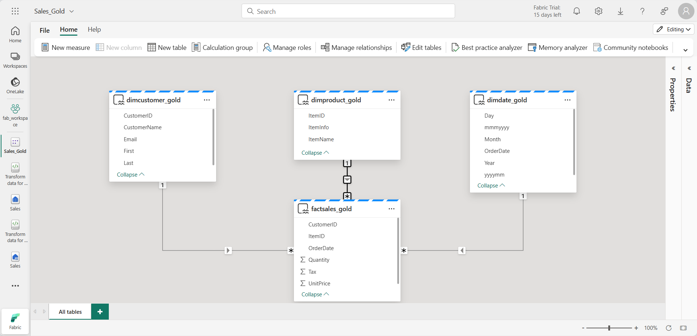

---
lab:
  title: 在 Microsoft Fabric 湖屋中创建奖牌体系结构
  module: Organize a Fabric lakehouse using medallion architecture design
---

# 在 Microsoft Fabric 湖屋中创建奖牌体系结构

在本练习中，你将使用笔记本在 Fabric 湖屋中构建奖牌体系结构。 你将创建工作区、创建湖屋、将数据上传到铜层、转换数据并将其加载到银 Delta 表、进一步转换数据并将其加载到金 Delta 表，然后浏览数据集并创建关系。

完成此练习大约需要 40 分钟

> 注意：需要 Microsoft Fabric 许可证才能完成本练习。 有关如何启用免费 Fabric 试用版许可证的详细信息，请参阅 [Fabric 入门](https://learn.microsoft.com/fabric/get-started/fabric-trial)。 执行此操作需要 Microsoft 学校或工作帐户 。 如果没有，可以[注册 Microsoft Office 365 E3 或更高版本的试用版](https://www.microsoft.com/microsoft-365/business/compare-more-office-365-for-business-plans)。

## 创建工作区并启用数据模型编辑

在 Fabric 中处理数据之前，在已启用的 Fabric 试用版中创建工作区。

1. 登录到 [Microsoft Fabric](https://app.fabric.microsoft.com) (`https://app.fabric.microsoft.com`)，然后选择 Power BI。
2. 在左侧菜单栏中，选择“工作区”（图标类似于 &#128455;）。
3. 新建一个工作区并为其指定名称，并选择包含 Fabric 容量（试用版、高级版或 Fabric）的许可模式  。
4. 打开新工作区时，它应为空，如下所示：

    
5. 导航到工作区设置并启用“数据模型编辑”预览功能。 这样一来，你就可以使用 Power BI 数据集在你的湖屋中的表之间创建关系。

    

    > 注意：启用预览功能后，可能需要刷新浏览器选项卡。

## 创建湖屋并将数据上传到铜层

现在已经有了一个工作区，接下来可以切换到 Fabric 门户中的“数据工程”体验，并为要分析的数据创建一个数据湖屋。

1. 在 Power BI 门户左下角，选择 Power BI 图标并切换到“数据工程”体验 。

2. 在“Synapse 数据工程”主页中，使用所选名称创建一个新的湖屋 。

    大约一分钟后，一个新的空湖屋创建完成。 需要将一些数据引入数据湖屋进行分析。 有多种方法可以执行此操作，但在本练习中，只需将文本文件下载到本地计算机（或者实验室 VM，如果适用），然后将其上传到湖屋。

3. 从 `https://github.com/MicrosoftLearning/dp-data/blob/main/orders.zip` 下载本练习的数据文件。 提取文件并以原始名称保存在本地计算机（或者实验室 VM，如果适用）上。 应该有 3 个包含 3 年销售数据的文件：2019.csv、2020.csv 和 2021.csv。

4. 返回到包含湖屋的 Web 浏览器选项卡，在“资源管理器”窗格中“Files”文件夹的“...”菜单中，选择“新建子文件夹”并创建名为“bronze”的文件夹    。

5. 在 bronze 文件夹的“...”菜单中，选择“上传”和“上传文件”，然后将本地计算机（或者实验室 VM，如果适用）中的 3 个文件（2019.csv、2020.csv 和 2021.csv）上传到湖屋   。 使用 Shift 键一次上传全部 3 个文件。
   
6. 上传文件后，选择 bronze 文件夹；然后验证文件是否已上传，如下所示：

    

## 转换数据并加载到银 Delta 表

现在，湖屋的铜层中已有一些数据，可以使用笔记本转换数据并将其加载到银层中的 Delta 表。

1. 在主页上查看数据湖中 bronze 文件夹的内容时，在“打开笔记本”菜单中选择“新建笔记本”   。

    几秒钟后，一个包含单个单元格的新笔记本将会打开。 笔记本由一个或多个单元格组成，这些单元格可以包含代码或 markdown（格式化文本） 。

2. 当笔记本打开时，选择笔记本左上角的“Notebook xxxx”文本并输入新名称，将其重命名为“Transform data for Silver” 。

    

2. 选择笔记本中的现有单元格，其中包含一些简单的注释代码。 突出显示并删除这两行 - 不需要此代码。
   
   > 注意：使用笔记本可以运行多种语言的代码，包括 Python、Scala 和 SQL。 在本练习中，你将使用 PySpark 和 SQL。 你还可以添加 markdown 单元格，以提供格式化文本和图像来记录代码。

3. 将以下代码**粘贴**到单元格中：

    ```python
    from pyspark.sql.types import *
    
    # Create the schema for the table
    orderSchema = StructType([
        StructField("SalesOrderNumber", StringType()),
        StructField("SalesOrderLineNumber", IntegerType()),
        StructField("OrderDate", DateType()),
        StructField("CustomerName", StringType()),
        StructField("Email", StringType()),
        StructField("Item", StringType()),
        StructField("Quantity", IntegerType()),
        StructField("UnitPrice", FloatType()),
        StructField("Tax", FloatType())
        ])
    
    # Import all files from bronze folder of lakehouse
    df = spark.read.format("csv").option("header", "true").schema(orderSchema).load("Files/bronze/*.csv")
    
    # Display the first 10 rows of the dataframe to preview your data
    display(df.head(10))
    ```

4. 使用单元格左侧的 ****&#9655;** (*运行单元格*)** 按钮运行代码。

    > 注意：由于这是你第一次在此笔记本中运行 Spark 代码，因此必须启动 Spark 会话。 这意味着第一次运行可能需要一分钟左右才能完成。 后续运行速度会更快。

5. 单元格命令完成后，**查看单元格下方的输出**，输出应如下所示：

    | Index | SalesOrderNumber | SalesOrderLineNumber | OrderDate | CustomerName | 电子邮件 | 项 | 数量 | 单价 | 税款 |
    | -- | -- | -- | -- | -- | -- | -- | -- | -- | -- |
    | 1 | SO49172 | 1 | 2021-01-01 | Brian Howard | brian23@adventure-works.com | Road-250 Red, 52 | 1 | 2443.35 | 195.468 |
    | 2 |  SO49173 | 1 | 2021-01-01 | Linda Alvarez | Mountain-200 Silver, 38 | 1 | 2071.4197 | 165.7136 |
    | ... | ... | ... | ... | ... | ... | ... | ... | ... | ... |

    你运行的代码已将 **bronze** 文件夹中的 CSV 文件的数据加载到 Spark 数据帧中，然后显示了数据帧的前几行。

    > 注意：可以通过选择输出窗格左上角的“...”菜单来清除、隐藏单元格输出的内容并自动调整其大小。 

6. 现在你将**添加用于数据验证和清理的列**，使用 PySpark 数据帧添加列并更新某些现有列的值。 使用 + 按钮**添加新的代码块**，并将以下代码添加到单元格：

    ```python
    from pyspark.sql.functions import when, lit, col, current_timestamp, input_file_name
    
    # Add columns IsFlagged, CreatedTS and ModifiedTS
    df = df.withColumn("FileName", input_file_name()) \
        .withColumn("IsFlagged", when(col("OrderDate") < '2019-08-01',True).otherwise(False)) \
        .withColumn("CreatedTS", current_timestamp()).withColumn("ModifiedTS", current_timestamp())
    
    # Update CustomerName to "Unknown" if CustomerName null or empty
    df = df.withColumn("CustomerName", when((col("CustomerName").isNull() | (col("CustomerName")=="")),lit("Unknown")).otherwise(col("CustomerName")))
    ```

    代码的第一行从 PySpark 导入必要的函数。 然后，向数据帧添加新列，以便可以跟踪源文件名称、订单是否被标记为在感兴趣的会计年度之前，以及创建和修改行的时间。
    
    另外，还需要添加 CustomerID 和 ItemID 列，稍后将填充这些列。
    
    最后，如果 CustomerName 列为 null 或为空，则将此列更新为“未知”。

7. 使用 ****&#9655;** (*运行单元格*)** 按钮运行单元格以执行代码。

8. 接下来，你将使用 Delta Lake 格式定义销售数据库中 **sales_silver** 表的架构。 创建新的代码块，并将以下代码添加到单元格：

    ```python
    # Define the schema for the sales_silver table
    
    from pyspark.sql.types import *
    from delta.tables import *
    
    DeltaTable.createIfNotExists(spark) \
        .tableName("sales.sales_silver") \
        .addColumn("SalesOrderNumber", StringType()) \
        .addColumn("SalesOrderLineNumber", IntegerType()) \
        .addColumn("OrderDate", DateType()) \
        .addColumn("CustomerName", StringType()) \
        .addColumn("Email", StringType()) \
        .addColumn("Item", StringType()) \
        .addColumn("Quantity", IntegerType()) \
        .addColumn("UnitPrice", FloatType()) \
        .addColumn("Tax", FloatType()) \
        .addColumn("FileName", StringType()) \
        .addColumn("IsFlagged", BooleanType()) \
        .addColumn("CreatedTS", DateType()) \
        .addColumn("ModifiedTS", DateType()) \
        .execute()
        ```
9. Run the cell to execute the code using the ****&#9655;** (*Run cell*)** button.

10. Select the **...** in the Tables section of the lakehouse explorer pane and select **Refresh**. You should now see the new **sales_silver** table listed. The **&#9650;** (triangle icon) indicates that it's a Delta table.

    

    > **Note**: If you don't see the new table, wait a few seconds and then select **Refresh** again, or refresh the entire browser tab.

11. Now you're going to perform an **upsert operation** on a Delta table, updating existing records based on specific conditions and inserting new records when no match is found. Add a new code block and paste the following code:

    ```python
    # Update existing records and insert new ones based on a condition defined by the columns SalesOrderNumber, OrderDate, CustomerName, and Item.

    from delta.tables import *
    
    deltaTable = DeltaTable.forPath(spark, 'Tables/sales_silver')
    
    dfUpdates = df
    
    deltaTable.alias('silver') \
      .merge(
        dfUpdates.alias('updates'),
        'silver.SalesOrderNumber = updates.SalesOrderNumber and silver.OrderDate = updates.OrderDate and silver.CustomerName = updates.CustomerName and silver.Item = updates.Item'
      ) \
       .whenMatchedUpdate(set =
        {
          
        }
      ) \
     .whenNotMatchedInsert(values =
        {
          "SalesOrderNumber": "updates.SalesOrderNumber",
          "SalesOrderLineNumber": "updates.SalesOrderLineNumber",
          "OrderDate": "updates.OrderDate",
          "CustomerName": "updates.CustomerName",
          "Email": "updates.Email",
          "Item": "updates.Item",
          "Quantity": "updates.Quantity",
          "UnitPrice": "updates.UnitPrice",
          "Tax": "updates.Tax",
          "FileName": "updates.FileName",
          "IsFlagged": "updates.IsFlagged",
          "CreatedTS": "updates.CreatedTS",
          "ModifiedTS": "updates.ModifiedTS"
        }
      ) \
      .execute()
    ```
    此操作非常重要，因为借助它，你可以根据特定列的值更新表中的现有记录，并在找不到匹配项时插入新记录。 从可能包含对现有和新记录的更新的源系统加载数据时，插入新记录是一个常见要求。

现在，银 Delta 表中已准备好用于进一步转换和建模的数据。

## 使用 SQL 终结点浏览银层中的数据

现在，银层中已有数据，可以使用 SQL 终结点来浏览数据并执行一些基本分析。 如果你熟悉 SQL 并想要对数据进行一些基本探索，这是一个很好的选择。 在本练习中，我们使用 Fabric 中的 SQL 终结点视图，但请注意，也可以使用其他工具，例如 SQL Server Management Studio (SSMS) 和 Azure 数据资源管理器。

1. 导航回工作区，注意，现在列出了一些资产。 选择“**SQL 终结点**”，在 SQL 终结点视图中打开你的湖屋。

    

1. 从功能区中选择“**新建 SQL 查询**”，这将打开 SQL 查询编辑器。 请注意，可以使用湖屋资源管理器窗格中现有查询名称旁边的 **...** 菜单项重命名查询。

   我们将运行两个 sql 查询来浏览数据。

1. 将以下查询粘贴到查询编辑器中，然后选择“**运行**”：

    ```sql
    SELECT YEAR(OrderDate) AS Year
        , CAST (SUM(Quantity * (UnitPrice + Tax)) AS DECIMAL(12, 2)) AS TotalSales
    FROM sales_silver
    GROUP BY YEAR(OrderDate) 
    ORDER BY YEAR(OrderDate)
    ```

    此查询会计算 sales_silver 表中每年的总销售额。 结果应如下所示：

    

  1. 现在，我们将了解一下哪些客户（在数量方面）购买的最多。 将以下查询粘贴到查询编辑器中，然后选择“**运行**”：

        ```sql
        SELECT TOP 10 CustomerName, SUM(Quantity) AS TotalQuantity
        FROM sales_silver
        GROUP BY CustomerName
        ORDER BY TotalQuantity DESC
        ```
        此查询会计算 sales_silver 表中每个客户购买的商品总数，然后返回按数量排名的前 10 位客户。

银层的数据探索对于基本分析很有用，但你需要进一步转换数据并将其建模为星型架构，以实现更高级的分析和报告。 将在下一部分执行该操作。

## 转换金层数据

你已成功从铜层获取数据，对其进行转换，并将其加载到银 Delta 表中。 现在，你将使用新的笔记本进一步转换数据，将其建模为星型架构，并将其加载到金 Delta 表中。

请注意，你可以在单个笔记本中完成以上操作，但在本练习中，你将使用单独的笔记本来演示将数据从铜级转换为银级，然后从银级转换为金级的过程。 这有助于调试、故障排除和重复使用。

1. 返回到“数据工程”主页，并创建名为“Transform data for Gold”的新笔记本 。

2. 在湖屋资源管理器窗格中，选择“添加”，然后选择前面创建的“Sales”湖屋来添加“Sales”湖屋。   你将在资源管理器窗格的“Tables”部分看到列出的 sales_silver 表 。

3. 在现有代码块中，删除样本文本并**添加以下代码**，以便将数据加载到数据帧并开始构建星型架构：

    ```python
    # Load data to the dataframe as a starting point to create the gold layer
    df = spark.read.table("Sales.sales_silver")
    ```

4. **添加新代码块**并粘贴以下代码以创建日期维度表：

    ```python
    from pyspark.sql.types import *
    from delta.tables import*
    
    # Define the schema for the dimdate_gold table
    DeltaTable.createIfNotExists(spark) \
        .tableName("sales.dimdate_gold") \
        .addColumn("OrderDate", DateType()) \
        .addColumn("Day", IntegerType()) \
        .addColumn("Month", IntegerType()) \
        .addColumn("Year", IntegerType()) \
        .addColumn("mmmyyyy", StringType()) \
        .addColumn("yyyymm", StringType()) \
        .execute()
    ```
    > 注意：你可以随时运行 `display(df)` 命令来查看工作进度。 在这种情况下，可以运行“display(dfdimDate_gold)”来查看 dimDate_gold 数据帧的内容。

1. 在新代码块中，**添加以下代码**，为日期维度创建数据帧 **dimdate_gold**：

    ```python
    from pyspark.sql.functions import col, dayofmonth, month, year, date_format
    
    # Create dataframe for dimDate_gold
    
    dfdimDate_gold = df.dropDuplicates(["OrderDate"]).select(col("OrderDate"), \
            dayofmonth("OrderDate").alias("Day"), \
            month("OrderDate").alias("Month"), \
            year("OrderDate").alias("Year"), \
            date_format(col("OrderDate"), "MMM-yyyy").alias("mmmyyyy"), \
            date_format(col("OrderDate"), "yyyyMM").alias("yyyymm"), \
        ).orderBy("OrderDate")


2. You're separating the code out into new code blocks so that you can understand and watch what's happening in the notebook as you transform the data. In another new code block, **add the following code** to update the date dimension as new data comes in:

    ```python
    from delta.tables import *
    
    deltaTable = DeltaTable.forPath(spark, 'Tables/dimdate_gold')
    
    dfUpdates = dfdimDate_gold
    
    deltaTable.alias('silver') \
      .merge(
        dfUpdates.alias('updates'),
        'silver.OrderDate = updates.OrderDate'
      ) \
       .whenMatchedUpdate(set =
        {
          
        }
      ) \
     .whenNotMatchedInsert(values =
        {
          "OrderDate": "updates.OrderDate",
          "Day": "updates.Day",
          "Month": "updates.Month",
          "Year": "updates.Year",
          "mmmyyyy": "updates.mmmyyyy",
          "yyyymm": "yyyymm"
        }
      ) \
      .execute()
    ```
    恭喜！ 你的日期维度全部设置好了。 现在，你将创建客户维度。
3. 要生成客户维度表，**请添加新代码块**并粘贴以下代码：

    ```python
    from pyspark.sql.types import *
    from delta.tables import *
    
    # Create customer_gold dimension delta table
    DeltaTable.createIfNotExists(spark) \
        .tableName("sales.dimcustomer_gold") \
        .addColumn("CustomerName", StringType()) \
        .addColumn("Email",  StringType()) \
        .addColumn("First", StringType()) \
        .addColumn("Last", StringType()) \
        .addColumn("CustomerID", LongType()) \
        .execute()
    ```
1. 在新代码块中，**添加以下代码**以删除重复的客户，选择特定列，然后拆分“CustomerName”列以创建“First”和“Last”姓名列：

    ```python
    from pyspark.sql.functions import col, split
    
    # Create customer_gold dataframe
    
    dfdimCustomer_silver = df.dropDuplicates(["CustomerName","Email"]).select(col("CustomerName"),col("Email")) \
        .withColumn("First",split(col("CustomerName"), " ").getItem(0)) \
        .withColumn("Last",split(col("CustomerName"), " ").getItem(1)) \
    ```

     此处，你通过执行各种转换（例如删除重复项、选择特定列以及拆分“CustomerName”列以创建“First”和“Last”名称列）创建了一个新的数据帧 dfdimCustomer_silver。 结果是一个数据帧，其中包含已清理和结构化的客户数据，包括从“CustomerName”列中提取的单独“First”和“Last”名称列。

2. 接下来，我们将**为客户创建 ID 列**。 在新代码块中，粘贴以下内容：

    ```python
    from pyspark.sql.functions import monotonically_increasing_id, col, when, coalesce, max, lit
    
    dfdimCustomer_temp = spark.read.table("Sales.dimCustomer_gold")
    
    MAXCustomerID = dfdimCustomer_temp.select(coalesce(max(col("CustomerID")),lit(0)).alias("MAXCustomerID")).first()[0]
    
    dfdimCustomer_gold = dfdimCustomer_silver.join(dfdimCustomer_temp,(dfdimCustomer_silver.CustomerName == dfdimCustomer_temp.CustomerName) & (dfdimCustomer_silver.Email == dfdimCustomer_temp.Email), "left_anti")
    
    dfdimCustomer_gold = dfdimCustomer_gold.withColumn("CustomerID",monotonically_increasing_id() + MAXCustomerID + 1)
    ```
    此处，将清理和转换客户数据 (dfdimCustomer_silver)，方法是执行左反联接以排除 dimCustomer_gold 表中已存在的重复项，然后使用 monotonically_increasing_id() 函数生成唯一的 CustomerID 值。

1. 现在，可以确保客户表在新数据传入时保持最新状态。 **在新代码块中**，粘贴以下内容：

    ```python
    from delta.tables import *

    deltaTable = DeltaTable.forPath(spark, 'Tables/dimcustomer_gold')
    
    dfUpdates = dfdimCustomer_gold
    
    deltaTable.alias('silver') \
      .merge(
        dfUpdates.alias('updates'),
        'silver.CustomerName = updates.CustomerName AND silver.Email = updates.Email'
      ) \
       .whenMatchedUpdate(set =
        {
          
        }
      ) \
     .whenNotMatchedInsert(values =
        {
          "CustomerName": "updates.CustomerName",
          "Email": "updates.Email",
          "First": "updates.First",
          "Last": "updates.Last",
          "CustomerID": "updates.CustomerID"
        }
      ) \
      .execute()
    ```
2. 现在，你将**重复上述步骤来创建产品维度**。 在新代码块中，粘贴以下内容：

    ```python
    from pyspark.sql.types import *
    from delta.tables import *
    
    DeltaTable.createIfNotExists(spark) \
        .tableName("sales.dimproduct_gold") \
        .addColumn("ItemName", StringType()) \
        .addColumn("ItemID", LongType()) \
        .addColumn("ItemInfo", StringType()) \
        .execute()
    ```    
3.  **添加另一个代码块**以创建 **customer_gold** 数据帧。 稍后将在 Sales 联接中使用它。
    
    ```python
    from pyspark.sql.functions import col, split, lit
    
    # Create Customer_gold dataframe, this dataframe will be used later on on the Sales join
    
    dfdimProduct_silver = df.dropDuplicates(["Item"]).select(col("Item")) \
        .withColumn("ItemName",split(col("Item"), ", ").getItem(0)) \
        .withColumn("ItemInfo",when((split(col("Item"), ", ").getItem(1).isNull() | (split(col("Item"), ", ").getItem(1)=="")),lit("")).otherwise(split(col("Item"), ", ").getItem(1))) \
       ```

4.  现在，你将为 **dimProduct_gold 表**创建 ID。 将以下语法添加到新代码块：

    ```python
    from pyspark.sql.functions import monotonically_increasing_id, col, lit, max, coalesce
    
    #dfdimProduct_temp = dfdimProduct_silver
    dfdimProduct_temp = spark.read.table("Sales.dimProduct_gold")
    
    MAXProductID = dfdimProduct_temp.select(coalesce(max(col("ItemID")),lit(0)).alias("MAXItemID")).first()[0]
    
    dfdimProduct_gold = dfdimProduct_silver.join(dfdimProduct_temp,(dfdimProduct_silver.ItemName == dfdimProduct_temp.ItemName) & (dfdimProduct_silver.ItemInfo == dfdimProduct_temp.ItemInfo), "left_anti")
    
    dfdimProduct_gold = dfdimProduct_gold.withColumn("ItemID",monotonically_increasing_id() + MAXProductID + 1)
    ```
5.   与对其他维度执行的操作类似，你需要确保产品表在新数据传入时保持最新。 **在新代码块中**，粘贴以下内容：
        ```python
        from delta.tables import *

        deltaTable = DeltaTable.forPath(spark, 'Tables/dimproduct_gold')
        
        dfUpdates = dfdimProduct_gold
        
        deltaTable.alias('silver') \
          .merge(
            dfUpdates.alias('updates'),
            'silver.ItemName = updates.ItemName AND silver.ItemInfo = updates.ItemInfo'
          ) \
           .whenMatchedUpdate(set =
            {
              
            }
          ) \
         .whenNotMatchedInsert(values =
            {
              "ItemName": "updates.ItemName",
              "ItemInfo": "updates.ItemInfo",
              "ItemID": "updates.ItemID"
            }
          ) \
          .execute()
        ```

        它根据表中的当前数据计算下一个可用的产品 ID，将这些新 ID 分配给产品，然后显示更新的产品信息（如果 display 命令取消注释）。

        **构建好维度后，最后一步是创建事实数据表。**

1.  **在新代码块中**，粘贴以下代码以创建**事实数据表**：

    ```python
    from pyspark.sql.types import *
    from delta.tables import *
    
    DeltaTable.createIfNotExists(spark) \
        .tableName("sales.factsales_gold") \
        .addColumn("CustomerID", LongType()) \
        .addColumn("ItemID", LongType()) \
        .addColumn("OrderDate", DateType()) \
        .addColumn("Quantity", IntegerType()) \
        .addColumn("UnitPrice", FloatType()) \
        .addColumn("Tax", FloatType()) \
        .execute()
    ```
2.  **在新代码块中**，粘贴以下代码以创建**新的数据帧**，将销售数据与客户和产品信息（包括客户 ID、商品 ID、订单日期、数量、单价和税费）合并：

    ```python
    from pyspark.sql.functions import col
    
    dfdimCustomer_temp = spark.read.table("Sales.dimCustomer_gold")
    dfdimProduct_temp = spark.read.table("Sales.dimProduct_gold")
    
    df = df.withColumn("ItemName",split(col("Item"), ", ").getItem(0)) \
        .withColumn("ItemInfo",when((split(col("Item"), ", ").getItem(1).isNull() | (split(col("Item"), ", ").getItem(1)=="")),lit("")).otherwise(split(col("Item"), ", ").getItem(1))) \
    
    
    # Create Sales_gold dataframe
    
    dffactSales_gold = df.alias("df1").join(dfdimCustomer_temp.alias("df2"),(df.CustomerName == dfdimCustomer_temp.CustomerName) & (df.Email == dfdimCustomer_temp.Email), "left") \
            .join(dfdimProduct_temp.alias("df3"),(df.ItemName == dfdimProduct_temp.ItemName) & (df.ItemInfo == dfdimProduct_temp.ItemInfo), "left") \
        .select(col("df2.CustomerID") \
            , col("df3.ItemID") \
            , col("df1.OrderDate") \
            , col("df1.Quantity") \
            , col("df1.UnitPrice") \
            , col("df1.Tax") \
        ).orderBy(col("df1.OrderDate"), col("df2.CustomerID"), col("df3.ItemID"))
    ```

3.  通过在**新的代码块**中运行以下代码来确保销售数据保持最新状态：
    ```python
    from delta.tables import *
    
    deltaTable = DeltaTable.forPath(spark, 'Tables/factsales_gold')
    
    dfUpdates = dffactSales_gold
    
    deltaTable.alias('silver') \
      .merge(
        dfUpdates.alias('updates'),
        'silver.OrderDate = updates.OrderDate AND silver.CustomerID = updates.CustomerID AND silver.ItemID = updates.ItemID'
      ) \
       .whenMatchedUpdate(set =
        {
          
        }
      ) \
     .whenNotMatchedInsert(values =
        {
          "CustomerID": "updates.CustomerID",
          "ItemID": "updates.ItemID",
          "OrderDate": "updates.OrderDate",
          "Quantity": "updates.Quantity",
          "UnitPrice": "updates.UnitPrice",
          "Tax": "updates.Tax"
        }
      ) \
      .execute()
    ```
     此处，将使用 Delta Lake 的合并操作将新的销售额数据 (dffactSales_gold) 同步和更新到 factsales_gold 表。 此操作将比较现有数据（银表）和新数据（更新数据帧）之间的订单日期、客户 ID 和商品 ID，更新匹配记录并根据需要插入新记录。

**现在，你已有一个策展的建模金层，可用于报告和分析。**

## 创建数据集

你可以在工作区中使用金层来创建报表并分析数据。 你可以直接在工作区中访问数据集，以创建用于报告的关系和度量值。

请注意，不能使用创建湖屋时自动创建的**默认数据集**。 必须从湖屋资源管理器创建一个新的数据集，其中包含你在本练习中创建的金表。

1. 在工作区中，导航到“Sales”湖屋。
2. 从湖屋资源管理器视图的功能区中选择“新建 Power BI 数据集”。
3. 选择要包含在数据集中的已转换金表，然后选择“确认”。
   - dimdate_gold
   - dimcustomer_gold
   - dimproduct_gold
   - factsales_gold

    此时将在 Fabric 中打开数据集，你可以在其中创建关系和度量值。

    

4. 重命名数据集，以便更轻松地识别。 选择窗口左上角的数据集名称。 将数据集重命名为 Sales_Gold。

在此处，你或数据团队的其他成员可以根据湖屋中的数据创建报表和仪表板。 这些报表将直接连接到湖屋的金层，因此它们将始终反映最新数据。

## 清理资源

在本练习中，你已了解如何在 Microsoft Fabric 湖屋中创建奖牌体系结构。

如果已完成湖屋探索，可删除为本练习创建的工作区。

1. 在左侧栏中，选择工作区的图标以查看其包含的所有项。
2. 在工具栏上的“...”菜单中，选择“工作区设置” 。
3. 在“其他”部分中，选择“删除此工作区” 。
