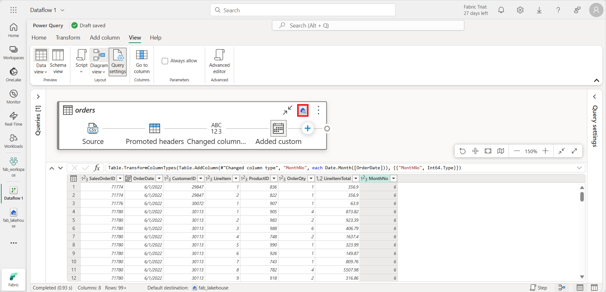
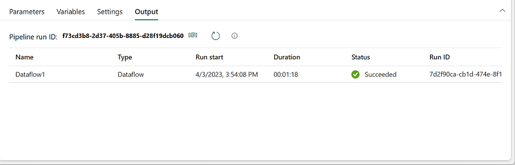

---
lab:
  title: 在 Microsoft Fabric 中创建和使用数据流 (Gen2)
  module: Ingest Data with Dataflows Gen2 in Microsoft Fabric
---

# 在 Microsoft Fabric 中创建和使用数据流 (Gen2)

在 Microsoft Fabric 中，数据流 (Gen2) 连接到各种数据源并在 Power Query Online 中执行转换。 然后，可以在数据管道中使用它们，将数据引入湖屋或其他分析存储，或定义 Power BI 报表的数据集。

本实验室旨在介绍数据流 (Gen2) 的不同元素，而不是创建企业中可能存在的复杂解决方案。 完成本实验室大约需要 30 分钟。

> **注意**：需要 [Microsoft Fabric 试用版](https://learn.microsoft.com/fabric/get-started/fabric-trial) 才能完成本练习。

## 创建工作区

在 Fabric 中处理数据之前，创建一个已启用的 Fabric 试用版的工作区。

1. 在浏览器中，导航到 [Microsoft Fabric 主页](https://app.fabric.microsoft.com/home?experience=fabric) (`https://app.fabric.microsoft.com/home?experience=fabric`)，使用 Fabric 凭据登录。
1. 在左侧菜单栏中，选择“工作区”（图标类似于 &#128455;）。
1. 新建一个工作区并为其指定名称，并选择包含 Fabric 容量（试用版、高级版或 Fabric）的许可模式  。
1. 打开新工作区时，它应为空。

    

## 创建湖屋

现在已经有了工作区，可以创建数据湖屋，将数据引入其中了。

1. 在左侧菜单上，选择“**创建**”。 在“*新建*”页的 *“数据工程”* 部分下，选择“**湖屋**”。 为其指定唯一的名称。

    >**备注**：如果未将“**创建**”选项固定到边栏，则需要首先选择省略号 (**...**) 选项。

    大约一分钟后，一个新的空湖屋创建完成。

 

## 创建数据流 (Gen2) 以引入数据

有了湖屋后，需要向湖屋引入一些数据。 执行此操作的一种方法是定义封装提取、转换和加载 (ETL) 过程的数据流。

1. 在湖屋主页中，选择“获取数据” > “新建数据流 Gen2”。******** 几秒钟后，新数据流的 Power Query 编辑器将打开，如下所示。

 

2. 选择“从文本/CSV 文件导入”，并使用以下设置创建新的数据源：
 - 文件链接：已选择
 - 文件路径或 URL：`https://raw.githubusercontent.com/MicrosoftLearning/dp-data/main/orders.csv`
 - 连接：创建新连接
 - 数据网关：（无)
 - 身份验证类型：匿名

3. 选择“下一步”可预览文件数据，然后选择“创建数据源” 。 Power Query 编辑器显示数据源以及设置数据格式的初始查询步骤集，如下所示：

 

4. 在工具栏功能区，选择“**添加列**”选项卡。然后，选择“**自定义列**”并创建新列。

5. 将“*新列名*”设置为“`MonthNo`”，将“*数据类型*”设置为“**整数**”，然后添加以下公式：`Date.Month([OrderDate])` - 如下所示：

 

6. 选择“**确定**”以创建列，并注意添加自定义列的步骤是如何添加到查询的。 生成的列显示在数据窗格中：

 

> 提示：请注意，在右侧的“查询设置”窗格中，“应用的步骤”包括每个转换步骤 。 在底部，还可以切换“关系图流”按钮以打开步骤的可视化关系图。
>
> 可以通过选择齿轮图标向上或向下移动、编辑步骤，还可以选择每个步骤以查看在预览窗格中应用转换。

7. 检查并确认“**OrderDate**”列的数据类型设置为“**Date**”，并且新创建的列“**MonthNo**”的数据类型设置为“**整数**”。

## 为数据流添加数据目标

1. 在工具栏功能区上，选择“开始”选项卡。然后在“添加数据目标”下拉菜单中，选择“湖屋”  。

   > 注意：如果此选项灰显，则可能已设置了数据目标。 检查 Power Query 编辑器右侧的“查询设置”窗格底部的数据目标。 如果已设置默认目标，可以将其删除并添加新目标。

2. 在“连接到数据目标”对话框中，编辑连接并使用 Power BI 组织帐户登录，以设置数据流用于访问湖屋的标识。

 

3. 选择“下一步”，在可用工作区列表中，找到你的工作区并选择在本练习开始时在该工作区中创建的湖屋。 然后指定名为“orders”的新表：

   

4. 选择“**下一步**”，然后在“**选择目标设置**”页上，禁用“**使用自动设置**”选项，选择“**追加**”，然后选择“**保存设置**”。
    > **注意：** 我们建议使用“*Power query*”编辑器更新数据类型，但你也可以根据需要从此页面执行此操作。

    

5. 在菜单栏上，打开“**视图**”，然后选择“**关系图视图**”。 请注意：“**Lakehouse**”目标在 Power Query 编辑器中的查询中显示为图标。

   

6. 在工具栏功能区上，选择“开始”选项卡。**** 然后选择“保存并运行”，等待“数据流 1”数据流在工作区中创建完成。********

## 将数据流添加到管道

可以将数据流作为活动包含在管道中。 管道用于协调数据引入和处理活动，使你能够在单个计划的过程中将数据流与其他类型的操作相结合。 可以在一些不同的体验中创建管道，包括数据工厂体验。

1. 在启用了 Fabric 的工作区中，选择“+ 新建项” > “数据管道”，然后在出现提示时创建名为“加载数据”的新管道。************

   管道编辑器随即打开。

   

   > 提示：如果“复制数据”向导自动打开，请将其关闭！

2. 选择“管道活动”，并将“数据流”活动添加到管道。********

3. 选中新的 Dataflow1 活动后，在“设置”选项卡上的“数据流”下拉列表中，选择“Dataflow 1”（之前创建的数据流）

   

4. 在“开始”选项卡上，使用 &#128427;（“保存”）图标保存管道 。
5. 使用 &#9655;（“运行”）按钮运行管道，等待管道完成。 可能需要几分钟时间。

   

6. 在左边缘上的菜单栏中，选择你的湖屋。
7. 在“表”的“...”菜单中，选择“刷新”  。 然后展开“表”并选择数据流创建的“订单”表 。

   

> **提示**：在 Power BI Desktop 中，可以使用 *Power BI 数据流（旧版）* 连接器直接连接到使用数据流完成的数据转换。
>
> 还可以进行其他转换，发布为新数据集，并向专用数据集的目标受众分发。
>
>

## 清理资源

如果已在 Microsoft Fabric 中探索完数据流，则可以删除为此练习创建的工作区。

1. 在浏览器中导航到 Microsoft Fabric。
1. 在左侧栏中，选择工作区的图标以查看其包含的所有项。
1. 选择“**工作区设置**”，然后在“**常规**”部分中向下滚动并选择“**删除此工作区**”。
1. 选择“**删除**”以删除工作区。
