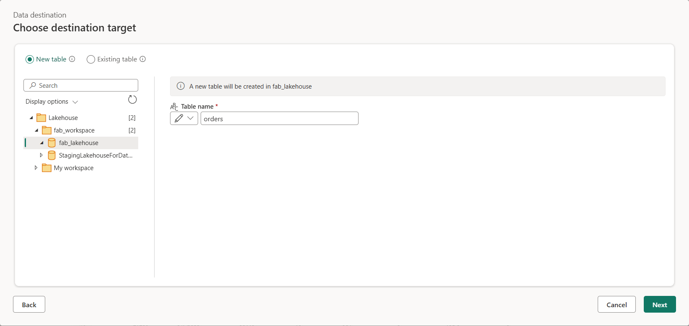

---
lab:
  title: 在 Microsoft Fabric 中创建和使用数据流 (Gen2)
  module: Ingest Data with Dataflows Gen2 in Microsoft Fabric
---

# 在 Microsoft Fabric 中创建数据流 (Gen2)

在 Microsoft Fabric 中，数据流 (Gen2) 连接到各种数据源并在 Power Query Online 中执行转换。 然后，可以在数据管道中使用它们，将数据引入湖屋或其他分析存储，或定义 Power BI 报表的数据集。

本实验室旨在介绍数据流 (Gen2) 的不同元素，而不是创建企业中可能存在的复杂解决方案。 完成本实验室大约需要 30 分钟。

> 注意：完成本练习需要 Microsoft Fabric 许可证。 有关如何启用免费 Fabric 试用版许可证的详细信息，请参阅 [Fabric 入门](https://learn.microsoft.com/fabric/get-started/fabric-trial)。 执行此操作需要 Microsoft 学校或工作帐户 。 如果没有，可以[注册 Microsoft Office 365 E3 或更高版本的试用版](https://www.microsoft.com/microsoft-365/business/compare-more-office-365-for-business-plans)。

## 创建工作区

在 Fabric 中处理数据之前，在已启用的 Fabric 试用版中创建工作区。

1. 登录到 [Microsoft Fabric](https://app.fabric.microsoft.com) (`https://app.fabric.microsoft.com`)，然后选择 Power BI。
2. 在左侧菜单栏中，选择“工作区”（图标类似于 &#128455;）。
3. 新建一个工作区并为其指定名称，并选择包含 Fabric 容量（试用版、高级版或 Fabric）的许可模式  。
4. 打开新工作区时，它应为空，如下所示：

    

## 创建湖屋

现在已经有了一个工作区，接下来可以切换到门户中的“数据工程”体验，并创建一个数据湖屋来将数据引入到其中。

1. 在 Power BI 门户左下角，选择 Power BI 图标并切换到“数据工程”体验 。

2. 在“数据工程”主页中，使用所选名称创建一个新的湖屋 。

    大约一分钟后，一个新的空湖屋创建完成。

 

## 创建数据流 (Gen2) 以引入数据

有了湖屋后，需要向湖屋引入一些数据。 执行此操作的一种方法是定义封装提取、转换和加载 (ETL) 过程的数据流。

1. 在工作区的主页中，选择“新建数据流 Gen2”。 几秒钟后，新数据流的 Power Query 编辑器将打开，如下所示。

 

2. 选择“从文本/CSV 文件导入”，并使用以下设置创建新的数据源：
 - 文件链接：已选择
 - 文件路径或 URL：`https://raw.githubusercontent.com/MicrosoftLearning/dp-data/main/orders.csv`
 - 连接：创建新连接
 - 数据网关：（无)
 - 身份验证类型：匿名

3. 选择“下一步”可预览文件数据，然后选择“创建数据源” 。 Power Query 编辑器显示数据源以及设置数据格式的初始查询步骤集，如下所示：

 

4. 在工具栏功能区上，选择“添加列”选项卡。然后选择“自定义列”并创建名为 MonthNo 的新列，其中包含基于公式 `Date.Month([OrderDate])` 的数字，如下所示：  

 

 添加自定义列的步骤将添加到查询中，生成的列将显示在数据窗格中：

 

> 提示：请注意，在右侧的“查询设置”窗格中，“应用的步骤”包括每个转换步骤 。 在底部，还可以切换“关系图流”按钮以打开步骤的可视化关系图。
>
> 可以通过选择齿轮图标向上或向下移动、编辑步骤，还可以选择每个步骤以查看在预览窗格中应用转换。

## 为数据流添加数据目标

1. 在工具栏功能区上，选择“开始”选项卡。然后在“添加数据目标”下拉菜单中，选择“湖屋”  。

   > 注意：如果此选项灰显，则可能已设置了数据目标。 检查 Power Query 编辑器右侧的“查询设置”窗格底部的数据目标。 如果已设置目标，可以使用齿轮更改它。

2. 在“连接到数据目标”对话框中，编辑连接并使用 Power BI 组织帐户登录，以设置数据流用于访问湖屋的标识。

 

3. 选择“下一步”，在可用工作区列表中，找到你的工作区并选择在本练习开始时在该工作区中创建的湖屋。 然后指定名为“orders”的新表：

   

   > 注意：在“目标设置”页上，请注意“列映射”中未选择“OrderDate”和“MonthNo”，并显示一条信息性消息：“更改为日期/时间”。 

   

1. 取消此操作，然后返回到在线 Power Query 中的 OrderDate 和 MonthNo 列。 右键单击列标题和“更改类型”。

    - OrderDate = 日期/时间
    - MonthNo = 整数

1. 现在重复前面所述的过程，以添加湖屋目标。

8. 在“目标设置”页上，选择“追加”，然后保存设置。   湖屋目标在 Power Query 编辑器中的查询中显示为图标。

   

9. 选择“发布”以发布数据流。 然后等待在工作区中创建 Dataflow 1 数据流。

1. 发布后，可以右键单击工作区中的数据流，选择“属性”，然后重命名数据流。

## 将数据流添加到管道

可以将数据流作为活动包含在管道中。 管道用于协调数据引入和处理活动，使你能够在单个计划的过程中将数据流与其他类型的操作相结合。 可以在一些不同的体验中创建管道，包括数据工厂体验。

1. 在启用了 Fabric 的工作区中，确保你仍处于数据工程体验中。 选择“新建”、“数据管道”，然后在出现提示时创建名为“加载数据”的新管道  。

   管道编辑器随即打开。

   

   > 提示：如果“复制数据”向导自动打开，请将其关闭！

2. 选择“添加管道活动”，并将数据流活动添加到管道 。

3. 选中新的 Dataflow1 活动后，在“设置”选项卡上的“数据流”下拉列表中，选择“Dataflow 1”（之前创建的数据流）   

   

4. 在“开始”选项卡上，使用 &#128427;（“保存”）图标保存管道 。
5. 使用 &#9655;（“运行”）按钮运行管道，等待管道完成。 可能需要几分钟时间。

   

6. 在左边缘上的菜单栏中，选择你的湖屋。
7. 在“表”的“...”菜单中，选择“刷新”  。 然后展开“表”并选择数据流创建的“订单”表 。

   

> 提示：使用 Power BI Desktop 数据流连接器直接连接到使用数据流完成的数据转换。
>
> 还可以进行其他转换，发布为新数据集，并向专用数据集的目标受众分发。
>
>

## 清理资源

如果已在 Microsoft Fabric 中探索完数据流，则可以删除为此练习创建的工作区。

1. 在浏览器中导航到 Microsoft Fabric。
1. 在左侧栏中，选择工作区的图标以查看其包含的所有项。
1. 在工具栏上的“...”菜单中，选择“工作区设置” 。
1. 在“其他”部分中，选择“删除此工作区” 。
1. 不要保存对 Power BI Desktop 所做的更改，也不要删除 .pbix 文件（如果已保存）。
