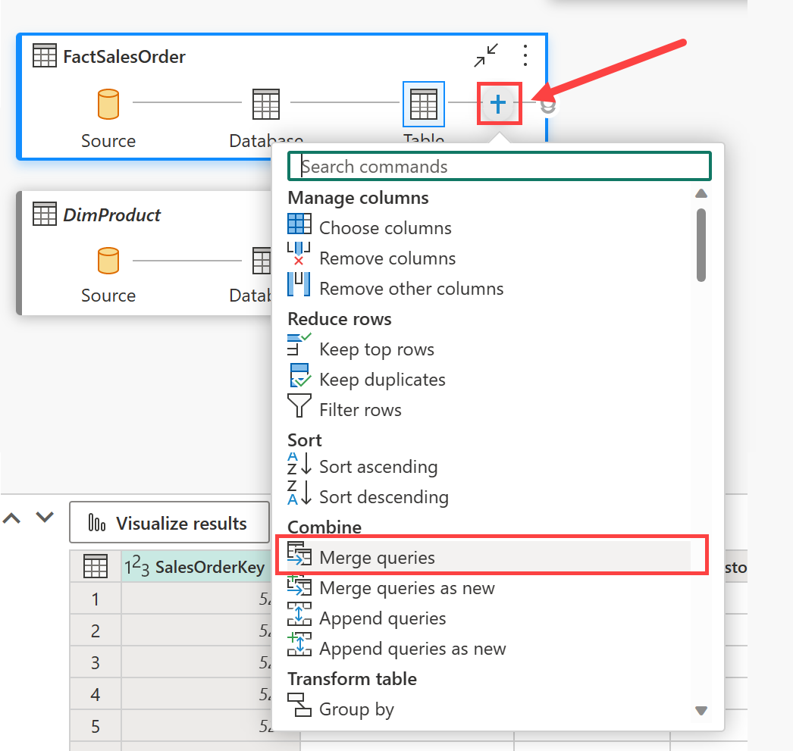

---
lab:
  title: 分析数据仓库中的数据
  module: Get started with data warehouses in Microsoft Fabric
---

# 分析数据仓库中的数据

在 Microsoft Fabric 中，数据仓库提供用于大规模分析的关系数据库。 与湖屋中定义的表的默认只读 SQL 终结点不同，数据仓库提供完整的 SQL 语义；包括插入、更新和删除表中数据的功能。

完成本实验室大约需要 30 分钟。

> **注意**：需要 [Microsoft Fabric 试用版](https://learn.microsoft.com/fabric/get-started/fabric-trial) 才能完成本练习。

## 创建工作区

在 Fabric 中处理数据之前，创建一个已启用的 Fabric 试用版的工作区。

1. 在 [Microsoft Fabric 主页](https://app.fabric.microsoft.com/home?experience=fabric) (`https://app.fabric.microsoft.com/home?experience=fabric`) 上，选择“**数据仓库**”。
1. 在左侧菜单栏中，选择“工作区”（图标类似于 &#128455;）。
1. 新建一个工作区并为其指定名称，并选择包含 Fabric 容量（试用版、高级版或 Fabric）的许可模式  。
1. 打开新工作区时，它应为空。

    

## 创建数据仓库

现已有了工作空间，可以创建数据仓库了。 “Synapse 数据仓库”主页包含创建新仓库的快捷方式：

1. 在“数据仓库”主页中，使用所选的名称创建新的仓库 。

    大约一分钟后，一个新的仓库创建完成：

    

## 创建表和插入数据

仓库是一个关系数据库，可在其中定义表和其他对象。

1. 在新仓库中，选择 **T-SQL** 磁贴，并使用以下 CREATE TABLE 语句：

    ```sql
   CREATE TABLE dbo.DimProduct
   (
       ProductKey INTEGER NOT NULL,
       ProductAltKey VARCHAR(25) NULL,
       ProductName VARCHAR(50) NOT NULL,
       Category VARCHAR(50) NULL,
       ListPrice DECIMAL(5,2) NULL
   );
   GO
    ```

2. 使用“&#9655;运行”按钮运行 SQL 脚本，在数据仓库的 dbo 架构中创建名为 DimProduct 的新表  。
3. 使用工具栏上的“刷新”按钮刷新视图。 然后，在“资源管理器”窗格中，展开“架构” > “dbo” > “Tables”，并验证是否已创建 DimProduct 表    。
4. 在“开始”菜单选项卡上，使用“新建 SQL 查询”按钮创建新查询，并输入以下 INSERT 语句 ：

    ```sql
   INSERT INTO dbo.DimProduct
   VALUES
   (1, 'RING1', 'Bicycle bell', 'Accessories', 5.99),
   (2, 'BRITE1', 'Front light', 'Accessories', 15.49),
   (3, 'BRITE2', 'Rear light', 'Accessories', 15.49);
   GO
    ```

5. 运行新查询，将三行插入 DimProduct 表中。
6. 查询完成后，在“**资源管理器**”窗格中，选择 **DimProduct** 表，并验证是否已将三行添加到表中。
7. 在“开始”菜单选项卡上，使用“新建 SQL 查询”按钮创建新查询 。 然后将 Transact-SQL 代码从 `https://raw.githubusercontent.com/MicrosoftLearning/dp-data/main/create-dw.txt` 复制并粘贴到新的查询窗格中。
8. 运行查询，创建一个简单的数据仓库架构并加载一些数据。 运行该脚本大约需要 30 秒。
9. 使用工具栏上的“刷新”按钮刷新视图。 然后在“资源管理器”窗格中，验证数据仓库中的 dbo 架构现在是否包含以下四个表 ：
    - **DimCustomer**
    - **DimDate**
    - **DimProduct**
    - **FactSalesOrder**

    > 提示：如果加载架构需要一段时间，只需刷新浏览器页面即可。

## 定义数据模型

关系数据仓库通常由事实数据表和维度表组成 。 事实数据表包含可以聚合以分析业务绩效（例如销售收入）的数字度量值，维度表包含实体的属性，可以按照这些属性来聚合数据（例如产品、客户或时间）。 在 Microsoft Fabric 数据仓库中，可以使用这些键来定义封装表之间的关系的数据模型。

1. 在工具栏中，选择“**模型布局**”按钮。
2. 在模型窗格中，重新排列数据仓库中的表，使 FactSalesOrder 表位于中间，如下所示：

    

> **备注**：视图 **frequently_run_queries**、**long_running_queries**、**exec_sessions_history** 和 **exec_requests_history** 是 Fabric 自动创建的 **queryinsights** 架构的一部分。 此功能提供 SQL 分析终结点上历史查询活动的整体视图。 由于此功能已超出本练习的范围，因此暂时应当忽略这些视图。

3. 将 FactSalesOrder 表中的 ProductKey 字段拖放到 DimProduct 表中的 ProductKey 字段上   。 然后确认以下关系详细信息：
    - **从表**：FactSalesOrder
    - 列：ProductKey
    - **到表**：DimProduct
    - 列：ProductKey
    - 基数：多对一 (*:1)
    - 交叉筛选器方向：单向
    - 将此关系设置为活动：已选中
    - 假设引用完整性：未选中

4. 重复此过程，在以下表之间创建多对一关系：
    - FactSalesOrder.CustomerKey &#8594; DimCustomer.CustomerKey********
    - FactSalesOrder.SalesOrderDateKey &#8594; DimDate.DateKey********

    定义所有关系后，模型应如下所示：

    

## 查询数据仓库表

由于数据仓库是关系数据库，因此可以使用 SQL 来查询其表。

### 查询事实数据表和维度表

关系数据仓库中的大多数查询都涉及在相关表（使用 JOIN 子句）中对数据进行聚合和分组（使用聚合函数和 GROUP BY 子句）。

1. 创建新的 SQL 查询，并运行以下代码：

    ```sql
   SELECT  d.[Year] AS CalendarYear,
            d.[Month] AS MonthOfYear,
            d.MonthName AS MonthName,
           SUM(so.SalesTotal) AS SalesRevenue
   FROM FactSalesOrder AS so
   JOIN DimDate AS d ON so.SalesOrderDateKey = d.DateKey
   GROUP BY d.[Year], d.[Month], d.MonthName
   ORDER BY CalendarYear, MonthOfYear;
    ```

    请注意，日期维度中的属性使你能够在多个层次结构级别（在本例中为年和月）聚合事实表中的度量。 这是数据仓库中的常见模式。

2. 按如下所示修改查询，向聚合添加第二个维度。

    ```sql
   SELECT  d.[Year] AS CalendarYear,
           d.[Month] AS MonthOfYear,
           d.MonthName AS MonthName,
           c.CountryRegion AS SalesRegion,
          SUM(so.SalesTotal) AS SalesRevenue
   FROM FactSalesOrder AS so
   JOIN DimDate AS d ON so.SalesOrderDateKey = d.DateKey
   JOIN DimCustomer AS c ON so.CustomerKey = c.CustomerKey
   GROUP BY d.[Year], d.[Month], d.MonthName, c.CountryRegion
   ORDER BY CalendarYear, MonthOfYear, SalesRegion;
    ```

3. 运行修改后的查询并查看结果，其中现在包括按年、月和销售区域聚合的销售收入。

## 创建视图

Microsoft Fabric 中的数据仓库具有许多可能在关系数据库中使用的相同功能。 例如，可以创建数据库对象（如“视图”和“存储过程”）来封装 SQL 逻辑 。

1. 按如下所示修改前面创建的查询以创建视图（请注意，需要移除 ORDER BY 子句才能创建视图）。

    ```sql
   CREATE VIEW vSalesByRegion
   AS
   SELECT  d.[Year] AS CalendarYear,
           d.[Month] AS MonthOfYear,
           d.MonthName AS MonthName,
           c.CountryRegion AS SalesRegion,
          SUM(so.SalesTotal) AS SalesRevenue
   FROM FactSalesOrder AS so
   JOIN DimDate AS d ON so.SalesOrderDateKey = d.DateKey
   JOIN DimCustomer AS c ON so.CustomerKey = c.CustomerKey
   GROUP BY d.[Year], d.[Month], d.MonthName, c.CountryRegion;
    ```

2. 运行查询以创建视图。 然后刷新数据仓库架构，并验证新视图是否已在“资源管理器”窗格中列出。
3. 创建新的 SQL 查询，并运行以下 SELECT 语句：

    ```SQL
   SELECT CalendarYear, MonthName, SalesRegion, SalesRevenue
   FROM vSalesByRegion
   ORDER BY CalendarYear, MonthOfYear, SalesRegion;
    ```

### 创建视觉查询

可以使用图形查询设计器来查询数据仓库中的表，而不是编写 SQL 代码。 此体验类似于 Power Query online，在其中无需代码即可创建数据转换步骤。 对于更复杂的任务，可以使用 Power Query 的 M (Mashup) 语言。

1. 在“**开始**”菜单上，展开“**新建 SQL 查询**”下的选项，然后选择“**新建可视化查询**”。

1. 将 FactSalesOrder 拖动到画布上 。 请注意，表的预览显示在下面的“预览”窗格中。

1. 将 DimProduct 拖动到画布上 。 查询中现在有两个表。

2. 使用画布上 FactSalesOrder 表上的 (+) 按钮来合并查询  。


1. 在“合并查询”窗口中，选择“DimProduct”作为右侧的合并表 。 在两个查询中选择“ProductKey”，保留默认的“左外部”联接类型，然后单击“确定”  。

2. 在“预览”中，请注意新的 DimProduct 列已添加到 FactSalesOrder 表中 。 通过单击列名右侧的箭头展开列。 选择“ProductName”，然后单击“确定” 。

    

1. 如果有兴趣根据管理者的请求查看单个产品的数据，现在可以使用 ProductName 列来筛选查询中的数据。 筛选 ProductName 列以仅查看“Cable Lock”数据 。

1. 在此处，可以通过选择“**可视化结果**”或“**下载 Excel 文件**”来分析此单一查询的结果。 现在可以看到管理者的确切要求，因此我们不需要进一步分析结果。

### 可视化数据

可以在单个查询或数据仓库中轻松可视化数据。 在可视化之前，请隐藏对报表设计器不友好的列和/或表。

1. 选择“**模型布局**”按钮。 

1. 在事实数据表和维度表中隐藏以下列，创建报告不需要这些列。 请注意，这不会从模型中移除列，而只是在报表画布上的视图中将其隐藏。
   1. FactSalesOrder
      - **SalesOrderDateKey**
      - **CustomerKey**
      - **ProductKey**
   1. DimCustomer
      - **CustomerKey**
      - **CustomerAltKey**
   1. DimDate
      - **DateKey**
      - **DateAltKey**
   1. DimProduct
      - **ProductKey**
      - **ProductAltKey** 

1. 现在，你已准备好生成报表并将此数据集提供给其他人。 在“报告”菜单上，选择“**新建报告**”。 这会打开一个新窗口，可在其中创建 Power BI 报表。

1. 在“数据”窗格中，展开 FactSalesOrder 。 请注意，隐藏的列不再可见。 

1. 选择“SalesTotal”。 这会将该列添加到“报表画布”。 由于该列是数值，因此默认视觉对象是“柱形图”。
1. 确保画布上的柱形图处于活动状态（带有灰色边框和图柄），然后从 DimProduct 表中选择“Category”，向柱形图添加一个类别 。
1. 在“可视化效果”窗格中，将图表类型从柱形图更改为“簇状条形图” 。 然后根据需要调整图表的大小，以确保类别可读。

    

1. 在“可视化效果”窗格中，选择“设置视觉对象格式”选项卡，然后在“常规”子选项卡的“标题”部分中，将“Text”更改为“Total Sales by Category”     。

1. 在“文件”菜单上，选择“保存”   。 然后在之前创建的工作区中，将报表另存为“Sales Report”。

1. 在左侧的菜单中心，导航回工作区。 请注意，现在工作区中保存了三个项：数据仓库、其默认语义模型和创建的报表。

    

## 清理资源

在本练习中，你创建了一个包含多个表的数据仓库。 使用 SQL 将数据插入了表并对其进行了查询。 还使用了视觉查询工具。 最后，你增强了数据仓库默认数据集的数据模型并将其用作了报表的源。

如果已完成数据仓库探索，可以删除为本练习创建的工作区。

1. 在左侧栏中，选择工作区的图标以查看其包含的所有项。
2. 在工具栏上的“...”菜单中，选择“工作区设置” 。
3. 在“常规”部分中，选择“删除此工作区”。********
