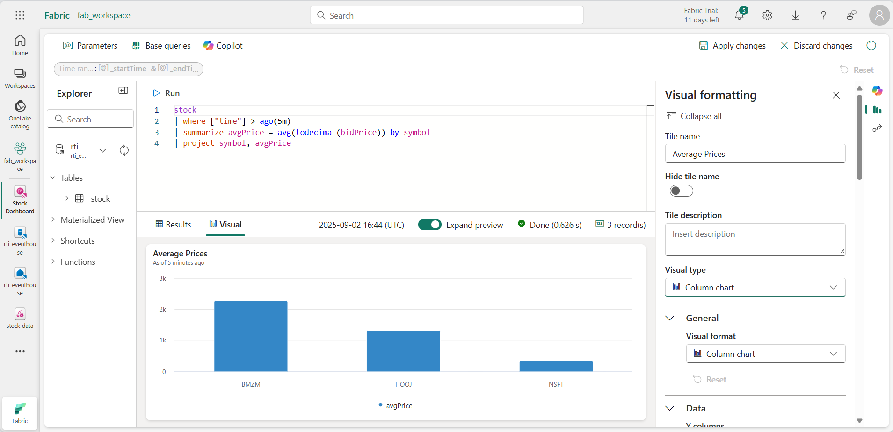

---
lab:
  title: Microsoft Fabric 中的实时智能入门
  module: Get started with Real-Time Intelligence in Microsoft Fabric
---

# Microsoft Fabric 中的实时智能入门

Microsoft Fabric 提供实时智能，可以为实时数据流创建分析解决方案。 在本练习中，你将使用 Microsoft Fabric 中的实时智能功能来引入、分析和可视化股市数据的实时流。

完成本实验室大约需要 30 分钟。

> **备注**：你需要 [Microsoft Fabric 租户](https://learn.microsoft.com/fabric/get-started/fabric-trial)才能完成本练习。

## 创建工作区

在 Fabric 中处理数据之前，需要创建一个已启用 Fabric 容量的工作区。

1. 在浏览器中，导航到 [Microsoft Fabric 主页](https://app.fabric.microsoft.com/home?experience=fabric) (`https://app.fabric.microsoft.com/home?experience=fabric`)，使用 Fabric 凭据登录。
1. 在左侧菜单栏中，选择“工作区”（图标类似于 &#128455;）。
1. 新建一个工作区并为其指定名称，并选择包含 Fabric 容量（试用版、高级版或 Fabric）的许可模式  。
1. 打开新工作区时，它应为空。

    

## 创建事件流

现在，你已准备好从流式处理源查找和引入实时数据。 为此，你将从 Fabric 实时中心开始。

> **提示**：首次使用实时中心时，可能会显示一些*入门*提示。 你可以关闭这些。

1. 在左侧菜单栏中，选择“**实时**”中心。

    实时中心提供了一种查找和管理流式处理数据源的简单方法。

    

1. 在实时中心，在**连接到**部分中，选择“**数据源**”。
1. 查找**股票市场**样本数据源并选择“**连接**”。 然后在“**连接**”向导中，命名源 `stock` 并编辑默认事件流名称以将其更改为 `stock-data`。 与此数据关联的默认流将自动命名为 *stock-data-stream*：

    

1. 依次选择“下一步”和“连接”，等待创建源和 Eventstream，然后选择“打开 Eventstream”。************ 事件流将在设计画布上显示**股票**源和 **stock-data-stream**：

   

## 创建 Eventhouse

事件流引入实时股票数据，但当前不对它执行任何操作。 让我们创建一个事件库，在其中我们可以将捕获的数据存储在表中。

1. 在左侧菜单上，选择“**创建**”。 在“*新建*”页的“*实时智能*”部分下，选择“**Eventhouse**”。 为其指定唯一的名称。

    >**备注**：如果未将“**创建**”选项固定到边栏，则需要首先选择省略号 (**...**) 选项。

    关闭显示的所有建议或提示，直到看到新的空事件屋。

    

1. 在左侧窗格中，请注意事件屋包含一个与事件屋同名的 KQL 数据库。 可以在此数据库中为实时数据创建表，或根据需要创建其他数据库。
1. 选择数据库，注意有一个相关的*查询集*。 此文件包含一些可用于开始查询数据库中表的示例 KQL 查询。

    但是，目前没有要查询的表。 让我们通过将数据从事件流导入到新表来解决该问题。

1. 在 KQL 数据库的主页中，选择“**获取数据**”。
1. 对于数据源，请选择“**事件流**” > “**新建事件流**”。
1. 在“**选择或创建目标表**”窗格中，创建一个名为 `stock` 的新表。 然后在“**配置数据源**”窗格中，选择工作区和**股票数据**事件流并命名该连接`stock-table`。

   

1. 使用“**下一步**”按钮完成检查数据的步骤，然后完成配置。 然后关闭配置窗口，查看包含股票表的事件库。

   

    已创建流与表之间的连接。 我们在事件流中验证一下。

1. 在左侧菜单栏中，选择“**实时**”中心。 在 **stock-data-stream** 流的 **...** 菜单中，选择“**打开事件流**”。

    事件流现在显示流的目标：

   

    > **提示**：选择设计画布上的目标，如果未在设计画布下显示任何数据预览，请选择“**刷新**”。

    在本练习中，你创建了一个非常简单的事件流，可以捕获实时数据并将其加载到表中。 在实际解决方案中，通常会添加转换以在时间窗口内聚合数据（例如，捕获每只股票在五分钟内的平均价格）。

    现在，让我们探讨如何查询和分析捕获的数据。

## 查询捕获的数据

事件流捕获实时股票市场数据，并将其加载到 KQL 数据库的表中。 可以查询此表以查看捕获的数据。

1. 在左侧菜单栏中，选择事件屋数据库。
1. 选择数据库的*查询集*。
1. 在查询窗格中，修改第一个示例查询，如下所示：

    ```kql
    stock
    | take 100
    ```

1. 选择查询代码并运行，以查看表中的 100 行数据。

    

1. 查看结果，然后修改查询以检索过去 5 分钟内每个股票代码的平均价格：

    ```kql
    stock
    | where ["time"] > ago(5m)
    | summarize avgPrice = avg(todecimal(bidPrice)) by symbol
    | project symbol, avgPrice
    ```

1. 突出显示修改后的查询并运行，以查看结果。
1. 等待几秒钟后再次运行，注意随着新数据从实时流添加到表中，平均价格会发生变化。

## 创建实时仪表板

现在，你已有一个通过数据流填充的表，可以使用实时仪表板来可视化数据。

1. 在查询编辑器中，选择用于检索过去五分钟平均股票价格的 KQL 查询。
1. 在工具栏上，选择“保存到仪表板”。**** 然后将查询固定**在新仪表板中**，设置如下：
    - **仪表板名称**：`Stock Dashboard`
    - **磁贴名称**：`Average Prices`
1. 创建并打开仪表板。 它应如下所示：

    

1. 在仪表板顶部，从“查看”模式切换到“编辑”模式。********
1. 选择“**平均价格**”磁贴的“**编辑**”（*铅笔*）图标。
1. 在“**视觉对象格式**”窗格中，将“**视觉对象**”从“*表格*”更改为“*柱形图*”：

    

1. 在仪表板顶部，选择“**应用更改**”并查看修改后的仪表板：

    

    现在，你已拥有实时股票数据的实时可视化效果。

## 创建警报

Microsoft Fabric 中的实时智能包括一项名为“*Activator*”的技术，它可以根据实时事件触发操作。 当平均股票价格上涨特定值时，让我们用它来提醒你。

1. 在包含股票价格可视化效果的仪表板窗口中，在工具栏中选择“**设置警报**”。
1. 在“**设置警报**”窗格中，使用以下设置创建警报：
    - **运行查询频率**：每 5 分钟
    - **检查**：按以下方式分组的每个事件
    - **分组字段**：符号
    - **时间**：avgPrice
    - **条件**：上涨了
    - **值**：100
    - **操作**：给我发送电子邮件
    - **保存位置**：
        - **工作区**：*你的工作区*
        - **项**：创建新项
        - **新项名称**：*所选的唯一名称*

    

1. 创建警报并等待其保存。 然后关闭确认已创建的窗格。
1. 在左侧菜单栏中，选择工作区的页面（如果出现提示，请将任何未保存的更改保存到仪表板）。
1. 在工作区页面上，查看在本练习中创建的项目，包括警报的激活器。
1. 打开激活器，并在其页面的 **avgPrice** 节点下，选择提醒的唯一标识符。 然后查看其“**历史记录**”选项卡。

    提醒可能尚未触发，在这种情况下，历史记录将不包含任何数据。 如果股票平均价格变化超过 100，激活器将向你发送电子邮件，并且警报将记录在历史记录中。

## 清理资源

在本练习中，你创建了事件屋、使用事件流引入了实时数据、查询了 KQL 数据库表中的引入数据、创建了实时仪表板来可视化实时数据，并使用 Activator 配置了警报。

如果你已完成 Fabric 中的实时智能探索，可以删除为此练习创建的工作区。

1. 在左侧栏中，选择你的工作区的图标。
2. 在工具栏上中，选择“**工作区设置**”。
3. 在“常规”部分中，选择“删除此工作区”。********
