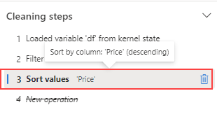

---
lab:
  title: 使用 Microsoft Fabric 中的数据整理器对数据进行预处理
  module: Preprocess data with Data Wrangler in Microsoft Fabric
---

# 使用 Microsoft Fabric 中的数据整理器对数据进行预处理

在本实验室中，你将了解如何使用 Microsoft Fabric 中的数据整理器对数据进行预处理，以及如何使用常见数据科学操作库生成代码。

完成本实验室大约需要 30 分钟。

> 注意：需要 Microsoft 学校或工作帐户才能完成本练习。 如果没有该帐户，可以[注册 Microsoft Office 365 E3 或更高版本的试用版](https://www.microsoft.com/microsoft-365/business/compare-more-office-365-for-business-plans)。

## 创建工作区

在 Fabric 中处理数据之前，创建一个已启用的 Fabric 试用版的工作区。

1. 在浏览器中导航到 Microsoft Fabric 主页 (`https://app.fabric.microsoft.com`)，如有必要，请使用 Fabric 凭据登录。
1. 在 Fabric 主页中，选择“Synapse 数据科学”。****
1. 在左侧菜单栏中，选择“工作区”（图标类似于 &#128455;）。
1. 新建一个工作区并为其指定名称，并选择包含 Fabric 容量（试用版、高级版或 Fabric）的许可模式  。
1. 打开新工作区时，它应为空。

    

## 创建笔记本

若要训练模型，可以创建笔记本。 笔记本提供了一个交互式环境，你可在其中编写和运行作为试验的（多种语言的）代码。

1. 在“Synapse 数据科学”主页中，创建新的笔记本********。

    几秒钟后，一个包含单个单元格的新笔记本将会打开。 笔记本由一个或多个单元格组成，这些单元格可以包含代码或 markdown（格式化文本） 。

1. 选择第一个单元格（当前是代码单元格），然后在其右上角的动态工具栏中，使用 M&#8595; 按钮将单元格转换为 markdown 单元格。

    当单元格更改为 markdown 单元格时，它包含的文本将会呈现。

1. 如有必要，使用 &#128393;（“编辑”）按钮将单元格切换到编辑模式，然后删除内容并输入以下文本：****

    ```text
   # Perform data exploration for data science

   Use the code in this notebook to perform data exploration for data science.
    ```

## 将数据加载到数据帧中

现在可以运行代码来获取数据了。 将使用 Azure 开放数据集中的 [OJ Sales 数据集](https://learn.microsoft.com/en-us/azure/open-datasets/dataset-oj-sales-simulated?tabs=azureml-opendatasets?azure-portal=true)。 加载数据后，将数据转换为 Pandas 数据帧，这是数据整理器支持的结构。

1. 在笔记本中，使用最新单元格下方的“ **+ 代码**”图标将新代码单元格添加到笔记本中。

    > **提示**：若要查看“+ 代码”图标，请将鼠标移到当前单元格输出的正下方和左侧。**** 或者在菜单栏中的“编辑”选项卡上，选择“+ 添加代码单元格”。********

1. 输入以下代码以将数据集加载到数据帧中。

    ```python
   # Azure storage access info for open dataset diabetes
   blob_account_name = "azureopendatastorage"
   blob_container_name = "ojsales-simulatedcontainer"
   blob_relative_path = "oj_sales_data"
   blob_sas_token = r"" # Blank since container is Anonymous access
    
   # Set Spark config to access  blob storage
   wasbs_path = f"wasbs://%s@%s.blob.core.windows.net/%s" % (blob_container_name, blob_account_name, blob_relative_path)
   spark.conf.set("fs.azure.sas.%s.%s.blob.core.windows.net" % (blob_container_name, blob_account_name), blob_sas_token)
   print("Remote blob path: " + wasbs_path)
    
   # Spark reads csv
   df = spark.read.csv(wasbs_path, header=True)
    ```

1. 使用单元格左侧的“&#9655; 运行单元格”按钮运行单元格。 或者，可以按键盘上的 `SHIFT` + `ENTER` 来运行单元格。

    > 注意：由于这是你第一次在此会话中运行 Spark 代码，因此必须启动 Spark 池。 这意味着会话中的第一次运行可能需要一分钟左右才能完成。 后续运行速度会更快。

1. 使用单元格输出下方的“+ 代码”图标将新的代码单元格添加到笔记本，并在其中输入以下代码：

    ```python
   import pandas as pd

   df = df.toPandas()
   df = df.sample(n=500, random_state=1)
    
   df['WeekStarting'] = pd.to_datetime(df['WeekStarting'])
   df['Quantity'] = df['Quantity'].astype('int')
   df['Advert'] = df['Advert'].astype('int')
   df['Price'] = df['Price'].astype('float')
   df['Revenue'] = df['Revenue'].astype('float')
    
   df = df.reset_index(drop=True)
   df.head(4)
    ```

1. 单元格命令完成后，查看单元格下方的输出，输出应如下所示：

    |   |WeekStarting|存储|品牌|数量|广告|价格|收入|
    |---|---|---|---|---|---|---|---|
    |0|1991-10-17|947|minute.maid|13306|1|2.42|32200.52|
    |1|1992-03-26|1293|dominicks|18596|1|1.94|36076.24|
    |2|1991-08-15|2278|dominicks|17457|1|2.14|37357.98|
    |3|1992-09-03|2175|tropicana|9652|1|2.07|19979.64|
    |...|...|...|...|...|...|...|...|

    输出显示 OJ Sales 数据集的前四行。

## 查看摘要统计信息

由于已加载数据，下一步是使用数据整理器对其进行预处理。 预处理是所有机器学习工作流中的关键步骤。 它涉及清理数据，并将数据转换为可馈送到机器学习模型中的格式。

1. 在笔记本功能区中选择“数据”，然后选择“启动数据整理器”下拉列表 。

1. 选择 `df` 数据集。 当数据整理器启动时，它会在“摘要”面板中生成所显示的数据帧的描述性概述。

1. 选择“收入”特征，并观察此特征的数据分布。

1. 查看“摘要”侧面板详细信息，并观察统计信息值。

    

    可以从中得出哪些见解？ 平均收入约为 33,459.54 美元，标准偏差为 8,032.23 美元 。 这表明收入值分散在平均值附近约 8,032.23 美元的范围内。

## 设置文本数据格式

现在，让我们对 **Brand** 特征应用一些转换。

1. 在“数据整理器”仪表板上，选择网格上的“`Brand`”特征。

1. 导航到“操作”面板，展开“查找和替换”，然后选择“查找和替换”。

1. 在“查找和替换”面板上，更改以下属性：

    - **旧值：** “`.`”
    - **新值：** "` `"（空格字符）

    你可以在显示网格中看到自动预览的操作结果。

1. 选择“应用”。

1. 返回到“操作”面板，展开“格式”********。

1. 选择“首字符大写”。 切换“将所有单词大写”切换开关，然后选择“应用”。

1. 选择“将代码添加到笔记本”。**** 此外，还可以复制代码并将转换后的数据集另存为 CSV 文件。

    >注意：代码会自动复制到笔记本单元格，并可供使用。

1. 将第 10 行和第 11 行替换为代码 `df = clean_data(df)`，因为数据整理器中生成的代码不会覆盖原始数据帧。 最终块应如下所示：

    ```python
   def clean_data(df):
       # Replace all instances of "." with " " in column: 'Brand'
       df['Brand'] = df['Brand'].str.replace(".", " ", case=False, regex=False)
       # Capitalize the first character in column: 'Brand'
       df['Brand'] = df['Brand'].str.title()
       return df
    
   df = clean_data(df)
    ```

1. 运行代码单元格，并检查 `Brand` 变量。

    ```python
   df['Brand'].unique()
    ```

    结果应显示以下值：Minute Maid、Dominicks 和 Tropicana。

你已了解如何使用数据整理器以图形方式操作文本数据并轻松生成代码。

## 应用独热编码转换

现在，让我们生成代码，在预处理步骤的过程中将独热编码转换应用于我们的数据。 为了使方案更加实用，我们首先生成一些示例数据。 这样，我们就能够模拟现实世界的情况，并为自身提供一个可行的特征。

1. 在 `df` 数据帧的顶部菜单中启动数据整理程序。

1. 选择网格上的 `Brand` 特征。

1. 在“操作”面板上，展开“公式”，然后选择“独热编码”。

1. 在“独热编码”面板中，选择“应用”。

    导航到数据整理器显示网格的末尾。 请注意，它添加了三个新特征（`Brand_Dominicks`、`Brand_Minute Maid` 和 `Brand_Tropicana`），并移除了 `Brand` 特征。

1. 退出数据整理器而不生成代码。

## 排序和筛选操作

假设我们需要查看特定商店的收入数据，然后对产品价格进行排序。 在以下步骤中，我们使用数据整理器筛选和分析 `df` 数据帧。

1. 针对 `df` 数据帧启动据整理器。

1. 在“操作”面板上，展开“排序和筛选”。

1. 选择**筛选**。

1. 在“筛选器”面板上，添加以下条件：

    - **目标列**：`Store`
    - **操作**：`Equal to`
    - **值**：`1227`
    - **操作**：`Keep matching rows`

1. 选择“应用”，并注意数据整理器显示网格中的更改。

1. 选择“收入”特征，然后查看“摘要”侧面板详细信息 。

    可以从中得出哪些见解？ 偏度为 -0.751，表示稍微向左倾斜（负倾斜）。 这意味着，分布的左尾部略长于右尾部。 换句话说，有许多时段的收入明显低于平均值。

1. 返回到“操作”**** 面板，展开“排序和筛选”****。

1. 选择“对值进行排序”。

1. 在“对值进行排序”面板上，选择以下属性：

    - 列名：`Price`
    - **排序顺序**：`Descending`

1. 选择“应用”。

    商店 1227 的最高产品价格为 2.68 美元 。 只有几条记录时，可以更轻松地确定最高的产品价格，但请考虑处理数千个结果时的复杂性。

## 浏览和移除步骤

假设你犯了一个错误，需要移除你在上一步中创建的排序。 请按以下步骤来移除它：

1. 导航到“清理步骤”面板。

1. 选择“对值进行排序”步骤。

1. 选择删除图标以将其移除。

    

    > 重要说明：网格视图和摘要仅限于当前步骤。****

    请注意，更改将还原到上一步，即“筛选”步骤。

1. 退出数据整理器而不生成代码。

## 聚合数据

假设我们需要了解每个品牌产生的平均收入。 在以下步骤中，我们使用数据整理器对 `df` 数据帧执行分组依据操作。

1. 针对 `df` 数据帧启动据整理器。

1. 返回到“操作”**** 面板，选择“分组依据和聚合”****。

1. 在“分组依据列”面板上，选择“`Brand`”特征。

1. 选择“添加聚合”。****

1. 在“要聚合的列”**** 属性上，选择 `Revenue` 特征。

1. 为“聚合类型”属性选择“`Mean`”。

1. 选择“应用”。

1. 选择“复制代码到剪贴板”。

1. 退出数据整理器而不生成代码。

1. 将 `Brand` 变量转换中的代码与 `clean_data(df)` 函数中的聚合步骤生成的代码组合在一起。 最终块应如下所示：

    ```python
   def clean_data(df):    
       # Replace all instances of "." with " " in column: 'Brand'    
       df['Brand'] = df['Brand'].str.replace(".", " ", case=False, regex=False)    
       # Capitalize the first character in column: 'Brand'    
       df['Brand'] = df['Brand'].str.title()
        
       # Performed 1 aggregation grouped on column: 'Brand'    
       df = df.groupby(['Brand']).agg(Revenue_mean=('Revenue', 'mean')).reset_index()    
        
       return df    
        
   df = clean_data(df)
    ```

1. 运行单元格代码。

1. 检查数据帧中的数据。

    ```python
   print(df)
    ```

    结果：

    |   |品牌|Revenue_mean|
    |---|---|---|
    |0|Dominicks|33206.330958|
    |1|Minute Maid|33532.999632|
    |2|Tropicana|33637.863412|

你为某些预处理操作生成了代码，并将其作为函数复制回笔记本，然后可以根据需要运行、重复使用或修改该函数。

## 保存笔记本并结束 Spark 会话

对用于建模的数据完成预处理后，可以使用有意义的名称保存笔记本并结束 Spark 会话。

1. 在笔记本菜单栏中，使用 ⚙️“设置”图标查看笔记本设置。
2. 将笔记本的“名称”设置为“使用数据整理器预处理数据”，然后关闭设置窗格********。
3. 在笔记本菜单上，选择“停止会话”以结束 Spark 会话。

## 清理资源

在本练习中，你创建了一个笔记本，并使用了数据整理器来探索和预处理用于机器学习模型的数据。

如果你已完成对预处理步骤的探索，则可以删除为此练习创建的工作区。

1. 在左侧栏中，选择工作区的图标以查看其包含的所有项。
2. 在工具栏上的“...”菜单中，选择“工作区设置” 。
3. 在“其他”部分中，选择“删除此工作区” 。
