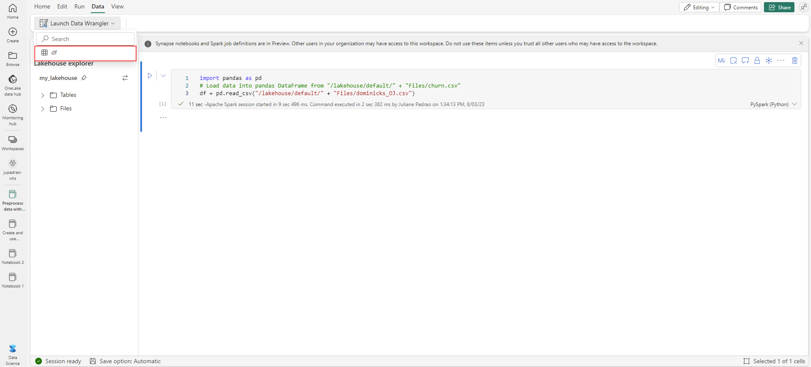
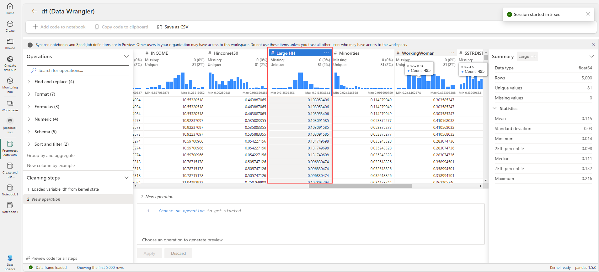
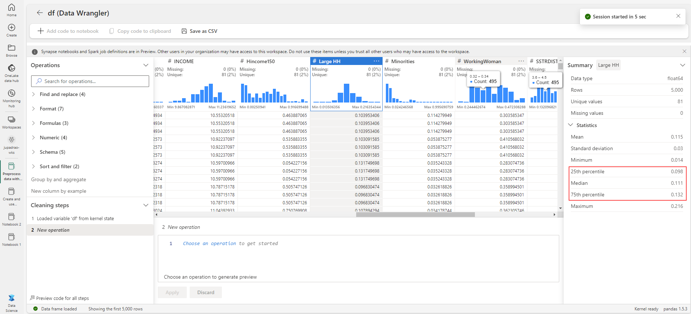

---
lab:
  title: 使用 Microsoft Fabric 中的数据整理器对数据进行预处理
  module: Preprocess data with Data Wrangler in Microsoft Fabric
---

# 使用笔记本在 Microsoft Fabric 中训练模型

在本实验室中，你将了解如何使用 Microsoft Fabric 中的数据整理器对数据进行预处理，以及如何使用常见数据科学操作库生成代码。

完成本实验室大约需要 30 分钟。

> 注意：需要 Microsoft Fabric 许可证才能完成本练习。 有关如何启用免费 Fabric 试用版许可证的详细信息，请参阅 [Fabric 入门](https://learn.microsoft.com/fabric/get-started/fabric-trial)。 执行此操作需要 Microsoft 学校或工作帐户 。 如果没有，可以[注册 Microsoft Office 365 E3 或更高版本的试用版](https://www.microsoft.com/microsoft-365/business/compare-more-office-365-for-business-plans)。

## 创建工作区

在 Fabric 中处理数据之前，在已启用的 Fabric 试用版中创建工作区。

1. 登录到 [Microsoft Fabric](https://app.fabric.microsoft.com) (`https://app.fabric.microsoft.com`)，然后选择 Power BI。
2. 在左侧菜单栏中，选择“工作区”（图标类似于 &#128455;）。
3. 新建一个工作区并为其指定名称，并选择包含 Fabric 容量（试用版、高级版或 Fabric）的许可模式  。
4. 打开新工作区时，它应为空，如下所示：

    

## 创建湖屋并上传文件

有了工作区后，可在门户中切换到数据科学体验，并为要分析的数据文件创建一个数据湖屋。

1. 在 Power BI 门户左下角，选择 Power BI 图标并切换到“数据工程”体验 。
1. 在“数据工程”主页中，使用所选名称创建一个新的湖屋 。

    大约一分钟后，将完成创建一个不包含表或文件的新湖屋 。 需要将一些数据引入数据湖屋进行分析。 可通过多种方法执行此操作，但在本练习中，只需将文本文件的文件夹下载并解压缩到本地计算机或实验室 VM（如果适用），然后将其上传到湖屋。

1. 待办事项：从 [https://raw.githubusercontent.com/MicrosoftLearning/dp-data/main/XXXXX.csv](https://raw.githubusercontent.com/MicrosoftLearning/dp-data/main/XXXXX.csv) 下载此练习的 `dominicks_OJ.csv` CSV 文件并将其保存。


1. 返回到包含湖屋的 Web 浏览器标签页，在“湖屋”窗格的“文件”节点的“...”菜单中，依次选择“上传”和“上传文件”，然后将 dominicks_OJ.csv 文件从本地计算机（或实验室 VM，如适用）上传到湖屋     。
6. 上传文件后，展开“文件”并验证 CSV 文件是否已上传。

## 创建笔记本

若要训练模型，可以创建笔记本。 笔记本提供了一个交互式环境，你可在其中编写和运行作为试验的（多种语言的）代码。

1. 在 Power BI 门户左下角，选择“数据工程”图标并切换到“数据科学”体验 。

1. 在“数据科学”主页中，创建新的笔记本 。

    几秒钟后，一个包含单个单元格的新笔记本将会打开。 笔记本由一个或多个单元格组成，这些单元格可以包含代码或 markdown（格式化文本） 。

1. 选择第一个单元格（当前是代码单元格），然后在其右上角的动态工具栏中，使用 M&#8595; 按钮将单元格转换为 markdown 单元格。

    当单元格更改为 markdown 单元格时，它包含的文本将会呈现。

1. 使用 &#128393;（“编辑”）按钮将单元格切换到编辑模式，然后删除内容并输入以下文本：

    ```text
   # Train a machine learning model and track with MLflow

   Use the code in this notebook to train and track models.
    ``` 

## 将数据加载到数据帧中

现在，你已准备好运行代码来准备数据和训练模型。 若要处理数据，需要使用数据帧。 Spark 中的数据帧类似于 Python 中的 Pandas 数据帧，提供一种用于处理行和列中的数据的通用结构。

1. 在“添加湖屋”窗格中，选择“添加”以添加湖屋。 
1. 选择“现有湖屋”，然后选择“添加” 。
1. 选择在上一部分创建的湖屋。
1. 展开“文件”文件夹，以便在笔记本编辑器旁边列出 CSV 文件。
1. 在“churn.csv”的“...”菜单中，选择“加载数据” > “Pandas”   。 应在笔记本中添加包含以下代码的新代码单元格：

    ```python
    import pandas as pd
    df = pd.read_csv("/lakehouse/default/" + "Files/dominicks_OJ.csv") 
    display(df.head(5))
    ```

    > 提示：可以隐藏左侧包含文件的窗格，方法是使用其 << 图标 。 这样做有助于专注于笔记本。

1. 使用单元格左侧的“&#9655; 运行单元格”按钮运行单元格。

    > 注意：由于这是你第一次在此会话中运行 Spark 代码，因此必须启动 Spark 池。 这意味着会话中的第一次运行可能需要一分钟左右才能完成。 后续运行速度会更快。

## 查看摘要统计信息

当数据整理器启动时，它会在“摘要”面板中生成所显示的数据帧的描述性概述。 

1. 选择顶部菜单中的“数据”，然后选择“数据整理器”下拉列表以浏览 `df` 数据集。

    

1. 选择“大型 HH”列，观察你能够多么轻松地确定此特征的数据分布。

    

    请注意，此特征遵循正态分布。

1. 检查“摘要”侧面板，并观察百分位范围。 

    

    可以看到，大多数数据位于 **0.098** 和 **0.132** 之间，并且 50% 的数据值在该范围内。

## 设置文本数据格式

现在，让我们对 **Brand** 特征应用一些转换。

1. 在“数据整理器”页上，选择 `Brand` 特征。

1. 导航到“操作”面板，展开“查找和替换”，然后选择“查找和替换”。

1. 在“查找和替换”面板上，更改以下属性：
    
    - 旧值："."
    - 新值：" "（空格字符）

    

    你可以在显示网格中看到自动预览的操作结果。

1. 选择**应用**。

1. 返回到“操作”面板，展开“格式” 。

1. 选择“将文本转换为大写”。

1. 在“将文本转换为大写”面板上，选择“应用”。 

1. 选择“将代码添加到笔记本”。 此外，还可以将转换后的数据集另存为 .csv 文件。

    请注意，代码会自动复制到笔记本单元格，并可供使用。

1. 运行代码。

> 重要说明：生成的代码不会覆盖原始数据帧。 

你已了解如何使用“数据整理器”操作轻松生成代码并操作文本数据。 

## 应用独热编码器转换

现在，让我们生成代码，以应用独热编码器转换作为预处理步骤。

1. 选择顶部菜单中的“数据”，然后选择“数据整理器”下拉列表以浏览 `df` 数据集。

1. 返回到“操作”面板，展开“公式” 。

1. 选择“独热编码”。

1. 在“独热编码”面板中，选择“应用”。

    导航到数据整理器显示网格的末尾。 请注意，它添加了三个新特征，并移除了 `Brand` 特征。

1. 选择“将代码添加到笔记本”。

1. 运行代码。

## 排序和筛选操作

1. 选择顶部菜单中的“数据”，然后选择“数据整理器”下拉列表以浏览 `df` 数据集。

1. 在“操作”面板上，展开“排序和筛选”。

1. 选择“筛选”。

1. 在“筛选器”面板上，添加以下条件：
    
    - 目标列：Store
    - 运算：等于
    - 值：2

1. 选择**应用**。

    请注意数据整理器显示网格中的更改。

1. 返回到“操作”面板，展开“排序和筛选”。

1. 选择“对值进行排序”

1. 在“价格”面板上，添加以下条件：
    
    - 列名：Price
    - 排序顺序：降序

1. 选择**应用**。

    请注意数据整理器显示网格中的更改。

## 聚合数据

1. 返回到“操作”面板，选择“分组依据和聚合”。

1. 在“分组依据列:”属性上，选择 `Store` 特征。

1. 选择“添加聚合”。

1. 在“要聚合的列”属性上，选择 `Quantity` 特征。

1. 为“聚合类型”属性选择“计数”。

1. 选择**应用**。 

    请注意数据整理器显示网格中的更改。

## 浏览和移除步骤

假设你犯了一个错误，需要移除你在上一步中创建的聚合。 请按以下步骤来移除它：

1. 展开“清理步骤”面板。

1. 选择“分组依据和聚合”步骤。

1. 选择删除图标以将其移除。

    

    > 重要说明：网格视图和摘要仅限于当前步骤。

    请注意，更改将还原到上一步，即“对值进行排序”步骤。

1. 选择“将代码添加到笔记本”。

1. 运行代码。

你为某些预处理操作生成了代码，并将其作为函数保存回笔记本，然后可以根据需要重复使用或修改该函数。

## 保存笔记本并结束 Spark 会话

对用于建模的数据完成预处理后，可以使用有意义的名称保存笔记本并结束 Spark 会话。

1. 在笔记本菜单栏中，使用 ⚙️“设置”图标查看笔记本设置。
2. 将笔记本的“名称”设置为“使用数据整理器预处理数据”，然后关闭设置窗格 。
3. 在笔记本菜单上，选择“停止会话”以结束 Spark 会话。

## 清理资源

在本练习中，你创建了一个笔记本，并使用了数据整理器来探索和预处理用于机器学习模型的数据。

如果你已完成对预处理步骤的探索，则可以删除为此练习创建的工作区。

1. 在左侧栏中，选择工作区的图标以查看其包含的所有项。
2. 在工具栏上的“...”菜单中，选择“工作区设置” 。
3. 在“其他”部分中，选择“删除此工作区” 。
