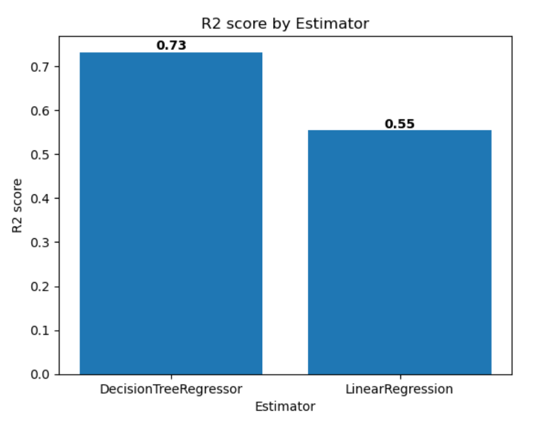

---
lab:
  title: 在 Microsoft Fabric 中训练和跟踪模型
  module: Train and track machine learning models with MLflow in Microsoft Fabric
---

# 在 Microsoft Fabric 中使用 MLflow 训练和跟踪机器学习模型

在此实验中，你将训练机器学习模型来预测糖尿病的定量度量。 将使用 scikit-learn 训练回归模型，并使用 MLflow 跟踪和比较模型。

完成此实验后，你将获得机器学习和模型跟踪的实践经验，并了解如何在 Microsoft Fabric 中使用笔记本、试验和模型******。

完成本实验室大约需要 25 分钟。

> 注意：需要 Microsoft 学校或工作帐户才能完成本练习。 如果没有该帐户，可以[注册 Microsoft Office 365 E3 或更高版本的试用版](https://www.microsoft.com/microsoft-365/business/compare-more-office-365-for-business-plans)。

## 创建工作区

在 Fabric 中处理数据之前，创建一个已启用的 Fabric 试用版的工作区。

1. 在浏览器中导航到 Microsoft Fabric 主页 (`https://app.fabric.microsoft.com`)，如有必要，请使用 Fabric 凭据登录。
1. 在 Fabric 主页中，选择“Synapse 数据科学”。****
1. 在左侧菜单栏中，选择“工作区”（图标类似于 &#128455;）。
1. 新建一个工作区并为其指定名称，并选择包含 Fabric 容量（试用版、高级版或 Fabric）的许可模式  。
1. 打开新工作区时，它应为空。

    

## 创建笔记本

若要训练模型，可以创建笔记本。 笔记本提供了一个交互式环境，可在其中编写和运行（多种语言的）代码。

1. 在“Synapse 数据科学”主页中，创建新的笔记本********。

    几秒钟后，一个包含单个单元格的新笔记本将会打开。 笔记本由一个或多个单元格组成，这些单元格可以包含代码或 markdown（格式化文本） 。

1. 选择第一个单元格（当前是代码单元格），然后在其右上角的动态工具栏中，使用 M&#8595; 按钮将单元格转换为 markdown 单元格。

    当单元格更改为 markdown 单元格时，它包含的文本将会呈现。

1. 如有必要，使用 &#128393;（“编辑”）按钮将单元格切换到编辑模式，然后删除内容并输入以下文本：****

    ```text
   # Train a machine learning model and track with MLflow
    ```

## 将数据加载到数据帧中

现在，你已准备好运行代码来获取数据和训练模型。 将使用 Azure 开放数据集中的[糖尿病数据集](https://learn.microsoft.com/azure/open-datasets/dataset-diabetes?tabs=azureml-opendatasets?azure-portal=true)。 加载数据后，将数据转换为 Pandas 数据帧：处理行和列中数据的常见结构。

1. 在笔记本中，使用最新单元格输出下方的“+ 代码”图标将新的代码单元格添加到笔记本，并在其中输入以下代码****：

    ```python
   # Azure storage access info for open dataset diabetes
   blob_account_name = "azureopendatastorage"
   blob_container_name = "mlsamples"
   blob_relative_path = "diabetes"
   blob_sas_token = r"" # Blank since container is Anonymous access
    
   # Set Spark config to access  blob storage
   wasbs_path = f"wasbs://%s@%s.blob.core.windows.net/%s" % (blob_container_name, blob_account_name, blob_relative_path)
   spark.conf.set("fs.azure.sas.%s.%s.blob.core.windows.net" % (blob_container_name, blob_account_name), blob_sas_token)
   print("Remote blob path: " + wasbs_path)
    
   # Spark read parquet, note that it won't load any data yet by now
   df = spark.read.parquet(wasbs_path)
    ```

1. 使用单元格左侧的“&#9655; 运行单元格”按钮运行单元格。 或者，可以按键盘上的 Shift + Enter 来运行单元格。********

    > 注意：由于这是你第一次在此会话中运行 Spark 代码，因此必须启动 Spark 池。 这意味着会话中的第一次运行可能需要一分钟左右才能完成。 后续运行速度会更快。

1. 使用单元格输出下方的“+ 代码”图标将新的代码单元格添加到笔记本，并在其中输入以下代码：

    ```python
   display(df)
    ```

1. 单元格命令完成后，查看单元格下方的输出，输出应如下所示：

    |年龄|性别|BMI|BP|S1|S2|S3|S4|S5|S6|Y|
    |---|---|---|--|--|--|--|--|--|--|--|
    |59|2|32.1|101.0|157|93.2|38.0|4.0|4.8598|87|151|
    |48|1|21.6|87.0|183|103.2|70.0|3.0|3.8918|69|75|
    |72|2|30.5|93.0|156|93.6|41.0|4.0|4.6728|85|141|
    |24|1|25.3|84.0|198|131.4|40.0|5.0|4.8903|89|206|
    |50|1|23.0|101.0|192|125.4|52.0|4.0|4.2905|80|135|
    | ... | ... | ... | ... | ... | ... | ... | ... | ... | ... | ... |

    输出显示糖尿病数据集的行和列。

1. 数据作为 Spark 数据帧加载。 Scikit-learn 将期望输入数据集是 Pandas 数据帧。 运行以下代码将数据集转换为 Pandas 数据帧：

    ```python
   import pandas as pd
   df = df.toPandas()
   df.head()
    ```

## 训练机器学习模型

现在，你已加载数据，可以使用它来训练机器学习模型并预测糖尿病的定量度量。 我们将使用 scikit-learn 库训练模型，并使用 MLflow 跟踪模型。

1. 运行以下代码，将数据拆分为训练数据集和测试数据集，并将特征与要预测的标签  分开：

    ```python
   from sklearn.model_selection import train_test_split
    
   X, y = df[['AGE','SEX','BMI','BP','S1','S2','S3','S4','S5','S6']].values, df['Y'].values
    
   X_train, X_test, y_train, y_test = train_test_split(X, y, test_size=0.30, random_state=0)
    ```

1. 在笔记本中添加另一个新代码单元格，在其中输入以下代码并运行它：

    ```python
   import mlflow
   experiment_name = "experiment-diabetes"
   mlflow.set_experiment(experiment_name)
    ```

    该代码会创建名为“**experiment-diabetes**”的 MLflow 试验。 在此试验中跟踪模型。

1. 在笔记本中添加另一个新代码单元格，在其中输入以下代码并运行它：

    ```python
   from sklearn.linear_model import LinearRegression
    
   with mlflow.start_run():
      mlflow.autolog()
    
      model = LinearRegression()
      model.fit(X_train, y_train)
    
      mlflow.log_param("estimator", "LinearRegression")
    ```

    该代码使用线性回归训练回归模型。 使用 MLflow 自动记录参数、指标和项目。 此外，还需要记录一个名为 estimator 的参数，其值为 LinearRegression。******

1. 在笔记本中添加另一个新代码单元格，在其中输入以下代码并运行它：

    ```python
   from sklearn.tree import DecisionTreeRegressor
    
   with mlflow.start_run():
      mlflow.autolog()
    
      model = DecisionTreeRegressor(max_depth=5) 
      model.fit(X_train, y_train)
    
      mlflow.log_param("estimator", "DecisionTreeRegressor")
    ```

    代码使用决策树回归量训练回归模型。 使用 MLflow 自动记录参数、指标和项目。 此外，还需要记录一个名为 estimator 的参数，其值为 DecisionTreeRegressor。******

## 使用 MLflow 搜索和查看试验

使用 MLflow 训练和跟踪模型后，可以使用 MLflow 库检索试验及其详细信息。

1. 若要列出所有试验，请使用以下代码：

    ```python
   import mlflow
   experiments = mlflow.search_experiments()
   for exp in experiments:
       print(exp.name)
    ```

1. 若要检索特定试验，可按名称获取试验：

    ```python
   experiment_name = "experiment-diabetes"
   exp = mlflow.get_experiment_by_name(experiment_name)
   print(exp)
    ```

1. 使用试验名称，可以检索该试验的所有作业：

    ```python
   mlflow.search_runs(exp.experiment_id)
    ```

1. 若要更轻松地比较作业运行和输出，可以配置搜索以对结果进行排序。 例如，以下单元格按 start_time 对结果进行排序，且仅显示最多 2 个结果：**

    ```python
   mlflow.search_runs(exp.experiment_id, order_by=["start_time DESC"], max_results=2)
    ```

1. 最后，可以绘制多个模型的评估指标，以便轻松比较模型：

    ```python
   import matplotlib.pyplot as plt
   
   df_results = mlflow.search_runs(exp.experiment_id, order_by=["start_time DESC"], max_results=2)[["metrics.training_r2_score", "params.estimator"]]
   
   fig, ax = plt.subplots()
   ax.bar(df_results["params.estimator"], df_results["metrics.training_r2_score"])
   ax.set_xlabel("Estimator")
   ax.set_ylabel("R2 score")
   ax.set_title("R2 score by Estimator")
   for i, v in enumerate(df_results["metrics.training_r2_score"]):
       ax.text(i, v, str(round(v, 2)), ha='center', va='bottom', fontweight='bold')
   plt.show()
    ```

    输出应如下图所示：

    

## 探索试验

Microsoft Fabric 将跟踪所有试验，并支持直观地探索它们。

1. 从左侧的菜单栏导航到工作区。
1. 选择 experiment-diabetes 试验将其打开。****

    > 提示：如果看不到任何记录的试验运行，请刷新页面。

1. 选择“视图”选项卡。
1. 选择“运行列表”。
1. 通过选中每个框来选择两个最新运行。

    因此，最后两个运行将在“指标比较”窗格中相互比较。 默认情况下，指标按运行名称绘制。

1. 选择图形的 &#128393;（“编辑”）按钮，以可视化每个运行的平均绝对误差****。
1. 将可视化效果类型更改为 bar。********
1. 将 X 轴更改为 estimator。********
1. 选择“替换”并浏览新图形。
1. （可选）可以对“指标比较”窗格中的其他图形重复这些步骤****。

通过绘制每个记录的估算器的性能指标，可以查看哪种算法可生成更好的模型。

## 保存模型

比较了在试验运行中训练的机器学习模型后，可以选择性能最佳的模型。 若要使用性能最佳的模型，请保存模型并使用它生成预测。

1. 在试验概述中，确保已选择“视图”选项卡。
1. 选择“运行详细信息”。
1. 选择训练集 R2 分数最高的运行。
1. 在“将运行另存为模型”框中选择“保存”（可能需要滚动到右侧才能看到此选项）。********
1. 在新打开的弹出窗口中选择“创建新模型”。
1. 选择“模型”文件夹。****
1. 将模型命名为“`model-diabetes`”，然后选择“保存”****。
1. 在创建模型时屏幕右上角显示的通知中选择“查看 ML 模型”。**** 还可刷新窗口。 已保存的模型在“模型版本”下链接****。

请注意，模型、试验和试验运行是链接的，以便你查看模型的训练方式。

## 保存笔记本并结束 Spark 会话

完成模型训练和评估后，可以使用有意义的名称保存笔记本并结束 Spark 会话。

1. 返回笔记本，在笔记本菜单栏中，使用 ⚙️“设置”图标查看笔记本设置。
2. 将笔记本的“名称”设置为“训练和比较模型”，然后关闭设置窗格 。
3. 在笔记本菜单上，选择“停止会话”以结束 Spark 会话。

## 清理资源

在本练习中，你已创建笔记本并训练了机器学习模型。 你已使用 scikit-learn 来训练模型，并使用 MLflow 来跟踪其性能。

如果已完成模型和试验，可以删除为本练习创建的工作区。

1. 在左侧栏中，选择工作区的图标以查看其包含的所有项。
2. 在工具栏上的“...”菜单中，选择“工作区设置” 。
3. 在“其他”部分中，选择“删除此工作区” 。
