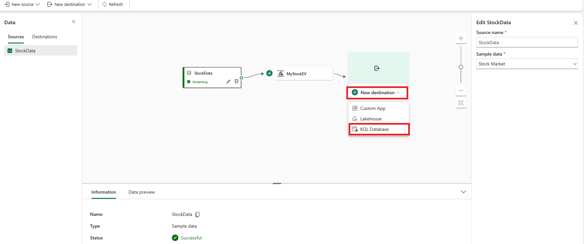
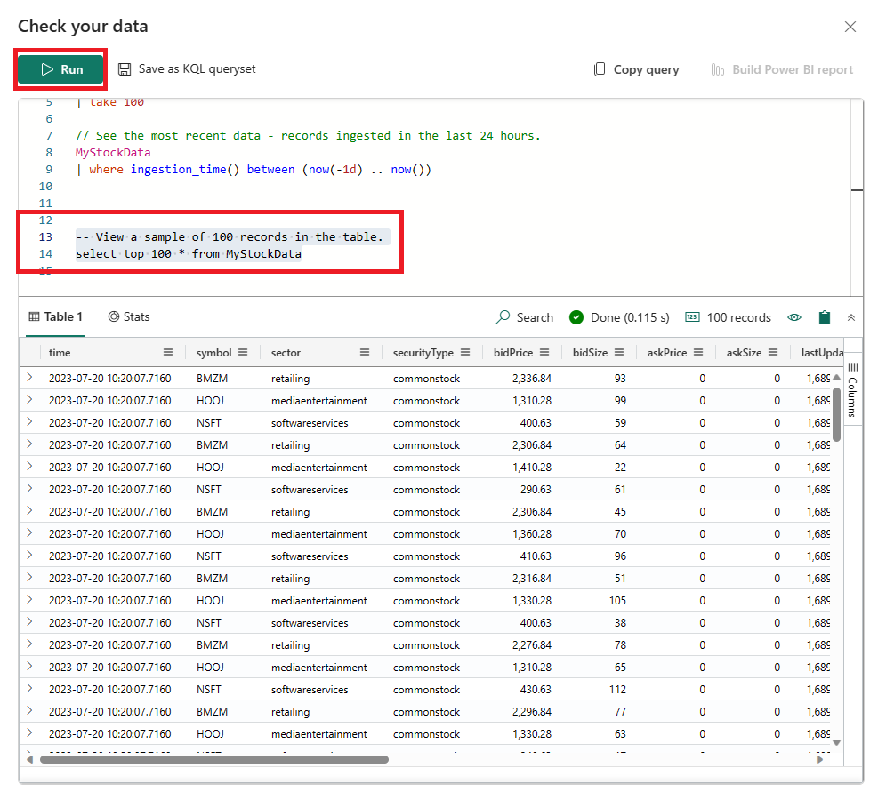

---
lab:
  title: Microsoft Fabric 中的 Real-Time Analytics 入门
  module: Get started with Real-Time Analytics in Microsoft Fabric
---
# Real-Time Analytics (RTA) 中的 EventStream 入门

事件流是 Microsoft Fabric 中的一项功能，可捕获、转换实时事件并将其路由到各种目标，并且无需编写代码。 可向事件流添加事件数据源、路由目标以及事件处理程序（如果需要转换）。 Microsoft Fabric 的 EventStore 是一个监视选项，用于维护群集中的事件，并提供一种方法来了解群集或工作负载在给定时间点的状态。 可以向 EventStore 服务查询可用于群集中的每个实体和实体类型的事件。 这意味着可在群集、节点、应用程序、服务、分区和分区副本等不同级别查询事件。 EventStore 服务还能够将群集中的事件相关联。 通过查看在同一时间从可能已相互影响的不同实体写入的事件，EventStore 服务可以将这些事件进行关联来帮助查明群集中发生各项活动的原因。 另一种监视和诊断 Microsoft Fabric 群集的方法是使用 EventFlow 聚合和收集事件。

完成本实验室大约需要 30 分钟。

> 注意：完成本练习需要 Microsoft Fabric 许可证。 有关如何启用免费 Fabric 试用版许可证的详细信息，请参阅 [Fabric 入门](https://learn.microsoft.com/fabric/get-started/fabric-trial)。 需要 Microsoft 学校或工作帐户才能执行此操作 。 如果没有该帐户，可以[注册 Microsoft Office 365 E3 或更高版本的试用版](https://www.microsoft.com/microsoft-365/business/compare-more-office-365-for-business-plans)。

## 创建工作区

在 Fabric 中处理数据之前，创建一个已启用的 Fabric 试用版的工作区。

1. 登录到 [Microsoft Fabric](https://app.fabric.microsoft.com) (`https://app.fabric.microsoft.com`)，然后选择“Power BI”。
2. 在左侧菜单栏中，选择“工作区”（图标类似于 &#128455;）。
3. 使用所选名称创建一个新工作区，并选择包含 Fabric 容量的授权模式（试用、高级或 Fabric）  。
4. 打开新工作区时，它应为空，如下所示：

   
5. 在 Power BI 门户左下角，选择 Power BI 图标并切换到“实时分析”体验 。

## 场景

借助 Fabric 事件流，可在一个位置轻松管理事件数据。 可收集、转换实时事件数据，并以所需格式将其发送到不同目标。 还可毫不费力地将事件流与 Azure 事件中心、KQL 数据库和 Lakehouse 相连接。

本实验室基于名为“股市数据”的示例流式处理数据。 股市示例数据是一个股票交易所的数据集，其中预设了时间、符号、价格、成交量等架构列。 你将使用此示例数据模拟股票价格的实时事件，并使用各种目标（如 KQL 数据库）对其进行分析。

使用实时分析流式处理和查询功能，回答有关股票统计信息的关键问题。 在此场景中，我们将充分利用向导，而不是单独手动创建某些组件，如 KQL 数据库。

在本教程中，将了解如何：

- 创建 KQL 数据库
- 将数据复制到 OneLake
- 创建 Eventstream
- 将数据从 Eventstream 流式传输到 KQL 数据库
- 使用 KQL 和 SQL 探索数据

## 创建 KQL 数据库

1. 在“实时分析”中，选择“KQL 数据库”框 。

   

2. 系统会提示为 KQL 数据库命名

   

3. 为 KQL 数据库指定一个你能记住的名称（如 MyStockData），然后按“创建” 。

1. 在“数据库详细信息”面板中，选择铅笔图标以在 OneLake 中打开可用性。

   

2. 确保将按钮切换到“活动”，然后选择“完成” 。

 > **注意：** 你无需选择文件夹，Fabric 将为你创建它。

   

## 创建 Eventstream

1. 在菜单栏中，选择“实时分析”（该图标类似于 ）
2. 在“新建”下，选择“EventStream (预览)”

   

3. 系统会提示为 Eventstream 命名。 为 EventStream 指定一个你能记住的名称（如 MyStockES），然后按“创建”按钮********。

   

## 建立 eventstream 源和目标

1. 在 Eventstream 画布中，从下拉列表中选择“新建源”，然后选择“示例数据” 。

   

2. 输入下表所示的示例数据的值，然后选择“添加”****。

   | 字段       | 建议的值 |
   | ----------- | ----------------- |
   | 源名称 | StockData         |
   | 示例数据 | 股市      |

3. 现在，通过选择“新建目标”，然后选择“KQL 数据库”来添加目标

   

4. 在 KQL 数据库配置中，使用下表完成配置。

   | 字段            | 建议的值                              |
   | ---------------- | ---------------------------------------------- |
   | 目标名称 | MyStockData                                    |
   | 工作区        | 创建 KQL 数据库的工作区 |
   | KQL 数据库     | MyStockData                                    |
   | 目的表| MyStockData                                    |
   | 输入数据格式| Json                                           |

3. 选择 **添加** 。

> **注意**：数据引入将立即开始。

等待所有步骤都标有绿色复选标记。 你应会看到页面标题“已建立从 Eventsream 的持续引入”。 然后选择“关闭”以返回到 Eventstream 页面。

> **注意**：生成并建立 Eventstream 连接后，可能需要刷新页面才能查看表。

## KQL 查询

Kusto 查询语言 (KQL) 是处理数据并返回结果的只读请求。 该请求用纯文本形式表示，使用的数据流模型易于读取、创作和自动执行。 查询始终在特定表或数据库的上下文中运行。 查询至少由源数据引用和依次应用的一个或多个查询运算符组成，通过使用竖线字符 (|) 对运算符进行分隔来直观地表示。 要详细了解 Kusto 查询语言，请参阅 [Kusto 查询语言 (KQL) 概述](https://learn.microsoft.com/en-us/azure/data-explorer/kusto/query/?context=%2Ffabric%2Fcontext%2Fcontext)

> 注意：KQL 编辑器附带语法和 Inellisense 突出显示功能，使你能够快速了解 Kusto 查询语言 (KQL)。

1. 浏览到新创建并经过水化处理的名为 MyStockData 的 KQL 数据库。
2. 在数据树中，选择 MyStockData 表上的“更多”菜单 [...]。 然后选择“查询表”>“显示任意 100 条记录”。

   

3. 示例查询将在“探索数据”窗格中打开，其中已填充表上下文。 第一个查询使用 take 运算符返回示例数量的记录，并且有助于初步了解数据结构和可能的值。 自动填充的示例查询将自动运行。 可在结果窗格中查看查询结果。

   

4. 返回到数据树以选择下一个查询，其使用 where 运算符和 between 运算符返回在过去 24 小时内获取的记录。

   

> **注意**：你可能会看到已超出查询限制的警告。 此行为可能会有所不同，具体取决于流式传输到数据库的数据量。

可继续使用内置查询函数进行导航来熟悉数据。

## 示例 SQL 查询

除了查询编辑器的主要查询语言 Kusto 查询语言 (KQL) 之外，查询编辑器还支持使用 T-SQL。 对于无法使用 KQL 的工具而言，T-SQL 可能很有用。 有关详细信息，请参阅[使用 T-SQL 查询数据](https://learn.microsoft.com/en-us/azure/data-explorer/t-sql)

1. 返回数据树，选择 MyStockData 表上的“更多”菜单 [...]。 选择“查询表”>“SQL”>“显示任意 100 条记录”。

   

2. 将光标置于查询中的某个位置，然后选择“运行”或按 Shift + Enter 。

   

可继续使用内置函数进行导航，并使用 SQL 或 KQL 熟悉数据。 此课程到此结束。

## 清理资源

在本练习中，你已创建 KQL 数据库并使用 EventStream 设置了持续流式处理。 然后使用 KQL 和 SQL 查询了数据。 如果已完成 KQL 数据库探索，可删除为本练习创建的工作区。
1. 在左侧栏中，选择你的工作区的图标。
2. 在工具栏上的“...”菜单中，选择“工作区设置”。
3. 在“其他”部分中，选择“删除此工作区”。
