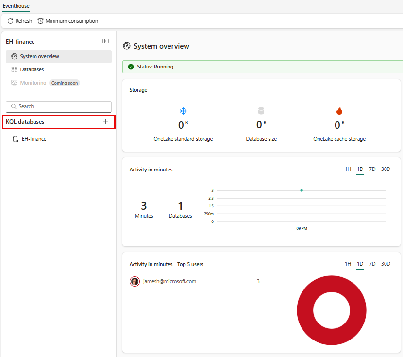
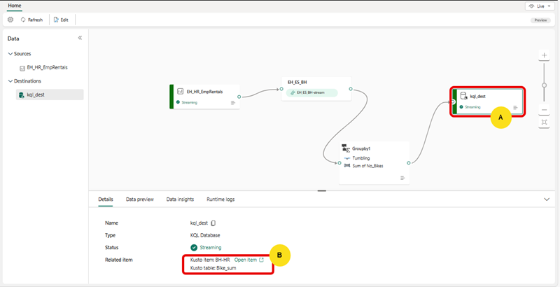

---
lab:
  title: Microsoft Fabric 中的 Eventstream 入门
  module: Get started with Eventstream in Microsoft Fabric
---
# 实时智能中的 EventStream 入门

事件流是 Microsoft Fabric 中的一项功能，可捕获、转换实时事件并将其路由到各种目标，并且无需编写代码。 可向事件流添加事件数据源、路由目标以及事件处理程序（如果需要转换）。 Microsoft Fabric 的 EventStore 是一个监视选项，用于维护群集中的事件，并提供一种方法来了解群集或工作负载在给定时间点的状态。 可以向 EventStore 服务查询可用于群集中的每个实体和实体类型的事件。 这意味着可在群集、节点、应用程序、服务、分区和分区副本等不同级别查询事件。 EventStore 服务还能够将群集中的事件相关联。 通过查看在同一时间从可能已相互影响的不同实体写入的事件，EventStore 服务可以将这些事件进行关联来帮助查明群集中发生各项活动的原因。 另一种监视和诊断 Microsoft Fabric 群集的方法是使用 EventFlow 聚合和收集事件。

完成本实验室大约需要 30 分钟。

> **注意**：需要 [Microsoft Fabric 试用版](https://learn.microsoft.com/fabric/get-started/fabric-trial) 才能完成本练习。

## 创建工作区

在 Fabric 中处理数据之前，创建一个已启用的 Fabric 试用版的工作区。

1. 登录到 [Microsoft Fabric](https://app.fabric.microsoft.com) (`https://app.fabric.microsoft.com`)，然后选择“Power BI”。
2. 在左侧菜单栏中，选择“工作区”（图标类似于 &#128455;）。
3. 使用所选名称创建一个新工作区，并选择包含 Fabric 容量的授权模式（试用、高级或 Fabric）  。
4. 打开新工作区时，它应为空，如下所示：

   
5. 在 Power BI 门户的左下角，选择“Power BI”图标，然后切换到“实时智能”体验********。

## 场景

借助 Fabric 事件流，可在一个位置轻松管理事件数据。 可收集、转换实时事件数据，并以所需格式将其发送到不同目标。 还可毫不费力地将事件流与 Azure 事件中心、KQL 数据库和 Lakehouse 相连接。

本实验室基于名为“股市数据”的示例流式处理数据。 股市示例数据是一个股票交易所的数据集，其中预设了时间、符号、价格、成交量等架构列。 你将使用此示例数据模拟股票价格的实时事件，并使用各种目标（如 KQL 数据库）对其进行分析。

使用实时智能流式处理和查询功能，回答有关股票统计信息的关键问题。 在此场景中，我们将充分利用向导，而不是单独手动创建某些组件，如 KQL 数据库。

本教程介绍以下操作：

- 创建 Eventhouse
- 创建 KQL 数据库
- 将数据复制到 OneLake
- 创建 Eventstream
- 将数据从 Eventstream 流式传输到 KQL 数据库
- 使用 KQL 和 SQL 探索数据

## 创建实时智能 Eventhouse

1. 在 Microsoft Fabric 中选择“实时智能”选项。
1. 从菜单栏中选择 Eventhouse，并为 Eventhouse 指定名称。
    
    

## 创建 KQL 数据库

1. 在“实时智能 Eventhouse”仪表板内，选中“KQL 数据库 +”框********。
1. 你将可以选择为数据库命名，然后选择“新数据库(默认)”或创建“新快捷方式数据库(后继)”********。
1. 选择**创建**。

     >**注意：** 使用后继数据库功能可将另一群集中的数据库附加到 Azure 数据资源管理器群集。 后继数据库以只读模式附加，因此可以查看其数据，并针对已引入先导数据库的数据运行查询。 后继数据库会同步先导数据库中的更改。 由于同步的缘故，数据可用性方面会存在几秒钟到几分钟的数据延迟。 具体的延迟时长取决于先导数据库元数据的总体大小。 先导数据库和后继数据库使用相同的存储帐户来提取数据。 存储由先导数据库拥有。 后继数据库无需引入数据即可查看数据。 由于附加的数据库是只读的数据库，因此无法修改数据库中除缓存策略、主体和权限以外的其他数据、表和策略。

   

4. 系统会提示为 KQL 数据库命名

   

5. 为 KQL 数据库指定一个你能记住的名称（如 Eventhouse-HR），然后按“创建”********。

6. 在“数据库详细信息”面板中，选择铅笔图标以在 OneLake 中打开可用性。

   

7. 确保将按钮切换到“活动”，然后选择“完成” 。

   

## 创建 Eventstream

1. 在菜单栏中，选择“实时智能”（该图标类似于“实时智能徽标”）****
2. 在“**新建**”下，选择“**Eventstream**”。

   

3. 系统会提示为 Eventstream 命名。 为 EventStream 指定一个你能记住的名称，例如 **MyStockES**，然后选择“**增强功能（预览版）**”选项，然后选择“**创建**”按钮。

   

     >**注意：** 工作区中新事件流的创建将在几分钟内完成。 建立之后，你将自动重定向到主编辑器，准备好开始将源集成到 Eventstream 中。

## 建立 Eventstream 源

1. 在 Eventstream 画布中，从下拉列表中选择“新建源”，然后选择“示例数据” 。

    

2.  在“**添加源**”中，为源指定一个名称，然后选择“**自行车 (Reflex 兼容)**”
3.  选择“添加”按钮。

    

4. 选择“添加”按钮后，将映射流并自动重定向到“Eventstream 画布”********。

   
 
 > **注意：** 创建示例数据源后，你会看到它以“编辑”模式添加到画布上的 Eventstream。 若要实现新添加的示例数据，请选择“发布”****。

## 添加转换事件或添加目标活动

1. 发布后，你可以选择“转换事件或添加目标”，然后选择“KQL 数据库”作为选项********。

   

2. 你将看到一个新的侧面板打开，其中提供许多选项。 输入 KQL 数据库的必要详细信息。

   

    - **数据引入模式：** 可通过两种方式将数据引入 KQL 数据库：
        - 直接引入：在不进行任何转换的情况下将数据直接引入 KQL 表******。
        - 在引入前先进行事件处理：在将数据发送到 KQL 表之前，使用事件处理程序转换数据******。      
        
        > **警告：** 将 KQL 数据库目标添加到 Eventstream 后，无法编辑引入模式****。     

   - **目标名称：** 输入该 Eventstream 目标的名称，例如“kql-dest”。
   - 工作区：KQL 数据库所在的位置****。
   - KQL 数据库：KQL 数据库的名称****。
   - 目标表：KQL 表的名称****。 还可以输入名称以创建新表，例如“bike-count”。
   - **输入数据格式：** 选择 JSON 作为 KQL 表的数据格式。

3. 选择“保存”。 
4. 选择**发布**。

## 转换事件

1. 在 Eventstream 画布中，选择“转换事件”********。

    

    A. 选择“分组依据”****。

    B. 选择“编辑”，以“铅笔”图标表示**********。

    °C 创建“分组依据”转换事件后，需要将其从 Eventstream 连接到“分组依据”************。 无需使用代码即可完成此操作，方法是单击 Eventstream 右侧的点，将其拖动到新的“分组依据”框左侧的点********。 

        

2. 填写**分组依据**设置部分的属性：
    - **操作名称：** 输入此转换事件的名称
    - **聚合类型：** 总和
    - **字段：** No_Bikes
    - **名称：** SUM_No_Bikes
    - **聚合分组依据：** 街道
      
3. 依次选择“添加”、“保存”。

4. 同样地，可以将鼠标悬停在**事件流**与 ***kql_dest*** 之间的箭头上，然后选择***垃圾桶**。 然后，可以按事件将**分组**连接到 **kql-dest**。

   

    > **注意：** 无论何时添加或移除连接器，都需要重新配置目标对象。

5. 选择 **kql-dest** 下的铅笔，并创建一个名为 **Bike_sum** 的新目标表，该表将接收**分组依据**事件的输出。

## KQL 查询

Kusto 查询语言 (KQL) 是处理数据并返回结果的只读请求。 该请求用纯文本形式表示，使用的数据流模型易于读取、创作和自动执行。 查询始终在特定表或数据库的上下文中运行。 查询至少由源数据引用和依次应用的一个或多个查询运算符组成，通过使用竖线字符 (|) 对运算符进行分隔来直观地表示。 要详细了解 Kusto 查询语言，请参阅 [Kusto 查询语言 (KQL) 概述](https://learn.microsoft.com/en-us/azure/data-explorer/kusto/query/?context=%2Ffabric%2Fcontext%2Fcontext)

> 注意：KQL 编辑器附带语法和 Inellisense 突出显示功能，使你能够快速了解 Kusto 查询语言 (KQL)。

1. 浏览到新创建并经过水化处理的 KQL 数据库：

    A.  选择 “**kql-dest**” 

    B. 选择位于“相关项”行中的“打开项”超链接********

   

1. 在数据树中，选择 Bike_sum 表上的“更多”菜单 [...]******。 然后选择“查询表”>“显示任意 100 条记录”。

   

3. 示例查询将在“探索数据”窗格中打开，其中已填充表上下文。 第一个查询使用 `take` 运算符返回示例数量的记录，并且有助于初步了解数据结构和可能的值。 自动填充的示例查询将自动运行。 可在结果窗格中查看查询结果。

   

4. 返回到数据树以选择下一个查询**汇总每小时引入**，其使用 `summarize` 运算符计算在给定时间间隔内引入的记录数。

   

> **注意**：你可能会看到已超出查询限制的警告。 此行为可能会有所不同，具体取决于流式传输到数据库的数据量。

可继续使用内置查询函数进行导航来熟悉数据。

## 使用 Copilot 进行查询

除了查询编辑器的主要查询语言 Kusto 查询语言 (KQL) 之外，查询编辑器还支持使用 T-SQL。 对于无法使用 KQL 的工具而言，T-SQL 可能很有用。 有关详细信息，请参阅[使用 T-SQL 查询数据](https://learn.microsoft.com/en-us/azure/data-explorer/t-sql)

1. 返回数据树，选择 MyStockData 表上的“更多”菜单 [...]。 选择“查询表”>“SQL”>“显示任意 100 条记录”。

   

2. 将光标置于查询中的某个位置，然后选择“运行”或按 Shift + Enter 。

   

可继续使用内置函数进行导航，并使用 SQL 或 KQL 熟悉数据。 

## 查询集功能

KQL（Kusto 查询语言）数据库中的查询集用途广泛，主要用于运行查询、查看和自定义 KQL 数据库中数据的查询结果。 它们是 Microsoft Fabric 数据查询功能的关键组成部分，允许用户：

 - **执行查询：** 运行查询以从 KQL 数据库中检索数据。
 - **自定义结果：** 查看和修改查询结果，以便更轻松地分析和解释数据。
 - **保存和共享查询：** 在查询集中创建多个选项卡，以保存查询供以后使用，或与他人共享查询以便协同探索数据。
 - **支持 SQL 函数：** 使用 KQL 创建查询时，查询集还支持许多 SQL 函数，从而灵活地进行数据查询。
 - **利用 Copilot：** 将查询保存为 KQL 查询集后，可以对其进行查看

保存 Queryset 非常简单，方法有两种。 

1. 在“KQL 数据库”中使用“探索数据”工具时，只需选择“另存为 KQL 查询集”即可************

   

2. 另一种方法是使用“实时智能”登录页面，从该页面中选择“KQL 查询集”按钮，然后为查询集命名********

   

3. 进入“查询集登录页面”后，工具栏上会显示一个 Copilot 按钮，选择此按钮可打开“Copilot 窗格”，提出数据相关问题************。

    

4. 在“Copilot 窗格”中，只需键入问题，Copilot 就会生成 KQL 查询，并允许你将查询复制或 *插入到查询集窗口中******************。 

    

5. 此时，你可以选择采用各个查询，并使用“固定到仪表板”或“生成 PowerBI 报表”按钮将其用于仪表板或 Power BI 报表********。

## 清理资源

在本练习中，你已创建 KQL 数据库并使用 EventStream 设置了持续流式处理。 然后使用 KQL 和 SQL 查询了数据。 如果已完成 KQL 数据库探索，可删除为本练习创建的工作区。
1. 在左侧栏中，选择你的工作区的图标。
2. 在工具栏上的“...”菜单中，选择“工作区设置” 。
3. 在“常规”部分中，选择“删除此工作区”。********
。
