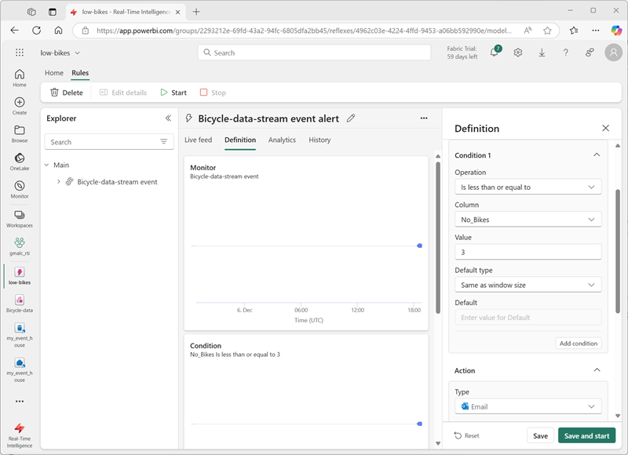

---
lab:
  title: 在 Microsoft Fabric 中使用事件流引入实时数据
  module: Ingest real-time data with Eventstream in Microsoft Fabric
---
# 在 Microsoft Fabric 中使用事件流引入实时数据

事件流是 Microsoft Fabric 中的一项功能，可捕获、转换实时事件并将其路由到各种目标。 可以将事件数据源、目标和转换添加到事件流。

在这个练习中，你将从一个样本数据源中引入数据，该数据源会发出与自行车共享系统中自行车收集点的观测相关的一系列事件，人们可以在这个系统中租赁城市内的自行车。

完成本实验室大约需要 30 分钟。

> **备注**：你需要 [Microsoft Fabric 租户](https://learn.microsoft.com/fabric/get-started/fabric-trial)才能完成本练习。

## 创建工作区

在 Fabric 中处理数据之前，需要创建一个已启用 Fabric 容量的工作区。

1. 在 [Microsoft Fabric 主页](https://app.fabric.microsoft.com/home?experience=fabric) (`https://app.fabric.microsoft.com/home?experience=fabric`) 上，选择“**实时智能**”。
1. 在左侧菜单栏中，选择“工作区”（图标类似于 &#128455;）。
1. 新建一个工作区并为其指定名称，并选择包含 Fabric 容量（试用版、高级版或 Fabric）的许可模式  。
1. 打开新工作区时，它应为空。

    

## 创建 Eventhouse

现在，你已拥有工作区，可以开始创建实时智能解决方案所需的 Fabric 项。 首先，我们将创建一个事件库。

1. 在左侧菜单栏上，选择“**开始**”；然后在“实时智能”主页中，创建新的“**Eventhouse**”，为其指定所选的唯一名称。
1. 关闭显示的所有建议或提示，直到看到新的空事件屋。

    

1. 在左侧窗格中，请注意事件屋包含一个与事件屋同名的 KQL 数据库。
1. 选择要查看的 KQL 数据库。

    目前数据库中没有表。 在本练习的其余部分中，你将使用事件流将数据从实时源加载到表中。

## 创建 Eventstream

1. 在 KQL 数据库的主页中，选择“**获取数据**”。
2. 对于数据源，请选择“**Eventstream**” > “**新建 Eventstream**”。 将 Eventstream 命名为 `Bicycle-data`。

    只需片刻即可在工作区完成创建新事件流。 建立之后，你将自动重定向到主编辑器，准备好开始将源集成到 Eventstream 中。

    

## 添加源

1. 在 Eventstream 画布中，选择“**使用示例数据**”。
2. 将该源命名为 `Bicycles`，并选择“**自行车**”示例数据。

    流将被映射，并且会自动显示在**事件流画布**上。

   

## 添加目标

1. 使用 **Bicycle-data** 节点右侧的 **+** 图标，添加一个新的 **Eventhouse** 节点。
1. 使用新事件库节点中的*铅笔*图标对其进行编辑。
1. 在“**Eventhouse**”窗格中，配置以下设置选项。
   - **数据引入模式：** 引入前的事件处理
   - **目标名称：**`bikes-table`
   - **工作区：***选择在本练习开始时创建的工作区*
   - **Eventhouse**：*选择事件屋*
   - **KQL 数据库：***选择 KQL 数据库*
   - **目标表：** 创建名为 `bikes` 的新表
   - **输入数据格式：** JSON

   

1. 在“**Eventhouse**”窗格中，选择“**保存**”。 
1. 在工具栏上，选择“发布”****。
1. 等待一分钟左右，让数据目标变为活动状态。 然后在设计画布中选择**自行车表**节点，然后查看下面的“**数据预览**”窗格，以查看已引入的最新数据：

   

1. 等待几分钟，然后使用“**刷新**”按钮刷新“**数据预览**”窗格。 流将永久运行，因此新数据可能已添加到表中。
1. 在事件流设计画布下，查看“**数据见解**”标签页以查看已捕获的数据事件的详细信息。

## 查询捕获的数据

创建的事件流从自行车数据的示例源中获取数据，并将其加载到事件屋的数据库中。 可以通过查询数据库中的表来分析捕获的数据。

1. 在左侧菜单栏中，选择 KQL 数据库。
1. 在 KQL 数据库工具栏的**数据库**选项卡上，使用“**刷新**”按钮刷新视图，直到看到数据库下的**自行车**表。 然后选择“**自行车**”表。

   

1. 在**自行车**表的 **...** 菜单中选择“**查询表** > **过去 24 小时内引入的记录**”。
1. 在查询窗格中，请注意，已生成并运行以下查询，结果如下所示：

    ```kql
    // See the most recent data - records ingested in the last 24 hours.
    bikes
    | where ingestion_time() between (now(-1d) .. now())
    ```

1. 选择查询代码并运行，以查看表中的 100 行数据。

    

## 转换事件数据

已捕获的数据与源数据一致，未经过更改。 在许多情况下，可能需要在将事件流中的数据加载到目标之前对其进行转换。

1. 在左侧菜单栏中，选择“**Bicycle-data**”事件流。
1. 在工具栏上，选择“**编辑**”以编辑事件流。
1. 在“**转换事件**”菜单中，选择“**分组依据**”，以将新的“**分组依据**”节点添加到事件流。
1. 将连接从“**Bicycle-data**”节点的输出拖到新的“**分组依据**”节点的输入，然后使用“**分组依据**”节点中的*铅笔*图标对其进行编辑。

   

1. 配置“**分组依据**”设置部分的属性：
    - **操作名称：** GroupByStreet
    - **聚合类型：***选择*“求和”
    - **字段：***选择*No_Bikes。 *然后选择“**添加**”以创建函数 *SUM_No_Bikes
    - **组聚合依据（可选）：** 街道
    - 时间窗口：翻转****
    - **持续时间**：5 秒
    - **偏移**：0 秒

    > **备注**：此配置将导致事件流每 5 秒计算一次每条街道上的自行车总数。
      
1. 保存配置并返回到事件流画布，此时会显示一个错误提示（因为需要将转换的输出存储在某个地方！）。

1. 使用“**GroupByStreet**”节点右侧的 **+** 图标来添加新的“**Eventhouse**”节点。
1. 使用以下选项配置新的事件屋节点：
   - **数据引入模式：** 引入前的事件处理
   - **目标名称：**`bikes-by-street-table`
   - **工作区：***选择在本练习开始时创建的工作区*
   - **Eventhouse**：*选择事件屋*
   - **KQL 数据库：***选择 KQL 数据库*
   - **目标表：** 创建名为 `bikes-by-street` 的新表
   - **输入数据格式：** JSON

    

1. 在“**Eventhouse**”窗格中，选择“**保存**”。 
1. 在工具栏上，选择“发布”****。
1. 等待一分钟左右，让更改变为活动状态。
1. 在设计画布中，选择“**按街道自行车表**”节点，并在画布下方查看“**数据预览**”窗格。

    

    请注意，转换的数据包括指定的分组字段（**街道**）、指定的聚合 (**SUM_no_Bikes**)，以及一个时间戳字段，指示发生事件的 5 秒翻转窗口的结束 (**Window_End_Time**)。

## 查询转换后的数据

现在，可以查看事件流已转换并加载到表中的自行车数据

1. 在左侧菜单栏中，选择 KQL 数据库。
1. 1. 在 KQL 数据库工具栏的**数据库**选项卡上，使用“**刷新**”按钮刷新视图，直到看到数据库下的**按街道自行车**表。
1. 在**按街道自行车**表的 **...** 菜单中选择“**查询数据** > **显示任意 100 条记录**”。
1. 在查询窗格中，请注意，生成并运行以下查询：

    ```kql
    ['bikes-by-street']
    | take 100
    ```

1. 修改 KQL 查询，以检索每 5 秒钟窗口内每条街道的自行车总数：

    ```kql
    ['bikes-by-street']
    | summarize TotalBikes = sum(tolong(SUM_No_Bikes)) by Window_End_Time, Street
    | sort by Window_End_Time desc , Street asc
    ```

1. 选择修改后的查询并运行它。

    结果显示每 5 秒时间段内每条街道观察到的自行车数。

    

<!--
## Add an Activator destination

So far, you've used an eventstream to load data into tables in an eventhouse. You can also direct streams to an activator and automate actions based on values in the event data.

1. In the menu bar on the left, return to the **Bicycle-data** eventstream. Then in the eventstream page, on the toolbar, select **Edit**.
1. In the **Add destination** menu, select **Activator**. Then drag a connection from the output of the **Bicycle-data** stream to the input of the new Activator destination.
1. Configure the new Activator destination with the following settings:
    - **Destination name**: `low-bikes-activator`
    - **Workspace**: *Select your workspace*
    - **Activator**: *Create a **new** activator named `low-bikes`*
    - **Input data format**: Json

    

1. Save the new destination.
1. In the menu bar on the left, select your workspace to see all of the items you have created so far in this exercise - including the new **low-bikes** activator.
1. Select the **low-bikes** activator to view its page, and then on the activator page select **Get data**.
1. On the **select a data source** dialog box, scroll down until you see **Data streams** and then select the **Bicycle-data-stream**.

    

1. Use the **Next**,  **Connect**, and **Finish** buttons to connect the stream to the activator.

    > **Tip**: If the data preview obscures the **Next** button, close the dialog box, select the stream again, and click **Next** before the preview is rendered.

1. When the stream has been connected, the activator page displays the **Events** tab:

    

1. Add a new rule, and configure its definition with the following settings:
    - **Monitor**:
        - **Event**: Bicycle-data-stream-event
    - **Condition**
        - **Condition 1**:
            - **Operation**: Numeric state: Is less than or equal to
            - **Column**: No_Bikes
            - **Value**: 3
            - **Default type**: Same as window size
    - **Action**:
        - **Type**: Email
        - **To**: *The email address for the account you are using in this exercise*
        - **Subject**: `Low bikes`
        - **Headline**: `The number of bikes is low`
        - **Message**: `More bikes are needed.`
        - **Context**: *Select the **Neighborhood**, **Street**, and **No-Bikes** columns.

    

1. Save and start the rule.
1. View the **Analytics** tab for the rule, which should show each instance if the condition being met as the stream of events is ingested by your eventstream.

    Each instance will result in an email being sent notifying you of low bikes, which will result in a large numbers of emails, so...

1. On the toolbar, select **Stop** to stop the rule from being processed.

-->

## 清理资源

在本练习中，你已创建了事件屋，并使用事件流填充了其数据库中的表。

如果已完成 KQL 数据库探索，可删除为本练习创建的工作区。

1. 在左侧栏中，选择你的工作区的图标。
2. 在工具栏上中，选择“**工作区设置**”。
3. 在“常规”部分中，选择“删除此工作区”。********
。
