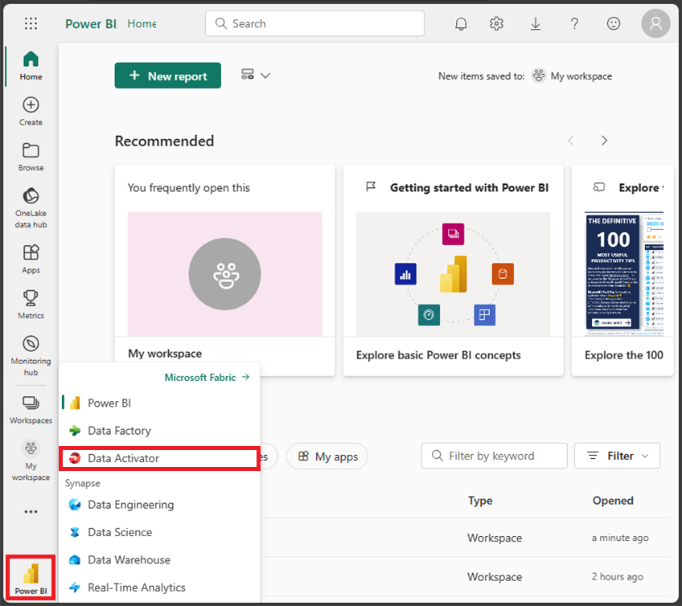
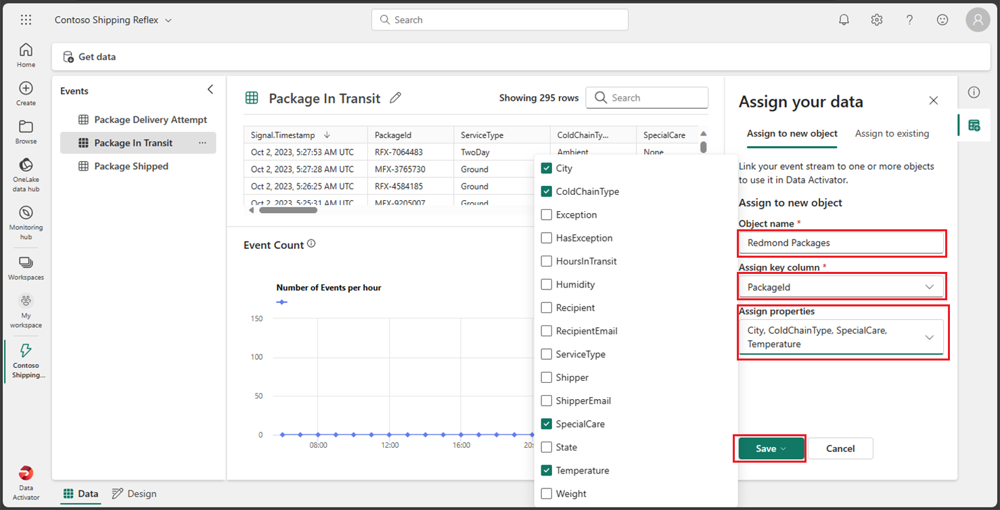
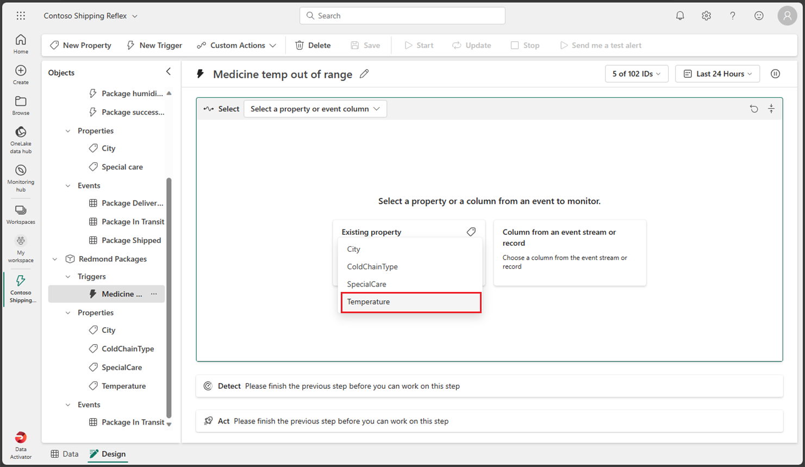
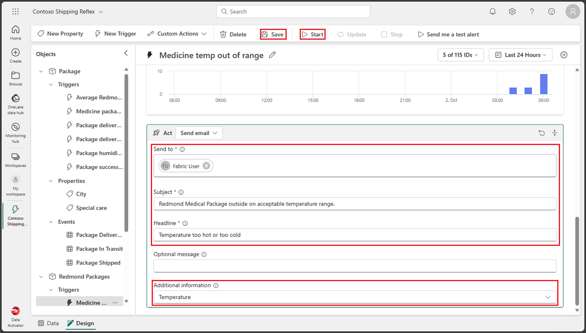
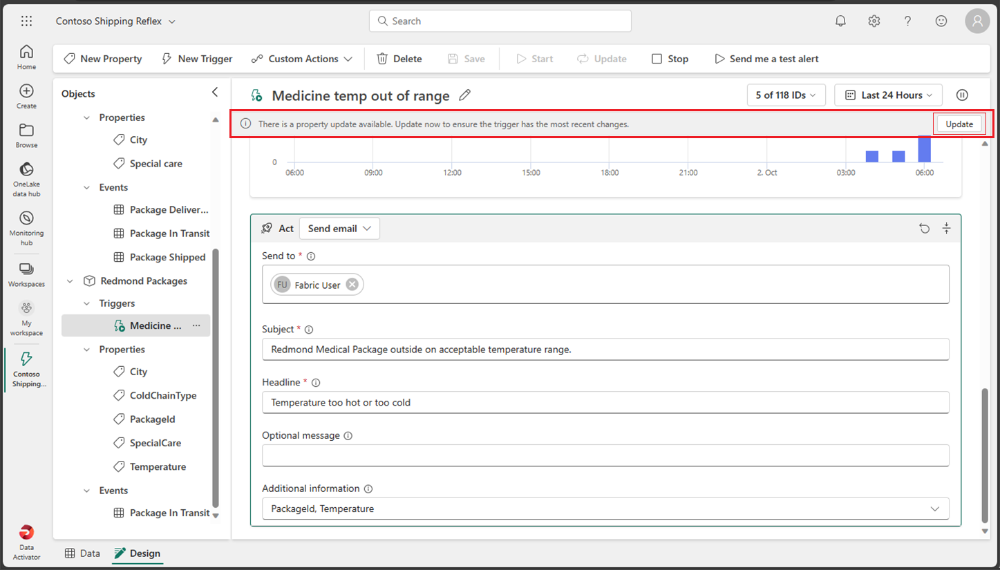

---
lab:
  title: 在 Fabric 中使用 Data Activator
  module: Get started with Data Activator in Microsoft Fabric
---

# 在 Fabric 中使用 Data Activator

Microsoft Fabric 中的 Data Activator 根据数据发生的情况采取操作。 使用 Data Activator 可以监视数据，并创建触发器来对数据更改做出反应。

完成本实验室大约需要 30 分钟。

> 注意：完成本练习需要 Microsoft Fabric 许可证。 有关如何启用免费 Fabric 试用版许可证的详细信息，请参阅 [Fabric 入门](https://learn.microsoft.com/fabric/get-started/fabric-trial)。 执行此操作需要 Microsoft 学校或工作帐户 。 如果没有，可以[注册 Microsoft Office 365 E3 或更高版本的试用版](https://www.microsoft.com/microsoft-365/business/compare-more-office-365-for-business-plans)。

## 创建工作区

在 Fabric 中处理数据之前，在已启用的 Fabric 试用版中创建工作区。

1. 登录到 [Microsoft Fabric](https://app.fabric.microsoft.com) (`https://app.fabric.microsoft.com`)，然后选择 Power BI。
2. 在左侧菜单栏中，选择“工作区”（图标类似于 &#128455;）。
3. 新建一个工作区并为其指定名称，并选择包含 Fabric 容量（试用版、高级版或 Fabric）的许可模式  。
4. 打开新工作区时，它应为空，如下所示：

    

在本实验中，你将使用 Fabric 中的 Data Activator 创建一个 Reflex。 Data Activator 可以方便地提供一个示例数据集，供你用来探索 Data Activator 的功能。 你将使用此示例数据创建一个 Reflex，用于分析某些实时数据并创建一个触发器，以便在满足条件时发送电子邮件。

> 注意：Data Activator 示例进程会在后台生成一些随机数据。 条件和筛选器越复杂，触发它们所需的时间就越长。 如果图形中未出现任何数据，请等待几分钟再刷新页面。 也就是说，你无需等待数据显示在图形中即可继续实验。

## 方案

在此场景中，你是一家销售和交付各种产品的公司的数据分析师。  你负责分析所有发往 Redmond 市的产品的发货和销售数据。 你想要创建一个 Reflex 用于监视要交付的包裹。 你要交付的一个产品类别是医疗处方药，此类产品在运输过程中需要在特定的温度下冷藏。 你想要创建一个 Reflex，以便在处方药的包裹温度高于或低于特定阈值时向发货部门发送电子邮件。 理想温度应介于 33 度至 41 度之间。 由于 Reflex 事件已包含类似的触发器，因此你专门为发往 Redmond 市的包裹创建一个触发器。 现在就开始吧！

## 创建 Reflex

1. 在 Microsoft Fabric 体验门户中选择 Data Activator 体验，方法是首先选择屏幕左下角的当前 Fabric 体验图标，然后从菜单中选择“Data Activator”  。 例如，在以下屏幕截图中，当前 Fabric 体验是“Power BI”。

    

1. 你现在应该位于 Data Activator 主页屏幕中。 右下角的 Fabric Experience 图标也变成了 Data Activator 图标。 让我们通过选择“Reflex (预览版)”按钮创建新的 Reflex。

    

1. 在现实生产环境中，你会使用自己的数据。 但在本实验中，你将使用 Data Activator 提供的示例数据。 选择“使用示例数据”按钮完成 Reflex 的创建。

    

1. 默认情况下，Data Activator 会创建名为“Reflex YYYY-MM-DD hh:mm:ss”的 Reflex。 由于工作区中可能有多个 Reflex，因此应将默认 Reflex 的名称更改为更具描述性的名称。 在本示例中，请选择左上角当前 Reflex 名称旁边的下拉列表，然后将名称更改为“Contoso Shipping Reflex”。

    

现已创建 Reflex，接下来可以开始为其添加触发器和操作。

## 熟悉 Reflex 主页屏幕

Reflex 的主页屏幕分为两个部分：“设计”模式和“数据”模式 。 可以通过选择屏幕左下角的相应选项卡来选择模式。  在“设计”模式选项卡中，可为对象定义触发器、属性和事件。 在“数据”模式选项卡中，可以添加数据源和查看 Reflex 处理的数据。 让我们看看“设计”模式选项卡，当你创建 Reflex 时，该选项卡默认应会打开。

### 设计模式

如果你当前未进入“设计”模式，请选择屏幕左下角的“设计”选项卡。

若要熟悉“设计”模式，请选择屏幕的不同部分：触发器、属性和事件。 以下各部分将更详细地介绍每个屏幕部分。

### 数据模式

如果你当前未进入“数据”模式，请选择屏幕左下角的“数据”选项卡。 在现实示例中，你可以在此处通过 EventStreams 和 Power BI 视觉对象添加自己的数据源。 对于本实验，你将使用 Data Activator 提供的示例数据。 对于此示例，已经为其设置了三个用于监视包裹交付状态的 EventStreams。

选择每个不同的事件，并观察流中使用的数据。

现在可以为 Reflex 添加触发器，但首先让我们创建一个新对象。

## 创建对象

在现实方案中，可能不需要为此 Reflex 创建新对象，因为 Data Activator 示例已包含一个名为 Package 的对象。 但对于本实验，我们将创建一个新对象来演示创建方法。 让我们创建一个名为 Redmond Packages 的新对象。

1. 如果你当前未进入“数据”模式，请选择屏幕左下角的“数据”选项卡。

1. 选择“包裹运输中”事件。 请密切关注 PackageId、Temperature、ColdChainType、City 和 SpecialCare 列中的值    。 你将使用这些列来创建触发器。

1. 如果“分配数据”对话框尚未在右侧打开，请选择屏幕右侧的“分配数据”按钮。

    

1. 在“分配数据”对话框中，选择“分配到新对象”选项卡并输入以下值：

    - 对象名称：Redmond Packages
    - 分配键列：PackageId
    - 分配属性：City、ColdChainType、SpecialCare、Temperature

    

1. 选择“保存”，然后选择“保存并进入设计模式” 。

1. 现在你应会返回“设计”模式。 现在已添加了一个名为 Redmond Packages 的新对象。 选择此新对象，展开其“事件”，然后选择“包裹运输中”事件。

    

现在让我们创建触发器。

## 创建触发器

让我们回顾一下你希望触发器执行的操作：你希望创建一个 Reflex，以便在处方药包裹的温度高于或低于特定阈值时向发货部门发送电子邮件。理想温度应该介于 33 度到 41 度之间。由于 Reflex 事件已包含类似的触发器，因此你将专门为发往 Redmond 市的包裹创建一个触发器。

1. 在“Redmond Packages”对象的“包裹运输中”事件中，选择顶部菜单上的“新建触发器”按钮。 已创建一个默认名称为“无标题”的新触发器，现在请将名称更改为“药物温度超出范围”以更好地定义触发器。

    

1. 现在让我们选择用于触发 Reflex 的属性或事件列。 由于在创建对象时创建了多个属性，因此请选择“现有属性”按钮并选择“温度”属性。 

    

    选择此属性后，应会返回一个包含示例历史温度值的图形。

    

1. 现在需要确定你想从此属性触发哪种类型的条件。 在本例中，你希望在温度高于 41 度或低于 33 度时触发 Reflex。 由于我们要查找数字范围，因此请选择“数字”按钮并选择“退出范围”条件 。

    

1. 现在需要输入条件的值。 输入 33 和 44 作为范围值。 由于选择了“退出数字范围”条件，因此当温度低于 33 度或高于 44 度时，触发器应会触发  。

    

1. 到目前为止，你定义了触发触发器所依据的属性和条件，但尚未包括你需要的所有参数。 你仍然需要确保触发器仅针对城市“Redmond”和特殊护理类型“医疗”触发。 让我们继续为这些条件添加几个筛选器。  选择“添加筛选器”按钮，将属性设置为“City”，将关系设置为“等于”，然后输入“Redmond”作为值。 然后，添加包含“SpecialCare”属性的一个新筛选器，将关系设置为“等于”，然后输入“Medicine”作为值。

    

1. 让我们再添加一个筛选器，以确保药物得到冷藏。 选择“添加筛选器”按钮，设置“ColdChainType”属性，将关系设置为“等于”，然后输入“Refrigerated”作为值。

    

1. 即将完成! 只需定义触发器触发时要执行的操作。 在本例中，你希望向发货部门发送电子邮件。 选择“电子邮件”按钮。

    

1. 为电子邮件操作输入以下值：

    - 收件人：默认情况下应选择你的当前用户帐户，这对于本实验而言应该没问题。
    - 主题：Redmond 医药包裹超出可接受的温度范围
    - 标题：温度太高或太低
    - 附加信息：从复选框列表中选择“Temperature”属性。

    

1. 选择“保存”，然后从顶部菜单中选择“启动” 。

现已在 Data Activator 中创建并启动了一个触发器。

## 更新和停止触发器

此触发器的唯一问题是，虽然触发器发送了包含温度信息的电子邮件，但触发器并未发送包裹的 PackageId。 让我们继续更新触发器以包含 PackageId。

1. 从“Redmond Packages”对象中选择“包裹运输中”事件，然后从顶部菜单中选择“新建属性”  。

    

1. 让我们通过从“包裹运输中”事件选择相应的列来添加 PackageId 属性。 请不要忘记将属性名称从“无标题”更改为“PackageId” 。

    

1. 让我们更新触发器操作。 选择“药品温度超出范围”触发器，滚动到底部的“操作”部分，选择“附加信息”，然后添加“PackageId”属性   。 暂时请不要选择“保存”按钮。

    

1. 由于更新了触发器，正确的操作应该是更新而不是保存触发器，但对于本实验，我们将执行相反的操作，因此请选择“保存”按钮而不是“更新”按钮来看看会发生什么情况 。 选择“更新”按钮的原因是，当你选择更新触发器时，它会保存触发器并使用新条件更新当前运行的触发器 。 如果选择了“保存”按钮，则在选择更新触发器之前，当前运行的触发器不会满足新条件。 让我们继续选择“保存”按钮。

1. 由于选择了“保存”而不是“更新”，因此你会注意到，屏幕顶部显示了消息“有属性更新可用。请立即更新以确保触发器应用最新的更改”  。 该消息还附带了一个“更新”按钮。 让我们继续选择“更新”按钮。

    

1. 从顶部菜单中选择“停止”按钮以停止触发器。

## 清理资源

在本练习中，你在 Data Activator 中创建了一个带有触发器的 Reflex。 现在，你应该熟悉了 Data Activator 界面，并知道如何创建 Reflex 及其对象、触发器和属性。

如果你已完成 Data Activator Reflex 的探索，可以删除为本练习创建的工作区。

1. 在左侧栏中，选择工作区的图标以查看其包含的所有项。
2. 在工具栏上的“...”菜单中，选择“工作区设置” 。
3. 在“其他”部分中，选择“删除此工作区” 。
