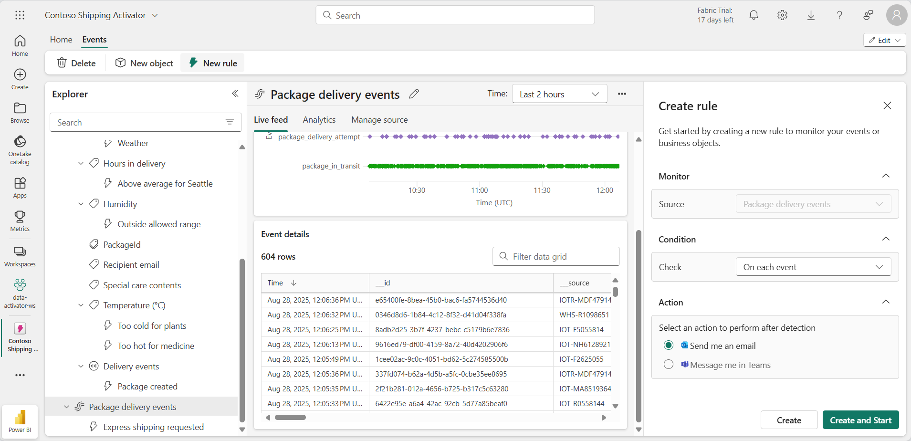

# 在 Fabric 中使用 Data Activator

Microsoft Fabric 中的 Data Activator 根据数据发生的情况采取操作。 使用 Activator 可以监视数据，并创建触发器来对数据更改做出反应。

完成本实验室大约需要 30 分钟。

> **注意**：需要 [Microsoft Fabric 试用版](https://learn.microsoft.com/fabric/get-started/fabric-trial) 才能完成本练习。

## 场景

在此场景中，你是一家销售和交付各种产品的公司的数据分析师。  你负责分析所有发往 Redmond 市的产品的发货和销售数据。 你想要创建一个警报规则用于监视要发送的包裹。 你要交付的一个产品类别是医疗处方药，此类产品在运输过程中需要在特定的温度下冷藏。 你想要创建一个警报，以便在处方药的包裹温度高于或低于特定阈值时向发货部门发送电子邮件。 理想温度应介于 33 度至 41 度之间。 由于 Activator 事件已包含类似的触发器，因此你专门为发往 Redmond 市的包裹创建一个触发器。 现在就开始吧！

## 创建工作区

在 Fabric 中处理数据之前，创建一个已启用的 Fabric 试用版的工作区。

1. 在浏览器中，导航到 [Microsoft Fabric 主页](https://app.fabric.microsoft.com/home?experience=fabric-developer) (`https://app.fabric.microsoft.com/home?experience=fabric-developer`)，使用 Fabric 凭据登录。
1. 在左侧菜单栏中，选择“工作区”（图标类似于 &#128455;）。
1. 新建一个工作区并为其指定名称，并选择包含 Fabric 容量（试用版、高级版或 Fabric）的许可模式  。
1. 打开新工作区时，它应为空。

    

在本实验中，你将使用 Fabric 中的 Activator 创建基于数据变更的触发器。 Fabric Activator 可以方便地提供一个示例数据集，供你用来探索 Activator 的功能。 你将使用此示例数据分析某些实时数据流并创建一个触发器，以便在满足条件时发送电子邮件。

> **注意**：Activator 示例进程会在后台生成一些随机数据。 条件和筛选器越复杂，触发它们所需的时间就越长。 如果图形中未出现任何数据，请等待几分钟再刷新页面。 也就是说，你无需等待数据显示在图形中即可继续实验。

## 创建 Activator

接下来，在创建的工作区中创建 Activator：

1. 在左侧菜单上，选择“**创建**”。 在“新建”页的“实时智能”部分下，选择“Activator”********。

    >**备注**：如果未将“**创建**”选项固定到边栏，则需要首先选择省略号 (**...**) 选项。

    大约一分钟后，一个新的 Activator 创建完成：

    

    在现实生产环境中，你会使用自己的数据。 但在本实验中，你将使用 Activator 提供的示例数据。 

1. 选择“试用示例”磁贴，使用示例数据填充 Activator。****

    默认情况下，使用名称 Activator YYYY-MM-DD hh:mm:ss** 创建 Activator。 由于工作区中可能有多个 Activator，因此应将默认名称更改为更具描述性的名称。

1. 在本示例中，请选择左上角当前 Activator 名称旁边的下拉列表，然后将名称更改为“Contoso Shipping Activator”******。

    

现已创建 Activator 项目，我们可以开始浏览其对象、属性和规则。

## 熟悉 Activator 主屏幕

让我们来探索构建此示例所基于的 Eventstream 数据。

1. 在“资源管理器”窗格中，向下滚动并选择“包裹发送事件”流********。

    这些事件显示正在交付的包的实时状态。

    

1. 查看“事件详细信息”实时表中的数据****。 每个数据点都包含有关传入事件的信息。 可能需要滚动才能看到所有内容。

    “资源管理器”**** 窗格显示使用 Eventstream 中的数据的对象。 这些对象具有可用于创建规则的属性。 在此示例中，“包裹”是从“包裹发送事件”Eventstream 创建的对象。********

1. 在“资源管理器”窗格的“Temperature”属性下，选择规则“药品储存条件过热”。************
1. 在“定义”**** 窗格中，查看规则的工作原理。 在“监视”部分，“Temperature”属性选定为将被监视的属性。******** Temperature 值来自 Eventstream 中前面显示的“事件详细信息”表中的“Temperature”列****。 

     

1. 在“条件”**** 部分，可以看到用于监视温度高于 20 摄氏度的规则条件。
1. 在“属性筛选器”部分，你将看到一个自定义筛选器，该筛选器确保规则仅适用于包含药品的包裹。**** 在 Eventstream 表中，规则将查看名为“SpecialCare”的列，这里表示为“Special care contents”属性******。 在“Special care contents”属性中，部分包裹的值为“Medicine”。**
1. 最后是“操作”**** 部分。 如果满足条件，规则会发送 Teams 消息。 也可以将其设置为改为发送电子邮件。
1. 选择你喜欢的操作类型，确认收件人是你，然后选择“向我发送测试操作”。**** 应在“消息”字段中收到消息集，其中包含有关触发器的详细信息，例如激活时间和包 ID。****

## 创建对象

在现实应用场景中，可能不需要为此 Eventstream 创建新对象，因为 Activator 示例已包含一个名为 Package 的对象**。 但对于本实验，我们将创建一个新对象来演示创建方法。 让我们创建一个名为 Redmond Packages 的新对象**。

1. 选择“包裹发送事件”Eventstream，然后选择功能区上的“新建对象”********。

1. 在右侧的“生成对象”**** 窗格中，输入以下值：
    - **** 对象名称：`Redmond Packages`
    - **** 唯一标识符：**** PackageId
    - **属性**：City、ColdChainType、SpecialCare、Temperature****************

1. 选择**创建**。

    

在“资源管理器”窗格中，现已添加一个名为“Redmond Packages”的新对象********。 现在让我们创建规则。

## 创建规则

让我们回顾一下你希望规则执行的操作：*你想要创建一个警报规则，以便在处方药的包裹温度高于或低于特定阈值时向发货部门发送电子邮件。理想温度应低于 20 度。由于 Package 对象已包含类似的规则，因此你将专门为发往 Redmond 市的包裹创建一个规则。*

1. 选择 Redmond Packages 对象中的“Temperature”属性，然后选择功能区上的“新建规则”按钮（如果尚未选择）。**********
1. 在“创建规则”窗格中输入以下值****：
    - **条件**：温度高于阈值
    - **值**：`20`
    - Occurrence****：每次满足条件时
    - **操作**：给我发送电子邮件

1. 选择**创建**。
1. 创建一个新规则，默认名称为“温度警报”** 通过在中间窗格中选择规则名称旁边的铅笔图标，将名称更改为“药品温度超出范围”******。

    

    到目前为止，你定义了触发规则所依据的属性和条件，但尚未包括你需要的所有参数。 你仍然需要确保触发器仅针对城市“Redmond”和特殊护理类型“医疗”触发************。 让我们继续为这些条件添加几个筛选器。  

1. 在“定义”窗格中，展开“属性筛选器”部分。********
1. 在“筛选器 1”框中，将属性设置为“City”，将操作设置为“Is equal to”，然后选择“Redmond”作为值。****************
1. 选择“添加筛选器”，添加包含“SpecialCare”属性的新筛选器，将操作设置为“Is equal to”，然后输入“Medicine”作为值。****************
1. 让我们再添加一个筛选器，以确保药物得到冷藏。 选择“添加筛选器”按钮，设置“ColdChainType”属性，将操作设置为“Is equal to”，然后输入“Refrigerated”作为值。******************

    

    即将完成! 只需定义触发器触发时要执行的操作。 在本例中，你希望向发货部门发送电子邮件。

1. 在“操作”**** 部分，输入以下值：
    - **类型**：电子邮件
    - **收件人**：默认情况下应选择你的当前用户帐户，这对于本实验而言应该没问题。
    - **主题**：Redmond 医药包裹超出可接受的温度范围**
    - **** 标题：*温度太高*
    - 上下文****：从复选框列表中选择“Temperature”属性。**

    

1. 选择“保存并启动”****。

    现已在 Activator 中创建并启动了一个规则。 规则应每小时触发几次。

1. 确认规则正常运行后，可以使用功能区上的“停止”按钮将其关闭****。

## 清理资源

在本练习中，你创建了一个具有警报规则的 Activator。 现在，你应该熟悉了 Activator 界面，并知道如何创建对象、属性和规则。

如果已完成 Activator 探索，可以删除为本练习创建的工作区。

1. 在左侧导航栏中，选择工作区的图标以查看其包含的所有项。
2. 在顶部工具栏上的菜单中，选择“工作区设置”****。
3. 在“常规”部分中，选择“删除此工作区”。********
