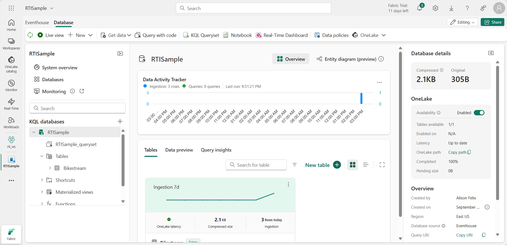
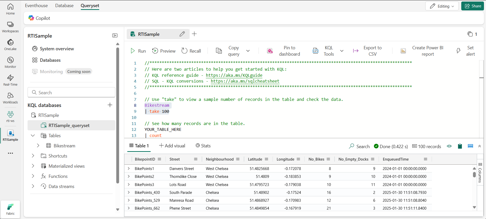

---
lab:
  title: 在 Microsoft Fabric 事件库中使用数据工作
  module: Work with data in a Microsoft Fabric eventhouse
---

# 在 Microsoft Fabric 事件库中使用数据工作

在 Microsoft Fabric 中，*事件库*用于存储与事件相关的实时数据，通常由*事件流*从流式数据源捕获。

在事件库中，数据存储在一个或多个 KQL 数据库中，每个数据库都包含表和其他对象，可以使用 Kusto 查询语言 (KQL) 或结构化查询语言 (SQL) 的子集进行查询。

在本练习中，你将使用与出租车行程相关的一些示例数据创建和填充事件库，然后使用 KQL 和 SQL 查询数据。

完成本练习大约需要 **25** 分钟。

## 创建工作区

在 Fabric 中处理数据之前，创建一个已启用 Fabric 容量的工作区。

1. 在浏览器中，导航到 [Microsoft Fabric 主页](https://app.fabric.microsoft.com/home?experience=fabric) (`https://app.fabric.microsoft.com/home?experience=fabric`)，使用 Fabric 凭据登录。
1. 在左侧菜单栏中，选择“工作区”（图标类似于 &#128455;）。
1. 新建一个工作区并为其指定名称，并选择包含 Fabric 容量（试用版、高级版或 Fabric）的许可模式  。
1. 打开新工作区时，它应为空。

    

## 创建 Eventhouse

现在，你已有一个支持 Fabric 容量的工作区，可以在其中创建一个事件库。

1. 在左侧菜单栏中，选择“**工作负载**”。 然后选择“**实时智能**”磁贴。
1. 在“**实时智能**”主页上，选择“**浏览实时智能示例**”磁贴。 它将自动创建名为 **RTISample** 的 eventhouse：

   

1. 在左侧窗格中，请注意事件屋包含一个与事件屋同名的 KQL 数据库。
1. 验证是否已创建 **Bikestream** 表。

## 使用 KQL 查询数据

Kusto 查询语言 (KQL) 是一种直观、全面的语言，可用于查询 KQL 数据库。

### 使用 KQL 检索表中的数据

1. 在 eventhouse 窗口左窗格的 KQL 数据库下，选择默认的**查询集**文件。 此文件包含一些用于入门的示例 KQL 查询。
1. 按如下所示修改第一个示例查询。

    ```kql
    Bikestream
    | take 100
    ```

    > **注意：** 竖线 ( | ) 字符在 KQL 中有两个用途，其中包括分隔表格表达式语句中的查询运算符。 它还用作方括号或圆括号中的逻辑 OR 运算符，表示可以指定一个由竖线字符分隔的项。

1. 选择查询代码并运行，以从表中返回 100 行。

   

    你可以做到更精确，方法是使用 `project` 关键字添加要查询的特定属性，然后使用 `take` 关键字告知引擎要返回多少条记录。

1. 键入、选择并运行以下查询：

    ```kql
    // Use 'project' and 'take' to view a sample number of records in the table and check the data.
    Bikestream
    | project Street, No_Bikes
    | take 10
    ```

    > **备注：** 使用 // 表示注释。

    分析中的另一个常见做法是重命名查询集中的列，以使其更方便用户识别。

1. 尝试运行以下查询：

    ```kql
    Bikestream 
    | project Street, ["Number of Empty Docks"] = No_Empty_Docks
    | take 10
    ```

### 使用 KQL 汇总数据

可以将 *summarize* 关键字与函数一起使用来聚合数据，否则可以操作数据。

1. 请尝试以下查询，该查询使用 **sum** 函数汇总租赁数据，以查看总共有多少辆自行车可用：

    ```kql

    Bikestream
    | summarize ["Total Number of Bikes"] = sum(No_Bikes)
    ```

    你可以按指定的列或表达式对汇总数据进行分组。

1. 运行以下查询，按街区对自行车数量进行分组，以确定每个街区的可用自行车数量：

    ```kql
    Bikestream
    | summarize ["Total Number of Bikes"] = sum(No_Bikes) by Neighbourhood
    | project Neighbourhood, ["Total Number of Bikes"]
    ```

    如果任何一个自行车点的街区条目为 Null 或空，汇总的结果将包含一个空值，这绝不适合分析。

1. 修改此处所示的查询，以将 *case* 函数与 *isempty* 和 *isnull* 函数一起使用，从而将该街区未知的所有行程分组到一个***未识别***类别以便跟进。

    ```kql
    Bikestream
    | summarize ["Total Number of Bikes"] = sum(No_Bikes) by Neighbourhood
    | project Neighbourhood = case(isempty(Neighbourhood) or isnull(Neighbourhood), "Unidentified", Neighbourhood), ["Total Number of Bikes"]
    ```

    >**备注**：由于此示例数据集维护良好，因此查询结果中可能没有“未识别”字段。

### 使用 KQL 对数据进行排序

为了更好地理解数据，我们通常会按列进行排序，此过程是在 KQL 中使用 *sort by* 或 *order by* 运算符实现的，二者的作用相同。

1. 尝试运行以下查询：

    ```kql
    Bikestream
    | summarize ["Total Number of Bikes"] = sum(No_Bikes) by Neighbourhood
    | project Neighbourhood = case(isempty(Neighbourhood) or isnull(Neighbourhood), "Unidentified", Neighbourhood), ["Total Number of Bikes"]
    | sort by Neighbourhood asc
    ```

1. 按如下所示修改查询并再次运行，并注意 *order by* 运算符与 *sort by* 作用相同：

    ```kql
    Bikestream
    | summarize ["Total Number of Bikes"] = sum(No_Bikes) by Neighbourhood
    | project Neighbourhood = case(isempty(Neighbourhood) or isnull(Neighbourhood), "Unidentified", Neighbourhood), ["Total Number of Bikes"]
    | order by Neighbourhood asc
    ```

### 使用 KQL 筛选数据

在 KQL 中，*where* 子句用于筛选数据。 可以使用 *and* 和 *or* 逻辑运算符将 *where* 子句中的条件合并在一起。

1. 运行以下查询来筛选自行车数据，以仅包含切尔西街区的自行车点：

    ```kql
    Bikestream
    | where Neighbourhood == "Chelsea"
    | summarize ["Total Number of Bikes"] = sum(No_Bikes) by Neighbourhood
    | project Neighbourhood = case(isempty(Neighbourhood) or isnull(Neighbourhood), "Unidentified", Neighbourhood), ["Total Number of Bikes"]
    | sort by Neighbourhood asc
    ```

## 使用 Transact-SQL 查询数据

KQL 数据库并不原生支持 Transact-SQL，但它提供了一个可仿真 Microsoft SQL Server 并允许你对数据运行 T-SQL 查询的 T-SQL 终结点。 T-SQL 终结点存在一些限制并与本机 SQL Server 有差别。 例如，它不支持创建、更改或删除表，也不支持插入、更新或删除数据。 另外，它不支持一些与 KQL 不兼容的 T-SQL 函数和语法。 创建该终结点的目的是使不支持 KQL 的系统能够使用 T-SQL 来查询 KQL 数据库中的数据。 因此，建议使用 KQL 作为 KQL 数据库的主要查询语言，因为它的功能比 T-SQL 多，性能也更好。 你还可以使用 KQL 支持的一些 SQL 函数，例如 count、sum、avg、min、max 等。

### 使用 Transact-SQL 从表检索数据

1. 在查询集中，添加并运行以下 Transact-SQL 查询： 

    ```sql
    SELECT TOP 100 * from Bikestream
    ```

1. 按如下所示修改查询以检索特定列

    ```sql
    SELECT TOP 10 Street, No_Bikes
    FROM Bikestream
    ```

1. 修改查询来分配别名，以将 **No_Empty_Docks** 重命名为用户友好程度更高的名称。

    ```sql
    SELECT TOP 10 Street, No_Empty_Docks as [Number of Empty Docks]
    from Bikestream
    ```

### 使用 Transact-SQL 汇总数据

1. 运行以下查询以查找可用的自行车总数：

    ```sql
    SELECT sum(No_Bikes) AS [Total Number of Bikes]
    FROM Bikestream
    ```

1. 修改查询，以按街区对自行车总数进行分组：

    ```sql
    SELECT Neighbourhood, Sum(No_Bikes) AS [Total Number of Bikes]
    FROM Bikestream
    GROUP BY Neighbourhood
    ```

1. 进一步修改查询，以使用 *CASE* 语句将未知来源的自行车点分组到***未识别***类别以进行跟进。 

    ```sql
    SELECT CASE
             WHEN Neighbourhood IS NULL OR Neighbourhood = '' THEN 'Unidentified'
             ELSE Neighbourhood
           END AS Neighbourhood,
           SUM(No_Bikes) AS [Total Number of Bikes]
    FROM Bikestream
    GROUP BY CASE
               WHEN Neighbourhood IS NULL OR Neighbourhood = '' THEN 'Unidentified'
               ELSE Neighbourhood
             END;
    ```

### 使用 Transact-SQL 对数据进行排序

1. 运行以下查询，以按街区对分组结果进行排序
 
    ```sql
    SELECT CASE
             WHEN Neighbourhood IS NULL OR Neighbourhood = '' THEN 'Unidentified'
             ELSE Neighbourhood
           END AS Neighbourhood,
           SUM(No_Bikes) AS [Total Number of Bikes]
    FROM Bikestream
    GROUP BY CASE
               WHEN Neighbourhood IS NULL OR Neighbourhood = '' THEN 'Unidentified'
               ELSE Neighbourhood
             END
    ORDER BY Neighbourhood ASC;
    ```

### 使用 Transact-SQL 筛选数据
    
1. 运行以下查询来筛选分组数据，以便结果中仅包含街区为“切尔西”的行

    ```sql
    SELECT CASE
             WHEN Neighbourhood IS NULL OR Neighbourhood = '' THEN 'Unidentified'
             ELSE Neighbourhood
           END AS Neighbourhood,
           SUM(No_Bikes) AS [Total Number of Bikes]
    FROM Bikestream
    GROUP BY CASE
               WHEN Neighbourhood IS NULL OR Neighbourhood = '' THEN 'Unidentified'
               ELSE Neighbourhood
             END
    HAVING Neighbourhood = 'Chelsea'
    ORDER BY Neighbourhood ASC;
    ```

## 清理资源

在本练习中，你已使用 KQL 和 SQL 创建了 eventhouse 并查询了数据。

如果已完成 KQL 数据库探索，可删除为本练习创建的工作区。

1. 在左侧栏中，选择你的工作区的图标。
2. 在工具栏上中，选择“**工作区设置**”。
3. 在“常规”部分中，选择“删除此工作区”。********
