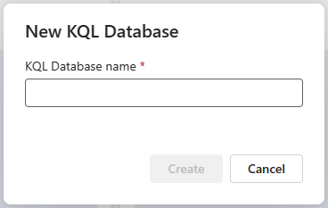
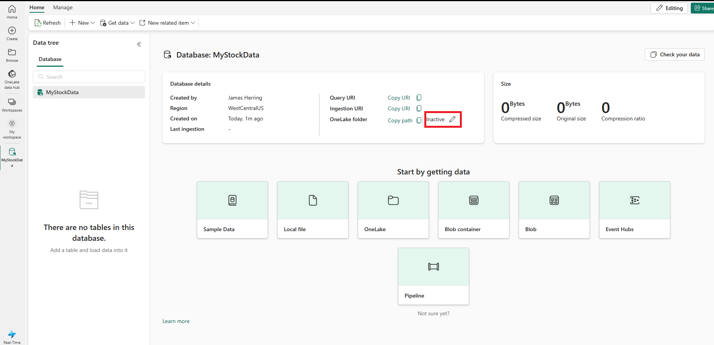
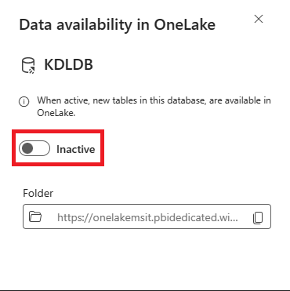

---
lab:
  title: 在 KQL 数据库中查询数据
  module: Query data from a Kusto Query database in Microsoft Fabric
---

# 在 Microsoft Fabric 中查询 Kusto 数据库入门

KQL 查询集是一种工具，可用于查询 KQL 数据库、修改和显示来自其中的查询结果。 可以将 KQL 查询集中的每个选项卡链接到不同的 KQL 数据库，并保存查询以供将来使用或与他人共享进行数据分析。 还可以更换任何选项卡的 KQL 数据库，以比较来自不同数据源的查询结果。

在此方案中，你是一名分析师，负责查询纽约市出租车行程原始指标的示例数据集，并从 Fabric 环境中拉取摘要统计（分析）数据。 你将使用 KQL 查询此数据并收集信息，以获取有关数据的信息化见解。

KQL 查询集使用 Kusto 查询语言（与许多 SQL 函数兼容）来创建查询。 详细了解 [kusto 查询 (KQL) 语言](https://learn.microsoft.com/en-us/azure/data-explorer/kusto/query/?context=%2Ffabric%2Fcontext%2Fcontext)。

完成本实验室大约需要 25 分钟。

> **注意**：需要 [Microsoft Fabric 试用版](https://learn.microsoft.com/fabric/get-started/fabric-trial) 才能完成本练习。

## 创建工作区

在 Fabric 中处理数据之前，创建一个已启用的 Fabric 试用版的工作区。

1. 在 [Microsoft Fabric 主页](https://app.fabric.microsoft.com)中，选择“实时分析”。****
1. 在左侧菜单栏中，选择“工作区”（图标类似于 &#128455;）。
1. 新建一个工作区并为其指定名称，并选择包含 Fabric 容量（试用版、高级版或 Fabric）的许可模式  。
1. 打开新工作区时，它应为空。

    

在本实验室中，你将在 Fabric 中使用实时分析 (RTA)，通过示例事件流创建 KQL 数据库。 实时分析 (RTA) 可以方便地提供一个示例数据集，供你用来探索 RTA 的功能。 你将使用此示例数据创建 KQL/SQL 查询和查询集，以分析实时数据，并在下游进程中用于其他用途。

## 创建 KQL 数据库

1. 在“实时分析”中，选择“KQL 数据库”框 。

   

1. 系统会提示为 KQL 数据库命名

   

1. 为 KQL 数据库指定一个你能记住的名称（如 **TaxiData**），然后按“创建”****。

1. 在“数据库详细信息”面板中，选择铅笔图标以在 OneLake 中打开可用性。

   

   然后使用滑块启用可用性。

   
   
1. 从“开始获取数据”的选项中选择“示例数据”框。**********

   

   然后从示例数据的选项中选择“汽车运营分析”框。

   

1. 完成数据加载后，我们可以验证 KQL 数据库是否已填充。

   

1. 加载完数据后，验证数据是否已加载到 KQL 数据库中。 要完成此操作，可以选择表右侧的省略号，导航到“查询表”，然后选择“显示任意 100 条记录”。********

    

   > 注意****：首次运行此功能时，可能需要几秒钟的时间来分配计算资源。


    

## Kusto 查询语言 (KQL) 及其语法简介

Kusto 查询语言 (KQL) 是用于分析 Microsoft Azure 数据资源管理器（Azure Fabric 的一部分）中数据的查询语言。 KQL 采用简单直观的设计，可方便初学者学习和使用。 同时，它还具有很高的灵活性和可自定义性，允许高级用户执行复杂的查询和分析。

KQL 基于与 SQL 类似的语法，但两者存在一些重要差异。 例如，KQL 使用管道运算符 (|) 而不是分号 (;) 来分隔命令，另外，它使用一组不同的函数和运算符来筛选和操作数据。

KQL 的重要功能之一是能够快速高效地处理大量数据。 此功能使它非常适合用于分析日志、遥测数据和其他类型的大数据。 KQL 还支持广泛的数据源（包括结构化和非结构化数据），因此成了全能型的数据分析工具。

在 Microsoft Fabric 的上下文中，KQL 可用于查询和分析来自各种源（例如应用程序日志、性能指标和系统事件）的数据。 这可以帮助你深入了解应用程序和基础结构的运行状况与性能，以及识别问题和优化时机。

总体而言，KQL 是一种强大且灵活的查询语言，无论你使用的是 Microsoft Fabric 还是其他数据源，它都可以帮助你快速轻松地深入了解数据。 凭借其直观的语法和强大的功能，KQL 值得用户进一步探索。

在本模块中，我们将重点介绍对 KQL 数据库进行查询的基础知识，先使用 KQL 来查询，然后再使用 T-SQL。 我们将重点介绍用于查询的 T-SQL 语法基本元素，包括：

**SELECT** 查询，用于从一个或多个表检索数据。 例如，可以使用 SELECT 查询来获取公司所有员工的姓名和工资。

**WHERE** 查询，用于根据特定的条件筛选数据。 例如，可以使用 WHERE 查询来获取在特定部门工作或工资高于特定金额的员工的姓名。

**GROUP BY** 查询，用于根据一列或多列对数据进行分组，并对其执行聚合函数。 例如，可以使用 GROUP BY 查询来根据部门或国家/地区获取员工的平均工资。

**ORDER BY**  查询，用于根据一列或多列按升序或降序对数据进行排序。 例如，可以使用 ORDER BY 查询来获取按工资或姓氏排序的员工姓名。

   > **警告：** 无法使用 **T-SQL** 从查询集创建 Power BI 报表，因为 Power BI 不支持 T-SQL 作为数据源。 **Power BI 仅支持 KQL 作为查询集的本机查询语言**。 如果你要使用 T-SQL 查询 Microsoft Fabric 中的数据，则需要使用可模拟 Microsoft SQL Server 并允许你对数据运行 T-SQL 查询的 T-SQL 终结点。 但是，T-SQL 终结点存在一些限制并与本机 SQL Server 有差别，而且它不支持创建报表或将报表发布到 Power BI。

> 注意****：除了前面所示的拉取查询窗口方法外，还可以在任何时候按下主 KQL 数据库面板中的“浏览数据”按钮...****

   

## 使用 KQL 对示例数据集中的数据运行 `SELECT`

1. 在此查询中，我们将从 Trips 表拉取 100 条记录。 我们使用 `take` 关键字来请求引擎返回 100 条记录。

    ```kusto
    
    Trips
    | take 100
    ```

    > **注意：** 竖线 `|` 字符在 KQL 中有两个用途，其中包括分隔表格表达式语句中的查询运算符。 它还用作方括号或圆括号中的逻辑 OR 运算符，表示可以指定一个由竖线字符分隔的项。

1. 我们可以做到更精确，使用 `project` 关键字添加我们想要查询的特定属性，然后使用 `take` 关键字告知引擎要返回多少条记录。

    > **注意：** 使用 `//` 表示在 Microsoft Fabric“***探索数据***”查询工具中使用的注释。

    ```kusto
    
    // Use 'project' and 'take' to view a sample number of records in the table and check the data.
    Trips 
    | project vendor_id, trip_distance
    | take 10
    ```

1. 分析中的另一个常见做法是重命名查询集中的列，以使其更方便用户识别。 为此，可以使用新的列名称，后接等号和我们要重命名的列。

    ```kusto
    
    Trips 
    | project vendor_id, ["Trip Distance"] = trip_distance
    | take 10
    ```

1. 我们还可以汇总行程数以查看行驶了多少英里：

    ```kusto
    
    Trips
    | summarize ["Total Trip Distance"] = sum(trip_distance)
    ```

## 使用 KQL 对示例数据集中的数据运行 `GROUP BY`

1. 然后，我们可以对使用 `summarize` 运算符得出的上车地点运行 `group by`。 我们还可以使用 `project` 运算符，这样就可以选择并重命名要包含在输出中的列。 在本例中，我们在纽约市出租车系统中按行政区进行分组，以便为用户提供从每个行政区出发的总行驶距离。

```kusto

Trips
| summarize ["Total Trip Distance"] = sum(trip_distance) by pickup_boroname
| project Borough = pickup_boroname, ["Total Trip Distance"]
```

1. 在此例中有一个空白值，这对分析永远是不利的，我们可以使用 `case` 函数以及 `isempty` 和 `isnull` 函数将它们归为“Unidentified”类别以供后续分析。

```kusto

Trips
| summarize ["Total Trip Distance"] = sum(trip_distance) by pickup_boroname
| project Borough = case(isempty(pickup_boroname) or isnull(pickup_boroname), "Unidentified", pickup_boroname), ["Total Trip Distance"]
```

## 使用 KQL 对示例数据集中的数据运行 `ORDER BY`

为了更好地理解数据，我们通常会按列进行排序，此过程是在 KQL 中使用 `sort by` 或 `order by` 运算符实现的，它们的作用相同。
 
```kusto

// using the sort by operators
Trips
| summarize ["Total Trip Distance"] = sum(trip_distance) by pickup_boroname
| project Borough = case(isempty(pickup_boroname) or isnull(pickup_boroname), "Unidentified", pickup_boroname), ["Total Trip Distance"]
| sort by Borough asc 

// order by operator has the same result as sort by
Trips
| summarize ["Total Trip Distance"] = sum(trip_distance) by pickup_boroname
| project Borough = case(isempty(pickup_boroname) or isnull(pickup_boroname), "Unidentified", pickup_boroname), ["Total Trip Distance"]
| sort by Borough asc 
```

## `WHERE` 子句用于筛选示例 KQL 查询中的数据

与 SQL 不同，KQL 查询中将会立即调用 `WHERE` 子句。 我们仍可以在 where 子句中使用 `and` 和 `or` 逻辑运算符，它会根据表计算为 true 或 false，并且可以构成涉及多个列、运算符和函数的简单或复杂表达式。

```kusto

// let's filter our dataset immediately from the source by applying a filter directly after the table.
Trips
| where pickup_boroname == "Manhattan"
| summarize ["Total Trip Distance"] = sum(trip_distance) by pickup_boroname
| project Borough = case(isempty(pickup_boroname) or isnull(pickup_boroname), "Unidentified", pickup_boroname), ["Total Trip Distance"]
| sort by Borough asc

```

## 使用 T-SQL 查询摘要信息

KQL 数据库并不原生支持 T-SQL，但它提供了一个可仿真 Microsoft SQL Server 并允许你对数据运行 T-SQL 查询的 T-SQL 终结点。 但是，T-SQL 终结点存在一些限制并与本机 SQL Server 有差别。 例如，它不支持创建、更改或删除表，也不支持插入、更新或删除数据。 另外，它不支持一些与 KQL 不兼容的 T-SQL 函数和语法。 创建该终结点的目的是使不支持 KQL 的系统能够使用 T-SQL 来查询 KQL 数据库中的数据。 因此，建议使用 KQL 作为 KQL 数据库的主要查询语言，因为它的功能比 T-SQL 多，性能也更好。 你还可以使用 KQL 支持的一些 SQL 函数，例如 count、sum、avg、min、max 等。 

## 使用 T-SQL 对示例数据集中的数据运行 `SELECT`

1. 在此查询中，我们使用 `TOP` 子句从 `Trips` 表拉取前 100 条记录。 

    ```sql
    // We can use the TOP clause to limit the number of records returned
    
    SELECT TOP 100 * from Trips
    ```

1. 如果你使用了 `//`（它是 KQL 数据库中“浏览数据”工具内的一个注释），则在执行 T-SQL 查询时你将无法突出显示它，而应该使用标准的 `--` SQL 注释表示法。****** 这个双连字符还会告知 KQL 引擎在 Azure 数据资源管理器中期待使用 T-SQL。

    ```sql
    -- instead of using the 'project' and 'take' keywords we simply use a standard SQL Query
    SELECT TOP 10 vendor_id, trip_distance
    FROM Trips
    ```

1. 同样，你会发现，标准 T-SQL 功能可与查询良好配合（在查询中，我们已将 trip_distance 重命名为更方便用户识别的名称）。

    ```sql
    
    -- No need to use the 'project' or 'take' operators as standard T-SQL Works
    SELECT TOP 10 vendor_id, trip_distance as [Trip Distance]
    from Trips
    ```

1. 我们还可以汇总行程数以查看行驶了多少英里：

    ```sql
    Select sum(trip_distance) as [Total Trip Distance]
    from Trips
    ```
     >注意：与 KQL 查询相比，T-SQL 中不需要使用引号，另请注意，`summarize` 和 `sort by` 命令在 T-SQL 中不可用。

## 使用 T-SQL 对示例数据集中的数据运行 `GROUP BY`

1. 然后，我们可以对使用 `GROUP BY` 运算符得出的上车地点运行 `group by`。 我们还可以使用 `AS` 运算符，这样就可以选择并重命名要包含在输出中的列。 在本例中，我们在纽约市出租车系统中按行政区进行分组，以便为用户提供从每个行政区出发的总行驶距离。

    ```sql
    SELECT pickup_boroname AS Borough, Sum(trip_distance) AS [Total Trip Distance]
    FROM Trips
    GROUP BY pickup_boroname
    ```

1. 在此例中有一个空白值，这对分析永远是不利的，我们可以使用 `CASE` 函数以及 `IS NULL` 函数和 `''` 空值将它们归为“Unidentified”类别以供后续分析。 

    ```sql
    
    SELECT CASE
             WHEN pickup_boroname IS NULL OR pickup_boroname = '' THEN 'Unidentified'
             ELSE pickup_boroname
           END AS Borough,
           SUM(trip_distance) AS [Total Trip Distance]
    FROM Trips
    GROUP BY CASE
               WHEN pickup_boroname IS NULL OR pickup_boroname = '' THEN 'Unidentified'
               ELSE pickup_boroname
             END;
    ```

## 使用 T-SQL 对示例数据集中的数据运行 `ORDER BY`

1. 为了更好地理解数据，我们通常会按列进行排序，此过程是在 T-SQL 中使用 `ORDER BY` 运算符实现的。 T-SQL 中没有“ORDER BY”运算符
 
    ```sql
    -- Group by pickup_boroname and calculate the summary statistics of trip_distance
    SELECT CASE
             WHEN pickup_boroname IS NULL OR pickup_boroname = '' THEN 'unidentified'
             ELSE pickup_boroname
           END AS Borough,
           SUM(trip_distance) AS [Total Trip Distance]
    FROM Trips
    GROUP BY CASE
               WHEN pickup_boroname IS NULL OR pickup_boroname = '' THEN 'unidentified'
               ELSE pickup_boroname
             END
    -- Add an ORDER BY clause to sort by Borough in ascending order
    ORDER BY Borough ASC;
    ```
    ## `WHERE` 子句用于筛选示例 T-SQL 查询中的数据
    
1. 与 KQL 不同，`WHERE` 子句会位于 T-SQL 语句的末尾；但在本例中，我们的 `GROUP BY` 子句要求我们使用 `HAVING` 语句，然后使用列的新名称（在本例中为“Borough”）作为要从中筛选的列名称。****

    ```sql
    -- Group by pickup_boroname and calculate the summary statistics of trip_distance
    SELECT CASE
             WHEN pickup_boroname IS NULL OR pickup_boroname = '' THEN 'unidentified'
             ELSE pickup_boroname
           END AS Borough,
           SUM(trip_distance) AS [Total Trip Distance]
    FROM Trips
    GROUP BY CASE
               WHEN pickup_boroname IS NULL OR pickup_boroname = '' THEN 'unidentified'
               ELSE pickup_boroname
             END
    -- Add a having clause due to the GROUP BY statement
    HAVING Borough = 'Manhattan'
    -- Add an ORDER BY clause to sort by Borough in ascending order
    ORDER BY Borough ASC;
    
    ```

## 清理资源

在本练习中，你已创建一个 KQL 数据库并设置了一个可供查询的示例数据集。 然后，使用 KQL 和 SQL 查询了数据。 如果已完成 KQL 数据库探索，可删除为本练习创建的工作区。
1. 在左侧栏中，选择你的工作区的图标。
2. 在工具栏上的“...”菜单中，选择“工作区设置”。
3. 在“常规”部分中，选择“移除此工作区”********。
