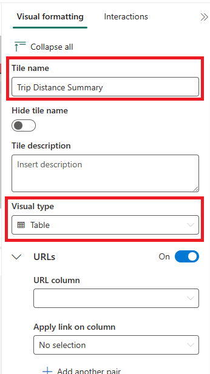

## *工作草稿
---
lab:
  title: 实时仪表板
  module: Query data from a Kusto Query database in Microsoft Fabric
---

# 在 Microsoft Fabric 中查询 Kusto 数据库入门

通过实时仪表板，可以使用 Kusto 查询语言 (KQL) 从 Microsoft Fabric 中收集见解，以检索结构化和非结构化数据，并在面板中以图表、散点图、表格等形式呈现这些数据，从而实现类似于 Power BI 中切片器的链接。 

完成本实验室大约需要 25 分钟。

> **注意**：需要 [Microsoft Fabric 试用版](https://learn.microsoft.com/fabric/get-started/fabric-trial) 才能完成本练习。

## 创建工作区

在 Fabric 中处理数据之前，创建一个已启用的 Fabric 试用版的工作区。

1. 在 [Microsoft Fabric 主页](https://app.fabric.microsoft.com)中，选择“实时分析”。****
1. 在左侧菜单栏中，选择“工作区”（图标类似于 &#128455;）。
1. 新建一个工作区并为其指定名称，并选择包含 Fabric 容量（试用版、高级版或 Fabric）的许可模式  。
1. 打开新工作区时，它应为空。

    

在本实验室中，你将在 Fabric 中使用实时分析 (RTA)，通过示例事件流创建 KQL 数据库。 实时分析 (RTA) 可以方便地提供一个示例数据集，供你用来探索 RTA 的功能。 你将使用此示例数据创建 KQL | SQL 查询和查询集，用于分析实时数据，并在下游进程中用于其他用途。

## 创建 KQL 数据库

1. 在“实时分析”中，选择“KQL 数据库”框 。

   

2. 系统会提示为 KQL 数据库命名

   

3. 为 KQL 数据库指定一个你能记住的名称（如 MyStockData），然后按“创建” 。

4. 在“数据库详细信息”面板中，选择铅笔图标以在 OneLake 中打开可用性。

   

5. 从“开始获取数据”的选项中选择“示例数据”框。**********
 
   

6. 从示例数据的选项中选择“汽车指标分析”框****。

   

7. 完成数据加载后，我们可以验证 KQL 数据库是否已填充。

   

7. 加载完数据后，验证数据是否已加载到 KQL 数据库中。 要完成此操作，可以选择表右侧的省略号，导航到“查询表”，然后选择“显示任意 100 条记录”。********

    

   > 注意****：首次运行此功能时，可能需要几秒钟的时间来分配计算资源。

    


## 方案
在此场景中，你将基于 Microsoft Fabric 提供的示例数据创建实时仪表板，使你能够以各种方法显示数据、创建变量并使用此变量将仪表板面板链接在一起，以便更深入地了解源系统中发生的情况。 在本模块中，我们使用 NY 出租车数据集查看按行政区等划分的当前行程详细信息。

1. 导航到“实时分析”，然后在 Fabric 主页上选择“实时仪表板” 。

    

1. 按“添加新磁贴”按钮。

```kusto

Trips
| summarize ["Total Trip Distance"] = sum(trip_distance) by pickup_boroname
| project Borough = case(isempty(pickup_boroname) or isnull(pickup_boroname), "Unidentified", pickup_boroname), ["Total Trip Distance"]
| sort by Borough asc 

```
3. 按“运行”按钮，验证查询没有错误****。
4. 在面板右侧，选择“视觉对象格式”选项卡，然后填写“磁贴名称”和“视觉对象类型”。

   

