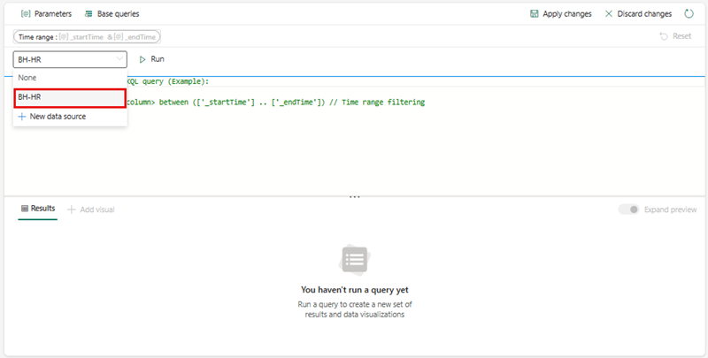
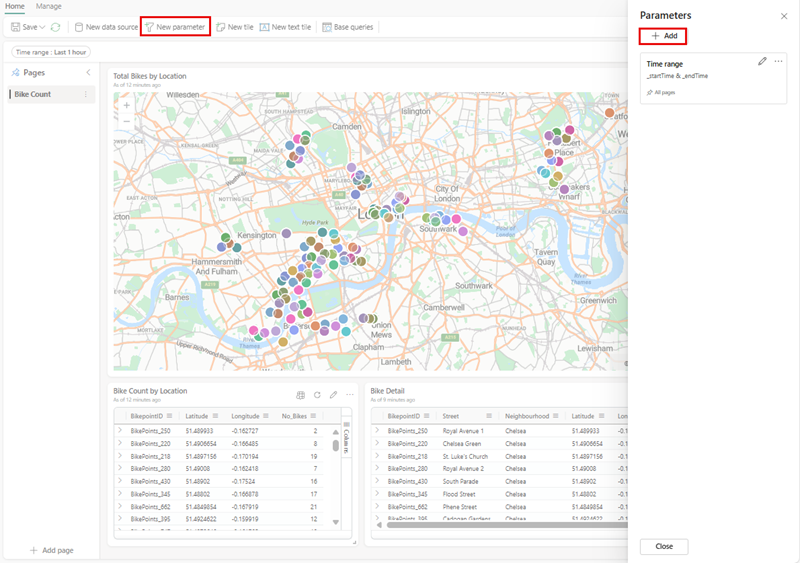

---
lab:
  title: Microsoft Fabric 中的实时仪表板
  module: Get Started with Real-Time Dashboards in Microsoft Fabric
---

# Microsoft Fabric 中的实时仪表板入门

通过实时仪表板，可以使用 Kusto 查询语言 (KQL) 从 Microsoft Fabric 中收集见解，以检索结构化和非结构化数据，并在面板中以图表、散点图、表格等形式呈现这些数据，从而实现类似于 Power BI 中切片器的链接。 

完成本实验室大约需要 25 分钟。

> **注意**：需要 [Microsoft Fabric 试用版](https://learn.microsoft.com/fabric/get-started/fabric-trial) 才能完成本练习。

## 创建工作区

在 Fabric 中处理数据之前，创建一个已启用的 Fabric 试用版的工作区。

1. 在 [Microsoft Fabric 主页](https://app.fabric.microsoft.com)中，选择“实时智能”。****
1. 在左侧菜单栏中，选择“工作区”（图标类似于 &#128455;）。
1. 使用所选名称创建一个新工作区，并选择包含 Fabric 容量的授权模式（试用、高级或 Fabric）  。 或者，也可以使用现有工作区生成实时仪表板。
1. 打开新工作区时，它应为空。

    

在本实验室中，你将使用 Fabric 中的实时智能创建实时仪表板。 实时智能提供了一个方便的示例数据集，可以用它来探索实时智能的功能。 你将使用此示例数据创建 KQL | SQL 查询和查询集，用于分析实时数据，并在下游进程中用于其他用途。

## 创建实时仪表板

1. 在“实时智能”内，选中“实时仪表板”框********。

   

2. 系统将提示你为实时仪表板命名****。

   

3. 为实时仪表板指定一个你能记住的名称（如基于主源的某个名称），然后按“创建”****。

4. 在“数据库详细信息”面板中，选择铅笔图标以在 OneLake 中打开可用性。

   [ ](./Images/real-time-dashboard-details-large.png#lightbox)

## 添加数据源

数据源充当对与实时仪表板位于同一工作区中的特定数据库或查询的可重用引用，因而各种磁贴能够利用不同的数据源来满足其数据需求。

1. 选择“管理”选项卡，然后在菜单栏上选择“新建数据源”**************。
1. 在“数据源”窗格中选择“+ 添加”按钮********。

    [  ](./Images/add-data-source-to-real-time-dashboard-large.png#lightbox)

1. 选择“OneLake 数据中心”和“Azure 数据资源管理器”两个主选项之一********。

    

1. 选择满足业务需求的数据源，然后选择“连接”按钮********。

    [  ](./Images/select-onelake-data-hub-large.png#lightbox)

    > 注意**** 连接到数据源后，你将能够进行确认并在所选位置内创建其他数据源。

1. 在“创建新数据源”窗格中确认数据源连接，然后选择“创建”************。

    [  ](./Images/conected-now-create-datasource-large.png#lightbox)

1. 此时，需要选择“第 n 页”右侧的省略号“...”，然后选择“重命名页面”以提供一个适合磁贴用法的名称************。
1. 选择“+ 添加磁贴”****

    [  ](./Images/rename-page-add-tile-large.png#lightbox)

1. 你将重定向到“磁贴查询窗格”，从中可添加参数并引入基本查询来支持磁贴****。 

    [  ](./Images/write-query-for-tile-large.png#lightbox)

    > 注意**** 可以选择在同一窗口的下拉窗口中添加新的数据源。 此源可能位于你的个人工作区中，也可能位于有另一个 KQL 数据库存储在你有权访问的 Evenhouse 内的任何工作区中。

## 编写查询

由于实时仪表板磁贴使用 Kusto 查询语言代码片段来检索数据和呈现视觉对象， 每个磁贴/查询可支持一个视觉对象。

1. 在每个磁贴内，都可以编写查询或从 Copilot 中粘贴查询（如果选择将它们固定到新磁贴或现有磁贴），然后根据需要进行修改****。 只需通过一个简单的查询，我们就可以创建根据自行车数量将大小用于地图的地图可视化效果。

```kusto

['Bike-count']
BikepointID, Latitude, Longitude, No_Bikes

```

## 创建可视化效果

对可视化效果感到满意后，只需选择“应用更改”，然后添加其他可视化效果来支持实时仪表板，或者执行其他步骤，如“参数”或“日程安排”************。

   [  ](./Images/create-visual-in-tiles-large.png#lightbox)

应用更改后，你将看到数据，然后可以进行调整以便于用户阅读和理解。

   [  ](./Images/first-published-visual-large.png#lightbox)

可以继续创建具有表信息和可视化效果信息的新磁贴，以便于社区用户理解****。 你还可以执行前面所述的“添加页面”、“新建数据源”操作********。 接下来，我们将重点添加一个参数，以帮助导航并减少向用户显示的信息量。

## 添加参数
参数可提高仪表板呈现的效率，并允许在查询过程中的最早阶段使用筛选器值。 在链接到磁贴的查询中包含参数会激活筛选功能。 可以跨仪表板使用参数，多个参数可以筛选基础可视化效果（包括表）中表示的数据。

创建参数一开始就很容易： 

1. 选择顶部菜单上的“新建参数”按钮。 “参数”窗格随即打开。
1. 在右窗格的顶部，选择“+ 添加”按钮。

    [  ](./Images/add-new-parameter-large.png#lightbox)

1. 为参数填充相关的属性。

    [  ](./Images/configure-parameter-large.png#lightbox)

1. 参数更为重要的一项功能是能够添加查询，为用户提供仅与基础信息相关的选项****。

    

1. 选择“完成”以创建参数。

    [  ](./Images/complete-parameter-settings-large.png#lightbox)

### 参数属性

| 字段            | 说明 |
|------------------|-------------|
| **标签**        | 参数的名称显示在仪表板或编辑卡上。 |
| **参数类型** | 以下类型之一： <ul><li>单选：只能在筛选器中选择一个值作为参数的输入。</li><li>多选：可在筛选器中选择一个或多个值作为参数的输入。</li><li>时间范围：允许创建附加参数以基于时间筛选查询和仪表板。 每个仪表板都有默认的时间范围选取器。</li><li>任意文本：允许用户在筛选字段中键入或粘贴值，而无需预先填充值，从而保留最近使用的值。</li></ul> |
| **描述**  | 参数的可选说明。 |
| **变量名称** | 查询中的参数所使用的名称。 |
| **Data type**    | 参数值表示的数据类型。 |
| **在页面上显示** | 将要显示参数的页面，其中包含用于选择所有页面的选项。 |
| **Source**       | 参数值的原点，可以是： <ul><li>固定值：手动输入的静态筛选器值。</li><li>查询：使用 KQL 查询引入的动态值。</li></ul> |
| **添加“全选”值** | 适用于单选和多选参数类型，此选项可检索所有参数值的数据，并且必须集成到查询中才能实现功能。 |
| **默认值** | 筛选器的默认值，该值在最初呈现仪表板时设置。 |

6. 确保向磁贴中的每个查询添加参数，然后选择“应用更改”****。

**KQL 查询之前**
```kusto
//Add the street parameter to each tile's query
['bike-count']
| where No_Bikes > 0
| project BikepointID, Latitude, Longitude, No_Bikes

```

**KQL 查询之后**
```kusto
//Add the street parameter to each tile's query
['bike-count']
| where No_Bikes > 0 and Street == street
| project BikepointID, Latitude, Longitude, No_Bikes

```
   [  ](./Images/update-each-query-large.png#lightbox)

## 启用自动刷新

自动刷新是一项功能，支持自动更新仪表板数据，而无需手动重新加载或按“刷新”按钮。 初始的自动刷新频率可由数据库编辑者配置。 编辑者和查看者都能够修改仪表板查看期间的实际自动刷新速率。 数据库编辑者有权确立最小刷新速率，以缓解群集上的过度负载。 设置此最小速率后，数据库用户将受到限制，无法选择低于指定最小值的刷新速率。 这可确保系统的性能得到保持，而不会使资源负担过重。

1. 选择“管理”选项卡 >“自动刷新”。

    [  ](./Images/enable-auto-refresh-large.png#lightbox)

1. 切换选项以启用“自动刷新”。
1. 为“最小时间间隔”和“默认刷新率”选择值 。
1. 选择“应用”，然后保存仪表板 。

    [  ](./Images/enable-and-configure-refresh-rate-large.png#lightbox)

## 清理资源

在本练习中，你已创建一个 KQL 数据库并设置了一个可供查询的示例数据集。 然后，使用 KQL 和 SQL 查询了数据。 如果已完成 KQL 数据库探索，可删除为本练习创建的工作区。
1. 在左侧栏中，选择你的工作区的图标。
2. 在工具栏上的“...”菜单中，选择“工作区设置”。
3. 在“常规”部分中，选择“删除此工作区”。********

