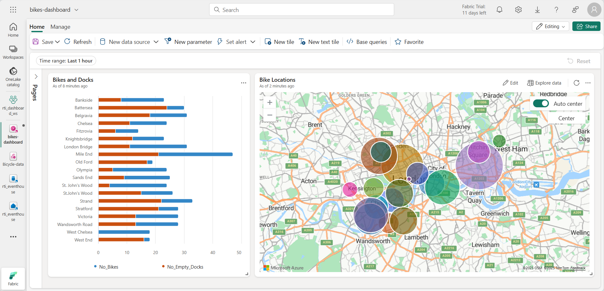

---
lab:
  title: Microsoft Fabric 中的实时仪表板入门
  module: Get started with Real-Time Dashboards in Microsoft Fabric
---

# Microsoft Fabric 中的实时仪表板入门

使用 Microsoft Fabric 中的实时仪表板，可以让你使用 Kusto 查询语言 (KQL) 可视化和浏览流数据。  在本练习中，你将了解如何基于实时数据源创建和使用实时仪表板。

完成本实验室大约需要 25 分钟。

> **备注**：你需要 [Microsoft Fabric 租户](https://learn.microsoft.com/fabric/get-started/fabric-trial)才能完成本练习。

## 创建工作区

在 Fabric 中处理数据之前，需要创建一个已启用 Fabric 容量的工作区。

1. 在 [Microsoft Fabric 主页](https://app.fabric.microsoft.com/home?experience=fabric) (`https://app.fabric.microsoft.com/home?experience=fabric`) 上，选择“**实时智能**”。
1. 在左侧菜单栏中，选择“工作区”（图标类似于 &#128455;）。
1. 新建一个工作区并为其指定名称，并选择包含 Fabric 容量（试用版、高级版或 Fabric）的许可模式  。
1. 打开新工作区时，它应为空。

    

## 创建 Eventhouse

现在，你已拥有工作区，可以开始创建实时智能解决方案所需的 Fabric 项。 首先，我们将创建一个事件库。

1. 在左侧菜单栏上，选择“**开始**”；然后在“实时智能”主页中，创建新的“**Eventhouse**”，为其指定所选的唯一名称。
1. 关闭显示的所有建议或提示，直到看到新的空事件屋。

    

1. 在左侧窗格中，请注意事件屋包含一个与事件屋同名的 KQL 数据库。
1. 选择要查看的 KQL 数据库。

## 创建事件流

目前数据库中没有表。 我们将使用事件流将数据从实时源加载到表中。

1. 在 KQL 数据库的主页中，选择“**获取数据**”。
2. 对于数据源，请选择“**Eventstream**” > “**新建 Eventstream**”。 将事件流命名为 `Bicycle-data`。

    

    只需片刻即可在工作区完成创建新事件流。 建立后，将自动重定向到为事件流选择数据源。

1. 选择“**使用示例数据**”。
1. 将该源命名为 `Bicycles`，并选择“**自行车**”示例数据。

    流将被映射，并且会自动显示在**事件流画布**上。

   

1. 在“**添加目标**”下拉列表中，选择“**事件库**”。
1. 在“**Eventhouse**”窗格中，配置以下设置选项。
   - **数据引入模式：** 引入前的事件处理
   - **目标名称：**`bikes-table`
   - **工作区：***选择在本练习开始时创建的工作区*
   - **Eventhouse**：*选择事件屋*
   - **KQL 数据库：***选择 KQL 数据库*
   - **目标表：** 创建名为 `bikes` 的新表
   - **输入数据格式：** JSON

   

1. 在“**Eventhouse**”窗格中，选择“**保存**”。 
1. 将 **Bicycles-data** 节点的输出连接到**自行车表**节点，然后选择“**发布**”。
1. 等待一分钟左右，让数据目标变为活动状态。 然后在设计画布中选择**自行车表**节点，然后查看下面的“**数据预览**”窗格，以查看已引入的最新数据：

   

1. 等待几分钟，然后使用“**刷新**”按钮刷新“**数据预览**”窗格。 流将永久运行，因此新数据可能已添加到表中。

## 创建实时仪表板

现在，已将实时数据流加载到事件库中的表中，可以使用实时仪表板将其可视化。

1. 在左侧菜单栏中，选择“**主页**”中心。 然后在主页上，创建名为 `bikes-dashboard` 的新**实时仪表板**。

    创建新的空仪表板。


    

1. 在工具栏中，选择“**新数据源**”并添加新的 **One Lake 数据中心**数据源。 然后选择事件库并使用以下设置创建新的数据源：
    - **显示名称**：`Bike Rental Data`
    - **数据库**：*事件库中的默认数据库*。
    - **直通标识**：*已选中*

1. 关闭“**数据源**”窗格，然后在仪表板设计画布上，选择“**添加磁贴**”。
1. 在查询编辑器中，确保已选择“**自行车租赁数据**”源，并输入以下 KQL 代码：

    ```kql
    bikes
        | where ingestion_time() between (ago(30min) .. now())
        | summarize latest_observation = arg_max(ingestion_time(), *) by Neighbourhood
        | project Neighbourhood, latest_observation, No_Bikes, No_Empty_Docks
        | order by Neighbourhood asc
    ```

1. 运行查询，该查询显示过去 30 分钟内每条街区观察到的自行车和空自行车停靠的数量。
1. 应用更改以查看仪表板磁贴中表中显示的数据。

   

1. 在磁贴上，选择“**编辑**”图标（看起来像铅笔）。 然后在“**视觉格式设置**”窗格中，设置以下属性：
    - **磁贴名称**：自行车和停靠
    - **视觉对象类型**：条形图
    - **视觉格式**：堆积条形图
    - **Y 列**：No_Bikes、No-Empty_Docks
    - **X 列**：邻里
    - **系列列**：推断
    - **图例位置**：底部

    编辑后的时间应如下所示：

   

1. 应用更改，然后调整磁贴的大小，以占据仪表板左侧的全部高度。

1. 在工具栏中，选择“**新建磁贴**”
1. 在查询编辑器中，确保已选择“**自行车租赁数据**”源，并输入以下 KQL 代码：

    ```kql
    bikes
        | where ingestion_time() between (ago(30min) .. now())
        | summarize latest_observation = arg_max(ingestion_time(), *) by Neighbourhood
        | project Neighbourhood, latest_observation, Latitude, Longitude, No_Bikes
        | order by Neighbourhood asc
    ```

1. 运行查询，该查询显示过去 30 分钟内每条街道观察到的自行车位置和数量。
1. 应用更改以查看仪表板磁贴中表中显示的数据。
1. 在磁贴上，选择“**编辑**”图标（看起来像铅笔）。 然后在“**视觉格式设置**”窗格中，设置以下属性：
    - **磁贴名称**：自行车位置
    - **视觉对象类型**：地图
    - **定义位置依据**：纬度和经度
    - **纬度列**：纬度
    - **经度列**：经度
    - **标签列**：邻里
    - **大小**：显示
    - **大小列**：No_Bikes

1. 应用更改，然后调整地图图块的大小，使其填满仪表板右侧的可用空间：

   

## 创建基础查询

仪表板包含两个基于类似查询的视觉对象。 为了避免重复并使仪表板更易于维护，可以将通用数据合并到单个*基本查询*中。

1. 在仪表板工具栏上，选择“**基础查询**”。 然后选择“+添加”。
1. 在基本查询编辑器中，将**变量名称**设置为 `base_bike_data`，并确保已选择“**自行车租赁数据**”源。 然后输入以下查询：

    ```kql
    bikes
        | where ingestion_time() between (ago(30min) .. now())
        | summarize latest_observation = arg_max(ingestion_time(), *) by Neighbourhood

1. Run the query and verify that it returns all of the columns needed for both visuals in the dashboard (and some others).

   

1. Select **Done** and then close the **Base queries** pane.
1. Edit the **Bikes and Docks** bar chart visual, and change the query to the following code:

    ```kql
    base_bike_data
    | project Neighbourhood, latest_observation, No_Bikes, No_Empty_Docks
    | order by Neighbourhood asc
    ```

1. 应用更改并验证条形图是否仍显示所有邻里的数据。

1. 编辑“**自行车位置**”地图视觉对象，并将查询更改为以下代码：

    ```kql
    base_bike_data
    | project Neighbourhood, latest_observation, No_Bikes, Latitude, Longitude
    | order by Neighbourhood asc
    ```

1. 应用更改并验证地图是否仍显示所有邻里的数据。

## 添加参数

仪表板当前显示所有社区的最新自行车、停靠和位置数据。 现在，让我们添加参数，以便你可以选择特定的邻里。

1. 在仪表板工具栏上的“**管理**”选项卡上，选择“**参数**”。
1. 请注意已自动创建的任何现有参数（例如*时间范围*参数）。 然后**删除**它们。
1. 选择“+ 添加”。
1. 添加一个参数，设置如下：
    - **标签：**`Neighbourhood`
    - 参数类型：多选
    - **说明**：`Choose neighbourhoods`
    - 变量名称：`selected_neighbourhoods`
    - **数据类型**：字符串
    - 在页面上显示：全选
    - 源：查询
    - **数据源**：自行车租赁数据
    - **编辑查询**：

        ```kql
        bikes
        | distinct Neighbourhood
        | order by Neighbourhood asc
        ```

    - **值列**：邻里
    - **标签列**：匹配值选择
    - **添加“全选”值**：*已选中*
    - **“全选”发送空字符串**：*已选中*
    - **自动重置为默认值**：已选择
    - **默认值**：全选

1. 选择“完成”以创建参数。

    添加参数后，需要修改基本查询，以基于所选临近区域筛选数据。

1. 在工具栏上，选择“**基础查询**”。 然后选择 **base_bike_data** 查询并对其进行编辑，在 **where** 子句中添加 **and** 条件，以便根据所选参数值进行筛选，如下代码所示：

    ```kql
    bikes
        | where ingestion_time() between (ago(30min) .. now())
          and (isempty(['selected_neighbourhoods']) or Neighbourhood  in (['selected_neighbourhoods']))
        | summarize latest_observation = arg_max(ingestion_time(), *) by Neighbourhood
    ```

1. 选择“**完成**”，保存基础查询。

1. 在仪表板中，使用**社区**参数根据所选邻里筛选数据。

   

1. 选择“**重置**”以删除所选参数筛选器。

## 添加页面

仪表板当前包含单个页面。 可以添加更多页面以提供更多数据。

1. 在仪表板左侧，展开“**页面**”窗格，然后选择“**+ 添加页**”。
1. 将新页命名为**第 2 页**。 然后选择它。
1. 在新页面上，选择“**+ 添加磁贴**”
1. 在新磁贴的查询编辑器中，输入以下查询：

    ```kql
    base_bike_data
    | project Neighbourhood, latest_observation
    | order by latest_observation desc
    ```

1. 应用更改。 然后调整磁贴的大小，使其填满仪表板的高度。

   

## 配置自动刷新

用户可以手动刷新仪表板，但在设定的时间间隔内自动刷新数据可能会很有用。

1. 在仪表板工具栏上的“**管理**”选项卡上，选择“**自动刷新**”。
1. 在“**自动刷新**”窗格中，配置以下设置：
    - **已启用**：*已选中*
    - **最小时间间隔**：允许所有刷新间隔
    - **默认刷新速率**：30 分钟
1. 应用自动刷新设置。

## 保存并共享仪表板

现在，你有一个有用的仪表板，你可以保存它并与其他用户共享。

1. 在仪表板工具栏上，选择“**保存**”。
1. 保存仪表板后，选择“**共享**”。
1. 在“**共享**”对话框中，选择“**复制链接**”，然后将仪表板的链接复制到剪贴板。
1. 打开新的浏览器选项卡，粘贴复制的链接以导航到共享仪表板。 如果出现提示，请使用 Fabric 凭据再次登录。
1. 浏览仪表板，使用它查看有关整个城市的自行车和空自行车停靠的最新信息。

## 清理资源

如果已浏览完仪表板，可删除为本练习创建的工作区。

1. 在左侧栏中，选择你的工作区的图标。
2. 在工具栏中，选择“**工作区设置**”。
3. 在“常规”部分中，选择“删除此工作区”。********
