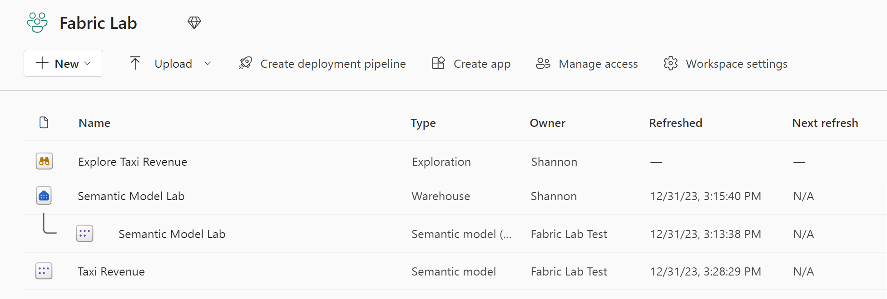

---
lab:
  title: 创建并浏览语义模型
  module: Understand scalability in Power BI
---

# 创建并浏览语义模型

在本练习中，你将使用 Microsoft Fabric 为数据仓库中的示例纽约市出租车数据开发数据模型。

你将练习：

- 从 Fabric 数据仓库创建自定义语义模型。
- 创建关系并组织模型图。
- 直接在 Fabric 中浏览语义模型中的数据。

完成本实验室大约需要 30 分钟。

> **注意**：需要 [Microsoft Fabric 试用版](https://learn.microsoft.com/fabric/get-started/fabric-trial) 才能完成本练习。

## 创建工作区

在 Fabric 中处理数据之前，创建一个已启用的 Fabric 试用版的工作区。

1. 在 [Microsoft Fabric 主页](https://app.fabric.microsoft.com)中，选择“Synapse 数据工程”。****
1. 在左侧菜单栏中，选择“工作区”（图标类似于 &#128455;）。
1. 新建一个工作区并为其指定名称，并选择包含 Fabric 容量（试用版、高级版或 Fabric）的许可模式  。
1. 打开新工作区时，它应为空。

## 创建数据仓库并加载示例数据

现已有了工作空间，可以创建数据仓库了。 “Synapse 数据仓库”主页包含创建新仓库的快捷方式：

1. 在“Synapse 数据仓库”主页中，使用所选的名称创建新的仓库 。

    大约一分钟后，一个新的仓库创建完成：
    
    

1. 在数据仓库用户界面的中心，你会看到几种将数据加载到仓库中的不同方法。 选择“示例数据”**** 可将纽约出租车数据加载到数据仓库中。 几分钟后即可创建完毕。

1. 加载示例数据后，请使用右侧的“资源管理器”**** 窗格查看示例数据仓库中已存在哪些表和视图。

1. 选择功能区的“报告”**** 选项卡，然后选择“新建语义模型”****。 这样你就能够仅使用数据仓库中的特定表和视图来创建新的语义模型，供数据团队和业务部门用来生成报表。

1. 将语义模型命名为“出租车收入”****，确保它位于刚创建的工作区中，然后选择以下表：
   - 日期
   - 旅行
   - 地域
   - 天气
     
   
     
## 在表之间创建关系

现在，你将在表之间创建关系以准确分析和可视化数据。 如果你熟悉在 Power BI Desktop 中创建关系，那么你会觉得这看起来很熟悉。

1. 导航回工作区，并确认你看到新的语义模型“出租车收入”。 请注意，项类型是“语义模型”****，而不是创建数据仓库时自动创建的“语义模型(默认)”****。

     *注意：在 Microsoft Fabric 中创建仓库或 SQL 分析终结点时，会自动创建默认语义模型，它从父湖屋或仓库继承业务逻辑。你自己创建的语义模型（正如我们在这里所创建的那样）是一个自定义模型，你可以根据自己的特定需求和偏好对其进行设计和修改。你可以使用 Power BI Desktop、Power BI 服务或连接到 Microsoft Fabric 的其他工具创建自定义语义模型。*

1. 选择“从功能区打开数据模型”****。
   
    现在，你将在表之间创建关系。 如果你熟悉在 Power BI Desktop 中创建关系，那么你会觉得这看起来很熟悉！

    回顾星型架构概念，我们需将模型中的表组织为事实数据表和维度表。** 在此模型中，“行程”**** 表是我们的事实数据表，我们的维度是“日期”****、“地理”**** 和“天气”****。

1. 使用 DateID**** 列在“日期”**** 表和“行程”**** 表之间创建关系。 选择“日期”表中的 DateID 列，然后将其拖放到“行程”表中的 DateID 列的顶部************。 也可从功能区中选择“管理关系”****，然后选择“新建关系”****。

1. 确保从“日期”**** 表到“行程”**** 表的关系是“一对多”**** 关系。

1. 重复上一步骤，从“地理”**** 和“天气”**** 维度创建与“行程”**** 事实数据表的关系。 另请确保这些关系是“一对多”****，即键在维度表中出现一次，而在事实数据表中出现多次。 

1. 将表拖动到适当的位置，以便“行程”事实数据表位于关系图的底部，而其余表（即维度表）位于事实数据表周围****。

    

    星型架构模型的创建现已完成。现在可以应用许多建模配置，例如添加层次结构、计算和设置列可见性等属性。

    > **提示**：在窗口的“属性”窗格中，将“将相关字段固定到卡片顶部”** 切换到“是”。 这将有助于你（以及此模型的其他报告人）一目了然地了解关系中正在使用哪些字段。 你还可以使用属性窗格与表中的字段交互。 例如，若要确认数据类型是否设置正确，可以选择一个字段并在属性窗格中查看格式。

     

## 浏览数据

现在，你有一个基于仓库构建的语义模型，该模型已建立进行报告所需的关系。 让我们使用“浏览数据”**** 功能来查看数据。

1. 导航回工作区并选择你的“出租车收入”语义模型****。

1. 在窗口中，从功能区选择“浏览此数据”****。 你将在此处查看表格格式的数据。 这提供了一种集中的体验来浏览数据，无需创建完整的 Power BI 报表。

1. 将 YearName**** 和 MonthName**** 添加到行中，然后浏览值字段中的“平均乘客数”****、“平均行程金额”**** 和“平均行程持续时间”****。

    将数字字段拖放到“浏览”窗格中时，它会默认设置为对数字进行汇总。** 若要将聚合从“汇总”**** 更改为“平均”****，请选择该字段并在弹出窗口中更改聚合。

    

1. 若要以视觉对象形式而不只是矩阵形式查看此数据，请选择窗口底部的“视觉对象”****。 选择条形图以快速可视化此数据。

   条形图并不是查看此数据的最佳方式。** 请在屏幕右侧“数据”窗格的“重新排列数据”部分尝试不同的视觉对象和字段。

1. 现在，你可以通过单击左上角的“保存”**** 按钮，将此“浏览”视图保存到工作区。 还可以通过选择右上角的“共享”**** 来共享**** 此视图。 这将使你能够与同事共享数据浏览结果。

1. 保存浏览结果后，请导航回工作区来查看数据仓库、默认语义模型、创建的语义模型以及浏览结果。

    

