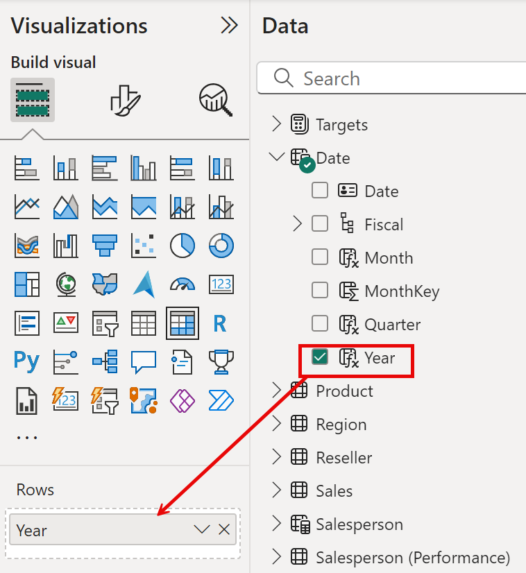
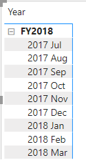
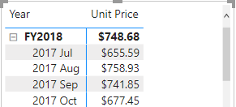
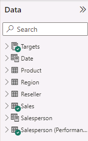

---
lab:
  title: 在 Power BI Desktop 中创建 DAX 计算
  module: Create DAX calculations in Power BI Desktop
---

# 在 Power BI Desktop 中创建 DAX 计算

## **实验室场景**

在本实验室中，使用数据分析表达式 (DAX) 创建计算表、计算列和简单的度量值。

本实验室介绍如何完成以下操作：

- 创建计算表
- 创建计算列
- 创建度量值

**此实验室应该大约需要 45 分钟。**

## 开始使用

若要完成本练习，请先打开 Web 浏览器并输入以下 URL 以下载 zip 文件夹：

`https://github.com/MicrosoftLearning/mslearn-fabric/raw/main/Allfiles/Labs/14/14-create-dax.zip`

将文件夹解压缩到 **C:\Users\Student\Downloads\14-create-dax** 文件夹。

打开 **14-Starter-Sales Analysis.pbix** 文件。

> ***备注**：可以通过选择“取消”**** 来取消登录。 关闭所有其他信息窗口。 如果系统提示应用更改，请选择“稍后应用”****。*

## 创建销售员计算表

在此任务中，创建与 Sales 有直接关系的 Salesperson 计算表 。

计算表的创建方式为，先输入表名称，后面依次跟等于号 (=) 和返回表的 DAX 公式。 表名称不能是数据模型中已有的。

编辑栏支持输入有效的 DAX 公式。 它包括自动完成、Intellisense 和颜色编码等功能，让你能够快速、准确地输入公式。

1. 在 Power BI Desktop 中，在“报表”视图的“建模”功能区上，选择“计算”组中的“新建表”。

     

2. 在编辑栏（在创建或编辑计算时在功能区正下方打开）中，键入“Salesperson =”，按 Shift+Enter，键入“Salesperson (Performance)”，然后按 Enter。

    > **备注**：*为方便起见，本实验室中的所有 DAX 定义都可以从位于 **14-create-dax\Snippets.txt** 中的片段文件中复制。*

     

    > 此表定义创建 Salesperson (Performance) 表的副本。它仅复制数据，但不复制如可见性、格式设置等模型属性。

1. 在**数据**窗格中，请注意，表图标前面还有另一个计算器图标（表示计算表）。

    

    > ***备注**：计算表是通过使用返回表的 DAX 公式来定义的。 请务必了解，计算表会增加数据模型的大小，因为它们会具体化和存储值。 每当刷新公式依赖项时，都会对其进行重新计算，就像将新（未来）日期值加载到表中时此数据模型的情况一样。*
    >
    > 与基于 Power Query 的表不同，计算表不能用于从外部数据源加载数据。它们只能根据已加载到数据模型中的内容来转换数据。

1. 切换到“模型”视图，请注意 Salesperson 表可用（可能需要重置视图以查找表）。

1. 创建从“Salesperson \| EmployeeKey”列到“Sales \| EmployeeKey”列的关系 。

1. 右键单击“Salesperson (Performance)”与“Sales”表之间的非活动关系，然后选择“删除”。 当看到确认删除的提示时，选择“是”。

1. 在“Salesperson”表中，选择以下列，然后将其隐藏（将“隐藏”属性设置为“是”）：

    - EmployeeID
    - EmployeeKey
    - UPN

1. 在模型图中，选择“Salesperson”表。

1. 在“属性”窗格的“说明”框中，输入：与销售额相关的销售员
    
    > 回想一下，当用户将光标悬停在表或字段上时，描述将显示为“数据”窗格中的工具提示。**

1. 对于“Salesperson (Performance)”表，将说明设置为：销售人员与一个或多个区域相关

数据模型现在会在分析销售人员时提供两种替代方案。 *“Salesperson”表可便于分析销售人员的销售额，而“Salesperson (Performance)”表则可便于分析分配给销售人员的一个或多个销售区域中的销售额。 *

## 创建“Date”表

在此任务中，你将创建“Date”表。

1. 切换到表视图。 在“主页”功能区选项卡上，选择“计算”组中的“新建表”。

    

1. 在公式栏中，输入以下 DAX：

    ```DAX
    Date =  
    CALENDARAUTO(6)
    ```

    

    > CALENDARAUTO() 函数返回一个由日期值组成的单列表。 *“自动”行为扫描所有数据模型日期列，以确定存储在数据模型中的最旧和最新日期值。* 然后，它为此范围内的每个日期都创建一行，并在两个方向上扩展此范围，以确保存储全年的数据。
    >
    > 此函数可以采用一个可选参数，该参数表示一年的最后一个月。*如果省略，则值为“12”，表示 12 月是一年的最后一个月。* 在此示例中，输入“6”，表示 6 月是一年的最后一个月。

1. 请注意日期值列，该列使用美国区域设置（即月/日/年）进行格式设置。

    

1. 在左下角的状态栏中，我们注意到表统计信息确认生成了 1826 行数据，这代表五个全年的数据。

    

## 创建计算列

在此任务中，添加其他列，以支持按不同时间段进行筛选和分组。 你还将创建一个计算列来控制其他列的排序顺序。

> **备注**：*为方便起见，本实验室中所有 DAX 定义都可以从 Snippets.txt**** 文件中复制。*

1. 在“表工具”关联功能区上，选择“计算”组中的“新建列”。

    > 计算列的创建方式为：先输入列名，后面依次是等号 (=) 和返回单值结果的 DAX 公式。该列名不能已存在于表中。

    

1. 在公式栏中键入以下内容（或从代码片段文件中复制），然后按 Enter：
    > 此公式使用日期的年份值，但如果月份是在 6 月后，则会在年份值上加 1。这就是 Adventure Works 会计年度的计算方式。

   ```DAX
   Year =
   "FY" & YEAR('Date'[Date]) + IF(MONTH('Date'[Date]) > 6, 1)
   ```


1. 使用代码片段文件定义为“Date”表创建以下两个计算列：

    - Quarter
    - 月

1. 验证是否已添加新列。

    

1. 若要验证计算，请切换到“报表”视图。

1. 若要创建新的报表页，请选择“第 1 页”旁边的加号图标。

    

1. 若要将矩阵视觉对象添加到新的报表页，请在“可视化效果”窗格中选择矩阵视觉对象类型。

    > *提示：* 可以将光标悬停在每个图标上，以查看描述视觉对象类型的工具提示。

    

1. 在“数据”窗格中，从“Date”表内，将“Year”字段拖入“行”井/区域中   。

    

1. 将“Month”字段拖入“Year”字段正下方的“行”井/区域。

1. 在矩阵视觉对象的右上角（或底部，取决于视觉对象的位置），选择“叉状双箭头”图标（可将所有年份向下展开一个级别）。

    

1. 我们注意到，年份展开到月份，月份是按字母顺序排序，而不是按时间顺序排序。

    

    > *默认情况下，文本值按字母顺序排序，数字按从小到大的顺序排序，日期按从早到晚的顺序排序。*

1. 要自定义“月份”**** 字段排序顺序，请切换到“表”视图。

1. 将“MonthKey”列添加到“Date”表中。

    ```DAX
    MonthKey =
    (YEAR('Date'[Date]) * 100) + MONTH('Date'[Date])
    ```

    > *此公式会为每个年份/月份组合计算一个数值。*

1. 在“表”视图中，验证新列是否包含数值（例如，201707 表示 2017 年 7 月等）。

    

1. 切换回“报表”视图。 在“数据”**** 窗格中，选择“月份”****。

1. 在“列工具”关联功能区上，选择“排序”组中的“按列排序”，然后选择“MonthKey”。

    

1. 在矩阵视觉对象中，我们注意到，月份现在按时间顺序排序。

    

## 完成“Date”表

在此任务中，你将通过隐藏列和创建层次结构来完成“Date”表的设计。 然后，你将创建与“Sales”和“Targets”表的关系。

1. 切换到“模型”视图。 在“Date”表中，隐藏“MonthKey”列（将“隐藏”设置为“是”）。

1. 在“数据”右侧窗格中，选择 Date 表，右键选择“Year”列，然后选择“创建层次结构”   。

1. 右键选择“重命名”，将新创建的层次结构重命名为“Fiscal” 。

1. 通过在“数据”窗格中选择其余两个字段，右键单击，选择“添加到层次结构”“Fiscal”，将其添加到“Fiscal”层次结构。  -> 

    - Quarter
    - Month

    

1. 创建以下两个模型关系：

    - 从“Date \| Date”到“Sales \| OrderDate”
    - 从“Date \| Date”到“Targets \| TargetMonth”


    > *实验室使用速记表示法引用字段。它将如下所示：Sales \| Unit Price。在此示例中，Sales 是表名称，Unit Price 是字段名称。 *

1. 隐藏以下两列：

    - Sales \| OrderDate
    - Targets \| TargetMonth

## 标记日期表

在此任务中，你将把“Date”表标记为日期表。

1. 切换到“报表”视图。 在“数据”窗格中，选择“Date”表（不是“Date”字段）。

1. 在**表工具**上下文功能区上，从**日历**组中选择**标记为日期表**。

1. 在**标记为日期表**窗口中，将**标记为日期表**属性滑动到**是**，然后在**选择日期列**下拉列表中选择**日期**。 选择“保存”。

    

1. 保存 Power BI Desktop 文件。

> *Power BI Desktop 现在理解此表可定义日期（时间）。这种日期表设计方法适用于数据源中没有日期表的情况。如果有数据仓库，应该从其日期维度表（而不是数据模型中的“重新定义”日期逻辑）中加载日期数据。*

## 创建简单的度量值

在此任务中，你将创建简单的度量值。 简单的度量值聚合单个列中的值或对表中的行进行计数。

1. 在“报表”视图“第 2 页”上的“数据”窗格中，将“Sales \| Unit Price”字段拖到矩阵视觉对象。

    

1. 在“视觉对象字段”窗格（位于“可视化效果”**** 窗格之下）的“值”**** 字段井/区域，注意“单价”**** 已作为“平均单价”**** 列出。 选择“Unit Price”的向下箭头，然后注意可用的菜单选项。

    

    > 借助可见数值列，报表作者可以在设计报表时确定汇总（或不汇总）列值的方式。这可能会生成不当的报表。但是某些数据建模人员不喜欢碰运气，他们选择隐藏这些列，而不是公开度量值中定义的聚合逻辑。这就是你要在本实验室中采用的方法。

1. 若要创建度量值，请在“数据”窗格中右键单击“Sales”表，然后选择“新建度量值”。

1. 在编辑栏中，添加以下度量值定义：

    ```DAX
    Avg Price =  
    AVERAGE(Sales[Unit Price])
    ```

1. 将 **Avg Price** 测量值添加到可视矩阵中，注意到它生成的结果与 **Unit Price** 列相同（但格式不同）。

1. 在“值”井中，打开“Avg Price”字段的上下文菜单，可以注意到无法更改聚合技术 。

    

    > 无法修改度量值的聚合行为。

1. 使用代码片段文件定义为“Sales”表创建以下五个度量值：

    - Median Price
    - Min Price
    - Max Price
    - Orders
    - Order Lines

    > “Orders”度量值中使用的 DISTINCTCOUNT() 函数只会对订单进行一次计数（忽略重复项）。*“Order Lines”度量值中使用的 COUNTROWS() 函数对表执行运算。*
    >
    > 在此示例中，订单数是通过统计非重复“SalesOrderNumber”列值来计算的，而订单行数则就是表行数（每行都是一个订单行）。**

1. 切换到“模型”视图，然后选择四个价格度量值：“Avg Price”、“Max Price”、“Median Price”和“Min Price”。

11. 对于选择的多个度量值，配置以下要求：

    - 将格式设置为两位小数

    - 分配到名为“Pricing”的显示文件夹

    

12. 隐藏“Unit Price”列。

    > 报表作者现在无法使用“Unit Price”列。*他们必须使用你添加到模型中的定价度量值。* 这种设计方法可确保报表作者不会以不当的方式对价格进行聚合（例如，通过对价格进行求和）。

13. 同时选择“Order Lines”和“Orders”度量值并配置以下要求：

    - 设置使用千位分隔符的格式

    - 分配到名为“Counts”的显示文件夹

    

14. 在“报表”视图中，在矩阵视觉对象的“值”井/区域中，选择“Unit Price”字段的“X”以将其移除  。

15. 增加矩阵视觉对象的大小，以占满报表页的宽度和高度。

16. 在“矩阵”视觉对象中添加以下五个新度量值：

    - Median Price
    - Min Price
    - Max Price
    - Orders
    - Order Lines

17. 验证结果是否合理，以及格式是否正确。

    

## 创建其他度量值

在此任务中，创建使用更复杂表达式的其他度量值。

1. 在“报表”视图中，选择“第 1 页”并查看表视觉对象，注意“Target”列的总计 。

    

1. 选择表视觉对象，然后在“可视化效果”窗格中，删除“Target”字段。

1. 将“Targets \| Target”列重命名为“Targets \| TargetAmount” 。

    > 提示：有多种方法可以在“报表”视图中重命名列：在“数据”窗格中，右键单击相应的列，然后选择“重命名”；或双击相应的列；或按 F2*  *。

1. 在“Targets”表上创建以下度量值：

    ```DAX
    Target =
    IF(
    HASONEVALUE('Salesperson (Performance)'[Salesperson]),
    SUM(Targets[TargetAmount])
    )
    ```

    > HASONEVALUE() 函数测试是否在“Salesperson”列中筛选出单个值。*如果为 true，则表达式返回目标额总和（仅针对此销售人员）。* 如果为 false，则返回 BLANK。

1. 将“Target”度量值的格式设置为没有小数位。

    > *提示：* 可以使用“度量值工具”上下文功能区。

1. 隐藏“TargetAmount”列。

    > 提示：在“数据”窗格中，可以右键单击该列，然后选择“隐藏”* *。

1. 将“Target”度量值添加到表视觉对象。

1. 我们注意到，“Target”列总计现在为 BLANK。

    

1. 使用代码片段文件定义为“Targets”表创建以下两个度量值：

    - Variance
    - Variance Margin

1. 将“Variance”度量值的格式设置为没有小数位。

1. 将“Variance Margin”度量值的格式设置为，有两位小数的百分比。

1. 将“Variance”和“Variance Margin”度量值添加到表视觉对象。

1. 重设表视觉对象的大小，以便查看所有列和行。

    

    > *虽然看上去所有销售员都未达到目标，但请记住，尚未按特定时间段对表视觉对象进行筛选。*

1. 在“数据”窗格的右上角，折叠后展开，以打开此窗格。

    > 折叠并重新打开此窗格会重置内容。

1. 我们注意到，“Targets”表现在显示在列表的最上面。

    

    *只包含可见度量值的表会自动在列表的最上面列出。*

## 实验已完成
