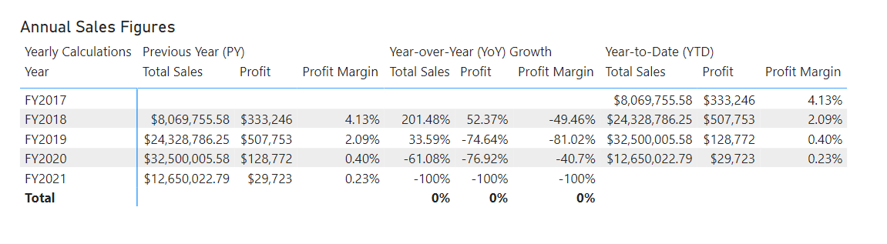
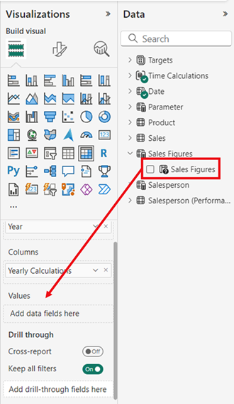

---
lab:
  title: 设计可缩放语义模型
  module: Design scalable semantic models
---

# 设计可缩放语义模型

在本练习中，将使用 DAX 函数来提高数据模型的灵活性和效率，特别是通过计算组和字段参数等功能。 通过结合使用这些功能，无需多个视觉对象或复杂的 DAX 表达式即可创建交互式报表，从而创建高度灵活且可缩放的语义模型。

在本练习中，你将学习如何：

- 使用用于修改关系行为的 DAX 函数。
- 创建计算组并将其应用于动态时间智能计算。
- 创建字段参数以动态选择和显示不同的字段和度量值。

完成本实验室大约需要 30 分钟。

## 开始之前

1. 从 `https://github.com/MicrosoftLearning/mslearn-fabric/raw/main/Allfiles/Labs/15/15-scalable-semantic-models.zip` 下载“[销售分析入门文件](https://github.com/MicrosoftLearning/mslearn-fabric/raw/main/Allfiles/Labs/15/15-scalable-semantic-models.zip)”，并保存到本地。

2. 将文件夹解压缩到 **C:\Users\Student\Downloads\15-scalable-semantic-models** 文件夹中。

3. 打开 **15-Starter-Sales Analysis.pbix** 文件。

    > 忽略并关闭要求应用更改的任何警告 - 不要选择“*放弃更改*”。

## 使用关系

在本任务中，将打开预先开发的 Power BI Desktop 解决方案来了解数据模型。 然后，你将探索活动模型关系的行为。

1. 在 Power BI Desktop 左侧，切换到“模型”视图。

    

2. 使用模型关系图查看模型设计。

    

3. 请注意，Date 表和 Sales 表之间存在三种关系 。

    

    > “**日期**”表中的“**日期**”列是表示关系“一”端的唯一列。 应用于“**日期**”表的任何列的筛选器使用其中一个关系传播到“**销售额**”表。*

4. 将光标悬停在这三个关系中的每一个上，以突出显示 Sales 表中的“多”侧列。

5. 请注意，“**OrderDate**”和“**日期**”之间存在活动关系。 当前模型设计指示“**日期**”表为角色扮演维度。 此维度可以扮演订单日期、截止日期或装运日期的角色。 具体角色取决于报表的分析要求。

> 稍后我们将使用 DAX 使用这些非活动关系，而无需创建另一个表来获取不同日期列的两个活动关系。

### 按日期可视化销售数据

在此任务中，将按年可视化销售总额，并使用非活动关系。

1. 切换到“报表”视图。

    

2. 若要添加表视觉对象，请在“可视化效果”窗格中选择“表”视觉对象图标 。

    

3. 若要向表视觉对象添加列，请在“数据”窗格（位于右侧）中，首先展开 Date 表 。

4. 将“**年**”列拖放到表视觉对象中。

5. 展开以打开 **Sales** 表，然后将 **Total Sales** 列拖放到表视觉对象中。

6. 查看表视觉对象。


> 表视觉对象显示按年分组的“**销售总额**”列的总和。 但“**年**”意味着什么？ 由于“**日期**”表和“**销售额**”表与“**OrderDate**”列之间存在活动关系，因此“**年**”表示下订单的会计年度。

### 使用非活动关系

在此任务中，将使用 `USERELATIONSHIP` 函数来激活非活动关系。

1. 在“数据”窗格中，右键单击 Sales 表，然后选择“新建度量值”  。

    

2. 在编辑栏（位于功能区下方）中，将文本替换为以下度量值定义，然后按 Enter。

    ```DAX
    Sales Shipped =
    CALCULATE (
    SUM ('Sales'[Sales]),
    USERELATIONSHIP('Date'[Date], 'Sales'[ShipDate])
    )
    ```

    > 此公式使用 CALCULATE 函数修改筛选器上下文。 USERELATIONSHIP 函数使 **ShipDate** 关系处于活动状态，仅用于此度量值。

3. 将“Sales Shipped”度量值添加到表视觉对象。

4. 扩大表视觉对象，使所有列都完全可见。 请注意，“**总计**”行相同，但“**销售总额**”和“**已发货销售额**”中每年的销售额不同。 这种差异是由于在给定年份收到订单，而仅在次年发货，甚至尚未发货。


> 创建临时将关系设置为活动的度量值是处理角色扮演维度的一种方法。 但是，当需要为许多度量值创建角色扮演版本时，可能会变得繁琐。 例如，如果有 10 个与销售相关的度量值和 3 个角色扮演日期，这可能意味着创建 30 个度量值。 使用计算组创建它们可以简化该过程。

## 创建计算组

在此任务中，将为时间智能分析创建一个计算组。

1. 切换到“模型”视图。

2. 在“模型”视图中，选择“**计算组**”以创建新的计算组表、组列和项。 如果弹出警告窗口，请选择“**是**”以确认创建计算组。

   

    > 备注：隐式度量值发生在“报表”视图中，直接在视觉对象中使用数据窗格中的数据列。 视觉对象允许将其聚合为 SUM、AVERAGE、MIN、MAX 或其他一些基本聚合，这将成为隐式度量值。 创建计算组后，Power BI Desktop 将不再创建隐式度量值，这意味着必须显式创建度量值来聚合数据列。

3. 将计算组重命名为“*时间计算*”，并将计算列重命名为“*年度计算*”。

4. 在“**数据**”窗格的“**模型**”选项卡中，选择使用计算组自动创建的计算项。

5. 将项的公式替换为以下内容并提交：

    ```DAX
   Year-to-Date (YTD) = CALCULATE(SELECTEDMEASURE(), DATESYTD('Date'[Date]))
    ```

6. 右键单击“**计算项**”字段，然后选择“**新建计算项**”。

7. 对新项使用以下 DAX 公式：

    ```DAX
   Previous Year (PY) = CALCULATE(SELECTEDMEASURE(), PREVIOUSYEAR('Date'[Date]))
    ```

8. 使用以下 DAX 公式创建第三个项：

    ```DAX
   Year-over-Year (YoY) Growth = 
   VAR MeasurePriorYear =
   CALCULATE(
       SELECTEDMEASURE(),
       SAMEPERIODLASTYEAR('Date'[Date])
   )
   RETURN
   DIVIDE(
       (SELECTEDMEASURE() - MeasurePriorYear),
       MeasurePriorYear
   )
    ```

最后一个计算项应仅以百分比形式返回值，因此需要动态格式字符串来更改其影响度量值的格式。

9. 在 YoY 项的“**属性**”窗格中，启用“**动态格式字符串**”功能。

10. 在 DAX 公式栏中，验证左侧的字段是否设置为“**格式**”，并编写以下格式字符串：`"0.##%"`

11. 确认计算组是否如下所示：

    

### 将计算组应用于度量值

在此任务中，将可视化计算项如何影响视觉对象中的度量值。

1. 切换到“报表”视图。

2. 在画布底部，选择“**概述**”选项卡。

3. 选择在画布中创建的矩阵视觉对象，并将“**年度计算**”计算列从“**数据**”窗格拖动到“**可视化效果**”窗格中的“**列**”字段。

    

4. 请注意，现在矩阵为每个计算项提供了一组销售数字。 

   

> 一次在一个视觉对象中拥有所有这些信息可能很难阅读，因此，一次将视觉对象限制为一个销售数字会很方便。 为此，可以使用字段参数。

## 创建字段参数

在此任务中，将创建字段参数来更改视觉对象。

1. 选择顶部功能区中的“**建模**”选项卡，然后展开“**新建参数**”按钮并选择“**字段**”。

    

2. 在“参数”窗口中，将参数重命名为“**销售数字**”，验证是否选中了“**向此页面添加切片器**”选项，并从“**销售额**”表中添加以下字段：

   - 总销售额
   - Profit
   - Profit Margin
   - 订单

    

3. 选择**创建**。

4. 创建切片器后，可以选择矩阵并从“可视化效果”窗格的“**值**”中移除所有字段，并改为添加“销售数字”字段参数。

    

5. 检查切片器中的不同销售数字，以及选择每个数字时矩阵的变化情况。

6. 请参阅如何使用“销售数字”字段参数的切片器选择“利润”字段。 这与上面的矩阵相同，因此可以看到三个计算项目（PY、YoY、YTD），但由于使用了切片器，因此只适用于利润。

    

### 编辑字段参数

在本任务中，将通过直接修改“**销售数字**”字段参数的 DAX 表达式来对其进行编辑。

1. 选择画布底部的“**销售员业绩**”选项卡。 请注意簇状条形图，用于在”按月销售额“和”按月目标“之间切换图表。

    > 创建书签按钮时，可以使用每个选项更改视觉对象类型，如果需要在多个度量值之间进行切换，则必须为每个度量值创建书签按钮，这可能会非常耗时。 相反，我们可以将字段参数与要分析的所有度量值一起使用，并在它们之间快速切换。

    

2. 选择条形图视觉对象，并将 **X 轴**中的“**总销售额**”字段替换为“**销售数字**”字段参数。

3. 创建“**切片器**”视觉对象，并将“**销售数字**”参数拖动到“**字段**”区域。

对于此视觉对象，仍需按月份评估目标，该目标不在字段参数中。

4. 在“数据”窗格中选择“**销售数字**”参数，并在参数的 DAX 表达式中添加“目标”字段，如下所示：

    ```DAX
   Sales Figures = {
    ("Total Sales", NAMEOF('Sales'[Total Sales]), 0),
    ("Profit", NAMEOF('Sales'[Profit]), 1),
    ("Profit Margin", NAMEOF('Sales'[Profit Margin]), 2),
    ("Orders", NAMEOF('Sales'[Orders]), 3),
    ("Target", NAMEOF('Targets'[Target]), 4)
   }
    ```

5. 提交更改并验证视觉对象在选择不同的销售数字时是否发生更改。

6. 删除书签按钮，并观察报表页的最终状态。

    

## 实验已完成

完成练习后，请关闭 Power BI Desktop - 无需保存文件。
