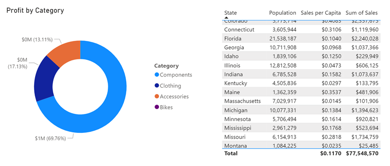

---
lab:
  title: 创建可重用的 Power BI 资产
  module: Create reusable Power BI assets
---

# 创建可重用的 Power BI 资产

在本练习中，你将创建可重用的资产，以支持语义模型和报表的开发。 这些资产包括 Power BI 项目和模板文件以及共享语义模型。 最后，世系视图将展示这些项目在 Power BI 服务中如何相互关联。

   > 备注：本练习不需要 Fabric 许可证，可以在 Power BI 或 Microsoft Fabric 环境中完成。

完成此练习大约需要 30 分钟。

## 准备工作

开始本练习之前，需要打开 Web 浏览器并输入以下 URL 以下载 zip 文件夹：

`https://github.com/MicrosoftLearning/mslearn-fabric/raw/refs/heads/main/Allfiles/Labs/16b/16-reusable-assets.zip`

将文件夹解压缩到 **C:\Users\Student\Downloads\16-reusable-assets** 文件夹。

## 创建新的 Power BI 项目

在此任务中，将报表另存为 Power BI 项目文件 (.pbip)**。 Power BI 项目文件将报表和语义模型详细信息存储在使用源代码管理的平面文件中。 可以使用 Visual Studio Code 来修改这些文件或使用 Git 来跟踪更改。

1. 在 16-reusable-assets 文件夹中，打开 16-Starter-Sales Analysis.pbix 文件。********

1. 选择“**文件**” > “**选项和设置**” > “**选项**” > “**预览功能**”，然后选择“**使用 TMDL 格式存储语义模型**”选项和“**确定**”。

    > 这样就可以选择使用表格模型定义语言 (TMDL) 来保存语义模型，目前这是一项预览功能。 如果系统提示重启 Power BI Desktop，请在继续此练习之前执行此操作。

    

1. 选择“另存为”，并在命名文件时通过选择下拉菜单中的箭头来选择文件类型。****

1. 选择扩展名为 **.*.pbip** 的文件，输入报表名称，并保存到易于记忆的文件夹中。

    

1. 请注意，在 Power BI Desktop 窗口顶部，报表名称旁边有 **（Power BI 项目）**。

1. 再次**保存**文件。

### 查看 Power BI 项目文件详细信息

让我们看看 Power BI Desktop 中的更改如何反映在 .tmdl 文件中。

1. 在桌面上，使用文件资源管理器导航到保存 **pbip**.** 文件的文件夹。
1. 应会看到以下项：

    - YourReport.pbip 文件
    - YourReport.Report 文件夹
    - YourReport.SemanticModel 文件夹
    - .gitignore Git 忽略源文件

## 向报表添加新表

在此任务中，你将添加新表，因为语义模型没有所需的所有数据。

1. 在 Power BI Desktop 中，导航到“**获取数据 > Web**”以添加新数据。

1. 连接后，“来自 Web”对话框将弹出。 将“基本”单选按钮保持为选中状态****。 输入以下文件路径作为 URL 路径。

    `C:\Users\Student\Downloads\16-reusable-assets\us-resident-population-estimates-2020.html`

1. 选择“**HTML 表 > 表 2**”的框，然后选择“**转换数据**”以继续。

    

1. 将打开新的 Power Query 编辑器窗口，其中包含表 2 数据预览。
1. 将**表 2** 重命名为“*美国人口*”。
1. 将 STATE 重命名为“**州**”，将 NUMBER 重命名为“**人口**”。
1. 删除 RANK 列。
1. 选择“**关闭并应用**”，将转换后的数据加载到语义模型。
1. 如果显示“*潜在安全风险*”对话框，请选择“**确定**”。
1. **保存**您的文件。
1. 如果出现提示，“**请勿升级**”到 Power BI 报表增强格式。

### 创建关系

在此任务中，我们将对 Power BI Desktop 中的报表进行更改，并查看平面 .tmdl 文件中的更改。

1. 在文件资源管理器中，找到 ***YourReport* SemanticModel** 文件夹。
1. 打开定义文件夹并注意不同的文件。
1. 在记事本中打开 **relationships.tmdl** 文件，请注意其中列出了 9 种关系。 关闭  文件。
1. 返回 Power BI Desktop，导航到功能区中的“**建模**”选项卡。
1. 选择“**管理关系**”，请注意有 9 种关系。
1. 创建新关系如下：
    - **自**：经销商，以州/省为键列
    - **至**：美国人口，以州为键列
    - **基数**：多对一 (*:1)
    - **交叉筛选器方向**：双向

    

1. **保存**您的文件。
1. 重新检查 **relationships.tmdl** 文件，并注意已添加新关系。

> 平面文件中的这些更改在源代码管理系统中可跟踪，这与二进制的 *.pbix* 文件不同。

## 向报表添加度量值和视觉对象

在此任务中，你将添加度量值和视觉对象来扩展语义模型并使用视觉对象中的度量值。

1. 在 Power BI Desktop 中，导航到“数据”窗格并选择“销售”表。
1. 在上下文“表工具”功能区上选择“**新建度量值**”。
1. 在公式栏中，输入并提交以下代码：

    ```DAX
    Sales per Capita =
    DIVIDE(
        SUM(Sales[Sales]),
        SUM('US Population'[Population])
    )
    ```

1. 找到新的“**人均销售额**”度量值，并将其拖到画布上。
1. 将“**销售 \| 销售**”、“**美国人口 \| 州**”和“**美国人口 \| 人口**”字段拖到同一视觉对象。

   > *实验室使用速记表示法引用字段。它将如下所示：Sales \| Unit Price。在此示例中，Sales 是表名称，Unit Price 是字段名称。 *

1. 选择视觉对象并将其更改为“**表**”。
1. 请注意“人均销售额”和“人口数据”的格式不一致。
1. 选择“数据”窗格中的每个字段，并更改格式和小数位数。
    - 人均销售额：货币 \| 小数点后 4 位
    - 人口：整数 \| 逗号分隔 \| 小数点后 0 位

    

    > 提示：如果不小心在错误的表中创建了度量值，可以轻松更改主表，如上图所示。

1. 保存您的文件。

> 表应如下图所示，其中包含四列，并且数字格式正确。


## 配置 Power BI 模板 (.pbit) 文件

在此任务中，你将创建一个模板文件，以便与其他人共享轻量级文件，从而更好地进行协作。

1. 转到 Power BI Desktop 功能区上的“插入”选项卡，然后选择“**图像**”。 导航到下载文件夹并选择 `AdventureWorksLogo.jpg` 文件。
1. 将此图像置于左上角。
1. 选择一个新视觉对象并向其添加“**销售 \| 利润**”和“**产品 \| 类别**”。

    > 我们在下面的屏幕截图中使用了环形图。

    

1. 请注意，图例中有 4 种不同的颜色。
1. 导航到功能区中的“**视图**”选项卡。
1. 选择“**主题**”旁边的箭头以展开并查看所有选项。
1. 选择其中一个“**辅助主题**”，将其应用于此报表。

    > 这些主题是专门为更便于报表查看者访问而创建的。

1. 再次展开“主题”，然后选择“**自定义当前主题**”。

    

1. 在“自定义主题”窗口中，导航到“**文本**”选项卡。将每个部分的字体系列更改为 Segoe UI 字体。

    

1. 完成后，“**应用**”更改。
1. 请注意应用了新主题的视觉对象中的不同颜色。

    

1. 选择“**文件 > 另存为**”以创建 *.pbit* 文件。
1. 将文件类型更改为 *.pbit*，并将其保存在与 *.pbip* 文件相同的位置。
1. 输入用户使用此模板时可以期待的内容的描述，然后选择“确定”。
1. 返回到文件资源管理器并打开 *.pbit* 文件，查看它是否与 *.pbip* 文件看起来完全相同。

    > 在本练习中，我们只需要标准报表主题模板，而无需语义模型。

1. 在同一个新文件中，从画布中删除两个视觉对象。
1. 在主页功能区上选择“**转换数据**”。
1. 在 Power Query 编辑器中，选择“**美国人口**”查询，然后右键单击将其删除。
1. 选择功能区中的“数据源设置”，删除“**DirectQuery 到 AS - Power BI 语义模型**”数据源，然后“**关闭**”。
1. **关闭并应用**
1. 导航回“主题”，查看修改后的“辅助主题”是否仍应用于报表。
1. 另外，请注意“数据”窗格中的“*你尚未加载任何数据*”消息。
1. “**另存为**”*.pbit* 文件，并使用与之前相同的名称来覆盖该文件。
1. 关闭无标题文件，无需保存。 仍应打开其他 *.pbip* 文件。

> 现在，你有了一个具有一致主题的模板，没有任何预加载的数据。

### 查看最终状态

在此任务中，你将查看以下屏幕截图，了解在本练习中执行的任务的最终结果。 为实现此状态，你已创建 Power BI 项目文件并将其发布到工作区。 然后，导航到 Power BI 服务中的工作区，并切换到“世系视图”****，查看新报表如何依赖于其他数据源。

从左到右，依次可见以下项目：

- 数据源：两个文本/CSV 文件和一个 SQL Server 连接。
- 16-Starter-Sales Analysis 语义模型，已连接至数据源。
- 16-Starter-Sales Analysis 报表，连接到 16-Starter-Sales Analysis 语义模型。
- 我的新报表语义模型已与 16-Starter-Sales Analysis 语义模型连接。
- 我的新报表已连接到“我的新报表”语义模型。

> 当语义模型相互关联时，这称为**链式连接**。 在此实验室中，初学者语义模型链接到新创建的语义模型，使其能够重复用于专门的用途。


## 清理

你已成功完成此练习。 你创建了 Power BI 项目和模板文件，以及专用语义模型和报表。 可以安全地删除工作区和所有本地资产。
