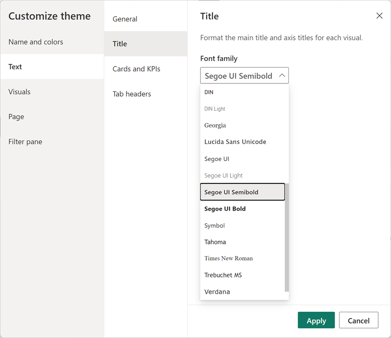
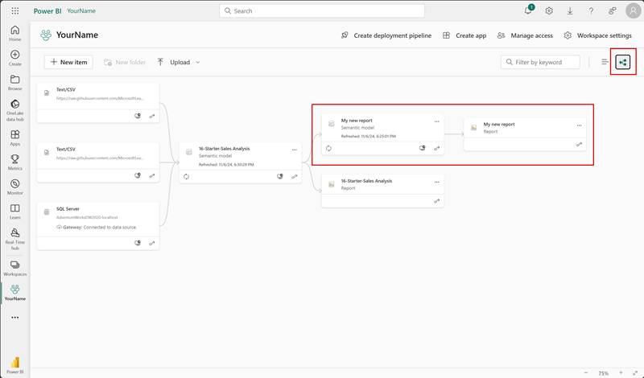

---
lab:
  title: 创建可重用的 Power BI 资产
---

# 创建可重用的 Power BI 资产

在本练习中，你将创建可重用的资产来支持语义模型和报表开发。 这些资产包括 Power BI 项目和模板文件以及共享语义模型。 最后，你将了解这些项目在 Power BI 服务中如何相互关联的世系视图。

   > 备注：本练习不需要 Fabric 许可证，可以在 Power BI 或 Microsoft Fabric 环境中完成。

完成此练习大约需要 30 分钟。

## 准备工作

开始本练习之前，需要打开 Web 浏览器并输入以下 URL 以下载 zip 文件夹：

`https://github.com/MicrosoftLearning/mslearn-fabric/raw/Main/Allfiles/Labs/16b/16-reusable-assets.zip`

将文件夹解压缩到 **C:\Users\Student\Downloads\16-reusable-assets** 文件夹。

## 将报表发布到 Power BI 服务

在此任务中，你将使用现有报表创建共享语义模型，以便重复使用以开发其他报表。

1. 在 Web 浏览器中，导航并登录到 Fabric 服务：[https://app.fabric.microsoft.com](https://app.fabric.microsoft.com)
1. 导航到 Power BI 体验，使用所选名称创建一个新的工作区。

    

1. 在新工作区的顶部功能区中，选择“**上传 > 浏览**”。
1. 在新文件资源管理器对话框中，导航到并选择初学者 *.pbix* 文件，然后选择“**打开**”以上传。
1. 请注意，工作区中现在有两个不同的项，名称相同：

    - 报告
    - 语义模型

1. 打开报表并注意使用的颜色主题。 *你将在稍后的任务中更改此设置。*
1. 可以关闭 Web 浏览器。

> Power BI *.pbix* 文件包含语义模型和报表视觉对象。 将报表发布到服务时，这些项是分离的。 稍后将再次看到此分离。

## 创建新的 Power BI 项目

在此任务中，你将通过连接到已发布的语义模型来创建报表，并将其另存为 Power BI 项目文件 (*.pbip*)。 Power BI 项目文件将报表和语义模型详细信息存储在使用源代码管理的平面文件中。 可以使用 Visual Studio Code 修改这些文件或 Git 来跟踪更改。

1. 从桌面打开 Power BI Desktop 应用并创建一个空白报表。

    > 出现提示时，请使用 Fabric 服务中使用的同一帐户登录。

1. 选择“**文件**” > “**选项和设置**” > “**选项**” > “**预览功能**”，然后选择“**使用 TMDL 格式存储语义模型**”选项和 **“确定**”。

    > 这使此选项能够使用表格模型定义语言 (TMDL) 保存语义模型，TMDL 目前是预览功能。

1. 如果系统提示重启 Power BI Desktop，请在继续练习之前执行此操作。

    

1. 选择“**另存为**”命名文件时，通过选择下拉菜单中的箭头选择文件类型。
1. 选择 ***.pbip*** 文件扩展名，然后为报表选择名称，并保存在便于记住的文件夹中。

    

1. 请注意，在 Power BI Desktop 窗口顶部，报表名称旁边有 **（Power BI 项目）**。
1. 在“主页”功能区中，导航到“**获取数据 > Power BI 语义模型**”以连接到已发布的语义模型。

    

1. 连接后，应在“数据”窗格中看到 9 个表。
1. 再次**保存**文件。

### 查看 Power BI 项目文件详细信息

让我们看看 Power BI Desktop 中的更改如何反映在 .tmdl 文件中。

1. 在桌面上，使用文件资源管理器导航到保存 *.* pbip** 文件的文件夹。
1. 应会看到以下项：

    - YourReport.*.pbip* 文件
    - YourReport.Report 文件夹
    - YourReport.SemanticModel 文件夹
    - .gitignore Git 忽略源文件

## 向报表添加新表

在此任务中，你将添加新表，因为语义模型没有所需的所有数据。

1. 在 Power BI Desktop 中，导航到“**获取数据 > Web**”以添加新数据。
1. 请注意需要 DirectQuery 连接的消息。 选择“**添加本地模型**”以继续操作。
1. 新的对话框将显示数据库和表供你选择。 选择全部并**提交**。

    > 语义模型被视为 SQL Server Analysis Server 数据库。

1. 连接后，“来自 Web”对话框将弹出。 保持选中“基本”单选按钮。 输入以下文件路径作为 URL 路径。

    `"C:\Users\Student\Downloads\16-reusable-assets\us-resident-population-estimates-2020.html"`

1. 选择“**HTML 表 > 表 2**”的框，然后选择“**转换数据**”以继续。

    

1. 将打开新的 Power Query 编辑器窗口，其中将显示表 2 数据预览。
1. 将**表 2** 重命名为“*US Population*”。
1. 将 STATE 重命名为“**State**”，将 NUMBER 重命名为“**Population**”。
1. 删除 RANK 列。
1. 选择“**关闭并应用**”，将转换后的数据加载到语义模型。
1. 如果显示“*潜在安全风险*”对话框，请选择“**确定**”。
1. **保存**您的文件。
1. 如果出现提示， **请勿升级到** Power BI 报表增强格式。

### 查看 Power BI 项目文件详细信息

在此任务中，我们将对 Power BI Desktop 中的报表进行更改，并查看平面 .tmdl 文件中的更改。

1. 在文件资源管理器中，找到***YourReport* SemanticModel** 文件夹。
1. 打开定义文件夹并注意到不同的文件。
1. 在记事本中打开 **relationships.tmdl** 文件，请注意其中列出了 9 种关系。 关闭  文件。
1. 在 Power BI Desktop 中，导航到功能区上的“**建模**”选项卡。
1. 选择“**管理关系**”，请注意有 9 种关系。
1. 创建新关系如下：
    - **自**：经销商，以州/省为键列
    - **至**：美国人口，以州为键列
    - **基数**：多对一 (*:1)
    - **交叉筛选器方向**：双向

    

1. **保存**您的文件。
1. 重新检查 **relationships.tmdl** 文件，并注意到已添加新关系。

> 平面文件中的这些更改在源代码管理系统中可跟踪，这与二进制的 *.pbix* 文件不同。

## 向报表添加度量值和视觉对象

在此任务中，你将添加度量值和视觉对象来扩展语义模型并使用视觉对象中的度量值。

1. 在 Power BI Desktop 中，导航到“数据”窗格并选择“销售”表。
1. 在上下文表工具功能区上选择“**新建度量值**”。
1. 在公式栏中，输入并提交以下代码：

    ```DAX
    Sales per Capita =
    DIVIDE(
        SUM(Sales[Sales]),
        SUM('US Population'[Population])
    )
    ```

1. 找到新的**人均销售额**度量值，并将其拖到画布上。
1. 将“**销售 \| 销售**”、“**美国人口 \| 状态**”和“**美国人口 \| 人口**”字段拖到同一视觉对象。

   > *实验室使用速记表示法引用字段。它将如下所示：Sales \| Unit Price。在此示例中，Sales 是表名称，Unit Price 是字段名称。 *

1. 选择视觉对象并将其更改为“**表**”。
1. 请注意人均销售额和人口数据的格式不一致。
1. 选择“数据”窗格中的每个字段，并更改格式和小数位数。
    - 人均销售额：货币 \| 4 位小数位数
    - 人口：整数 \| 逗号分隔 \| 0 位小数

    

    > 提示：如果在错误的表中意外创建度量值，可以轻松更改主表，如上图所示。

1. 保存您的文件。

> 表应如下图所示，其中包含四列并且数字格式正确。


## 配置 Power BI 模板 (.pbit) 文件

在此任务中，你将创建一个模板文件，以便与其他人共享轻型文件，从而更好地协作。

1. 转到 Power BI Desktop 功能区上的“插入”选项卡，然后选择“**图像**”。 导航至 downloads 文件夹，选择 `AdventureWorksLogo.jpg` 文件。
1. 将此图像置于左上角。
1. 选择一个新视觉对象并向其添加“**销售 \| 利润**”和“**产品 \| 类别**”。

    > 我们在下面的屏幕截图中使用了圆环图。

    

1. 请注意，图例中有 4 种不同的颜色。
1. 导航到功能区中的“**视图**”选项卡。
1. 选择“**主题**”旁边的箭头以展开并查看所有选项。
1. 选择其中一个“**辅助主题**”，将其应用于此报表。

    > 这些主题是专门创建的，更易于报表查看者访问。

1. 再次展开“主题”，然后选择“**自定义当前主题**”。

    

1. 在“自定义主题”窗口中，导航到“**文本**”选项卡。将每个部分的字体系列更改为 Segoe UI 字体。

    

1. **应用**完成后的更改。
1. 请注意应用了新主题的视觉对象中的不同颜色。

    

1. 选择“**文件 > 另存为**”以创建 *.pbit* 文件。
1. 将文件类型更改为 *.pbit*，并将其保存在与 *.pbip* 文件相同的位置。
1. 输入用户使用此模板时可能期望的内容的说明，然后选择“确定”。
1. 返回到文件资源管理器并打开 *.pbit* 文件，查看它是否与 *.pbip* 文件看起来完全相同。

    > 在本练习中，我们只需要标准报表主题模板，而无需语义模型。

1. 在此同一个新文件中，从画布中删除两个视觉对象。
1. 在主页功能区上选择“**转换数据**”。
1. 在Power Query 编辑器中，选择**美国人口**查询，然后右键单击将其删除。
1. 选择功能区中的数据源设置，删除“**DirectQuery 到 AS - Power BI 语义模型**”数据源，然后**关闭**。
1. **关闭并应用**
1. 导航回“主题”，查看已修改的辅助主题是否仍应用于报表。
1. 另请注意在“数据”窗格中的“*尚未加载任何数据*”的消息。
1. **另存为** *.pbit* 文件，文件名与之前用来覆盖文件的名称相同。
1. 关闭无标题文件，无需保存。 仍应打开其他 *.pbip* 文件。

> 现在，有一个具有一致主题的模板，没有任何预加载的数据。

## 发布和浏览资产

在此任务中，你将发布 Power BI 项目文件，并使用服务中的世系视图查看相关项。

> 重要说明：我们在添加 HTML 数据源时创建了本地 DirectQuery 模型。 已发布的报表需要网关才能访问本地数据，因此会收到错误。 这不会影响此任务的值，但可能会令人困惑。

1. 在 Power BI 项目文件中，选择“**发布**”。
1. 如果系统提示，请**保存**文件。
1. 如果系统提示，**请勿升级***PBIR* 版本。
1. 选择在本练习开始时创建的工作区。
1. 当收到文件已发布但已断开连接的消息时，请选择 **Open 'YourReport.*.pbip*' in Power BI**。

    

1. 进入工作区后，可以看到以前的语义模型和报表，以及新的语义模型和报表。
1. 在“工作区设置”下面的右角，选择“**世系视图**”以查看新报表如何依赖于其他数据源。

    

> 当语义模型与其他语义模型相关时，称为“链接”。 在此实验室中，初学者语义模型链接到新创建的语义模型，以实现专用用途的重复使用。

## 清理

你已成功完成此练习。 你创建了 Power BI 项目和模板文件，以及专用语义模型和报表。 可以安全地删除工作区和所有本地资产。
