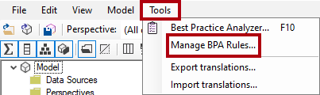
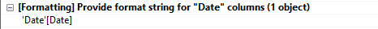
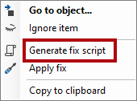
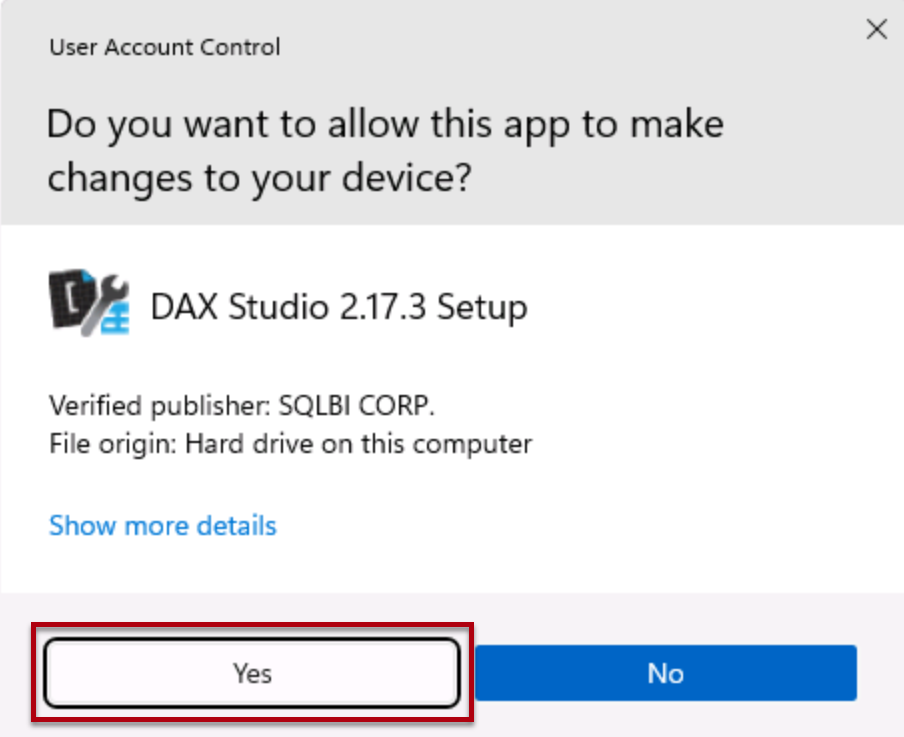
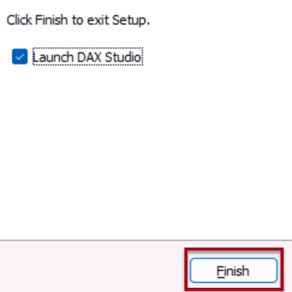

---
lab:
  title: 使用工具优化 Power BI 性能
  module: Optimize enterprise-scale tabular models
---

# 使用工具优化 Power BI 性能

## 概述

完成实验室预计需要花费 30 分钟

在本实验室中，你将了解如何使用两个外部工具来帮助开发、管理并优化数据模型和 DAX 查询。

本实验室中介绍了如何使用：

- 表格编辑器中的最佳做法分析器 (BPA)。

- DAX Studio。

## 开始使用

在本实验室中，你将安装和使用表格编辑器和 DAX Studio 来优化语义模型。

## 使用最佳做法分析器

在本练习中，你将安装表格编辑器 2 并加载最佳做法分析器 (BPA) 规则。 你将查看 BPA 规则，然后解决在数据模型中发现的具体问题。

*BPA 是一款免费的第三方工具，可提醒你潜在的建模错误或可作出哪些更改来改进模型设计和性能。它包括关于命名、用户体验和常用优化的建议，你可以应用这些建议来提高性能。有关详细信息，请参阅[提高模型性能的最佳做法规则](https://powerbi.microsoft.com/blog/best-practice-rules-to-improve-your-models-performance/)。*

### 下载并安装表格编辑器 2

下载并安装表格编辑器 2 才能创建计算组。

重要说明：******如果已在 VM 环境中安装了表格编辑器 2，请继续执行下一个任务。

表格编辑器是一个替代工具，可用于创作 Analysis Services 和 Power BI 的表格模型。表格编辑器 2 是一个开源代码项目，可以在不访问模型中的任何数据的情况下编辑 BIM 文件。

1. 确保关闭 Power BI Desktop。

1. 在 Microsoft Edge 中，导航到表格编辑器发布页。

    ```https://github.com/TabularEditor/TabularEditor/releases```

1. 向下滚动到“资产”部分，然后选择 TabularEditor.Installer.msi 文件 。 该操作将启动文件安装。

1. 完成后，选择“打开文件”以运行安装程序。

1. 在“表格编辑器安装程序”窗口中，选择“下一步”。

1. 在“许可协议”步骤中，如果同意，请选择“我同意”，然后选择“下一步”  。

1. 在“选择安装文件夹”步骤中，选择“下一步” 。

1. 在“应用程序快捷方式”步骤中，选择“下一步” 。

1. 在“确认安装”步骤中，选择“下一步” 。

    如果出现提示，请选择“是”以允许应用进行更改**。

1. 安装完成后，选择“关闭”。

    表格编辑器现已安装，并注册为 Power BI Desktop 外部工具。

### 设置 Power BI Desktop

在此任务中，你将打开预先开发的 Power BI Desktop 解决方案。

1. 从 `https://aka.ms/fabric-optimize-starter` 下载“销售分析入门文件“，并将其保存到你能记住的位置。[](https://aka.ms/fabric-optimize-starter)

1. 导航到所下载的文件并在 Power BI Desktop 中打开它。

1. 选择“外部工具”功能区选项卡。

    

1. 请注意，可以从此功能区选项卡启动表格编辑器。

    

    在本练习的后面部分，你将通过表格编辑器来使用 BPA。

### 查看数据模型

在此任务中，你将查看数据模型。

1. 在 Power BI Desktop 左侧，切换到“模型”视图。

    

2. 使用模型关系图查看模型设计。

    

    该模型包含八个维度表和一个事实数据表。Sales 事实数据表存储销售订单详细信息。这是一种典型的星型架构设计，其中包括表示产品维度的雪花维度表（“类别”>“子类别” > “产品”）** 。

    在本练习中，你将使用 BPA 检测模型问题并修复它们。

### 加载 BPA 规则

在此任务中，你将加载 BPA 规则。

在表格编辑器安装过程中不会添加 BPA 规则。必须下载并安装它们。

1. 在“外部工具”功能区上，选择“表格编辑器”。

    

    表格编辑器在新窗口中打开，并实时连接到 Power BI Desktop 中托管的数据模型。保存在表格编辑器中对模型所做的更改之前，这些更改不会传播到 Power BI Desktop。

2. 若要加载 BPA 规则，请选择“C# 脚本”选项卡。

    注意：在旧版表格编辑器中，可能将其称为“高级脚本编写”选项卡。

    

3. 粘贴到以下脚本中。

    ```csharp
    System.Net.WebClient w = new System.Net.WebClient(); 

    string path = System.Environment.GetFolderPath(System.Environment.SpecialFolder.LocalApplicationData);
    string url = "https://raw.githubusercontent.com/microsoft/Analysis-Services/master/BestPracticeRules/BPARules.json";
    string downloadLoc = path+@"\TabularEditor\BPARules.json";
    w.DownloadFile(url, downloadLoc);
    ```

4. 若要运行脚本，请在工具栏上选择“运行脚本”命令。

    

    若要使用 BPA 规则，必须关闭并重新打开表格编辑器。

5. 关闭表格编辑器。

6. 若要重新打开表格编辑器，在 Power BI Desktop 的“外部工具”功能区上选择“表格编辑器” 。

    

### 查看 BPA 规则

在此任务中，你将查看在上一个任务中加载的 BPA 规则。

1. 在表格编辑器的菜单中，选择“工具” > “管理 BPA 规则” 。

    

2. 在“管理最佳做法规则”窗口的“规则集合”列表中，选择“针对本地用户的规则”  。

    

3. 在“集合中的规则”列表中，向下滚动规则列表。

    提示：可以拖动右下角以放大窗口。

    在几秒钟内，表格编辑器可以根据每个规则扫描整个模型，并提供关于所有满足每个规则中的条件的模型对象的报告。

4. 请注意，BPA 将规则分组为不同的类别。

    一些规则（如 DAX 表达式）侧重于性能优化，而其他规则（如格式设置规则）以美学为导向。

5. 查看“严重性”列。

    数字越大，该规则就越重要。

6. 滚动到列表底部，然后取消选中“在非属性列上将 IsAvailableInMdx 设置为 false”规则。

    

    你可以禁用单个规则或整个规则类别。BPA 不会根据你的模型检查禁用的规则。删除此特定规则是为了向你演示如何禁用规则。

7. 选择“确定”。

    

### 解决 BPA 问题

在此任务中，你将打开 BPA 并查看检查结果。

1. 在菜单上，选择“工具” > “最佳做法分析器”（或按 F10）  。

    

2. 在“最佳做法分析器”窗口中，根据需要使该窗口最大化。

3. 查看（可能的）问题的列表（按类别分组）。

4. 在第一个类别中，右键单击“Product”表，然后选择“忽略项” 。

    

    当某个问题不是一个真正的问题时，可以忽略该项。可随时通过使用工具栏上的“显示忽略项”命令显示忽略项**。

5. 继续查看列表，在“使用 DIVIDE 函数进行除法运算”类别中，右键单击“[Profit Margin]”，然后选择“转到对象”  。

    

    此命令切换到表格编辑器，并重点关注对象。这样可以轻松修复问题。

6. 在表达式编辑器中，修改 DAX 公式以使用更高效（和安全的）[DIVIDE](https://docs.microsoft.com/dax/divide-function-dax) 函数，如下所示。

    *提示：所有公式都可从 D:\fabric\Allfiles\Labs\16\Snippets.txt 复制和粘贴。*****

    ```dax
    DIVIDE ( [Profit], SUM ( 'Sales'[Sales Amount] ) )
    ```

7. 若要保存模型更改，请在工具栏上选择“保存对连接的数据库的更改”命令（或按 Ctrl+S） 。

    

    保存更改会将修改推送到 Power BI Desktop 数据模型。

8. 切换回（偏离焦点）“最佳做法分析器”窗口。

9. 请注意，BPA 不再列出此问题。

10. 向下滚动问题列表，找到“为‘日期’列提供格式字符串”。

    

11. 右键单击“‘日期’[Date]”问题，然后选择“生成修复脚本” 。

    

    此命令生成 C# 脚本并将其复制到剪贴板。还可以使用“应用修补程序”命令生成和运行脚本，但更安全的做法是在运行脚本之前查看（和修改）脚本。**

12. 当系统通知 BPA 已将修复脚本复制到剪贴板时，选择“确定”。

13. 切换到表格编辑器，然后选择“C# 脚本”选项卡。

    注意：在旧版表格编辑器中，可能将其称为“高级脚本编写”选项卡。

    

14. 若要粘贴修复脚本，请在窗格内右键单击，然后按 Ctrl+V。

    

    可以选择更改格式字符串。

15. 若要运行脚本，请在工具栏上选择“运行脚本”命令。

    

16. 保存模型更改。

17. 若要关闭表格编辑器，请在菜单中选择“文件” > “退出” 。

18. 保存 Power BI Desktop 文件。

    

    还必须保存 Power BI Desktop 文件，以确保保存表格编辑器更改。

    在有关挂起更改的消息中，选择“稍后应用”。******

## 使用 DAX Studio

在本练习中，你将使用 DAX Studio 来优化 Power BI 报表文件中的 DAX 查询。

根据其网站，DAX Studio 是“针对 Microsoft 表格模型执行和分析 DAX 查询的终极工具”。它是一种具有丰富功能的工具，可用于 DAX 创作、诊断、性能优化和分析。功能包括对象浏览、集成跟踪、带有详细统计信息的查询执行明细、DAX 语法突出显示和格式设置。

### 下载 DAX Studio

在此任务中，你将下载 DAX Studio。

1. 在 Microsoft Edge 中，导航到 DAX Studio 下载页。

    ```https://daxstudio.org/downloads/```

1. 选择 DaxStudio_3_X_XX_setup.exe（安装程序）- 这将启动文件安装。****
    注意：随着时间的推移，DAX Studio 的版本会略有变化。请下载最新版本。

1. 完成后，选择“打开文件”以运行安装程序。

    

1. 在 DAX Studio 安装程序窗口中，选择“为所有用户安装(推荐)”。

1. 在“用户帐户控制”窗口中，选择“是”以允许应用对设备进行更改。

    

1. 在“许可协议”步骤，如果接受许可条款，请选择“我接受协议”，然后选择“下一步”  。

    

1. 选择“下一步”以使用默认目标位置。
1. 选择“下一步”以选择要安装的默认组件。
1. 选择“下一步”，将快捷方式放在默认的开始菜单文件夹中。
1. 选择“创建桌面快捷方式”，然后选择“下一步”。

    
1. 选择“安装”  。

1. 完成后，在选中“启动 DAX Studio”后，选择“完成” 。 这将打开 DAX Studio。
    

1. 在“连接”窗口中，选择“Power BI/SSDT 模型”选项。********

1. 在相应的下拉列表中，确保选中“销售分析 - 使用工具优化 Power BI 性能”模型。

    

    如果未打开“销售分析 - 使用工具优化 Power BI 性能”初学者文件，则将无法连接。请确保文件已打开。**

1. 选择“连接”。

    

1. 如有必要，使 DAX Studio 窗口最大化。

### 使用 DAX Studio 优化查询

在此任务中，你将使用改进的度量值公式优化查询。

请注意，当数据模型量较小时，很难优化查询。本练习重点介绍如何使用 DAX Studio 而不是优化 DAX 查询。

1. 在浏览器窗口中，从 `https://aka.ms/fabric-optimize-dax` 下载 Monthly Profit Growth.dax 文件，并将其保存在本地计算机上（在任何文件夹中）。[](https://aka.ms/fabric-optimize-dax)

   

3. 切换到 Dax Studio 窗口，然后从“文件”菜单中选择“浏览”来导航到 Monthly Profit Growth.dax 文件，并打开该文件。****************

    

6. 读取文件顶部的注释，然后查看后面的查询。

    不需要全面了解此查询。

    此查询定义了用于确定每月利润增长的两个度量值。目前，此查询仅使用第一个度量值（位于第 72 行）。未使用某个度量值时，不会影响查询执行。

7. 若要运行服务器跟踪以记录性能分析的详细计时信息，请在“主页”功能区选项卡上的“跟踪”组中，选择“服务器计时”  。

    

8. 若要运行脚本，请在“主页”功能区选项卡上的“查询”组中，选择“运行”图标  。

    

9. 在下方窗格中，查看查询结果。

    最后一列显示度量值结果。

10. 在下方窗格中，选择“服务器计时”选项卡。

    

11. 查看左侧提供的统计信息。

    

    从左上到右下，统计信息指示运行查询所花费的毫秒数，以及存储引擎 (SE) CPU 占用的持续时间。在这种情况下（结果会有所不同），公式引擎 (FE) 占用了 73.5% 的时间，而 SE 占用了其余 26.5% 的时间。有 34 个单独的 SE 查询和 21 个缓存命中。

12. 再次运行查询，并注意所有 SE 查询都来自 SE 缓存。

    这是因为结果已缓存以供重复使用。有时在测试中，可能需要清除缓存。在这种情况下，在“主页”功能区选项卡上，选择“运行”命令的向下箭头。* *

    

    第二个度量值定义提供了更高效的结果。现在，你将更新查询以使用第二个度量值。

13. 在第 72 行，将“Bad”一词替换为 “Better” 。

    

14. 运行查询，然后查看服务器计时统计信息。

    

15. 再次运行它以获得完全缓存命中结果。

    

    在这种情况下，可以确定使用变量和时间智能函数的“better”查询具有更好的性能，在查询执行时间方面几乎减少了 50% 的时间。

### 完成

若要完成本练习，请关闭所有应用程序 - 无需保存文件。
