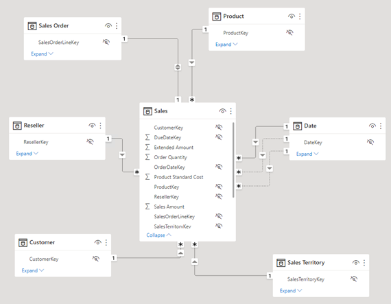
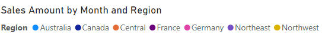
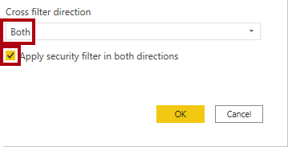

---
lab:
  title: 强制实施语义模型安全性
  module: Design and build tabular models
---

# 强制实施模型安全性

## 概述

**预估完成本实验室需要 45 分钟**

在本实验室中，你将更新预先开发的数据模型以强制实施安全性。 具体来说，Adventure Works 公司的销售人员应该只能看到与其指定销售区域相关的销售数据。

在此实验室中，你将了解如何完成以下操作：

- 创建静态角色。

- 创建动态角色。

- 验证角色。

- 将安全主体映射到语义模型角色。

## 开始使用

在本练习中，需要准备好环境。

### 下载 Power BI 初学者文件

1. 打开[销售分析入门文件](https://github.com/MicrosoftLearning/mslearn-fabric/raw/main/Allfiles/Labs/17/Starter/Sales%20Analysis%20-%20Enforce%20model%20security.pbix)，并保存到能记住的位置。

1. 导航到下载的文件并在 Power BI Desktop 中打开它。

1. 如果系统提示，请使用工作或学校帐户登录。

### 登录到 Power BI 服务

在此任务中，你将登录到 Power BI 服务并启动试用许可证，然后创建工作区。

1. 在 Web 浏览器中转到 [app.powerbi.com](https://app.powerbi.com/)。

2. 使用 Power BI Desktop 中使用的同一帐户完成登录过程。

    重要说明：请务必使用登录 Power BI Desktop 时使用的凭据。

    提示：Power BI Web 浏览器体验称为 Power BI 服务**。

### 创建工作区

在此任务中，你将创建一个工作区。

1. 若要在 Power BI 服务中创建工作区，请在“导航”窗格中（位于左侧）选择“工作区”，然后选择“创建工作区”  。

    

2. 在“创建工作区”窗格（位于右侧）的“工作区名称”框中，输入工作区的名称 。

    工作区名称在租户内必须是唯一的。

    

3. 选择“保存”。

    *创建后会打开该工作区。在后面的练习中，你会将一个语义模型发布到此工作区。*

### 查看数据模型

在此任务中，你将查看数据模型。

1. 在 Power BI Desktop 左侧，切换到“模型”视图。

    

2. 使用模型关系图查看模型设计。

    

    该模型包括六个维度表和一个事实数据表。Sales 事实数据表存储销售订单详细信息。这是一种典型的星型架构设计。

3. 展开“Sales Territory”表。

    

4. 请注意，此表包含“Region”列。

    “Region”列存储 Adventure Works 销售区域。在此组织中，销售人员只能查看与其指定销售区域相关的数据。在本实验室中，你将实现两种不同的行级别安全技术以强制实施数据权限。

## 创建静态角色

在本练习中，你将创建并验证静态角色，然后了解如何将安全主体映射到语义模型角色。

### 创建静态角色

在此任务中，你将创建两个静态角色。

1. 切换到“报表”视图。

    

2. 在堆积柱形图视觉对象的图例中，请注意（目前）可以看到许多区域。

    

    目前，图表看起来内容过于繁多。这是因为所有区域都可见。当解决方案强制实施行级别安全性后，报表使用者将只看到一个区域。

3. 若要添加安全角色，在“建模”功能区选项卡上的“安全”组中，选择“管理角色”  。

    

4. 在“管理角色”窗口中，选择“创建” 。

    

5. 若要命名角色，请将所选文本替换为“Australia”，然后按 Enter 。

    

6. 在“表”列表中，对于“Sales Territory”表，选择省略号，然后选择“添加筛选器” > “[Region]”   。

    

7. 在“表筛选 DAX 表达式”框中，将“值”替换为“Australia”  。

    

    此表达式通过值“Australia”筛选“Region”列 。

8. 若要创建其他角色，请按“创建”。

    

9. 重复此任务中的步骤，创建一个名为“Canada”的角色，该角色通过“Canada”筛选“Region”列  。

    

    在本实验室中，你将只创建这两个角色。但是在实际解决方案中，必须为 11 个 Adventure Works 区域中的每个区域创建一个角色。

10. 选择“保存”。

    

### 验证静态角色

在此任务中，你将验证其中一个静态角色。

1. 在“建模”功能区选项卡上的“安全组”中，选择“查看方式”  。

    

2. 在“以角色身份查看”窗口中，选择“Australia”角色 。

    

3. 选择“确定”。

    

4. 在报表页上，请注意，堆积柱形图视觉对象仅显示 Australia 的数据。

    

5. 在报表顶部，请注意确认已强制执行角色的黄色横幅。

    

6. 若要使用角色停止查看，请在黄色横幅的右侧，选择“停止查看”。

    

### 发布报表

在此任务中，你将发布报表。

1. 保存 Power BI Desktop 文件。

    

2. 若要发布报表，请在“主页”功能区选项卡上选择“发布” 。

    

3. 在“发布到 Power BI”窗口中选择工作区，然后选择“选择” 。

    

4. 发布成功后，选择“知道了”。

    

### 配置行级别安全性（可选）

在此任务中，你将了解如何在 Power BI 服务中配置行级别安全性。

此任务依赖于你所使用的租户中存在的 Salespeople_Australia 安全组。 此安全组不会自动出现在租户中。 如果对租户拥有权限，则可以按照以下步骤操作。 如果使用的是培训中提供的租户，你将没有适当权限来创建安全组。 请通读任务，但请注意，如果缺少此安全组，则无法完成这些任务。 **通读后，请继续执行“清理”任务。**

1. 切换到 Power BI 服务（Web 浏览器）。

2. 在工作区登陆页面中，请注意“Sales Analysis - Enforce model security”语义模型****。

    

3. 将光标悬停在此语义模型上，出现省略号时，选择省略号，然后选择“安全性”****。

    

    “安全性”选项支持映射 Microsoft Azure Active Directory (Azure AD) 安全主体，其中包括安全组和用户。

4. 在左侧，请注意角色列表，并且“Australia”处于选中状态。

    

5. 在“成员”框中，开始输入 Salespeople_Australia 。

    步骤 5 到 8 仅用于演示目的，因为需要创建或存在 Salespeople_Australia 安全组才能执行这些步骤。如果你具有创建安全组的权限和知识，请随时继续操作。否则，请继续执行“清理”任务。

    

6. 选择 **添加** 。

    

7. 若要完成角色映射，请选择“保存”。

    

    现在，Salespeople_Australia 安全组的所有成员都已映射到 Australia 角色，这会将数据访问权限限制为仅查看澳大利亚的销售数据 。

    在实际解决方案中，每个角色都应映射到安全组。

    *当每个区域的安全组存在时，此设计方法简单且有效。但是，存在缺点：它需要更多的精力进行创建和设置。它还需要在载入新区域时更新和重新发布语义模型。*

    在下一个练习中，你将创建一个数据驱动的动态角色。此设计方法可以帮助解决这些缺点。

8. 若要返回到工作区登陆页面，请在“导航”窗格中选择工作区。

### 清理解决方案

在此任务中，你将通过移除语义模型和模型角色来清理解决方案。

1. 要删除语义模型，将光标悬停在此语义模型上，出现省略号时，选择省略号，然后选择“删除”****。

    

    在下一个练习中，你将重新发布修改后的语义模型。**

2. 当看到确认删除的提示时，选择“删除”。

    

3. 切换到 Power BI Desktop。

4. 若要移除安全角色，在“建模”功能区选项卡上的“安全”组中，选择“管理角色”  。

    

5. 在“管理角色”窗口中，若要移除第一个角色，请选择“删除” 。

    

6. 当系统提示确认删除时，按“是，删除”。

    

7. 此外，请删除第二个角色。

8. 选择“保存”。

    

## 创建动态角色

在本练习中，你将向模型添加一个表，创建并验证动态角色，然后将安全主体映射到语义模型角色。

### 添加“Salesperson”表

在此任务中，你将向模型添加“Salesperson”表。

1. 切换到“模型”视图。

    

2. 在“主页”功能区选项卡的“查询”组中，选择“转换数据”图标  。

    

3. 在“Power Query 编辑器”窗口的“查询”窗格（位于左侧）中，右键单击“客户”查询，然后选择“复制”   。

    

    由于“客户”查询已包含连接数据仓库的步骤，因此复制它是开始开发新查询的有效方法。

4. 在“查询设置”窗格（位于右侧）的“名称”框中，将文本替换为“Salesperson”  。

    

5. 在“应用的步骤”列表中，右键单击“已移除的其他列”步骤（第三步），然后选择“删除到末尾”  。

    

6. 当系统提示确认删除步骤时，请选择“删除”。

    

7. 要从其他数据仓库表中获取数据，请在“应用的步骤”列表的“导航”步骤（第二步）中，选择齿轮图标（位于右侧） 。

    

8. 在“导航”窗口中，选择“DimEmployee”表 。

    

9. 选择“确定”。

    

10. 若要移除不必要的列，请在“主页”功能区选项卡上的“管理列”组中，选择“选择列”图标  。

    

11. 在“选择列”窗口中，取消选中“(选择所有列)”项 。

    

12. 检查以下三列：

    - EmployeeKey

    - SalesTerritoryKey

    - EmailAddress

13. 选择“确定”。

    

14. 若要对“EmailAddress”列进行重命名，请双击“EmailAddress”列标题 。

15. 将文本替换为“UPN”，然后按 Enter 。

    UPN 是用户主体名称的首字母缩略词。此列中的值与 Azure AD 帐户名称匹配。

    

16. 要将表加载到模型中，请在“主页”功能区选项卡上选择“关闭并应用”图标 。

    

17. 已将表添加到模型时，请注意，会自动创建与“Sales Territory”表的关系。

### 配置关系

在此任务中，你将配置新关系的属性。

1. 右键单击“Salesperson”与“Sales Territory”表之间的关系，然后选择“属性”  。

    

2. 在“编辑关系”窗口的“交叉筛选方向”下拉列表中，选择“双向”  。

3. 选中“在两个方向上应用安全筛选器”复选框。

    

    由于从“Sales Territory”表到“Salesperson”表存在一对多关系，因此筛选器仅从“Sales Territory”表传播到“Salesperson”表。若要强制在另一方向进行传播，必须同时将交叉筛选方向设置为这两个方向   。

4. 选择“确定”。

    

5. 若要隐藏表，请在“Salesperson”表的右上角选择睛形图标。

    

    “Salesperson”表的目的是强制实施数据权限。隐藏时，报表作者和问答体验将看不到此表或其字段。

### 创建动态角色

在此任务中，你将创建一个动态角色，该角色基于模型中的数据强制实施权限。

1. 切换到“报表”视图。

    

2. 若要添加安全角色，在“建模”功能区选项卡上的“安全”组中，选择“管理角色”  。

    

3. 在“管理角色”窗口中，选择“创建” 。

    

4. 若要对角色进行命名，请将所选文本替换为“Salespeople”。

    

    这时，只需要创建一个角色。

5. 将筛选器添加到“Salesperson”表的“UPN”列 。

    

6. 在“表筛选 DAX 表达式”框中，将“值”替换为“USERPRINCIPALNAME()”  。

    

    此表达式通过 USERPRINCIPALNAME 函数筛选“UPN”列，该函数返回经过身份验证的用户的用户主体名称 (UPN)。

    当 UPN 筛选“Salesperson”表时，它会筛选“Sales Territory”表，继而筛选“Sales”表。这样一来，经过身份验证的用户只会看到其指定区域的销售数据  。

7. 选择“保存”。

    

### 验证动态角色

在此任务中，你将验证动态角色。

1. 在“建模”功能区选项卡上的“安全组”中，选择“查看方式”  。

    

2. 在“**以角色身份查看**”窗口中，勾选“**其他用户**”，然后在相应的框中输入 `michael9@adventure-works.com`。

    

    出于测试目的，“其他用户”是 USERPRINCIPALNAME 函数将返回的值。请注意，此销售人员已分配给“Northeast”区域 。

3. 选中“销售员”角色。

    

4. 选择“确定”。

    

5. 在报表页上，请注意，堆积柱形图视觉对象仅显示 Northeast 的数据。

    

6. 在报表顶部，请注意确认已强制执行角色的黄色横幅。

    

7. 若要使用角色停止查看，请在黄色横幅的右侧，选择“停止查看”。

    

### 完成设计

在此任务中，通过发布报表并将安全组映射到角色即可完成设计。

此任务中的步骤是特意简化的。有关完整步骤详细信息，请参阅上一练习的任务步骤。

1. 保存 Power BI Desktop 文件。

2. 将报表发布到在实验室开始时创建的工作区。

3. 关闭 Power BI Desktop。

4. 切换到 Power BI 服务（Web 浏览器）。

5. 转到“Sales Analysis - Enforce model security”语义模型的安全设置****。

6. 将 Salespeople 安全组映射到 Salespeople 角色 。

    

    现在，Salespeople 安全组的所有成员都已映射到 Salespeople 角色。如果经过身份验证的用户由“Salesperson”表中的一行表示，则已分配的销售区域将用于筛选销售表  。

    当数据模型存储用户主体名称值时，此设计方法非常简单且有效。添加或移除销售人员，或将销售人员分配到不同的销售区域时，此设计方法将很有效。
