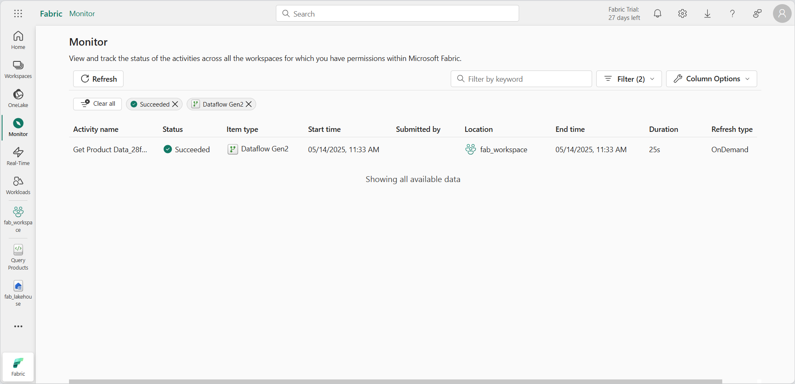

---
lab:
  title: 在监视中心监视 Fabric 活动
  module: Monitoring Fabric
---

# 在监视中心监视 Fabric 活动

Microsoft Fabric 中的*监视中心*提供了一个可以监视活动的中心位置。 可以使用监视中心查看与有权查看的项目相关的事件。

完成本实验室大约需要 30 分钟。

> **备注**：你需要访问 [Microsoft Fabric 租户](https://learn.microsoft.com/fabric/get-started/fabric-trial)才能完成本练习。

## 创建工作区

在 Fabric 中处理数据之前，请在启用 Fabric 容量的租户中创建一个工作区。

1. 在浏览器中，导航到 [Microsoft Fabric 主页](https://app.fabric.microsoft.com/home?experience=fabric) (`https://app.fabric.microsoft.com/home?experience=fabric`)，使用 Fabric 凭据登录。
1. 在左侧菜单栏中，选择“工作区”（图标类似于 &#128455;）。
1. 新建一个工作区并为其指定名称，并在“高级”部分选择包含 Fabric 容量（试用版、高级版或 Fabric）的许可模式  。
1. 打开新工作区时，它应为空。

    

## 创建湖屋

现在已经有了工作区，可以为数据创建数据湖屋了。

1. 在左侧菜单上，选择“**创建**”。 在“*新建*”页的 *“数据工程”* 部分下，选择“**湖屋**”。 为其指定唯一的名称。

    >**备注**：如果未将“**创建**”选项固定到边栏，则需要首先选择省略号 (**...**) 选项。

    大约一分钟后，一个新的湖屋创建完成：

    

1. 查看新的湖屋，并注意使用左侧的湖屋资源管理器窗格可浏览湖屋中的表和文件：

    目前，湖屋中没有表或文件。

## 创建和监视数据流

在 Microsoft Fabric 中，可以使用数据流 (Gen2) 从各种源引入数据。 在本练习中，你将使用数据流从 CSV 文件获取数据，并将其加载到湖屋的表中。

1. 在湖屋“**主页**”上的“**获取数据**”菜单中，选择“**新建数据流 Gen2**”。

   创建并打开名为“**数据流 1**”的新数据流。

    

1. 在数据流页的左上角，选择“**数据流 1**”以查看其详细信息，并将数据流重命名为“**获取产品数据**”。
1. 在新的数据流设计器中，选择“**从文本/CSV 文件导入**”。 完成“获取数据”向导，使用匿名身份验证链接到 `https://raw.githubusercontent.com/MicrosoftLearning/dp-data/main/products.csv` 以创建数据连接。 完成向导后，数据流设计器中将显示数据预览，如下所示：

    

1. 发布数据流。
1. 在左侧导航栏中，选择“**监视器**”以查看监视中心并观察数据流是否正在进行中（如果没有，请刷新视图，直到看到为止）。

    

1. 等待几秒钟，然后刷新页面，直到数据流状态为“**已成功**”。
1. 在导航窗格中，选择湖屋。 然后展开 **Tables** 文件夹，验证数据流是否已创建并加载名为 **products** 的表（可能需要刷新 **Tables** 文件夹）。

    

## 创建和监视 Spark 笔记本

在 Microsoft Fabric 中，可以使用笔记本来运行 Spark 代码。

1. 在导航中心，选择“**主页**”。 在“数据工程”主页上，创建新的“**笔记本**”。

    创建并打开名为“**笔记本 1**”的新笔记本。

    

1. 在笔记本的左上角，选择“**笔记本 1**”以查看其详细信息，并将其名称更改为“**查询产品**”。
1. 在笔记本编辑器的“**资源管理器**”窗格中，选择“**湖屋**”并添加之前创建的湖屋。
1. 在**产品**表的“**...**”菜单中，选择“**加载数据**” > **Spark**。 这会向笔记本添加新的代码单元格，如下所示：

    

1. 使用“**&#9655; 运行全部**”按钮运行笔记本中的所有单元格。 启动 Spark 会话需要一段时间，然后查询结果将在代码单元格下显示。

    

1. 在工具栏上，使用 **&#9723;**（*停止会话*）按钮停止 Spark 会话。
1. 在导航栏中，选择“**监视器**”以查看监视中心，注意笔记本活动已列出。

    

## 监视项目历史记录

工作区中的某些项可能会多次运行。 你可以使用监视中心查看其运行历史记录。

1. 在导航栏中，返回到工作区页。 然后使用**获取产品数据**数据流的 **&#8635;**（*立即刷新*）按钮重新运行它。
1. 在导航窗格中，选择“**监视**”页以查看监视中心，并验证数据流是否正在运行中。
1. 在**获取产品数据**数据流的 **...** 菜单中，选择“**历史运行**”以查看数据流的运行历史记录：

    

1. 在任一历史运行的 **...** 菜单中，选择“**查看详细信息**”以查看运行的详细信息。
1. 关闭“**详细信息**”窗格，并使用“**返回主视图**”按钮返回到主监视中心页。

## 自定义监视中心视图

在本练习中，你只运行了几个活动，因此在监视中心内查找事件应该相当容易。 但是，在实际环境中，可能需要搜索大量事件。 使用筛选器和其他视图自定义项可以简化此操作。

1. 在监视中心，使用“**筛选器**”按钮应用以下筛选器：
    - **状态**：已成功
    - **项目类型**：数据流 Gen2

    应用筛选器后，只会列出成功的数据流运行。

    

1. 使用“**列选项**”按钮在视图中包含以下列（使用“**应用**”按钮应用更改）：
    - 活动名称
    - Status
    - 项目类型
    - 开始时间
    - 提交者
    - 位置
    - 结束时间
    - 持续时间
    - 刷新类型

    可能需要进行水平滚动才能看到所有列：

    

## 清理资源

在本练习中，你已创建湖屋、数据流和 Spark 笔记本；并且已使用监视中心查看项活动。

如果已完成湖屋探索，可删除为本练习创建的工作区。

1. 在左侧栏中，选择工作区的图标以查看其包含的所有项。
2. 在工具栏上的“...”菜单中，选择“工作区设置” 。
3. 在“常规”部分中，选择“删除此工作区”。********
