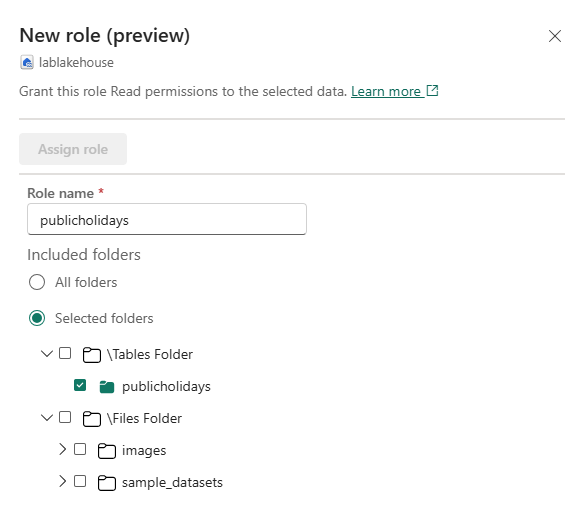

---
lab:
  title: 在 Microsoft Fabric 中安全访问数据
  module: Secure data access in Microsoft Fabric
---

# 在 Microsoft Fabric 中安全访问数据

Microsoft Fabric 有一个用于管理数据访问的多层安全模型。 可为整个工作区、单个项或通过每个 Fabric 引擎中的精细权限设置安全性。 在本练习中，你将使用工作区、项访问控制和 OneLake 数据访问角色来保护数据。

完成本实验室大约需要 **45** 分钟。

## 创建工作区

在 Fabric 中处理数据之前，创建一个已启用的 Fabric 试用版的工作区。

1. 在 [Microsoft Fabric 主页](https://app.fabric.microsoft.com/home?experience=fabric) (`https://app.fabric.microsoft.com/home?experience=fabric`) 上，选择“**数据仓库**”。
1. 在左侧菜单栏中，选择“工作区”（图标类似于 &#128455;）。
1. 新建一个工作区并为其指定名称，并选择包含 Fabric 容量（试用版、高级版或 Fabric）的许可模式  。
1. 打开新工作区时，它应为空。

    

> **注意**：创建工作区时，你将自动成为工作区管理员角色的成员。 

## 创建数据仓库

接下来，在创建的工作区中创建数据仓库：

1. 在“数据仓库”主页中，选择**示例仓库**快捷方式，使用所选的名称创建新的仓库。  

    大约一分钟后，一个新的仓库创建完成：

    

## 创建湖屋
接下来，在创建的工作区中创建湖屋。

1. 在左侧菜单栏中，选择“**工作区**”（图标类似于 🗇）。
2. 选择所创建的工作区。
3. 在工作区中，选择“**+新建项**”按钮，然后选择“**湖屋**”。 使用所选的名称创建新湖屋。

   大约一分钟后，将创建一个新的湖屋：

    

4. 选择“**从示例数据开始**”磁贴。 一分钟左右之后，湖屋将填充数据。

## 应用工作区访问控制

工作区角色用于控制对工作区及其内容的访问权限。 当用户需要查看工作区中的所有项时，需要管理工作区访问权限或创建新 Fabric 项时，或需要特定权限查看、修改或共享工作区中的内容时，可以分配工作区角色。  

在本练习中，将用户添加到工作区角色，应用权限，并查看应用每个权限集时可查看的内容。 打开两个浏览器，以不同的用户身份登录。 在一个浏览器中，你将是**工作区管理员**，而另一个浏览器中，你将以另一个特权较低的用户身份登录。 在一个浏览器中，工作区管理员更改了第二个用户的权限，并在第二个浏览器中可以看到更改权限的效果。  

1. 在左侧菜单栏中，选择“工作区”（图标类似于 &#128455;）。
2. 接下来，选择所创建的工作区。
3. 选择屏幕顶部的“**管理访问权限**”。

> **备注**：你将看到所登录的用户，该用户是**工作区管理员**角色成员，因为你创建了工作区。 尚未向其他用户分配对工作区的访问权限。

4. 接下来，你将看到没有工作区权限的用户可以查看的内容。 在浏览器中，打开 InPrivate 窗口。 在 Microsoft Edge 浏览器中，选择右上角的省略号，然后选择“**新建 InPrivate 窗口**”。
5. 输入 https://app.fabric.microsoft.com，然后以测试时使用的第二个用户身份登录。  
6. 在屏幕左下角，选择 **Microsoft Fabric**，然后选择“**数据仓库**”。 接下来，选择“**工作区**”（图标看起来类似于 &#128455;）。  

> **备注：** 第二个用户无权访问工作区，因此无法查看。

7. 接下来，将**工作区查看者**角色分配给第二个用户，会看到该角色授予对工作区中仓库的读取访问权限。  
8. 返回到以工作区管理员身份登录的浏览器窗口。确保仍在显示所创建的工作区页上。 页面底部应列出新工作区项，以及示例仓库和湖屋。
9. 在屏幕右上角选择“**管理访问权限**”。
10. 选择“**添加人员或组**”。 输入测试的第二个用户的电子邮件。 选择“**添加**”以将用户分配到工作区**查看者**角色。 
11. 返回到以第二个用户身份登录的 InPrivate 浏览器窗口，并在浏览器中选择“刷新”按钮以刷新分配给第二个用户的会话权限。
12. 选择左侧菜单栏上的“**工作区**”图标（图标看起来类似于 &#128455;），然后选择以工作区管理员用户身份创建的工作区名称。 第二个用户现在可以看到工作区中的所有项，因为已为其分配了“**工作区查看者**”角色。

    

13. 选择仓库并打开。
14. 选择 **Date** 表并等待加载行。 可以看到这些行，因为作为工作区查看者角色的成员，你对仓库中的表拥有 CONNECT 和 ReadData 权限。 有关授予工作区查看者角色的权限的详细信息，请参阅[工作区角色](https://learn.microsoft.com/en-us/fabric/data-warehouse/workspace-roles)。
15. 接下来，选择左侧菜单栏上的“**工作区**”图标，然后选择湖屋。
16. 湖屋打开后，单击屏幕右上角显示“**湖屋**”的下拉框，然后选择“**SQL 分析终结点**”。
17. 选择 **publicholidays** 表并等待显示数据。 湖屋表中的数据可从 SQL 分析终结点读取，因为用户是工作区查看者角色的成员，该角色授予对 SQL 分析终结点的读取权限。

## 应用项访问控制

项权限控制对工作区中各个 Fabric 项（如仓库、湖屋和语义模型）的访问。 在此练习中，你将移除上一个练习中应用的**工作区查看器**权限，然后对仓库应用项目级权限，以便权限较低的用户只能查看仓库数据，而不能查看湖屋数据。

1. 返回到以工作区管理员身份登录的浏览器窗口。从左侧导航窗格中选择“**工作区**”。 
2. 选择所创建的工作区并打开。
3. 从屏幕顶部选择“**管理访问权限**”。
4. 选择第二个用户名称下的“**查看器**”一词。 从显示的菜单中，选择“**移除**”。

   

5. 关闭“**管理访问权限**”部分。
6. 在工作区中，将鼠标悬停在仓库的名称上，将显示省略号 (**...**)。 选择省略号，然后选择“**管理权限**”。

7. 选择“**添加用户**”并输入第二个用户的名称。 
8. 在显示的框中，在“**其他权限**”下，选中“**使用 SQL (ReadData) 读取所有数据**”，并取消选中所有其他框。

    

9. 选择“**授权**”。

10. 返回到以第二个用户身份登录的浏览器窗口。 刷新浏览器视图。  

11. 第二个用户不再有权访问工作区，而是只能访问仓库。 无法再浏览左侧导航窗格中的工作区来查找仓库。 在左侧导航菜单中选择“**OneLake**”以查找仓库。 

12. 选择仓库。 在显示的屏幕上，从顶部菜单栏中选择“**打开**”。

13. 当仓库视图出现时，选择 **Date** 表以查看表数据。 行是可查看的，因为用户仍拥有对仓库的读取访问权限，ReadData 权限是通过对仓库使用项权限应用的。

## 在湖屋中应用 OneLake 数据访问角色

OneLake 数据访问角色允许在湖屋中创建自定义角色，并向指定的文件夹授予读取权限。 OneLake 数据访问角色目前是预览功能。

在本练习中，你将分配项权限并创建 OneLake 数据访问角色，并试验它们如何协同工作，以限制对湖屋中的数据的访问。  

1. 留在以第二个用户身份登录的浏览器中。  
2. 选择左侧导航栏中的“**OneLake**”。 第二个用户看不到湖屋。  
3. 返回到以工作区管理员身份登录的浏览器。
4. 在左侧菜单中选择“**工作区**”，然后选择你的工作区。 将鼠标悬停在湖屋的名称上。  
5. 选择椭圆形右侧的省略号 (**...**)，然后选择“**管理权限**”

      

6. 在出现的屏幕上，选择“**添加用户**”。 
7. 将第二个用户分配到湖屋，并确保未选中“**授予人员访问权限**”窗口中的复选框。  

      

8. 选择“**授权**”。 第二个用户现在对湖屋具有读取权限。 读取权限仅允许用户查看湖屋的元数据，但不允许查看基础数据。 接下来，我们将对此进行验证。
9. 返回到以第二个用户身份登录的浏览器。 刷新浏览器。
10. 选择左侧导航窗格中的“**OneLake**”。  
11. 选择湖屋并打开。 
12. 选择顶部菜单栏上的“**打开**”。 即使已授予读取权限，也无法展开表或文件。 接下来，使用 OneLake 数据访问权限授予第二个用户对特定文件夹的访问权限。
13. 返回到以工作区管理员身份登录的浏览器。
14. 从左侧导航栏中选择“**工作区**”。
15. 选择工作区名称。
16. 选择湖屋。
1. 湖屋打开后，选择顶部菜单栏上的“**管理 OneLake 数据访问**”，然后单击“**继续**”按钮启用该功能。

      

14. 在显示的“**管理 OneLake 数据访问（预览）**”屏幕上选择新角色。
  
      

15. 创建一个名为 **publicholidays** 的新角色，该角色只能访问 publicholidays 文件夹，如以下屏幕截图所示。

      

16. 角色完成创建后，选择“**分配角色**”并将角色分配给第二个用户，选择“**添加**”，然后选择“**保存**”。
 
       

17. 返回到以第二个用户身份登录的浏览器。 确保你仍在湖屋打开的页面上。 刷新浏览器。  
18. 选择 **publicholidays** 表并等待加载数据。 只有 publicholidays 表中的数据可供用户访问，因为已向用户分配了自定义 OneLake 数据访问角色。 该角色允许他们仅查看 publicholidays 表中的数据，而不查看任何其他表、文件或文件夹中的数据。

       

## 清理资源

在本练习中，你使用工作区访问控制、项访问控制和 OneLake 数据访问角色来保护数据。

1. 在左侧导航栏中，选择工作区的图标以查看其包含的所有项。
2. 在顶部工具栏上的菜单中，选择“工作区设置”****。
3. 在“常规”部分中，选择“删除此工作区”。********
