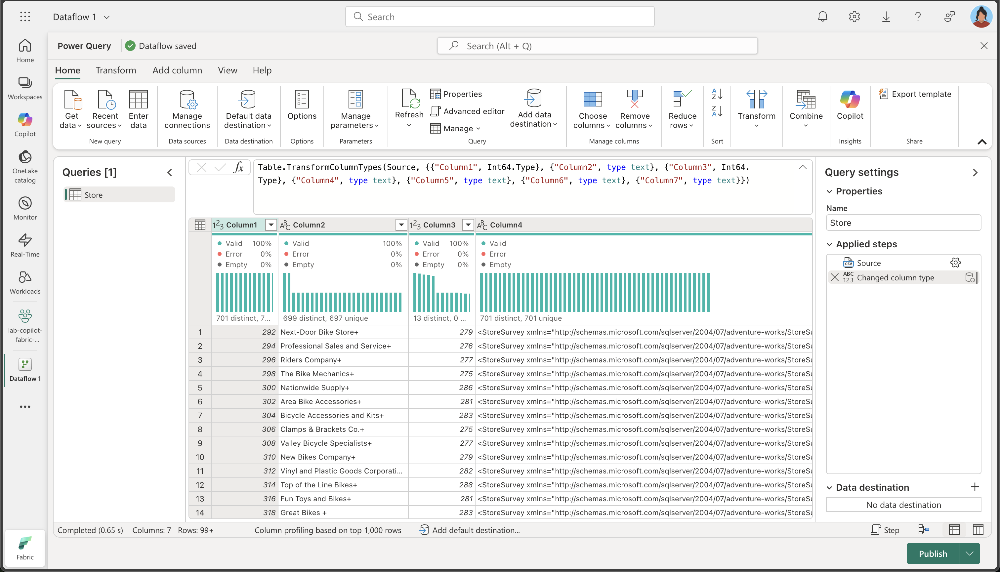
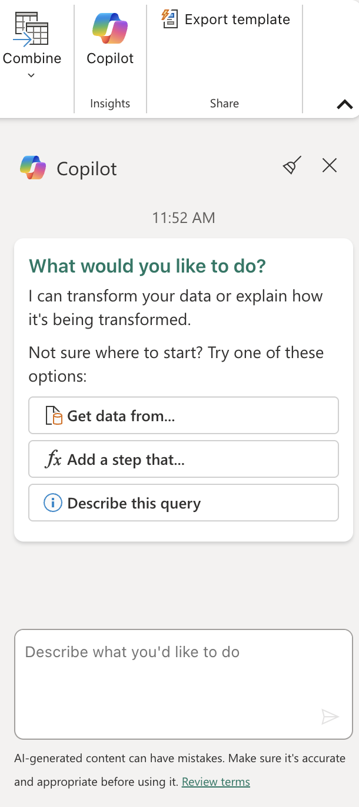
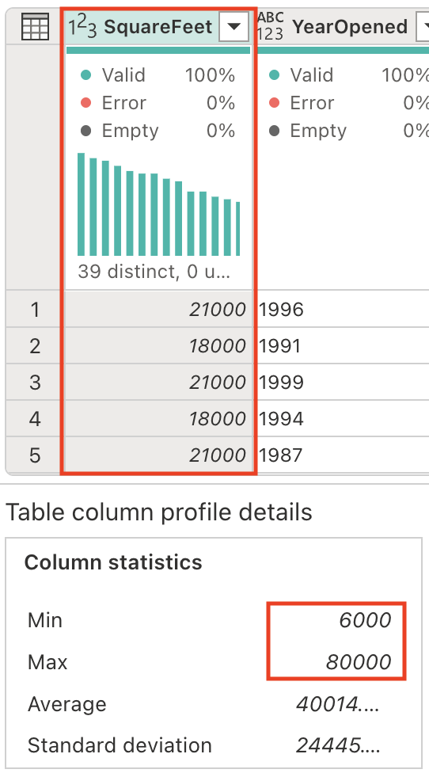
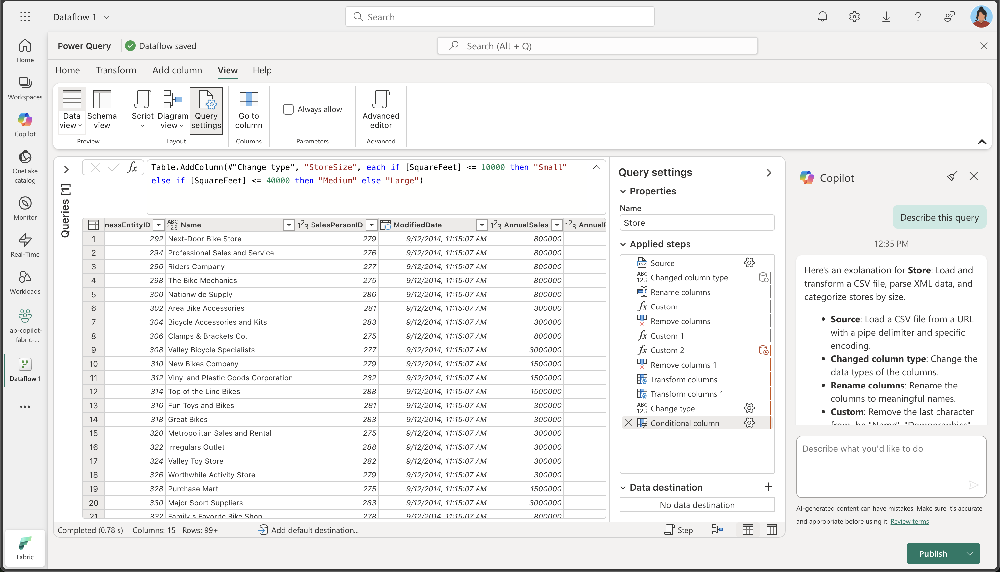
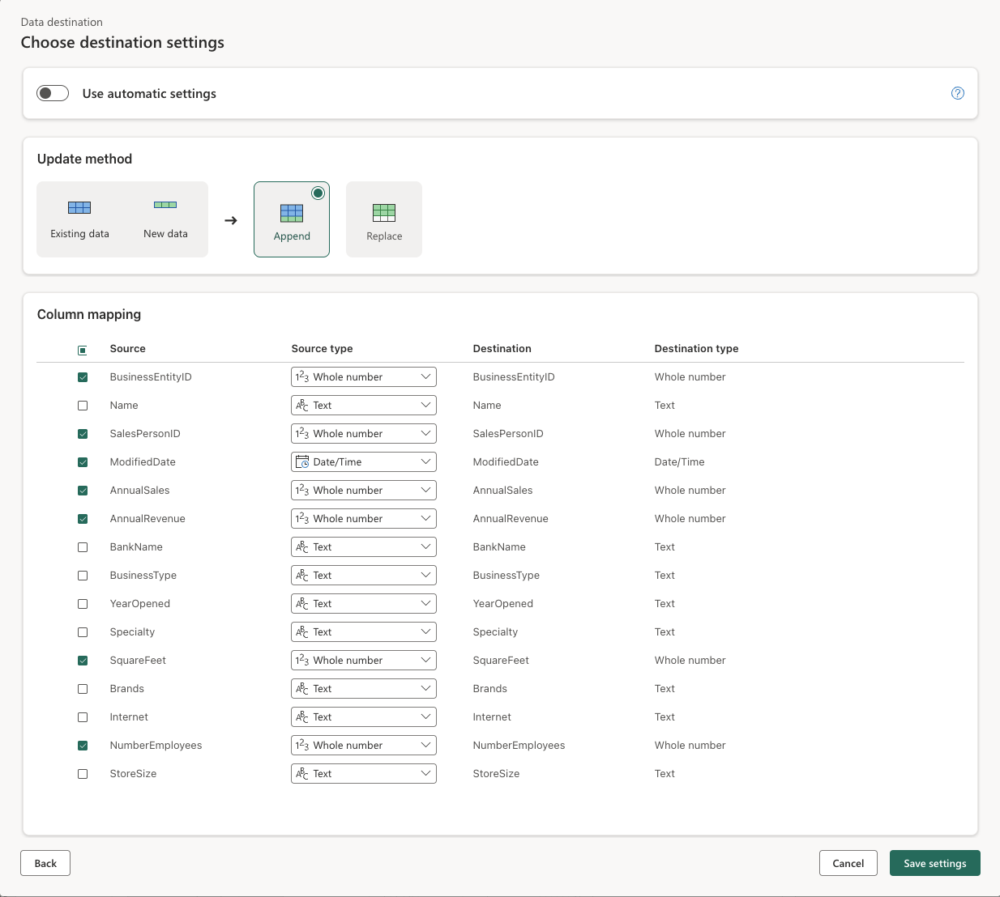

---
lab:
  title: 在 Microsoft Fabric 数据流 Gen2 中更智能地使用 Copilot
  module: Get started with Copilot in Fabric for data engineering
---

# 在 Microsoft Fabric 数据流 Gen2 中更智能地使用 Copilot

在 Microsoft Fabric 中，数据流 (Gen2) 连接到各种数据源并在 Power Query Online 中执行转换。 然后，可以在数据管道中使用它们，将数据引入湖屋或其他分析存储，或定义 Power BI 报表的数据集。 本实验室介绍数据流 (Gen2) 中的 Copilot，而不是专注于构建复杂的企业解决方案。

完成此练习大约需要 30 分钟****。

## 学习内容

通过完成本实验室，你可：

- 了解如何使用 Microsoft Fabric 数据流 Gen2 中的 Copilot 来加速数据转换任务。
- 了解如何在 Copilot 的帮助下使用 Power Query Online 引入、清理和转换数据。
- 应用数据质量最佳做法，包括重命名列、移除不需要的字符和设置适当的数据类型。
- 获得在数据流中分析和扩展 XML 数据的经验。
- 将连续数据分类为有意义的组以便进行分析。
- 将转换后的数据发布到湖屋并验证结果。
- 认识到 AI 辅助数据工程对于提高生产力和数据质量的价值。

## 开始之前

需要启用了 Copilot 的 [Microsoft Fabric 容量（F2 或更高版本）](https://learn.microsoft.com/fabric/fundamentals/copilot-enable-fabric)以完成本练习。

## 练习场景

Contoso 是一家全球零售公司，正在使用 Microsoft Fabric 实现其数据基础结构的现代化。 作为数据工程师，你的任务是准备商店信息以供分析。 原始数据存储在 CSV 文件中，其中包括嵌入的 XML 字段、不一致的列名和不需要的字符。 你的目标是使用数据流 Gen2 中的 Copilot 来引入、清理、转换和扩充这些数据，使其准备好在湖屋中用于报告和分析。 此动手练习将指导你完成每个步骤，演示 Copilot 如何加速和简化常见的数据工程任务。

## 创建工作区

在使用 Fabric 中的数据之前，请先创建一个已启用 Fabric 的工作区。 工作区可作为所有 Fabric 项的容器，并为团队提供协作功能。

1. 在浏览器中，导航到 [Microsoft Fabric 主页](https://app.fabric.microsoft.com/home?experience=fabric) (`https://app.fabric.microsoft.com/home?experience=fabric`)，使用 Fabric 凭据登录。

1. 在左侧菜单栏中，选择“工作区”（图标类似于 &#128455;）。

1. 新建一个工作区并为其指定名称，并选择包含 Fabric 容量（高级版或 Fabric）的许可模式****。 请注意，不支持试用版**。

    > **重要说明**：Fabric 中的 Copilot 功能需要付费容量（F2 或更高）。 试用版工作区不支持 Copilot 功能。

1. 打开新工作区时，它应为空。

    

## 创建湖屋

现在已经有了工作区，可以创建数据湖屋，将数据引入其中了。

1. 在左侧菜单上，选择“**创建**”。 在“*新建*”页的 *“数据工程”* 部分下，选择“**湖屋**”。 为其指定唯一的名称。

    >**备注**：如果未将“**创建**”选项固定到边栏，则需要首先选择省略号 (**...**) 选项。

    大约一分钟后，一个新的空湖屋创建完成。

    

## 创建数据流 (Gen2) 以引入数据

有了湖屋后，需要向湖屋引入一些数据。 执行此操作的一种方法是定义封装提取、转换和加载 (ETL) 过程的数据流。

1. 在工作区的主页中，选择“**获取数据**” > “**新建数据流 Gen2**”。 几秒钟后，新数据流的 Power Query 编辑器将打开，如下所示。

    

1. 选择“从文本/CSV 文件导入”，并使用以下设置创建新的数据源：

   - 文件链接：已选择
   - 文件路径或 URL：`https://raw.githubusercontent.com/MicrosoftLearning/mslearn-fabric/refs/heads/main/Allfiles/Labs/22a/Store.csv`
   - 连接：创建新连接
   - 数据网关：（无)
   - 身份验证类型：匿名
   - 隐私级别****：无

1. 选择“下一步”可预览文件数据，然后选择“创建数据源” 。 Power Query 编辑器显示数据源以及设置数据格式的初始查询步骤集，如下所示：

    

1. 在“开始”功能区选项卡上，从“见解”组中选择“Copilot”，如下所示************：
    
    

1. 列名目前太过通用且缺乏明确的含义（可能显示为 Column1、Column2 等）。 有意义的列名对于数据理解和下游处理至关重要。 使用以下提示来优化它们，并确保它们准确传达预期信息：

    ```copilot-prompt
    Rename columns to BusinessEntityID, Name, SalesPersonID, Demographics, rowguid, ModifiedDate
    ```

    请注意，列名现在准确且具有描述性。 此外，“已应用步骤”列表中还添加了一个步骤，显示 Copilot 如何在后台自动生成 Power Query M 代码：
    
    

1. 某些列在其文本值末尾包含一个“+”字符。 这是一个常见的数据质量问题，可能会干扰下游数据分析和处理。 

    
    
    让我们使用以下提示消除这些不需要的字符：
    
    ```copilot-prompt
    Delete the last character from the columns Name, Demographics, rowguid
    ```
    
    为什么这很重要****：移除多余的字符可确保数据的一致性，并防止在后续过程中执行字符串操作或数据联接时出现问题。

1. 该表包含一些冗余列，需要将其移除以简化我们的数据集并提高处理效率。 使用以下提示来相应地优化数据：

    
    
    ```copilot-prompt
    Remove the rowguid and Column7 columns
    ```
    
    **注意**：`rowguid` 列通常用于内部数据库操作，不需要用于分析。 `Column7` 似乎是一个空列或不相关的列，对我们的数据集没有任何价值。
    
1. Demographics 列包含一个不可见的 Unicode 字符，即字节顺序标记 (BOM) \ufeff，它会干扰 XML 数据分析。 我们需要将其移除以确保正确处理。 在 Copilot 窗格中，输入以下提示：

    ```copilot-prompt
    Remove the Byte Order Mark (BOM) \ufeff from the Demographics column
    ```
    
    了解 BOM****：字节顺序标记是一个 Unicode 字符，可以出现在文本文件的开头，以指示文本编码的字节顺序。 虽然它对于文件编码检测很有用，但在分析 XML 等结构化数据时可能会导致问题。
    
    请注意为移除字符而生成的公式：
    
    
    
1. 现在，我们已准备好分析 XML 数据并将其扩展为单独的列。 Demographics 列包含 XML 格式的数据，其中保存了有价值的商店信息，例如年销售额、占地面积和其他业务指标。

    
    
    在 Copilot 窗格中，输入以下提示：
    
    ```copilot-prompt
    Parse this XML and expand it's columns
    ```
    
    了解 XML 分析****：XML（可扩展标记语言）是一种常用于存储分层信息的结构化数据格式。 通过分析和扩展 XML，我们将嵌套数据转换为更易于分析的扁平表格结构。
    
    请注意，表中已添加了新列（可能需要向右滚动）。
    
    

1. 移除 Demographics 列，因为我们已将全部有价值的信息提取到单独的列中，不再需要它。 在 Copilot 窗格中，输入以下提示：

    ```copilot-prompt
    Remove the Demographics column.
    ```

    为什么要移除此列****：现在我们已经分析了 XML 并为每条信息创建了单独的列，包含原始 XML 的原始 Demographics 列是冗余的，可以安全地将其移除以保持数据集干净。

1. ModifiedDate 列的值末尾有一个与号 (&)。 需要在分析之前将其移除以确保正确处理数据。

    
    
    在 Copilot 窗格中，输入以下提示：
    
    ```copilot-prompt
    Remove the last character from the ModifiedDate
    ```

1. 我们现在准备将其数据类型转换为 DateTime，以便进行正确的日期/时间操作和分析。 在 Copilot 窗格中，输入以下提示：

    ```copilot-prompt
    Set the data type to DateTime
    ```

    数据类型重要性****：转换为正确的数据类型对于在下游分析中实现正确的排序、筛选和基于日期的计算至关重要。

    请注意，ModifiedDate 数据类型已更改为 DateTime：
    
    
    
1. 将多个列的数据类型调整为数值，以启用数学运算和适当的聚合。 在 Copilot 窗格中，输入以下提示：

    ```copilot-prompt
    Set the data type to whole number for the following columns: AnnualSales, AnnualRevenue, SquareFeet, NumberEmployee
    ```
    
    为什么要转换为数字****：使用数字数据类型可以进行适当的数学计算、聚合（求和、平均值等）和统计分析，而这些是基于文本的数据无法实现的。
    
1. SquareFeet 字段包含从 6,000 到 80,000 的范围内的数值。 从连续数值数据创建分类分组是一种常见的分析技术，可以使数据更易于解释和分析。

    
    
    让我们生成一个新列来对商店规模进行相应分类。 在 Copilot 窗格中，输入以下提示：
    
    ```copilot-prompt
    Add a column StoreSize, based on the SquareFeet:
        0 - 10000: Small
        10001 - 40000: Medium
        40001 - 80000: Large
    ```
    
    请注意，已添加新列 StoreSize，其中包含一个基于 SquareFeet 列的公式。 另请注意，列配置文件具有 3 个不同的值：小型、中型和大型。
    
    
    
1. 修改当前缺少指定类型的列的数据类型。 在 Copilot 窗格中，输入以下提示：

    ```copilot-prompt
    Set the datatype of the following columns to text: Name, BankName, BusinessType, YearOpened, Specialty, Brands, Internet, StoreSize
    ```
    
    数据类型一致性****：明确设置数据类型可确保下游流程中的行为可预测，并防止可能导致意外结果的自动类型推理。
    
## 代码说明

1. 我们已执行多个转换。 让我们请求 Copilot 总结我们已经采取的步骤：

    ```copilot-prompt
    Describe this query
    ```
    
    观察结果是否出现在 Copilot 窗格中。 以下是所提供的解释的一个示例。 由于 AI 生成的内容可能存在错误，因此你的结果可能会略有不同。
    
    
    
    以下是对 Store 的解释：****** 加载并转换 CSV 文件、分析 XML 数据并按大小对商店进行分类。
    
    - 源：_****_ 使用管道分隔符和特定编码从 URL 加载 CSV 文件。
    - 已更改列类型：_****_ 更改列的数据类型。
    - 重命名列：_****_ 将列重命名为有意义的名称。
    - 自定义：_****_ 从“Name”、“Demographics”和“rowguid”列中移除最后一个字符。
    - 移除列：_****_ 移除“rowguid”和“Column7”列。
    - 自定义 1：_****_ 从 Demographics 列中移除所有前导特殊字符。
    - 自定义 2：_****_ 将“Demographics”列分析为 XML 并将其扩展为多个列。
    - 移除第 1 列：_****_ 移除原来的“Demographics”列。
    - 转换列：_****_ 从“ModifiedDate”列中移除最后一个字符。
    - 转换第 1 列：_****_ 将“ModifiedDate”列转换为日期时间类型。
    - 更改类型：_****_ 将“AnnualSales”、“AnnualRevenue”、“SquareFeet”和“NumberEmployees”列的数据类型更改为整数。
    - 条件列：_****_ 根据“SquareFeet”值添加新列“StoreSize”，将商店分类为“Small”、“Medium”或“Large”。
    - 更改类型 1：_****_ 将多个列的数据类型更改为文本。
    
## 为数据流添加数据目标

1. 在工具栏功能区上，选择“开始”选项卡。然后在“添加数据目标”下拉菜单中，选择“湖屋”  。

    > 注意：如果此选项灰显，则可能已设置了数据目标。 检查 Power Query 编辑器右侧的“查询设置”窗格底部的数据目标。 如果已设置目标，可以使用齿轮更改它。

1. 在“连接到数据目标”对话框中，编辑连接并使用 Power BI 组织帐户登录，以设置数据流用于访问湖屋的标识。

    

1. 选择“下一步”，在可用工作区列表中，找到你的工作区并选择在本练习开始时在该工作区中创建的湖屋。 然后指定名为 Store 的新表****：

    

1. 选择“**下一步**”，然后在“**选择目标设置**”页上，禁用“**使用自动设置**”选项，选择“**追加**”，然后选择“**保存设置**”。

    > **注意：** 我们建议使用“*Power query*”编辑器更新数据类型，但你也可以根据需要从此页面执行此操作。

    

1. 选择“保存并运行”以发布数据流****。 然后等待在工作区中创建 Dataflow 1 数据流。

## 验证你的工作

现在可以从数据流验证 ETL 过程，并确保正确应用所有转换。

1. 导航回工作区并打开之前创建的湖屋。

1. 在湖屋中，找到并打开 Store 表****。 （在数据流处理数据时，可能需要等待几分钟才能填充数据。）

1. 观察转换后的数据的以下关键方面：

   - 列名****：验证它们是否与你指定的有意义的名称（BusinessEntityID、Name、SalesPersonID 等）匹配
   - 数据类型****：检查数字列是否显示为数字，日期时间列是否显示为日期/时间，文本列是否显示为文本
   - 数据质量****：确认已移除不需要的字符（+、&）
   - XML 扩展****：请注意从原始 XML 人口统计信息数据中提取的各个列
   - StoreSize 分类****：验证是否根据 SquareFeet 值正确创建了 Small/Medium/Large 类别
   - 数据完整性****：确保转换过程中不会丢失任何关键数据

   

    为什么这很重要****：最终的表格应该包含结构良好的干净数据，具有有意义的列名、适当的数据类型和新的 StoreSize 分类列。 这演示了 Copilot 如何帮助将混乱的原始数据转换为可供分析的干净数据集。

## 清理资源

如果已在 Microsoft Fabric 中探索完数据流，则可以删除为此练习创建的工作区。

1. 在浏览器中导航到 Microsoft Fabric。
1. 在左侧栏中，选择工作区的图标以查看其包含的所有项。
1. 选择“**工作区设置**”，然后在“**常规**”部分中向下滚动并选择“**删除此工作区**”。
1. 选择“**删除**”以删除工作区。

