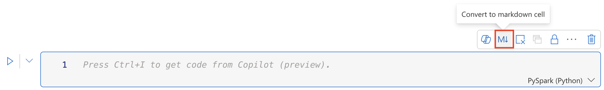
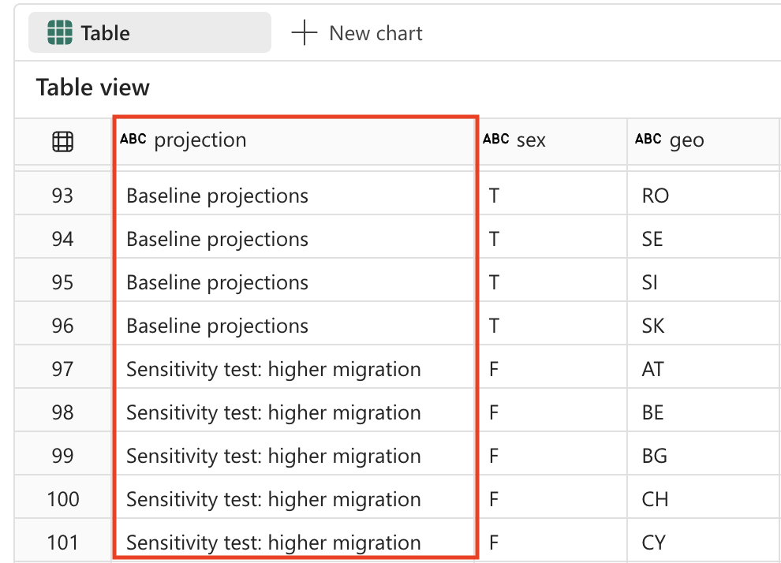

---
lab:
  title: 在 Microsoft Fabric Notebooks 中使用 Apache Spark 和 Copilot 分析数据
  module: Get started with Copilot in Fabric for data engineering
---

# 在 Microsoft Fabric Notebooks 中使用 Apache Spark 和 Copilot 分析数据

在此实验室中，我们使用 Copilot for Fabric Data Engineering 功能，通过使用笔记本在湖屋中加载、转换和保存数据。 笔记本提供了一个交互式环境，可将代码、可视化效果和叙述性文本合并到一个文档中。 使用此格式可以轻松地记录工作流、解释推理并与他人共享结果。 通过使用笔记本，可以迭代开发和测试代码、在每个步骤中可视化数据，并清楚记录分析过程。 此方法可增强协作性、可重现性，帮助用户更好地理解，这使笔记本成为数据工程和分析任务的理想工具。

传统上，使用笔记本执行数据工程任务时，用户需要使用 Python 或 Scala 等语言编写代码，同时需要熟练掌握 Apache Spark、pandas 等框架和库。 不熟悉编程或不熟悉这些工具的用户可能会面临困难。 通过在 Fabric 笔记本中使用 Copilot，可以使用自然语言描述数据任务，Copilot 会为你生成所需代码 - 它能处理大部分技术复杂性，让你可以专注于分析工作本身。

完成此练习大约需要 30 分钟****。

## 学习内容

通过完成本实验室，你将能够：

- 为数据工程任务创建和配置 Microsoft Fabric 工作区和湖屋。
- 使用 Fabric 笔记本中的 Copilot 通过自然语言提示生成代码。
- 使用 Apache Spark 和 Copilot 辅助工作流引入、清理和转换数据。
- 通过拆分、筛选和转换数据类型来规范化和准备用于分析的统计数据集。
- 将转换后的数据另存为湖屋中的表，用于进行下游分析。
- 使用 Copilot 生成用于数据浏览和验证的查询和可视化效果。
- 了解 Microsoft Fabric 中数据清理、转换和协作分析的最佳做法。

## 开始之前

需要启用了 Copilot 的 [Microsoft Fabric 容量（F2 或更高版本）](https://learn.microsoft.com/fabric/fundamentals/copilot-enable-fabric)以完成本练习。

> **注意**：为方便起见，可在以下位置下载包含此练习的所有提示的笔记本：

`https://github.com/MicrosoftLearning/mslearn-fabric/raw/refs/heads/main/Allfiles/Labs/22b/Starter/eurostat-notebook.ipynb`

## 练习场景

假设综合专科医院网络机构 Contoso Health 希望在欧洲拓展服务，并希望分析预测的人口数据。 本示例使用[欧盟统计信息](https://ec.europa.eu/eurostat/web/main/home)（欧盟统计局）人口预测数据集。

来源:EUROPOP2023 人口数据：1 月 1 日按年龄、性别及预测类型划分 [[ proj_23np ](https://ec.europa.eu/eurostat/databrowser/product/view/proj_23np?category=proj.proj_23n)]，上次更新时间为 2023 年 6 月 28 日。

## 创建工作区

在使用 Fabric 中的数据之前，请先创建一个已启用 Fabric 的工作区。 Microsoft Fabric 中的工作区是一个协作环境，可以在此处组织和管理所有数据工程工件，包括数据湖屋、笔记本和数据集。 可将其视为包含数据分析所需的所有资源的项目文件夹。

1. 在浏览器中，导航到 [Microsoft Fabric 主页](https://app.fabric.microsoft.com/home?experience=fabric) (`https://app.fabric.microsoft.com/home?experience=fabric`)，使用 Fabric 凭据登录。

1. 在左侧菜单栏中，选择“工作区”（图标类似于 &#128455;）。

1. 新建一个工作区并为其指定名称，并选择包含 Fabric 容量（高级版或 Fabric）的许可模式****。 请注意，不支持试用版**。
   
    > 为什么这很重要****：Copilot 需要付费的 Fabric 容量才能正常工作。 这可确保能够访问 AI 支持的功能，这些功能可帮助在整个实验过程中生成代码。

1. 打开新工作区时，它应为空。

    

## 创建湖屋

现在已经有了工作区，可以创建湖屋，将数据引入其中了。 数据湖屋结合了数据湖（以多种格式存储原始数据）和数据仓库（针对分析经过优化的结构化数据）的优势。 它将同时充当原始人口数据的存储位置和经过清理和转换的数据集的目标。

1. 在左侧菜单上，选择“**创建**”。 在“*新建*”页的 *“数据工程”* 部分下，选择“**湖屋**”。 为其指定唯一的名称。

    >**备注**：如果未将“**创建**”选项固定到边栏，则需要首先选择省略号 (**...**) 选项。


大约一分钟后，一个新的空湖屋创建完成。


## 创建笔记本

现在可以创建一个 Fabric 笔记本来处理数据。 笔记本提供交互式环境，可以在其中编写和运行代码、可视化结果以及记录数据分析过程。 它们非常适合用于探索性数据分析和迭代开发，使你能够即时查看每个步骤的结果。

1. 在左侧菜单上，选择“**创建**”。 在“*新建*”页的“*数据工程*”部分，选择“**笔记本**”。

    创建并打开名为“**笔记本 1**”的新笔记本。

    

1. Fabric 会为你创建的每个笔记本分配一个名称，例如笔记本 1、笔记本 2 等。点击菜单上**主页**选项卡上方的名称面板，将名称更改为更具描述性的名称。

    

1. 选择第一个单元格（当前是代码单元格），然后在其右上角的动态工具栏中，使用 **M↓** 按钮将单元格转换为 Markdown 单元格。 然后，单元格中包含的文本将显示为带格式的文本。

    > **为何使用 Markdown 单元格**：Markdown 单元格使你能够使用格式化文本记录分析过程，这使你的笔记本更具可读性，也方便他人（或你日后回顾时）理解内容。

    

1. 使用 🖉（编辑）按钮将单元格切换到编辑模式，然后修改 Markdown，如下所示：

    ```md
    # Explore Eurostat population data.
    Use this notebook to explore population data from Eurostat
    ```
    
    
    
    完成后，单击笔记本中单元格外的任意位置，即可停止编辑。

## 将湖屋附加到笔记本

若要从笔记本中处理湖屋中的数据，需要将湖屋附加到笔记本。 通过此连接，你的笔记本能够读取和写入湖屋存储，从而实现分析环境与数据存储之间的无缝集成。

1. 从左侧栏中选择新工作区。 将看到工作区中包含的项列表，包括湖屋和笔记本。

1. 选择湖屋以显示“资源管理器”窗格。

1. 在顶部菜单中，选择“**打开笔记本**”、“**现有笔记本**”，然后打开之前创建的笔记本。 笔记本现在应该在“资源管理器”窗格旁边打开。 展开“湖屋”，然后展开“文件”列表。 请注意，笔记本编辑器旁边尚未列出任何表或文件，如下所示：

    

    > 你看到的内容****：左侧的“资源管理器”窗格会显示湖屋结构。 ******** 现在是空的，但在加载和处理数据时，“文件”部分和“表”部分的表中会相应显示文件。


## 加载数据

现在，我们将借助 Copilot 从 Eurostat API 下载数据。 我们不会从头开始编写 Python 代码，而是描述我们想要使用自然语言执行的操作，Copilot 将生成相应的代码。 这体现了 AI 辅助编码的核心优势之一：你可以专注于业务逻辑，而非技术实现细节。

1. 在笔记本中创建新单元格，并将以下指令复制到其中。 若要指示让 Copilot 生成代码，请在单元格中使用 `%%code` 作为第一个指令。 

    > 关于 `%%code` magic 命令****：此专门指令告知 Copilot 你希望它基于自然语言描述生成 Python 代码。 这是几个“神奇命令”中的一个，可帮助你更有效地与 Copilot 交互。

    ```copilot-prompt
    %%code
    
    Download the following file from this URL:
    
    https://ec.europa.eu/eurostat/api/dissemination/sdmx/2.1/data/proj_23np$defaultview/?format=TSV
     
    Then write the file to the default lakehouse into a folder named temp. Create the folder if it doesn't exist yet.
    ```
    
1. 选择单元格左侧的 ▷ “**运行单元格**”以运行代码。

    Copilot 会生成以下代码，这些代码可能略有不同，具体取决于你的环境和 Copilot 的最新更新。
    
    
    
    > Copilot 的工作原理****：请注意 Copilot 如何将自然语言请求转换为有效的 Python 代码。 它理解了你需要发出 HTTP 请求、处理文件系统，并将数据保存到湖屋中的特定位置。
    
    为方便你使用，以下是完整代码，供你在执行过程中遇到异常时参考：
    
    ```python
    #### ATTENTION: AI-generated code can include errors or operations you didn't intend. Review the code in this cell carefully before running it.
    
    import requests
    import os
    
    # Define the URL and the local path
    url = "https://ec.europa.eu/eurostat/api/dissemination/sdmx/2.1/data/proj_23np$defaultview/?format=TSV"
    local_path = "/lakehouse/default/Files/temp/"
    file_name = "proj_23np.tsv"
    file_path = os.path.join(local_path, file_name)
    
    # Create the temporary directory if it doesn't exist
    if not os.path.exists(local_path):
        os.makedirs(local_path)
    
    # Download the file
    response = requests.get(url)
    response.raise_for_status()  # Check that the request was successful
    
    # Write the content to the file
    with open(file_path, "wb") as file:
        file.write(response.content)
    
    print(f"File downloaded and saved to {file_path}")
    ```

1. 选择单元格左侧的 ▷“运行单元格”**** 以运行代码并观察输出。 文件应会下载并保存到湖屋的临时文件夹中。

    > 注意****：可能需要通过选择三个点图标来刷新湖屋文件...
    
    

1. 现在湖屋中已有了原始数据文件，接下来需要将其加载到 Spark 数据帧中，以便可以进行分析和转换。 在笔记本中创建新单元格，并将以下指令复制到其中。

    > **信息**：数据帧是组织成命名列的数据的分布式集合，类似于数据库或电子表格中的表。

    ```copilot-prompt
    %%code
    
    Load the file 'Files/temp/proj_23np.tsv' into a spark dataframe.
    
    The fields are separated with a tab.
    
    Show the contents of the DataFrame using display method.
    ```

1. 选择单元格左侧的 ▷“运行单元格”**** 以运行代码并观察输出。 数据帧应包含来自 TSV 文件的数据。 下面是可能生成的代码的示例：

    ```python
    #### ATTENTION: AI-generated code can include errors or operations you didn't intend. Review the code in this cell carefully before running it.
    
    # Load the file 'Files/temp/proj_23np.tsv' into a spark dataframe.
    # The fields have been separated with a tab.
    file_path = "Files/temp/proj_23np.tsv"
    
    spark_df = spark.read.format("csv").option("delimiter", "\t").option("header", "true").load(file_path)
    
    # Show the contents of the DataFrame using display method
    display(spark_df)
    ```

下面是输出的示例：

| freq,projection,sex,age,unit,geo\TIME_PERIOD |      2022  |      2023  |   ….  |      2100  |
| -------------------------------------------- | ---------- | ---------- | ------ | ---------- |
|                         A,BSL,F,TOTAL,PER,AT |   4553444  |   4619179  |   ….  |   4807661  |
|                         A,BSL,F,TOTAL,PER,BE |   5883978  |   5947528  |   ….  |   6331785  |
|                         A,BSL,F,TOTAL,PER,BG |   3527626  |   3605059  |   ….  |   2543673  |
|                                          …. |       ...  |       ...  |   ….  |   5081250  |
|                         A,BSL,F,TOTAL,PER,CY |    463622  |    476907  |   ….  |    504781  |

> 了解数据结构****：请注意，第一列包含多个用逗号分隔的值（频率、预测类型、性别、年龄、单位和地理位置），而其余列代表年份，且包含人口数值。 此结构在统计数据集中很常见，但需要经过清理才能进行有效分析。

## 转换数据：拆分字段

现在，继续下一步，转换数据。 需要确保将第一个字段拆分为单独的列。 此外，还需要确保使用正确的数据类型并应用筛选。 

> 为什么需要拆分字段****：第一列包含多项拼接在一起的信息（频率、预测类型、性别、年龄组、单位和地理代码）。 若要正确进行分析，每一项均应位于自己的列中。 此过程称为将数据结构“规范化”。

1. 在笔记本中创建新单元格，并将以下指令复制到其中。


    ```copilot-prompt
    %%code
    
    From the currently loaded DataFrame, split the first field 'freq,projection,sex,age,unit,geo\TIME_PERIOD' using a comma into 6 separate fields.
    ```

1. 选择单元格左侧的 ▷“运行单元格”**** 以运行代码并观察输出。 下面是输出的示例：

    ```python
    #### ATTENTION: AI-generated code can include errors or operations you didn't intend. Review the code in this cell carefully before running it.
    
    from pyspark.sql.functions import split, col
    
    # Split the first field 'freq,projection,sex,age,unit,geo\TIME_PERIOD' into 6 separate fields
    spark_df = spark_df.withColumn("freq", split(col("freq,projection,sex,age,unit,geo\\TIME_PERIOD"), ",").getItem(0)) \
                       .withColumn("projection", split(col("freq,projection,sex,age,unit,geo\\TIME_PERIOD"), ",").getItem(1)) \
                       .withColumn("sex", split(col("freq,projection,sex,age,unit,geo\\TIME_PERIOD"), ",").getItem(2)) \
                       .withColumn("age", split(col("freq,projection,sex,age,unit,geo\\TIME_PERIOD"), ",").getItem(3)) \
                       .withColumn("unit", split(col("freq,projection,sex,age,unit,geo\\TIME_PERIOD"), ",").getItem(4)) \
                       .withColumn("geo", split(col("freq,projection,sex,age,unit,geo\\TIME_PERIOD"), ",").getItem(5))
    
    # Show the updated DataFrame
    display(spark_df)
    ```

1. 选择单元格左侧的 ▷ “**运行单元格**”以运行代码。 可能需要将表格滚动到右侧才能看到添加到表中的新字段。

    

## 转换数据：删除字段

表中的某些字段不提供有意义的值，因为它们只包含各不相同的单条条目。 按最佳做法，应将其从数据集中删除。

> 数据清理原则****：仅含一个唯一值的列不提供分析值，并且可能会使数据集变得不必要的复杂。 删除这些列可简化数据结构并提高性能。 在本例中，“freq”（频率）、“age”（所有记录均显示 TOTAL）和“unit”（人员的所有记录均显示 PER）在所有行中均为常量。

1. 在笔记本中创建新单元格，并将以下指令复制到其中。

    ```copilot-prompt
    %%code
    
    From the currently loaded DataFrame, remove the fields 'freq', 'age', 'unit'.
    ```

1. 选择单元格左侧的 ▷“运行单元格”**** 以运行代码并观察输出。 下面是输出的示例：

    ```python
    #### ATTENTION: AI-generated code can include errors or operations you didn't intend. Review the code in this cell carefully before running it.
    
    # Remove the fields 'freq', 'age', 'unit'
    spark_df = spark_df.drop("freq", "age", "unit")
    
    # Show the updated DataFrame
    display(spark_df)
    ```

1. 选择单元格左侧的 ▷ “**运行单元格**”以运行代码。

## 转换数据：重新定位字段

首先使用最重要的标识列组织数据，以便更易于阅读和理解。 在数据分析中，一种常见做法是将分类型/维度型列（如预测类型、性别、地理位置）置于数值型/度量型列（按年份统计的人口数值）之前。

1. 在笔记本中创建新单元格，并将以下指令复制到其中。

    ```copilot-prompt
    %%code
    
    From the currently loaded DataFrame, the fields 'projection', 'sex', 'geo' should be positioned first.
    ```

1. 选择单元格左侧的 ▷“运行单元格”**** 以运行代码并观察输出。 下面是输出的示例：

    ```python
    #### ATTENTION: AI-generated code can include errors or operations you didn't intend. Review the code in this cell carefully before running it.
    
    # Reorder the DataFrame with 'projection', 'sex', 'geo' fields first
    new_column_order = ['projection', 'sex', 'geo'] + [col for col in spark_df.columns if col not in {'projection', 'sex', 'geo'}]
    spark_df = spark_df.select(new_column_order)
    
    # Show the reordered DataFrame
    display(spark_df)
    ```

1. 选择单元格左侧的 ▷ “**运行单元格**”以运行代码。

## 转换数据：替换值

预测字段当前包含不便于用户理解的加密代码。 为提高可读性和分析性，我们将将这些代码替换为描述性名称，这些名称清楚反映了每个预测方案代表了什么。

> 了解预测方案****：统计组织通常使用不同的方案为将来的人口变化建模。 基线代表最可能的情况，而敏感性测试则展示在不同的生育率、死亡率和移民模式假设下，人口可能发生的变化。

1. 在笔记本中创建新单元格，并将以下指令复制到其中。


    ```copilot-prompt
    %%code
    
    The 'projection' field contains codes that should be replaced with the following values:
        _'BSL' -> 'Baseline projections'.
        _'LFRT' -> 'Sensitivity test: lower fertility'.
        _'LMRT' -> 'Sensitivity test: lower mortality'.
        _'HMIGR' -> 'Sensitivity test: higher migration'.
        _'LMIGR' -> 'Sensitivity test: lower migration'.
        _'NMIGR' -> 'Sensitivity test: no migration'.
    ```

1. 选择单元格左侧的 ▷“运行单元格”**** 以运行代码并观察输出。 下面是输出的示例：

    ```python
    #### ATTENTION: AI-generated code can include errors or operations you didn't intend. Review the code in this cell carefully before running it.
    
    from pyspark.sql.functions import when
    
    # Replace projection codes
    spark_df = spark_df.withColumn("projection", 
                                   when(spark_df["projection"] == "BSL", "Baseline projections")
                                   .when(spark_df["projection"] == "LFRT", "Sensitivity test: lower fertility")
                                   .when(spark_df["projection"] == "LMRT", "Sensitivity test: lower mortality")
                                   .when(spark_df["projection"] == "HMIGR", "Sensitivity test: higher migration")
                                   .when(spark_df["projection"] == "LMIGR", "Sensitivity test: lower migration")
                                   .when(spark_df["projection"] == "NMIGR", "Sensitivity test: no migration")
                                   .otherwise(spark_df["projection"]))
    
    # Display the updated DataFrame
    display(spark_df)
    ```

1. 选择单元格左侧的 ▷ “**运行单元格**”以运行代码。

    
    
## 转换数据：筛选数据

人口预测表包含 2 行不存在的国家/地区的数据：**** EU27_2020（欧盟 - 27 个国家/地区总计）和 EA20（欧洲地区 - 20 个国家/地区）。 我们需要删除这 2 行，因为我们只希望将数据保留在最低粒度。

> 数据粒度原则****：若要进行详细分析，请务必尽可能地在最精细的级别处理数据。 汇总值（如欧洲总计）可在需要时随时计算，但将其包含在基础数据集中可能会导致分析中出现重复计数或混淆。


1. 在笔记本中创建新单元格，并将以下指令复制到其中。

    ```copilot-prompt
    %%code
    
    Filter the 'geo' field and remove values 'EA20' and 'EU27_2020' (these are not countries).
    ```

1. 选择单元格左侧的 ▷“运行单元格”**** 以运行代码并观察输出。 下面是输出的示例：

    ```python
    #### ATTENTION: AI-generated code can include errors or operations you didn't intend. Review the code in this cell carefully before running it.
    
    # Filter out 'geo' values 'EA20' and 'EU27_2020'
    spark_df = spark_df.filter((spark_df['geo'] != 'EA20') & (spark_df['geo'] != 'EU27_2020'))
    
    # Display the filtered DataFrame
    display(spark_df)
    ```

1. 选择单元格左侧的 ▷ “**运行单元格**”以运行代码。

    人口预测表还包含字段“性别”，其中包含以下非重复值：
    
    - M：男
    - F：Female
    - T：总计（男性 + 女性）

    同样，我们需要删除总计，以便将数据保留在最小细节层次。

    > **** 删除总计的原因：与地域性汇总类似，我们希望仅保留各性别类别（男性和女性），而排除总计值。 这可支持更灵活的分析 - 始终可以对“男性”和“女性”值求和获取总计，但无法将总计拆回各构成部分。

1. 在笔记本中创建新单元格，并将以下指令复制到其中。

    ```copilot-prompt
    %%code
    
    Filter the 'sex' field and remove 'T' (these are totals).
    ```

1. 选择单元格左侧的 ▷“运行单元格”**** 以运行代码并观察输出。 下面是输出的示例：

    ```python
    #### ATTENTION: AI-generated code can include errors or operations you didn't intend. Review the code in this cell carefully before running it.
    
    # Filter out 'sex' values 'T'
    spark_df = spark_df.filter(spark_df['sex'] != 'T')
    
    # Display the filtered DataFrame
    display(spark_df)
    ```

1. 选择单元格左侧的 ▷ “**运行单元格**”以运行代码。

## 转换数据：裁掉空格

人口预测表中的某些字段名称末尾有空格。 需要对这些字段的名称应用剪裁操作。

> 数据质量问题****：查询数据或创建可视化效果时，列名中的额外空格可能会导致问题。 这是一个常见的数据质量问题，尤其是在数据是来自外部源或从其他系统导出时。 剪裁空格可确保一致性，并防止以后出现难以调试的问题。

1. 在笔记本中创建新单元格，并将以下指令复制到其中。

    ```copilot-prompt
    %%code
    
    Strip spaces from all field names in the dataframe.
    ```

1. 选择单元格左侧的 ▷“运行单元格”**** 以运行代码并观察输出。 下面是输出的示例：

    ```python
    #### ATTENTION: AI-generated code can include errors or operations you didn't intend. Review the code in this cell carefully before running it.
    
    from pyspark.sql.functions import col
    
    # Strip spaces from all field names
    spark_df = spark_df.select([col(column).alias(column.strip()) for column in spark_df.columns])
    
    # Display the updated DataFrame
    display(spark_df)
    ```

1. 选择单元格左侧的 ▷ “**运行单元格**”以运行代码。

## 转换数据：数据类型转换

如果之后想正确分析这些数据（例如使用 Power BI 或 SQL），需要确保数据类型（如数值型、日期时间型）设置正确。 

> **** 数据类型正确的重要性：从文本文件中加载数据后，所有列最初均视为字符串。 将年份列转换为整数可进行数学运算（如计算和聚合），并确保进行适当的排序。 此步骤对于下游分析和可视化工具至关重要。

1. 在笔记本中创建新单元格，并将以下指令复制到其中。

    ```copilot-prompt
    %%code
    
    Convert the data type of all the year fields to integer.
    ```

1. 选择单元格左侧的 ▷“运行单元格”**** 以运行代码并观察输出。 下面是输出的示例：

    ```python
    #### ATTENTION: AI-generated code can include errors or operations you didn't intend. Review the code in this cell carefully before running it.
    
    from pyspark.sql.functions import col
    
    # Convert the data type of all the year fields to integer
    year_columns = [col(column).cast("int") for column in spark_df.columns if column.strip().isdigit()]
    spark_df = spark_df.select(*spark_df.columns[:3], *year_columns)
    
    # Display the updated DataFrame
    display(spark_df)
    ```
    
1. 选择单元格左侧的 ▷ “**运行单元格**”以运行代码。 下面是输出内容的示例（为简洁起见删除了列和行）：

|          投影 (projection)|sex|geo|    2022|    2023|     ….|    2100|
|--------------------|---|---|--------|--------|--------|--------| 
|基线预测|  周五| AT| 4553444| 4619179|     ….| 4807661|
|基线预测|  周五| BE| 5883978| 5947528|     ….| 6331785|
|基线预测|  周五| BG| 3527626| 3605059|     ….| 2543673|
|….                 |...|...|     ...|     ...|     ...|     ….|
|基线预测|  周五| LU|  320333|  329401|     ….|  498954|

>[!TIP]
> 可能需要将表格滚动到右侧才能观察到所有列。

## 保存数据

接下来，要将转换后的数据保存到湖屋。 

> 为何保存转换后的数据****：在完成所有这些数据清理和转换工作之后，我们希望保留结果。 将数据作为表格保存在湖屋中后，我们和其他人就能将清理后的数据集用于各种分析方案，而无需再重复执行数据转换流程。 这样 Microsoft Fabric 生态系统中的其他工具（如 Power BI、SQL 分析终结点和数据工厂）也能够处理此数据。

1. 在笔记本中创建新单元格，并将以下指令复制到其中。

    ```copilot-prompt
    %%code
    
    Save the dataframe as a new table named 'Population' in the default lakehouse.
    ```
    
1. 选择单元格左侧的 ▷ “**运行单元格**”以运行代码。 Copilot 生成的代码可能会略有不同，具体取决于你的环境和 Copilot 的最新更新。

    ```python
    #### ATTENTION: AI-generated code can include errors or operations you didn't intend. Review the code in this cell carefully before running it.
    
    spark_df.write.format("delta").saveAsTable("Population")
    ```

1. 选择单元格左侧的 ▷ “**运行单元格**”以运行代码。

## 验证：提问

现在让我们来深入了解 Copilot 的强大数据分析功能。 无需从零开始编写复杂的 SQL 查询或可视化代码，我们可以使用自然语言询问 Copilot 关于数据的问题，它会生成相应的代码来解答这些问题。

1. 要验证数据是否已正确保存，可展开湖屋中的表格并查看内容（可能需要通过选择三个点“...”来刷新“表格”文件夹）。 

    

1. 在“开始”功能区中，选择 Copilot 选项。

    > Copilot 聊天界面****：Copilot 面板提供了一个对话界面，可以使用自然语言在其中提有关数据的问题。 它可以生成用于分析的代码、创建可视化效果，并帮助你浏览数据集中的模式。

    

1. 输入以下提示：

    ```copilot-prompt
    What are the projected population trends for geo BE  from 2020 to 2050 as a line chart visualization. Make sure to sum up male and female numbers. Use only existing columns from the population table. Perform the query using SQL.
    ```

    > 所展示的内容****：此提示展示了 Copilot 理解上下文（人口表）、生成 SQL 查询和创建可视化效果的能力。 它非常强大，因为它在单个请求中将数据查询与可视化效果相结合。

1. 观察生成的输出，这可能会略有不同，具体取决于环境和 Copilot 的最新更新。 将代码片段复制到新单元格中。

    ```python
    #### ATTENTION: AI-generated code can include errors or operations you didn't intend. Review the code in this cell carefully before running it.
    
    import plotly.graph_objs as go
    
    # Perform the SQL query to get projected population trends for geo BE, summing up male and female numbers
    result = spark.sql(
        """
        SELECT projection, sex, geo, SUM(`2022`) as `2022`, SUM(`2023`) as `2023`, SUM(`2025`) as `2025`,
               SUM(`2030`) as `2030`, SUM(`2035`) as `2035`, SUM(`2040`) as `2040`,
               SUM(`2045`) as `2045`, SUM(`2050`) as `2050`
        FROM Population
        WHERE geo = 'BE' AND projection = 'Baseline projections'
        GROUP BY projection, sex, geo
        """
    )
    df = result.groupBy("projection").sum()
    df = df.orderBy("projection").toPandas()
    
    # Extract data for the line chart
    years = df.columns[1:].tolist()
    values = df.iloc[0, 1:].tolist()
    
    # Create the plot
    fig = go.Figure()
    fig.add_trace(go.Scatter(x=years, y=values, mode='lines+markers', name='Projected Population'))
    
    # Update the layout
    fig.update_layout(
        title='Projected Population Trends for Geo BE (Belgium) from 2022 to 2050',
        xaxis_title='Year',
        yaxis_title='Population',
        template='plotly_dark'
    )
    
    # Display the plot
    fig.show()
    ```

1. 选择单元格左侧的 ▷ “**运行单元格**”以运行代码。 

    观察它创建的图表：
    
    
    
    > 实现的操作****：你已成功使用 Copilot 生成可视化效果，该可视化效果显示比利时随时间推移的人口趋势。 其中演示了端到端数据工程工作流：数据引入、转换、存储和分析 - 所有这些都由 AI 辅助完成。

## 清理资源

在本练习中，你已了解如何使用 Copilot 和 Spark 在 Microsoft Fabric 中处理数据。

完成数据探索后，可以结束 Spark 会话，并删除为本练习创建的工作区。

1.  在笔记本菜单上，选择“停止会话”以结束 Spark 会话。
1.  在左侧栏中，选择工作区的图标以查看其包含的所有项。
1.  选择“**工作区设置**”，然后在“**常规**”部分中向下滚动并选择“**删除此工作区**”。
1.  选择“**删除**”以删除工作区。
