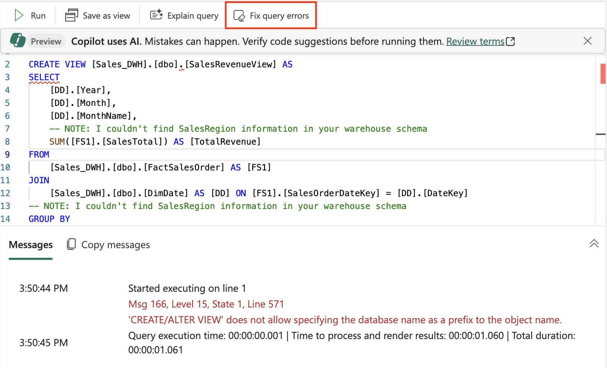

---
lab:
  title: 在 Microsoft Fabric 数据仓库中使用 Copilot
  module: Get started with Copilot in Fabric for Data Warehouse
---

# 在 Microsoft Fabric 数据仓库中使用 Copilot

在 Microsoft Fabric 中，数据仓库提供用于大规模分析的关系数据库。 与湖屋中定义的表的默认只读 SQL 终结点不同，数据仓库提供完整的 SQL 语义；包括插入、更新和删除表中数据的功能。 在此实验室中，我们将探讨如何利用 Copilot 来创建 SQL 查询。

完成此练习大约需要 30 分钟****。

## 学习内容

通过完成本实验室，你将能够：

- 了解 Microsoft Fabric 中数据仓库的作用。
- 在 Fabric 中创建并配置工作区和数据仓库。
- 使用 SQL 加载和浏览示例数据。
- 使用 Copilot 根据自然语言提示生成和优化 SQL 查询并排查其故障。
- 使用 AI 辅助的 SQL 生成创建视图并执行高级数据分析。
- 应用 Copilot 的功能来加速数据探索和分析任务。

## 开始之前

需要启用了 Copilot 的 [Microsoft Fabric 容量（F2 或更高版本）](https://learn.microsoft.com/fabric/fundamentals/copilot-enable-fabric)以完成本练习。

## 练习场景

在本练习中，你是一家零售公司的一名数据分析师，希望使用 Microsoft Fabric 更好地了解销售业绩。 你的团队最近采用了 Fabric 的数据仓库功能，并有兴趣利用 Copilot 来加速数据探索和报告。 你将创建一个新的数据仓库，加载示例零售销售数据，并使用 Copilot 生成和优化 SQL 查询。 在实验室结束时，你可获得使用 AI 分析销售趋势、创建可重用视图和执行高级数据分析的实践经验，所有这些操作都在 Fabric 环境中完成。

## 创建工作区

在使用 Fabric 中的数据之前，请先创建一个已启用 Fabric 的工作区。 Microsoft Fabric 中的工作区是一个协作环境，可以在此处组织和管理所有数据工程工件，包括数据湖屋、笔记本和数据集。 可将其视为包含数据分析所需的所有资源的项目文件夹。

1. 在浏览器中，导航到 [Microsoft Fabric 主页](https://app.fabric.microsoft.com/home?experience=fabric) (`https://app.fabric.microsoft.com/home?experience=fabric`)，使用 Fabric 凭据登录。

1. 在左侧菜单栏中，选择“工作区”（图标类似于 &#128455;）。

1. 新建一个工作区并为其指定名称，并选择包含 Fabric 容量（高级版或 Fabric）的许可模式****。 请注意，不支持试用版**。
   
    > 为什么这很重要****：Copilot 需要付费的 Fabric 容量才能正常工作。 这可确保能够访问 AI 支持的功能，这些功能可帮助在整个实验室中生成代码。

1. 打开新工作区时，它应为空。


## 创建数据仓库

现已有了工作空间，可以创建数据仓库了。 Microsoft Fabric 中的数据仓库是针对分析工作负载进行了优化的关系数据库。 与专用于事务操作的传统数据库不同，数据仓库的结构可以高效处理大量数据和复杂查询。 找到创建新仓库的快捷方式：

1. 在左侧菜单上，选择“**创建**”。 在“*新建*”页的“*数据仓库*”部分下，选择“**仓库**”。 为其指定唯一的名称。 此名称将标识工作区中的数据仓库，因此请选择反映其用途的描述性内容。

    >**备注**：如果未将“**创建**”选项固定到边栏，则需要首先选择省略号 (**...**) 选项。

    大约一分钟后，一个新的仓库创建完成。 预配过程会设置底层基础结构并为分析数据库创建必要的组件：

    

## 创建表和插入数据

仓库是一个关系数据库，可在其中定义表和其他对象。 为了演示 Copilot 的功能，我们需要使用示例数据。 我们将创建一个包含维度表（客户、日期、产品）和事实数据表（销售订单）的典型零售销售架构，该架构是数据仓库中称为星型架构的常见模式。

1. 在“开始”菜单选项卡上，使用“新建 SQL 查询”按钮创建新查询 。 这会打开一个 SQL 编辑器，可在其中编写和执行 Transact-SQL 命令。 然后将 Transact-SQL 代码从 `https://raw.githubusercontent.com/MicrosoftLearning/mslearn-fabric/refs/heads/main/Allfiles/Labs/22c/create-dw.txt` 复制并粘贴到新的查询窗格中。 此脚本包含生成示例数据集所需的所有 CREATE TABLE 和 INSERT 语句。

1. 运行查询，创建一个简单的数据仓库架构并加载一些数据。 运行该脚本大约需要 30 秒。 在此期间，数据库引擎会创建表结构并在其中填充示例零售销售数据。

1. 使用工具栏上的“刷新”按钮刷新视图。 然后在“资源管理器”窗格中，验证数据仓库中的 dbo 架构现在是否包含以下四个表 ：
   
    - DimCustomer - 包含客户信息（包括姓名和地址）****
    - DimDate - 包含日历信息（年、月、日名称等）的日期维度表****
    - DimProduct - 包含类别、名称和定价信息的产品目录****
    - FactSalesOrder - 包含销售事务的中心事实数据表，带有维度表的外键****

    > 提示：如果加载架构需要一段时间，只需刷新浏览器页面即可。 资源管理器窗格显示数据库结构，便于轻松浏览表和其他数据库对象。

## 查询数据仓库表

由于数据仓库是关系数据库，因此可以使用 SQL 来查询其表。 但是，从头开始编写复杂的 SQL 查询可能非常耗时并且容易出错。 使用 Copilot 可以更快地生成 SQL 查询！ Copilot 使用人工智能来理解你的自然语言请求并将其转换为正确的 SQL 语法，从而使数据分析更加容易。

1. 关闭当前的 SQL 查询 1****。 这可清除工作区，以便我们可以专注于使用 Copilot 生成查询。

1. 在“开始”功能区中，选择 Copilot 选项。 这会打开 Copilot 助手窗格，可以在其中与 AI 交互以生成查询。

    

1. 让我们首先探索一下 Copilot 能做什么。 单击标记为 `What can Copilot do?` 的建议，并将其作为提示发送。

    阅读输出，并观察 Copilot 目前处于预览状态，可以帮助集思广益、生成 SQL 查询、解释和修复查询等。
    
    
    
1. 我们的目标是按月分析销售收入。 这是一个常见的业务需求 - 了解一段时间内的收入趋势有助于识别季节性模式、增长趋势和绩效指标。 输入以下提示并发送。

    ```copilot-prompt
    /generate-sql Calculate monthly sales revenue
    ```

1. 查看生成的输出，该输出可能会略有不同，具体取决于你的环境和 Copilot 的最新更新。 请注意 Copilot 如何解释你的请求并在事实数据表和维度表之间创建适当的 JOIN 语句，以按月聚合销售数据。

1. 选择位于查询右上角的“插入代码”图标****。 这会将生成的 SQL 从 Copilot 窗格传输到 SQL 编辑器中，你可以在其中执行它。

    

1. 通过选择查询上方的 ▷“运行”选项执行查询，并观察输出****。 你应该会看到每月的总收入，它演示了如何跨时间段聚合销售数据。

    

1. 创建新 SQL 查询，并询问后续问题，以便结果中也包含月份名称和销售区域。****。 这演示了如何使用 Copilot 以迭代方式优化查询 - 基于先前请求创建更详细的分析：

    ```copilot-prompt
    /generate-sql Retrieves sales revenue data grouped by year, month, month name and sales region
    ```

1. 选择“插入代码”图标并 ▷ 运行查询********。 观察其返回的输出。 请注意 Copilot 如何调整查询以包含其他维度，同时维护核心收入计算逻辑。

1. 让我们通过询问 Copilot 以下问题，根据此查询创建视图。 视图是存储查询逻辑的虚拟表，可用于更轻松地重用复杂查询，并为报告和分析提供一致的数据访问模式：

    ```copilot-prompt
    /generate-sql Create a view in the dbo schema that shows sales revenue data grouped by year, month, month name and sales region
    ```

1. 选择“插入代码”图标并 ▷ 运行查询********。 查看其生成的输出。 

    查询未成功执行，因为 SQL 语句包含数据库名称作为前缀，在定义视图时，数据仓库中不允许此行为。 这是跨不同数据库平台工作时常见的语法问题，在一个环境中有效的语法在另一个环境中可能需要进行调整。

1. 选择“修复查询错误”选项****。 观察 Copilot 如何对查询进行更正。 这演示了 Copilot 的一项强大功能 - 它不仅可以生成查询，还可以自动排查和修复语法错误。

    
    
    下面是它更正的一个查询示例 - 请注意 `Auto-Fix` 注释，它解释了所做的更改：
    
    ```sql
    -- Auto-Fix: Removed the database name prefix from the CREATE VIEW statement
    CREATE VIEW [dbo].[SalesRevenueView] AS
    SELECT 
        [DD].[Year],
        [DD].[Month],
        [DD].[MonthName],
        -- NOTE: I couldn't find SalesRegion information in your warehouse schema
        SUM([FS1].[SalesTotal]) AS [TotalRevenue]
    FROM 
        [dbo].[FactSalesOrder] AS [FS1] -- Auto-Fix: Removed the database name prefix
    JOIN 
        [dbo].[DimDate] AS [DD] ON [FS1].[SalesOrderDateKey] = [DD].[DateKey] -- Auto-Fix: Removed the database name prefix
    -- NOTE: I couldn't find SalesRegion information in your warehouse schema
    GROUP BY 
        [DD].[Year],
        [DD].[Month],
        [DD].[MonthName]; 
    ```
    
    请注意，Copilot 不仅修复了语法错误，还提供了有用的注释来解释更改，并指出当前架构中没有销售区域信息。

1. 输入另一个提示来检索按类别组织的详细产品列表。 此查询将演示更高级的 SQL 功能，例如用于对组内数据进行排名的窗口函数。 对于每个产品类别，它应该显示可用的产品及其标价，并根据价格在其各自的类别中对其进行排名。 

    ```copilot-prompt
    /generate-sql Retrieve a detailed product listing, organized by category. For each product category, it should display the available products along with their list prices and rank them within their respective categories based on price. 
    ```

1. 选择“插入代码”图标并 ▷ 运行查询********。 观察其返回的输出。 

    这样就可以轻松比较同类别的产品，帮助识别最贵和最便宜的商品。 排名功能对于产品管理、定价分析和库存决策特别有用。

## 总结

在本练习中，你创建了一个包含多个表的数据仓库。 你使用 Copilot 生成了 SQL 查询来分析数据仓库中的数据。 你已经了解 AI 如何加快编写复杂 SQL 查询、自动修复错误以及帮助你更高效地探索数据的过程。

在本实验室中，你学习了如何：
- 利用自然语言提示生成 SQL 查询
- 使用 Copilot 的错误纠正功能来修复语法问题
- 在 AI 的帮助下创建视图和复杂的分析查询
- 应用排名函数和分组进行数据分析

## 清理资源

如果已完成 Microsoft Fabric 数据仓库中的 Copilot 探索，则可以删除为此练习创建的工作区。

1. 在浏览器中导航到 Microsoft Fabric。
1. 在左侧栏中，选择工作区的图标以查看其包含的所有项。
1. 选择“**工作区设置**”，然后在“**常规**”部分中向下滚动并选择“**删除此工作区**”。
1. 选择“**删除**”以删除工作区。


