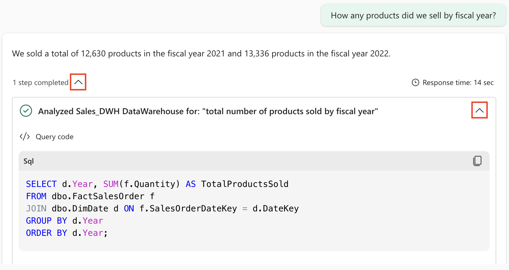

---
lab:
  title: 使用 Microsoft Fabric 数据代理与数据进行聊天
  module: Implement Fabric Data Agents
---

# 使用 Microsoft Fabric 数据代理与数据进行聊天

Microsoft Fabric 数据代理使你能够与数据进行自然交互 - 你可以用通俗易懂的英语提出问题，并获得结构化、易理解的回复。 数据代理无需用户掌握 SQL（结构化查询语言）、DAX（数据分析表达式）或 KQL（Kusto 查询语言）等查询语言，从而让整个组织内的人员无论技术水平高低，都能获取数据见解。

完成此练习大约需要 30 分钟****。

## 学习内容

通过完成本实验室，你将：

- 了解 Microsoft Fabric 数据代理在自然语言数据分析方面的用途和优势。
- 了解如何创建和配置 Fabric 工作区和数据仓库。
- 获取加载和浏览星型架构销售数据集的实践经验。
- 了解数据代理如何将纯英语问题转换为 SQL 查询。
- 培养技能以提出有效的分析型问题并解释 AI 生成的结果。
- 树立使用 AI 工具的信心，以推动数据获取及数据见解的普及化。

## 开始之前

需要启用了 Copilot 的 [Microsoft Fabric 容量（F2 或更高版本）](https://learn.microsoft.com/fabric/fundamentals/copilot-enable-fabric)以完成本练习。

## 练习场景

在本练习中，我们将创建销售数据仓库，将一些数据加载到其中，然后创建 Fabric 数据代理。 然后，我们将向其提出各种问题，并探索数据代理如何将自然语言转换为 SQL 查询以提供见解。 这种实践方法将展示 AI 辅助数据分析的强大功能，用户无需深入了解 SQL 知识。 开始吧!

## 创建工作区

在使用 Fabric 中的数据之前，请先创建一个已启用 Fabric 的工作区。 Microsoft Fabric 中的工作区是一个协作环境，可以在此处组织和管理所有数据工程工件，包括数据湖屋、笔记本和数据集。 可将其视为包含数据分析所需的所有资源的项目文件夹。

1. 在浏览器中，导航到 [Microsoft Fabric 主页](https://app.fabric.microsoft.com/home?experience=fabric) (`https://app.fabric.microsoft.com/home?experience=fabric`)，使用 Fabric 凭据登录。

1. 在左侧菜单栏中，选择“工作区”（图标类似于 &#128455;）。

1. 新建一个工作区并为其指定名称，并选择包含 Fabric 容量（高级版或 Fabric）的许可模式****。 请注意，不支持试用版**。
   
    > 为什么这很重要****：Copilot 需要付费的 Fabric 容量才能正常工作。 这可确保能够访问 AI 支持的功能，这些功能可帮助在整个实验过程中生成代码。

1. 打开新工作区时，它应为空。


## 创建数据仓库

现已有了工作空间，可以创建数据仓库了。 数据仓库是一种集中式存储库，用于存储来自各种源的结构化数据，并针对分析查询和报告进行了优化。 在本例中，我们将创建一个简单的销售数据仓库，作为数据代理交互的基础。 找到创建新仓库的快捷方式：

1. 在左侧菜单上，选择“**创建**”。 在“*新建*”页的“*数据仓库*”部分下，选择“**仓库**”。 为其指定唯一的名称。

    >**备注**：如果未将“**创建**”选项固定到边栏，则需要首先选择省略号 (**...**) 选项。

    大约一分钟后，一个新的仓库创建完成：

    

## 创建表和插入数据

仓库是一个关系数据库，可在其中定义表和其他对象。 为了让数据代理能够发挥其效用，需要使用示例销售数据填充它。 我们将要运行的脚本会创建一个典型的数据仓库架构，包含维度表（存储描述性属性）和事实表（存储可度量的业务事件）。 此星型架构设计针对数据代理将生成的分析查询进行了优化。

1. 在“开始”菜单选项卡上，使用“新建 SQL 查询”按钮创建新查询 。 然后将 Transact-SQL 代码从 `https://raw.githubusercontent.com/MicrosoftLearning/mslearn-fabric/refs/heads/main/Allfiles/Labs/22d/create-dw.txt` 复制并粘贴到新的查询窗格中。

    > **此脚本的功能**：该脚本创建包含客户信息、产品详细信息、日期维度和销售交易信息的完整销售数据仓库。 这种真实的数据集使我们能够向数据代理提出有意义的业务问题。

1. 运行查询，创建一个简单的数据仓库架构并加载一些数据。 运行该脚本大约需要 30 秒。

1. 使用工具栏上的“刷新”按钮刷新视图。 然后在“资源管理器”窗格中，验证数据仓库中的 dbo 架构现在是否包含以下四个表 ：
   
    - **DimCustomer** - 包含客户信息，包括姓名、位置和联系人详细信息
    - **DimDate** - 包含与日期相关的属性，例如会计年度、季度和月份，用于基于时间的分析
    - **DimProduct** - 包含产品信息，包括名称、类别和定价
    - **FactSalesOrder** - 包含链接了客户、产品和日期的实际销售交易

    > 提示：如果加载架构需要一段时间，只需刷新浏览器页面即可。

## 创建 Fabric 数据代理

Fabric 数据代理是一款 AI 辅助工具，它能理解关于数据的自然语言问题，并自动生成相应的查询来解答这些问题。 这样在无需用户了解 SQL、KQL 或 DAX 语法的情况下仍可提供准确的数据驱动的见解。 现在创建和配置数据代理：

1. 创建新的数据代理。
   
    

1. 为其命名，如 **`sales-data-agent`**。

    > **命名为何重要**：一个描述性的名称能帮助你和团队理解该数据代理的用途和范围，尤其是在管理不同数据领域的多个代理时。
    
    

1. 选择**添加数据源**。 

    

1. 选择之前创建的数据仓库。

    > 连接到数据****：数据代理需要访问表以了解架构和关系。 这样它就可以根据你的问题生成准确的 SQL 查询。

1. **************** 展开数据仓库，并检查 DimCustomer、DimDate、DimProduct 和 FactSalesOrder。

    > 表选择策略****：通过选择所有四个表，我们将向数据代理授予对完整数据模型的访问权限。 这使它能够回答跨多个不同表的复杂问题，例如按客户位置确定的销售趋势或随时间推移的产品性能。

    

## 提出问题

现在可以开始试验并向数据代理提问了。 本部分将展示自然语言如何转换为 SQL 查询，从而让不具备 SQL 技术知识的用户也能开展数据分析。 每个问题都会显示生成的解答和基础查询。

1. 通过键入以下提示来提问： 

    ```copilot-prompt
    How many products did we sell by fiscal year?
    ```

    请注意生成的解答：2021 财年共销售了 12,630 个产品，在 2022 财年销售了 13,336 个产品。

1. 展开完成的步骤及其子步骤。 这会显示数据代理为回答问题而生成的 SQL 查询。

    > 学习机会：**** 通过检查生成的 SQL，可以了解数据代理如何解释你的问题并了解基础数据关系。 这种透明度可建立对 AI 生成的结果的信任。
    
    
    
    Copilot 生成了以下 SQL 代码，这可能会因环境和 Copilot 的最新更新而略有不同。
    
    ```sql
    SELECT d.Year, SUM(f.Quantity) AS TotalProductsSold
    FROM dbo.FactSalesOrder f
    JOIN dbo.DimDate d ON f.SalesOrderDateKey = d.DateKey
    GROUP BY d.Year
    ORDER BY d.Year;
    ```

    > SQL 解释****：此查询将事实数据表 (FactSalesOrder) 与日期维度 (DimDate) 联接，以按年份对销售额进行分组，并对数量求和。 请注意，数据代理会自动理解“已售产品数量”引用“数量”字段，“会计年度”映射日期维度中的“年份”字段。

1. 接下来是以下问题： 

    ```copilot-prompt
    What are the top 10 most popular products all time?
    ```

    > 预期结果：**** 此问题将演示数据代理如何执行排名操作，将产品信息与销售数据联接以确定最畅销的产品。

1. 然后是此问题： 

    ```copilot-prompt
    What are the historical trends across all my data?
    ```

    > 高级分析：**** 这一更广泛的问题将说明数据代理如何跨多个维度提供趋势分析，这可能包括销售、客户行为和产品性能中的基于时间的模式。

1. 尝试更多问题以探究数据的不同方面：

    ```copilot-prompt
    In which countries are our customers located?
    ```
    
    ```copilot-prompt
    How many products did we sell in the United States?
    ```
    
    ```copilot-prompt
    How much revenue did we make in FY 2022?
    ```
    
    ```copilot-prompt
    How much was our total sales revenue, by fiscal year, fiscal quarter and month name?
    ```

    > 专业提示：**** 每个问题都针对不同的分析方案 - 地理分析、筛选聚合、收入计算和分层时间分析。 尝试多种变化形式，观察数据代理如何适应不同的提问风格。

## 了解数据结构

在进行问题试验时，请记住这些数据特征，以提出更有针对性的问题：

- 会计年度时间****：会计年度从 7 月开始（第 7 个月）。 因此，第 1 季度为 7 月到 9 月，第 2 季度为 10 月到 12 月，第 3 季度为 1 月到 3 月，第 4 季度为 4 月到 6 月。

- 客户标识：**** CustomerAltKey 字段包含客户电子邮件地址，这对于特定于客户的查询非常有用。

- **货币：** 所有价目表价格及销售总额均以 GBP（英磅）为单位。

- 数据关系：**** FactSalesOrder 表通过外键连接客户、产品和日期，从而支持复杂的多维分析。

> **** 进一步试验：尝试提出组合了这些元素的问题，例如“2022 财年第 1 季度的收入是多少？” 或“英国哪些客户购买了最昂贵的产品？” 数据代理将自动处理回答这些问题所需的复杂联接和计算。

## 总结

恭喜！ 你已成功执行以下操作：

- 使用真实的销售数据集**创建了 Fabric 工作区**和数据仓库
- **生成并配置了一个数据代理**，该代理可理解有关数据的自然语言问题
- 通过以纯英语提问并了解它们如何转换为 SQL 查询，**体验了 AI 支持的数据分析**
- **探究了各种类型的分析问题** - 从简单的聚合到复杂的趋势分析

### 关键要点

- 标准化数据访问****：数据代理使用户无论是否具备 SQL 知识均可进行分析
- 透明度和信任****：始终可以检查生成的 SQL 以了解问题的回答过程
- **** 自然语言灵活性：AI 可以处理措辞中的变体，甚至是问题中的拼写小错误
- 复杂的查询生成****：代理根据自然语言输入自动处理联接、聚合和筛选器

### 后续步骤

请考虑深入了解：

- 自定义说明****：添加业务特定的上下文以改进数据代理的响应
- 添加更多数据源****：连接更多表或数据集以扩展代理的知识
- 高级问题****：尝试涉及多个时间段、客户细分领域或产品类别的更复杂的分析方案
- 集成****：将数据代理见解嵌入报表、仪表板或业务应用程序

Fabric 数据代理是朝着让数据见解在企业内部真正实现普及化迈出的重要一步，它填补了数据与决策之间的鸿沟。
